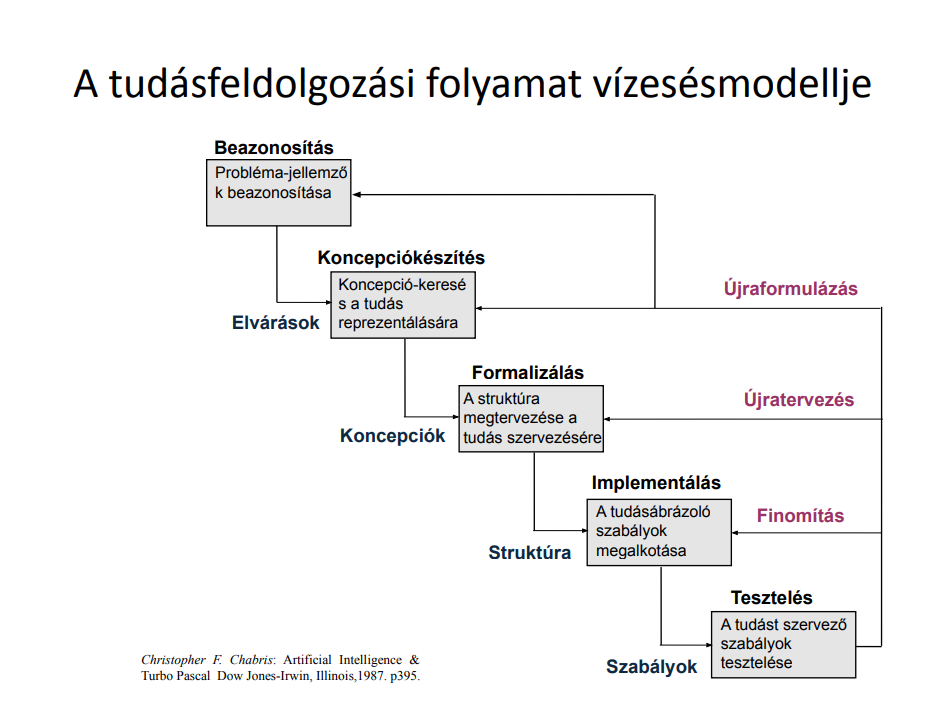

# Mesterséges intelligencia alapjai - ME

## 1. Hogy mérik és mire használják?

### Az intelligencia mérése
* Egzakt mérés igénye -> tesztek
* Tesztek fajtái
  * Teljesítménytesztek
  * Képességtesztek (intelligenciateszt)
* Követelmények
  * Érvényesség
  * Megbízhatóság
* Kortól kultúrától való függés

### Intelligencia tesztek készítése
* **Sir Francis Galton**
  * **Intelligencia:** Öröklött, kivételes érzékelési és észlelési készségek -> mérései nem igazolták
  * **Korrelációs együttható**
    * **Korreláció:** Egymást kölcsönösen feltételező dolgok, vagy fogalmak viszonya, dolgok egymástól való függése, ill. egymásnak való megfelelése
* **J. Cattel:**
  * Első intelligenciateszt (1890)
  * **Emberi képességek** (57 változó):
    * **Elsődleges faktorok** (alavető emberi képességek)
    * **Másodlagos faktorok**
      * **Folyékony intelligencia** (Fluid) -> megértés, poblémahelyzet alkalmazkodás -> öröklött
      * **Krisztályos intelligencia** (Rögzült) -> megszerzett tudás és képesség alkalmazása
    * Tesztmódszerek atyja
* **Alfred Binet, Teophile Simon**
  * Teszt gyerekek iskolaérettségének vizsgálatára (3-15 éves kor között) 1905.
    * lassú felfogású gyerekek kiszűrése
  * Gondolkodási és problémamegoldási feladatok
  * Mentális kor fogalma, mentális kor skála
  * Legelterjedtebb tesztek egyike

### A Turing teszt "Imitation Game"
* Alan Turing -> mesterséges intelligencia minősítésére
* Bíráló kérdéseket tesz fel a két tesztalanynak (gép és ember) -> ha 5 perc után sem tudja melyik a gép -> gép sikeresen teljesítette a tesztet
* Kritikák

### A mesterséges intelligencia alkalmazási területei
1. **Logikai játékok** (logical games)
2. **Tételbizonyítás**
  * Matematikai tételek bizonyítása az alapaxiómákból kiindulva
  * **Rezolúció:** lássuk be, hogy
    - a tényekből, 
    - szabályállításokból és a 
    - bizonyítandó állítás negáltjából álló halmaz kielégíthetetlen, ellentmondásos
    - Ha sikerül -> a bizonyítandó állítás csak igaz lehet
  * **Tételbizonyítók** esetében (szemben a programozási nyelvekkel) a **felhasználó feladata:**
    * **logika** (kiinduló ismeretek, tények és szabályok) megadása
    * **vezérlés** (következtetés, bizonyítás menetének) módszere
    * Konkrét alkalmazások: QA1, QA2, QA3 programnyelvek, QA4 procedurális reprezentáció is
3. **Automatikus programozás**
  * Szoftverkészítés automatizálása -> elég feladatot specifikálni, megoldás algoritmusa és programja automatikusan készül el.
4. **Szimbolikus számítás**
  * Matematikai levezetések, algebrai manipulációk, deriválás stb. azonosságok alkalmazása adott feladatok megoldására
  * szimbolikus algebrai szoftverek: MACSYMA, REDUCE, CAMAL, LAM, ALTRAN, FORMAC, SYMBOL, MATHEMATICA
  * MATHEMATICA:
    * numerikus és szimbolikus számítások
    * automatikus alapvető egyszerűsítések
    * összetett kifejezések legegyszerűbb alakra hozása
5. **Gépi látás, képfeldolgozás**
  * mesterséges látás
  * adott kétdimenziós bittérkép -> kép leírása (alakzatok, méretek, színek, helyek paramétereivel)
  * emberi látás modellezése
  * **elektronikus recehártya** -> megkönnyíti mesterséges neurális hálók bemenő jeleinek előállítását
  * input: kétdimenziós bitmap fálj -> output: felismert objektumok és térbeli viszonyuk, fizikai jellemzőik
  * Képfeldolgozás lépései:
    * élek detektálása
    * mélység meghatározása
    * alak meghatározása az árnyékoltságból
    * vonalak címkézése
    * objektum beazonosítás, helyzet meghatározás
6. **Robotika**
  * Mit értünk alatta:
    * önálló tevékenységre képes
    * mozgásra képes
    * többnyire nyílt kinematikai láncú gép
    * a környezetével interakcióban van 
    * ismétlődő, az ember számára fáradságos és veszélyes munkát végez
  * cél -> ember helyettesítése
  * gépi intelligencia hasznosíthatósága és veszélyessége megnő
7. **Beszédfelismerés**
  * cél: emberi beszéd szöveges formára alakítása
  * szegmentálás, szavakra bontás -> gond: a beszéd szavai egybefolynak
  * fonémák és szavak leírására használt betűk között nincs egyértelmű megfeleltetés
8. **A hangjel feldolgozása**
  * cél: az információ csökkentése és a jellemzők kiemelése
  * Lépések:
    * mintavételezés, kvantálás
    * jellemzők kinyerése, keretekben, azonos időintervallumokban
    * vektorkvantálás: a keretek jellemzővektorainak a jellemzők hiperterének régióihoz rendelése
    * **beszédfelismerés** 
    * **beszélőfelismerés**
    * **statisztikai, valószínűségi adatok** felhasználása -> szavak egyértelmű felismeréséhez
9. **Számítógépes fordítás**
  * Értelmezés 4 szintje:
    * Szintaktikai
    * Szemantikai
    * Pragmatikus
    * Intencionális
10. **Korlátozás kielégítés**
  * Ilyen feladat a benne szereplő változók értékeit korlátozza (pl. 8 vezér probléma)
    * értékek felsorolásával
    * explicit módon,
    * kifejezéssel implicit módon
  * Változók által felvehető értékek száma véges
  * megoldás -> változók olyan értékhalmaza, mely kielégíti az összes korlátozást 
  * Megoldó módszerek:
    * lehetőségtér állapotait tartalmazó fagráf "mélységben először" technikával bejárása
    * korlátozás propagáló, megoldást biztosan nem adó pontok kizárásával
11. **Cselekvési tervek generálása**
  * Célirányos tevékenységsorozat generálása feladat megoldására
  * Megoldási módszerek:
    * keresés -> nagy elágazási tényező
    * szituációkakulus -> elsőrendű logika módszerével
  * Cselekvési terv a két módszer együttes alkalmazásával
  * Végeredmény -> végrehajtható cselekvésegyüttes, megadott korlátokat kielégítő új állapotba visz át
12. **Szakértőrendszerek**
  * Olyan eszköz, amely 
    * problémaspecifikus ismeret megértésére képes
    * és intelligensen használja a tématerület ismeretanyagát egy tevékenység különböző megvalósítási útjainak felvezetéséhez.
  * Technikák alkalmazása:
    * ismeretátadás technikái
    * analitikus, elemző eszközök ismeret kiértékelésére
    * tanulási technikák
  * Heurisztikus magyarázat
  * Felhasználókkal interakció: természetes nyelven és megfelelő módon
  * bizonytalanság kezelése
  * mérlegelés
  * indokol
  * alapja: tudásbázis + következtetési mechanizmus
  * előnyök:
    * emberi hibák minimalizálása
    * idő költség megtakarítása
    * tudás megőrzése és megosztása
  * NAVEX, POMME, DENDRAL, DECGUIDE, GURU, MYCIN, stb.
  * DENDRAL -> hipotézis felállítása egy vegyület lehetséges molekuláris felépítésére
    * Szerkezetgeneráló rész
    * Spektrumjósló
    * Szerkezetjósló

### Hol találkozhatunk a mesterséges intelligenciával?
* E-kereskedelem
  * Személyre szabott vásárlás
  * Mesterséges intelligencia alapú asszisztensek
  * Csalásmegelőzés -> hitelkártyacsalás megelőzése használati minták alapján
* Önvezető járművek
* Spam szűrő
* Arcfelismerés
  * Eszközök arcfelismerési technikák
  * Megfigyelőkamerák képei alapján azonosítás
* Robotika 
  * ipari robotok, robotporszívó, stb.

## 2. Mesterséges intelligencia alapjai - Tudásbázis

### Tudás

* tudás = az elvégzendő feladat végrehajtásában hasznosnak bizonyuló bármely ismeret
* az emberi intelligenciával összemérhető képességű gépi intelligenciának rendelkeznie kell az ember általános tudásával.
* Az ilyen tudással, ismerethalmazzal bíró mesterséges rendszer intelligenciája ezen ismerethalmaz szervezésétől függ

### A tudásszemléltetés szükségessége

* ismeret -> ritkán áll rendelkezésre számítógép által kezelhető formában -> kódolás => számítógép tárolni, kezelni tudja
* kódolás módja -> gépi feldolgozás gyorsasága, hatékonysága, tárolt tudáson alkalmazható gépi műveletekre
* A megfelelő ismeretstruktúrát alkalmazó tudásszemléltetés az MI kulcskérdése
* Megfelelő szintű működés párhuzamos hardverrendszerektől várható
* Statikus tudásszemléltetés, tudásszemléltető modellek megalkotása és használata helyett -> Dinamikus, önszervező ismeretábrázolási modellek
  * Automatikus ismeretszerző és ismeretstrukturáló tevékenység
  * Öntanuló
* Szimbolikus jelleg
* A fogalom jelentése: mindaz, ami hozzá szocializálódott (térbeli, időbeli, minőségi stb. vonatkozásban)

### A tudásszemléltetés elvárt jellemzői

1. A **fontos dolgokat világosan adja meg**.
2. Fedje fel a **természetes korlátokat**, megkönnyítve a számítások néhány fajtáját.
3. Legyen **teljes**.
4. Legyen **tömör**.
5. Legyen **átlátható** számunkra.
6. Legyen **alkalmas gyors feldolgozásra**.
7. **Rejtse el a részleteket**, de tegye elérhetővé azokat szükség esetén.
8. **Létezzen rá számítógépi eljárás**.

### A tudásfeldolgozási folyamat vízesésmodellje

### Tudásfeldolgozás

* az a folyamat, amelyben a **szintetizált tudást a számítógépbe juttatjuk** abból a célból, hogy a problémákat a **tudásbázison végzett elektronikus szimbolikus manipulációval és következtetéssel** megoldjuk
* Szakterület **szakértője** együttműködik a **"tudásmérnökkel"** (knowledge engineer) -> szakértőrendszer számára fogyasztható tudásreprezentáció => tudásfeldolgozás -> kulcskérdés
* első teendő -> **tudásgyűjtés** (Knowledge Acquisition)

### Tudásgyűjtés

* az a folyamat, amelynek feladata beazonosítani, kinyerni, dokumentálni és elemezni a szakterület szakértőjének információ-feldolgozó tevékenységét -> cél: szakértőrendszer tudásbázisának és következtető automatájának meghatározása

***A tudáskinyerés négy fő szakasza:***
1. Az előzetes tudás és problématartomány feltárása
2. Az információforrások beazonosítása
3. A részletes tudás kinyerése a forrásokból
4. A kinyert tudás elemzése, kódolása és dokumentálása.

### Előzetes tudásfeltárás

### Tudás kézikönyv

### Információforrások

### Tudáskinyerés

### Részletes tudás

### Tudáskinyerési technikák

### Kinyert tudás elemzése, kódolása, dokumentálása

### Gépi tanulás

### Előállító szabályok, szabályalapú tudásszemléltetés

### Szabályláncolás

### Szabályalapú tudásszemléltetést és következtető automatát alkalmazó szakértőrendszer felépítése

### Szabályalapú következtetés működése előrehaladó láncolásnál

