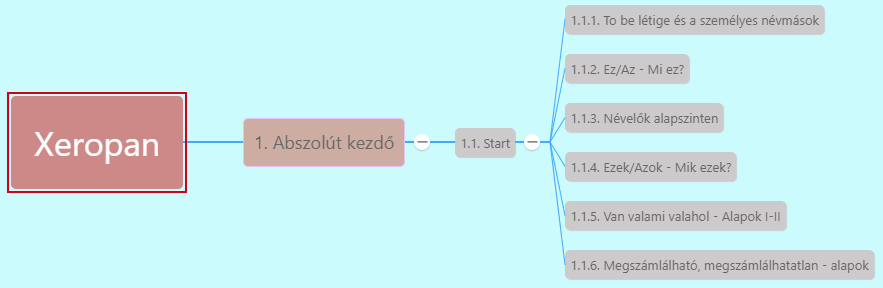

# Ezek/azok - Mik ezek? 

> * **this:** [^1] közel mutat
> * **that:** távolra mutat
> * Megmondani, mi ez a tárgy: **This/That + is + a/an + főnév**
> * Megkérdezni, mi ez a tárgy: *What is this?*/ *What is that?*
> * Bemutatunk valakit: *This is my brother, Paul.*

these, those mutató névmások, főnév utánuk **többes számban**! [^2]

* **these:** ezek
* **those:** azok

* **többes szám** jele általában: **-s** -> Those dogs are cute
* **-s, -sh, -ch, -x** végű szavak -> többes szám jele **-es** ->
  * glass -> glasses, dish -> dishes, -> church -> churches, box-> boxes
* **-y** végű: **ies** ->
  * family -> families, lady -> ladies
* Ha teljesen egyértelmű, mire mutat a mutató névmás, nem kötelező kitenni a főnevet mögé ->
  * These books are boring, but those are interesting.

---
[^1]: Start lecke, 3. fejezet - Ez, az éa az a másik dolog
[^2]: Start, 6.fejezet - Mik ezek?