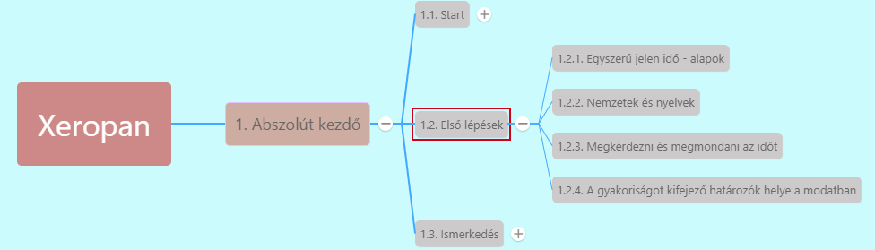

# 1.2.1. Egyszerű jelen idő (Present Simple) alapok

***Akkor használjuk, ha szokásokról, ismétlődő cselekvésekről beszélünk.***

* Ha az alany: **I (én), you (te, ti, Ön, Önök), we (mi), they (ők)**, vagy **többes számban lévő fn** -> ige rag nélkül szerepel
  * *I work.*
* Ha az alany: **he (ő, hímnem), she (ő, nőnem), it(ő, semleges nem)**, vagy **egyes számban lévő fn** -> ige **-s** ragot kap
  * She works

***Kérdés***:

1. **Do/does + alany + ige?**
   * *Does she work?*
   * Do you live in Budapest?*
2. **Kérdőszó + do/does + alany + ige?**
   * *Where do you work?*
   * *What does she like?*
