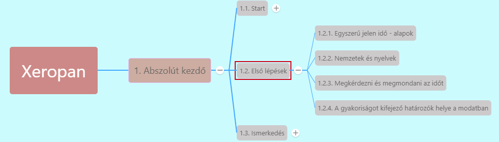

# 1.2.2. Nemzetek és nyelvek [^1]

* ***Származás:***
  * **Alany + be megfelelő alakja + from**
    * *I am from the USA*
  * **come from**
    * *We come from Japan*
* ***Beszélt nyelvek:***
  * **Alany + speak + nyelv**
    * *She speaks German*
* ***Nemzetiség kifejezése:***
  * **Alany + be megfelelő alakja + nemzetiség**
    * *He is Hungarian*

---
[^1]: Abszolút kezdő, Első lépések, 3. fejezet - A világ nyelvei