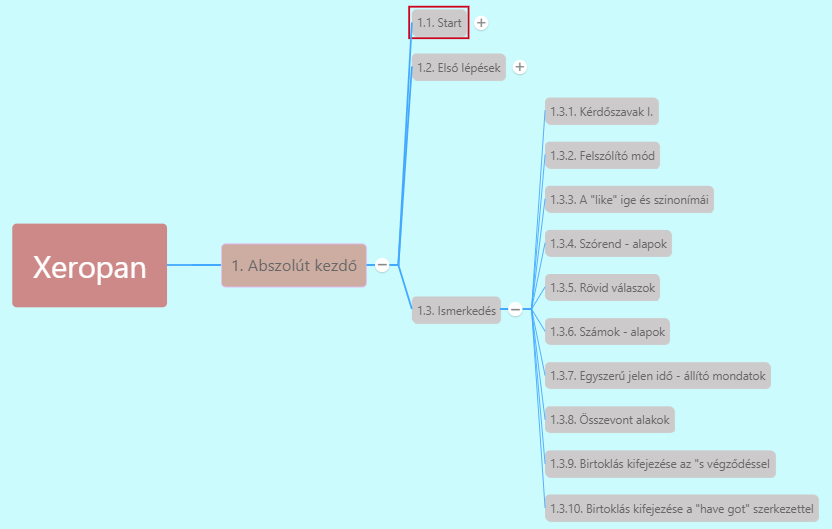

# 1.3.1. Kérdőszavak I [^1]

Leggyakoribb kérdőszavak:

| Kérdőszó         | Jelentése                      |
|------------------|--------------------------------|
| **Who...?**      | *Ki, kik, kit, kiket?*         |
| **What...?**     | *Mi, mik, mit, miket?*         |
| **Where...?**    | *Hol, hová?*                   |
| **When...?**     | *Mikor?*                       |
| **Why...?** | *Miért?* |

*Who is that girl?*
*Who did you see?*

*What is your phone number?*

*Where is my pen?*

*When is your birthday?*

*Why are you crying?*

[^1]: 1. fejezet - Hadd mutatkozzam be!