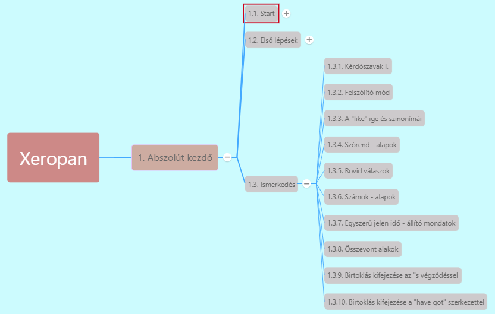

# 1.3.2. Felszólító mód [^1]

***Felszólító mondatok***

* Mindig E/2 és T/2-re vonatkozik a felszólítás (mindkét esetben megegyezik)
* **Nem használunk alanyt** a felszólításban, **csak az ige szótári alakját** (ragozatlan igét "to" nélkül)
* Angolban **nincs felkiáltójel a mondat végén**
* **Nincs különbség tegezés és magázás között.**
* Ha van **módosítószó**: az **ige elé** kell tenni
  * *Never try any drugs.* - Soha ne próbálj ki semmilyen drogot.
  * *Always be friendly and polite.* - Mindig légy barátságos és udvarias.

*Sit down.* - Ülj le!/ Üljetek le!/ Üljön le!/ Üljenek le!

*Go straight and then turn left.* - Menj egyenesen, majd fordulj balra!

---
[^1]: 2.fejezet - Menned kell!