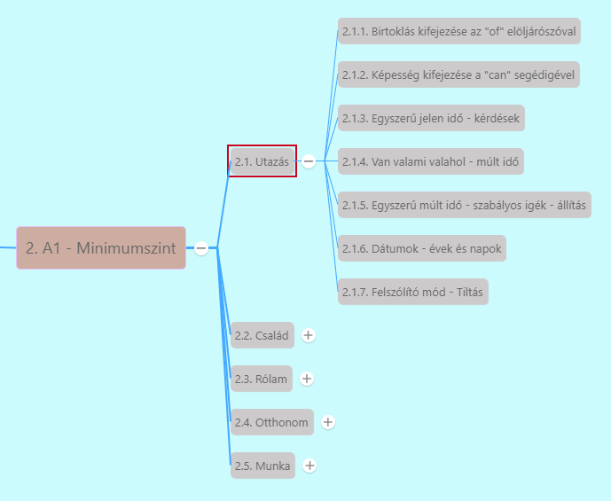

# 2.1.1. Birtoklás kifejezése az "of" elöljárószóval

    Többféleképpen tudunk **birtoklást kifejezni**

    1. ***'s ragos birtokos szerkezet*** -> *This is Jack's car*, *The family's house is very large.*
       * Többes számú főnevek esetén:
         * *The students' homework is easy.*
         * **Szabályosan képezve csak egy aposztróffal jelöljük!.**
       * Nem -s-re végződő többes számú főnevek esetén:
         * ugyanúgy megkapják az 's ragot
         * *Where are the children's toys?*
       * 's végződést jellemzően előlényekkel kapcsolatban használjuk

    2. ***Igével, vagy igét tartalmazó szerkezettel***
       1. ***"have"***
       2. ***"have got"*** szerkezet
        * **"have" segédigei szerepben** ->
          * **tagadásban** ehhez csatoljuk a not tagadószót
          * **kérdésben** ezt tesszük az alany elé
          * **Kijelentő mondatban**: *I have got a black car.*
          * **E/3-ban**: *He has got a lot of free time.*
          * Személyes névmást gyakran összevonják -> *I've got a good plan*, *He's got two children.*, *They've got many dogs.*
          * **Tagadó mondat**:
            * "have" segédigeként, "not" tagadószót hozzá csatoljuk -> *I haven't got a dictionary.* - Nincs szótáram, *She has'nt got any friends.* - Nincsenek barátai, *They have'nt got tickets.*
          * **Kérdő mondat**:
            * "have" szintén segédigeként -> *Have you got a pen?*, *How many bikes have they got?*, *Has he got much homework?*

    Jelentésbeli különbség nincs, csak földrajzi ->

    * **"have got"** -> brit angol
    * **"have"** -> amerikai angol
