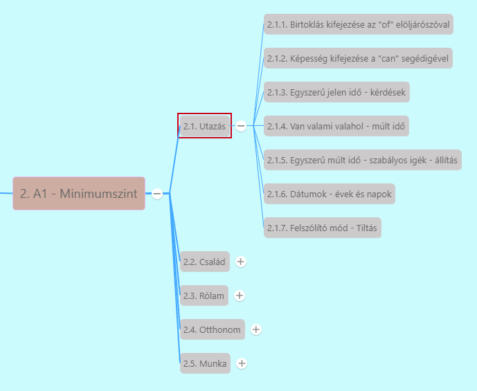

# 2.1.5. Egyszerű múlt idő - szabályos igék - állítás [^1]

Többféle múlt idő angolban
1. ***Egyszerű múlt (Past Simple)***
   * Mondatfelépítés mint egyszerű jelennél, csak **igét múlt időbe tesszük**
     * **Szabályos igék**
       * Igék 99%-a
       * **múlt idejű alak** = jelen idejű alak + **-ed**
         * *We enjoyed our holiday.*
         * *She opened the window.*
         * *I filled a bucket with water.* - Megtöltöttem egy vödröt vízzel.
       * **Nincs különbség az E/3 alakok és a többi alak között.**
     * **Rendhagyó igék** múlt ideje:
       * *be* múlt idejű alakja *was* vagy *were*
   * Egyszerű múlt idő -> **már lezárult események**
   * Nem kötelező időhatározó, de gyakori: *yesterday, last week/month/year, in* + évszám, *ago*
     * *I traveled to London last month.*
     * *We started learning English 2 years ago.*

---
[^1]: Minimumszint, Utazás, 8.fejezet - Köszönöm! 