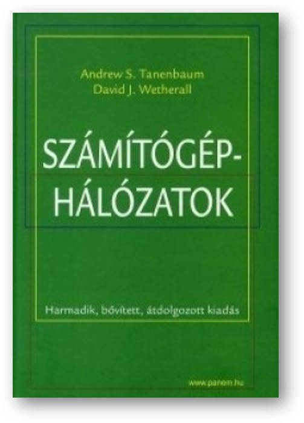

# Adrew S. Tanenbaum - David J. Wetherall: Számítógép hálózatok [^1]

## Bevezető, linkgyűjtemény, videók

A társszerző, David J. Wetherall által készített videók elérhetők a linkeken.

----

[Goals and Motivation videó - Wetherall_1.1](https://mediaplayer.pearsoncmg.com/_ph_cc_ecs_set.title.1-1_Goals_and_Motivation__/ph/streaming/esm/tanenbaum5e_videonotes/1_1_goals_motivation_cn5e.m4v)

----

----

[Lecture Organization videó - Wetherall_1.9](https://mediaplayer.pearsoncmg.com/_ph_cc_ecs_set.title.1-9_Lecture_Outline__/ph/streaming/esm/tanenbaum5e_videonotes/1_9_lecture_outline_cn5e.m4v)

----

----

[Könyv elérhetősége interneten: *https://gyires.inf.unideb.hu/GyBITT/30/index.html*](https://gyires.inf.unideb.hu/GyBITT/30/index.html)

----

----

[Összes videó elérhetősége](https://media.pearsoncmg.com/ph/streaming/esm/tanenbaum5e_videonotes/tanenbaum_videoNotes.html)

----
----
[^1]: Andrew S. Tanenbaum - David J. Wetherall: Számítógép hálózatok, Panem, 3. kiadás, Budapest 2013. (A mű eredeti címe: Computer Networks. Fifth edition)