# 2. Fizikai réteg

|[2.1. Az adatátvitel elméleti alapjai](#21-az-adatátvitel-elméleti-alapjai) | [2.2. Vezetékes átviteli közegek](#22-vezetékes-átviteli-közegek) | [2.3. Vezeték nélküli adatátvitel](#23-vezeték-nélküli-adatátvitel) |
|[2.4. Kommunikációs műholdak](#24-kommunikációs-műholdak) | [2.5. Digitális moduláció és multiplexelés](#25-digitális-moduláció-és-multiplexelés) | [2.6. A nyilvános kapcsolt telefonhálózat](#26-a-nyilvános-kapcsolt-telefonhálózat) |
|[2.7. A mobiltelefon rendszer](#27-a-mobiltelefon-rendszer) | [2.8. Kábeltelevízió](#28-kábeltelevízió) | |

---

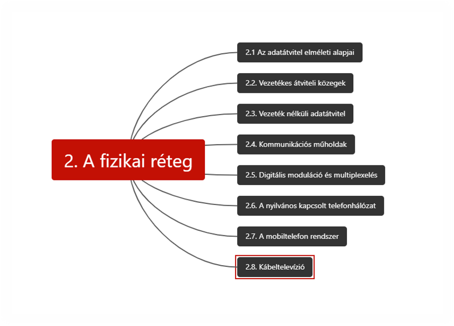

----

[Overview of the Physical Layer videó - Wetherall_2.1](https://mediaplayer.pearsoncmg.com/_ph_cc_ecs_set.title.2-1_Overview_of_the_Physical_Layer__/ph/streaming/esm/tanenbaum5e_videonotes/2_1_physical_overview_cn5e.m4v)

----

* A különféle fizikai csatornák határozzák meg a teljesítőképességet (átbocsátóképesség, várakozási idő és hibaarány)
* Korlát a csatornákon átvihető adatmennyiségre
* **Átviteli közegek** (vezetékes: rézvezeték és üvegszál, vezeték nélküli: földi rádiós, műholdas)
* **Digitális moduláció:** analóg jelek digitális bitekké alakítása, majd vissza.

## 2.1. Az adatátvitel elméleti alapjai

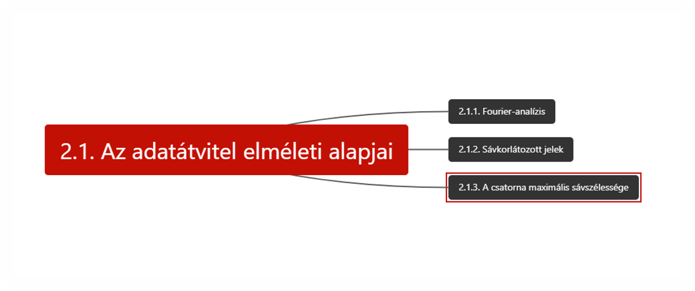

----

[Fundamental Limits videó - Wetherall_2.5](https://mediaplayer.pearsoncmg.com/_ph_cc_ecs_set.title.2-5_Fundamental_Limits__/ph/streaming/esm/tanenbaum5e_videonotes/2_5_limits_cn5e.m4v)

----

* Fourier-analízis
* Nincs olyan adatátviteli eszköz, amely a jeleket energiaveszteség nélkül tudná továbbítani -> **csillapítás**, jelalak torzul
* **Sávszélesség (bandwith)**: Az a frekvenciatartomány, amelyen belül a csillapítás mértéke nem túl nagy.
  * Az átviteli közeg tulajdonsága
  * Gyakran használnak szűrőket, a jel sávszélességének korlátozására (pl. 802.11 20 MHz)
  * Az *áteresztő frekvenciasáv szélessége*
    * 0-tól maximális frekvenciáig: **alapsávi (baseband) jelek**
    * Jelek átviteli sávját egy nagyobb frekvenciatartomány felé tolják el: **áteresztősávi (passband) jelek**.
  * Korlátozása korlátozza az adatsebességet is
  * *Sávszélesség villamosmérnököknek*: = **analóg sávszélesség**: egy Hz-ben mérhető mennyiség
  * *Sávszélesség informatikusoknak*: = **digitális sávszélesség**:  a csatorna maximális adatsebessége bit/sec-ban mérhető mennyiség
  * Az **adatsebesség** a digitális adatátvitelre használt fizikai csatorna analóg sávszélességének használatából adódó végeredmény.
* ***A csatorna maximális adatsebessége***:
  * **Henry Nyquist**: tökéletes csatornának is *véges az átviteli kapacitása* (1924) -> egyenlete a *zajmentes csatorna maximális adatsebességét* fejezi ki.
  * **Claude Shannon**: kiterjesztette a véletlen (termodinamikus) zajnak kitett csatornákra is
    * **𝑀𝑎𝑥𝑖𝑚á𝑙𝑖𝑠 𝑎𝑑𝑎𝑡𝑠𝑒𝑏𝑒𝑠𝑠é𝑔**=2𝐵 log_2 𝑉 bit/sec
    * Egy jelet B sávszélességű aluláteresztő szűrőn bocsátunk át, szűrt jelből másodpercenként vett 2B minta alapján az eredeti helyreállítható
    * Ha a csatornán *véletlen zaj* is jelen van (rendszer moleuláinak mozgása miatt mindig) ->
    * **Jel/zaj viszony (Signal-to-Noise Ratio, SNR)**: a jelenlévő termikus zaj mennyiségét a jel és a zaj teljesítményének arányával mérik (S/N -> jelteljesítmény: S, zajteljesítmény: N)
      * 10〖𝑙𝑜𝑔〗_10 𝑆/𝑁 logaritmikus skála -> egységei dB (decibel)
    * **Maximális adatsebesség (kapacitás) zajos csatornán** = 𝐵〖 𝑙𝑜𝑔〗_2 (1+𝑆/𝑁) bit/sec

## 2.2. Vezetékes átviteli közegek

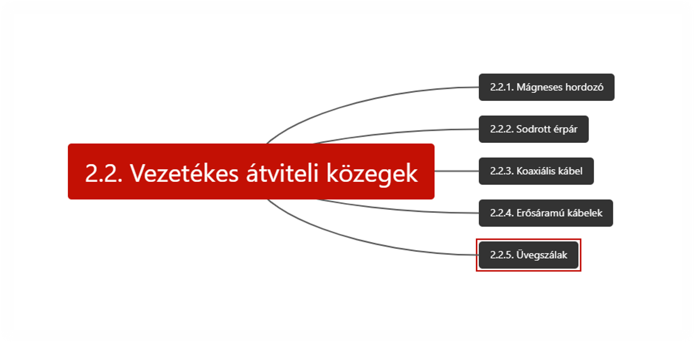

----

[Media videó - Wetherall_2.2](https://mediaplayer.pearsoncmg.com/_ph_cc_ecs_set.title.2-2_Media__/ph/streaming/esm/tanenbaum5e_videonotes/2_2_media_cn5e.m4v)

----

----

[Signals videó - Wetherall_2.3](https://mediaplayer.pearsoncmg.com/_ph_cc_ecs_set.title.2-3_Signals__/ph/streaming/esm/tanenbaum5e_videonotes/2_3_signals_cn5e.m4v)

----

* A fizikai réteg célja, hogy egy bitfolyamot szállítson egyik géptől a másikig

### 2.2.1. Mágneses hordozó

* Mágneses szalag, lemez, pendrive stb. a szállítás közege.
* „Soha ne becsüld le egy olyan furgon sávszélességét, amely kazettákkal telepakolva száguld az autópályán” :smiley:
* Nem online összeköttetés, késleltetése jelentős

### 2.2.2. Sodrott érpár (twisted pair)

* Két szigetelt rézhuzal, kb 1 mm vastag, spirálszerűen egymás köré sodorva.
* Sodrás oka: két párhuzamos huzal -> antenna. A huzalokból érkező hullámok kioltják egymást -> huzal kevésbé sugároz.
* Jel: a két érpár két huzalának feszültségkülönbségeként
* Alkalmas analóg és digitális jelátvitelre is
* Cat3, Cat5, Cat6, Cat7 stb.
* Full-duplex adatkapcsolat: egyidejűleg két irányban használható vezetéken
* Fél-duplex: bármely irányban, de egyszerre csak egyfelé
* Szimplex: csak egyirányú adatátvitel
* Cat6-ig: UTP (Unshielded Twisted Pair – árnyékolatlan sodrott érpár)
* Cat7: sodrott érpárokat árnyékolják + a teljes kábelt is

### 2.2.3. Koaxiális kábel (coaxial cable)

* Jobb árnyékolás mint a sodrott érpárnál -> nagyobb sebességgel nagyobb távolságok
* Kétfajta:
  * 50Ω digitális átvitel
  * 75Ω analóg átvitel és kábeltv -> 90-es évek közepe – adatátvitel
* Felépítése:
  * Középen tömör rézhuzalmag
  * Szigetelő veszi körül
  * Szigetelő körül sűrű szövésű hálóból rézvezető
  * Műanyag burkolat

### 2.2.4. Erősáramú vezetékek

* Erősáramú vezetékek adatkommunikációra való használata
* Vezetékeket eredetileg áramjelek elosztására tervezték -> vezetékek elektromos tulajdonságai házanként eltérőek
* Elektromos zaj

### 2.2.5. Üvegszálak

* FttH (Fiber to the Home – üvegszál a lakásig)
* Három fő komponens:
  * Fényforrás
  * Átviteli közeg
  * Fényérzékelő (detektor): ha fényt érzékel villamos jelet állít elő
* Ezek egymás mellett: egyirányú átviteli rendszer
* Fényimpulzus megléte: logikai 1 bit, hiánya 0
* **Fénytörés:** fény egyik közegből másikba lép (üveg -> levegő) -> fénytörés. Ha a beesési szög nagyobb  egy határértéknél, akkor a fény nem lép ki a levegőbe, visszaverődik az üvegbe -> a fény az üvegszálon belül marad.
* Határszögnél nagyobb beesési szögben minden fénysugár belül marad az üvegszálban -> egyszerre sok, különböző beesési szögű fénysugár haladhat. -> minden sugárnak más a **módusa -> többmódusú szál**
* Ha az üvegszál átmérőjét néhány fényhullámhossznyira csökkentjük -> hullámvezetőként viselkedik, a fény visszaverődés nélkül, egyenes vonal mentén terjed a vezetékben -> **egymódusú szál**. Drágább, de nagyobb távolság
* Fény továbbítása üvegszálon:
  * Nagy mértékben átlátszó üveg kell
  * A szálon végigküldött fényimpulzusok hosszanti irányban szétszóródnak terjedés közben -> kromatikus diszperzió (chromatic dispersion: „a színek szétszóródása”) -> mértéke a hullámhossztól függ.
  * Szétszóródott impulzusok átfedésének megakadályozása:
    * növeljük a közöttük hagyott távolságot -> jelzési sebesség csökkentése vagy
    * Ha az impulzusokat egy bizonyos alakúra formáljuk -> szolitonok

***Üvegszálas kábelek:***

* Középen üvegmag, ahol a fény terjed
  * Többmódusú szál: 50 mikron átmérőjű
  * Egymódusú szál: 8-10 mikron atmérő
* Üvegköpeny, melynek törésmutatója kisebb mint a magé
* Műanyag védőburkolat
* Általában több üvegszál műanyag csőben
* Illesztés módjai:
  * Csatlakozók: 10-20% veszteség, de megkönnyítik a rendszer újrakonfigurálását
  * Szálak mechanikus illesztése, szorítóval összefogva: 10% veszteség
  * Két szál összehegesztése: majdnem olyan jó mint a gyári
* Fényimpulzusok előállítására **fényforrások:**
  * LED (Light Emitting Diode)
  * Félvezető lézer
* Üveszál másik végén **fotodióda** -> elektromos impulzusokat állít elő, ha fény esik rá
  * Késleltetése kb 1 ns -> adatsebességet korlátozza kb 1 Gb/s-ra
* Termikus zaj

***Az üvegszál és rézvezeték összehasonlítása***

* Ismétlők használata:
  * Üvegszálnak nagyobb a sávszélessége, kisebb a csillapítása -> 30 km-enként kell ismétlő
  * Rézvezetéknél kb 5 km-enként
* Üvegszál:
  * nem érzékeny áramimpulzusokra,
  * levegőben lévő korrodáló hatású vegyületek sem ártanak neki,
  * Vékony, könnyű, kevesebb helyet foglal
  * Nem szivárog fény, megcsapolni is igen nehéz -> kiváló védelem lehallgatók ellen

*De:*
  * Sérülékenyebb túlságos hajlításnál
  * Speciális ismereteket igényel
  * Egyirányú
  * Interfészei drágábbak

## 2.3. Vezeték nélküli adatátvitel

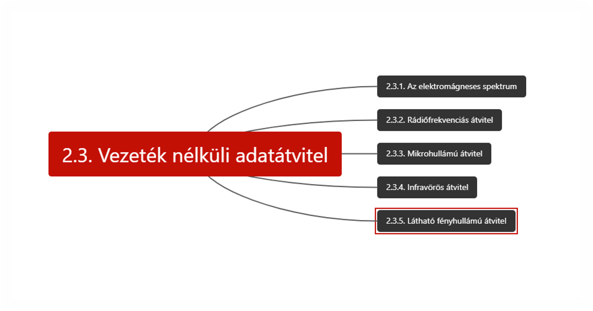

### 2.3.1. Az elektromágneses spektrum

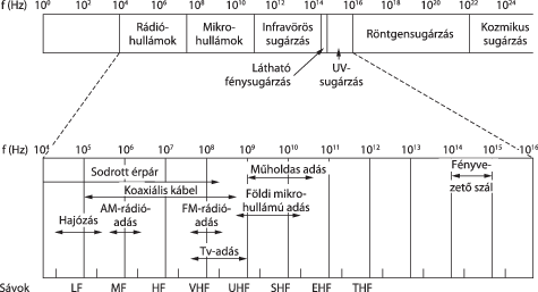

* Elektromágneses hullámok -> másodpercenkénti rezgésszámuk => frekvencia (f). Mértékegysége: Hertz (Hz)
* Két egymást követő hullámcsúcs (vagy hullámvölgy) közötti távolság: hullámhossz λ (lambda)
* Vákuumban minden elektromágneses hullám a frekvenciájától függetlenül ugyanolyan sebességgel terjed -> fénysebesség (c)
  * **λf = c**
* Legtöbb átvitel viszonylag keskeny frekvenciasávot használ -> hatékony spektrumkihasználás, elfogadható adatsebesség elérése elegendő teljesítményű átvitellel
* **Frekvenciaugrásos szórt spektrumú átvitel (FHSS – Frequency Hopping Spread Spectrum):** az adó frekvenciáról frekvenciára ugrál, másodpercenként több százszor.
  * Katonai rendszerekben -> adások felderítése nehéz, szinte lehetetlen zavarni
  * Jó ellenállás többutas jelgyengüléssel (multipath fading) és a keskeny sávú interferenciával szemben is -> robosztusság hasznos a spektrum zsúfolt részei számára -> kereskedelmi rendszerekben is, 802.11 korábbi verziói, Bluetooth
* **Közvetlen sorozatú szórt spektrum (DSSS – Direct Sequence Spread Spectrum):** egy széles frekvenciasávon teríti szét a jelet. -> több jel ugyanazon a frekvencián osztozik
  * Ezekhez a jelekhez különböző kódokat rendelnek -> Kódosztásos többszörös hozzáférés (CDMA – Code Division Multiple Access): 3G mobiltelefonok és GPS
* **Ultraszéles sáv (UWB – Ultra- WideBand)**: gyors impulzusok sorozatát küldi, váltogatva azok pozícióját az információ továbbítása érdekében -> nagyon széles frekvenciasávban terjedő jel, ritka eloszlásban
  * Viszonylag erős interferenciát tud tolerálni
  * Nem okoz interferenciát más keskeny sávú rádiójeleknél (UWB nagyon kis energiát közöl egy adott frekvencián rövid távú átvitel esetén -> elfér más jelek alatt -> *underlay*)
  * Szilárd tárgyakon átlátó képalkotó rendszerekben, precíz helymeghatározó rendszerekben használható

### 2.3.2. Rádiófrekvenciás átvitel

* A **rádióhullámok** egyszerűen előállíthatóak, nagy távolságra jutnak el és könnyen áthatolnak épületek falain.
* Rádióhullámok minden irányban terjednek
* Terjedési tulajdonságaik frekvenciafüggők:
  * *Kis frekvencián*: minden akadályon áthatolnak, de teljesítményük forrástól távolodva erősen csökken -> ez a csillapítás: szakaszveszteség (path loss)
  * *Nagy frekvencián*: egyenes vonal mentén terjednek, a tárgyakról visszaverődnek.

### 2.3.3. Mikrohullámú átvitel

* 100 MHz felett a hullámok szinte teljesen egyenes vonalban terjednek
  * Jól fókuszálhatók
* **Mikrohullámok** nem jutnak át épületek falain
* Hiába a sugarakat jól fókuszáló adóegység -> levegőben mindenképp szóródnak valamennyire.
  * Hullámok egy kis része megtörhet alacsonyabb légköri rétegeknél -> később érnek célba -> megtört hullámok fázisa nem egyezik a közvetlen beérkező hullámokéval, kiolthatják egymást -> **többutas jelgyengülés (mutipath fading)**
* Nagy távolságú távbeszélőrendszerekben, mobiltelefon-hálózatokban, tv
* Viszonylag nem drága, 50 km-enként kell adótorony

### 2.3.4. Infravörös átvitel

### 2.3.6. Látható fényhullámú átvitel

* Szabadtéri optikai rendszerek

## 2.4. Kommunikációs műholdak

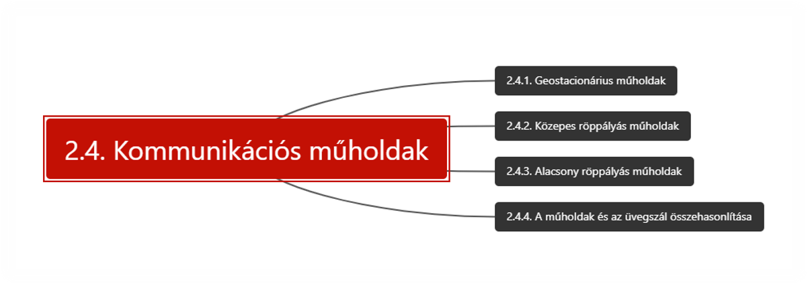

## 2.5. Digitális moduláció és multiplexelés

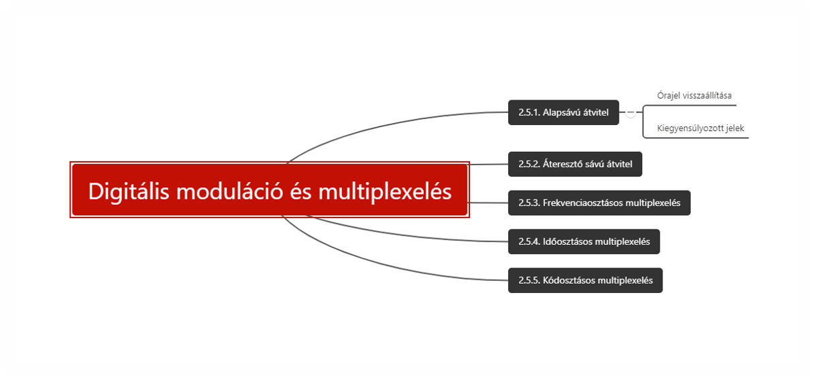

----

[Modulation videó - Wetherall_2.4](https://mediaplayer.pearsoncmg.com/_ph_cc_ecs_set.title.2-4_Modulation__/ph/streaming/esm/tanenbaum5e_videonotes/2_4_modulation_cn5e.m4v)

----

* **Digitális moduláció**: Az az átalakítási folyamat, amely a bitek és az azokat ábrázoló jelek közötti átalakítást végzi.
* **Biteket közvetlenül jelekké:**
  * Alapsávú átvitel
  * Jel komponensei a 0 és a maximum közötti tartományba eső frekvenciát foglalják el, jelsebességtől függően
  * Vezetékeknél
* **Vivőjel amplitúdóját, fázisát, frekvenciáját módosítják a továbbítás érdekében:**
  * Áteresztő sávú átvitel
  * Jel komponensei a vivőjel frekvenciája körüli frekvenciasávot foglalják el
  * Vezeték nélküli és optikai csatornák
* A csatornákon több jel osztozik -> **multiplexelés**
* A digitális moduláció -> + feszültség 1, negatív feszültség 0.

### 2.5.1. Alapsávú átvitel

* NRZ (Non-Return-to-Zero – nullára vissza nem térő): a jel követi az adatot
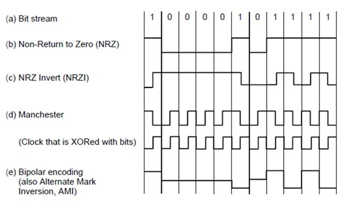
* A jel továbbterjed a vezetéken -> vevő bitekké alakítja, szabályos időközönkénti mintavétellel -> szimbólumok
* Csatorna, zaj -> csillapítás, torzítás
* A jel változásának sebességét **jelsebességnek (baud rate)** vagy **szimbólumsebességnek (symbol rate)** nevezzük. Nem egyenlő az adatsebességgel!!!
* **Adatsebesség** = *jelsebesség x szimbólumonkénti bitek száma*
* **Órajel visszaállítása**
  * 0-k és 1-esek hosszú sora csak nagyon pontos órával lenne megkülönböztethető -> drága megoldás

**Módszerek:**

* Külön órajelet küldenek a vevőnek
* Órajel és adatjel kizáró vagy kapcsolatba hozása -> órajel bitidőnként órajel-átmenetet állít elő ->
  * L-H jelátmenet, egyszerűen az órajel = **logikai 0**
  * H-L jelátmenet -> **logikai 1**
  * **=> Manchester kódolás** (klasszikus Ethernetnél)
  * Hátránya: órajel miatt kétszer akkora sávszélességet igényel mint NRZ
* 1-es átmenetként, 0 nem átmenetként kódolása -> **NRZI (Non-Return-to-Zero Inverted – invertált, nullára vissza nem térő)** -> *USB szabvány (Universal Serial Bus)* ezt használja
* 0-k hosszú sorozatára megoldás:
  * T1 vonalak esetén: előírták, hogy *15-nél több nulla nem küldhető egymás után*
  * **4B/5B kódolás** -> minden 4 bitnek egy 5 bites mintát feleltetünk meg egy rögzített leképezési táblával -> így soha nem lesz több 3 egymást követő nullánál.
    * Marad néhány üres kód, -> nem adat jellegű kódok, fizikai réteget vezérlő jelek pl. 11111 tétlen vonal
* **Rejtjelezés -> rejtjelező (scrambler)**: továbbítás előtt *KIZÁRÓ VAGY* kapcsolatba hozza az adatot egy ál-véletlensorozattal.
  * A vevő aztán KIZÁRÓ VAGY kapcsolatba hozza a beérkező biteket ugyanazzal az ál-véletlensorozattal -> visszaállítja a valódi adatot
  * Segít kondícionálni a jelet, hogy ne a domináns frekvenciakomponensekben legyen az energiája, melyeket az ismétlődő adatminták okoznak, ami esetleg elektromos interferenciát okoz.
  * Segít a jelek energiáját a frekvenciakomponenseken szétteríteni
  * Rejtjelezés nem garantálja, hogy nem lesznek hosszú sorozatok
  * Ha az adat ugyanaz mint az ál-véletlensorozat -> KIZÁRÓ VAGY eredménye: 0 -> rosszindulatú felhasználók kihasználhatják -> kapcsolat meghibásodása -> „gyilkos csomagok” a SONET-nél
* **Kiegyensúlyozott jelek (balanced signals):** Azok a jelek, amelyeknek még rövid időtartam alatt is ugyanakkora pozitív feszültségük van, mint negatív. -> *átlaguk 0*
* **Kapacitív csatolás:** a vevőt összekapcsoljuk a csatornával
* **Kiegyensúlyozott kód előállítása:** *két feszültségszintet használunk a logikai 1* ábrázolására (+1 V és -1 V) *és 0 V-ot a logikai 0 ábrázolására* -> **bipoláris kódolás** (telefonhálózatokban AMI – Alternate Mark Inversion – alternáló jelinvertálás)
* **8B/10B** kiegyensúlyozott kódolás

### 2.5.2. Áteresztő sávú átvitel

* A jel továbbítására egy tetszőleges frekvenciasávot használunk
* Nem praktikus nagyon kis frekvenciájú jelek küldése -> antenna átmérőjének mérete = a jel hullámhosszának hányadosával
* Eltolhatunk egy 0-tól B Hz-ig tartó alapsávi jelet S-sel => áteresztősávi jellé -> a vevőnél visszatolhatjuk az alapsávig => szimbólumok egyszerűbben detektálhatók.
* Digitális moduláció áteresztő sávú átvitellel valósul meg az áteresztősávban elhelyezkedő vivőjel változtatásával, vagy modulálásával. -> *modulálhatjuk a vivőjel amplitúdóját, frekvenciáját vagy fázisát*
* **ASK (Amplitude Shift Keying – amplitúdóbillentyűzés)**: két különböző amplitúdó 0 és 1 ábrázolására
* **FSK (Frequency Shift Keying – frekvenciabillentyűzés)**: 2 vagy több különböző frekvencia használatos
* **PSK (Phase Shift Keying – fázisbillentyűzés)**: vivőhullám fázisszögét szisztematikusan 0 vagy 180 fokkal eltolják minden fázisperiódusban
  * **BPSK (Binary Phase Shift Keying – bináris fázisbillentyűzés)**: a szimbólumok 2 bitet ábrázolnak
  * **QPSK (Quadrate Phase Shift Keying – kvadratúra fázisbillentyűzés)**
  * **Gray-kód**

### 2.5.3. Frekvenciaosztásos multiplexelés

----

[Multiplexing videó - Wetherall_3b.3](https://mediaplayer.pearsoncmg.com/_ph_cc_ecs_set.title.3b-3_Multiplexing__/ph/streaming/esm/tanenbaum5e_videonotes/3b_3_multiplexing_cn5e.m4v)

----

***Frekvenciaosztásos multiplexelés (Frequency Division Multiplexing – FDM):***

* *Áteresztősávú átvitel* előnyei a csatorna megosztásához
* A frekvenciatartományt *felosztja frekvenciasávokra*, minden felhasználó kizárólagosan birtokol bizonyos sávot a jel küldéséhez.
* *AM rádiószórás*, frekvenciatartományok között elég nagy a távolság ahhoz, hogy ne zavarják egymás adásait -> **védősáv (guard band)**: ez biztosítja a csatornák elkülönítését
* Telefonos hálózatokban, mobiltelefon-, földfelszíni vezeték nélküli és műholdas hálózatokban, finomabb felosztás esetén

***OFDM (Orthogonal Frequency Division Multiplexing – ortogonális frekvenciaosztásos multiplexelés):***

* A csatorna több **alvivőre (subcarrier) van felosztva**, amelyek függetlenül küldenek adatokat ->
* Alvivők szorosan a *frekvenciatartományban* ->
* jelek szomszédos tartományba átérnek, -> szomszédos alvivők közepén frekvenciaválaszuk 0 -> **középfrekvenciában mintavételezhetők**
* **Védőidő** szükséges a szimbólumjelek egy részének megismétléséhez
* *802.11, kábelhálózatok, elektromos hálózatok, 4. generációs mobiltelefon rendszerek*
* A digitális információ nagy sebességű folyamát *felosztják sok kisebb sebességű folyamra*, amelyek párhuzamosan kerülnek átvitelre

### 2.5.4. Időosztásos multiplexelés

----

[Multiplexing videó - Wetherall_3b.3](https://mediaplayer.pearsoncmg.com/_ph_cc_ecs_set.title.3b-3_Multiplexing__/ph/streaming/esm/tanenbaum5e_videonotes/3b_3_multiplexing_cn5e.m4v)

----

***Időosztásos multiplexelés (Time Division Multiplexing – TDM):***

* Körforgó módszer, felhasználók időközönként teljes sávszélességet kapnak ->
* Az egyes bemeneti folyamoktól érkező bitek  rögzített időszeletet kapnak -> csoportosított folyamba kerülnek.
* *Védőidő (guard time)* is alkalmazható a kis időzítési eltérésekhez való alkalmazkodás érdekében.
* Telefon- és mobilhálózatok

***Statisztikai időosztásos multiplexelés (Statistical Time Division Multiplexing – STDM):***

* „statisztikai” -> az egyéni folyamok nem rögzített ütemezés szerint, hanem igényük statisztikája alapján
* = csomagkapcsolás

### 2.5.5. Kódosztásos multiplexelés

***Kódosztásos multiplexelés (CDM – Code Division Multiplexing):***

* Szórt spektrumú komm. egy formája, amelyben a keskeny sávú jel szélesebb frekvenciasávban terjed. ->
  * jobb interferenciatűrés ->
  * különböző felhasználók jelei ugyanazt a frekvenciasávot használják =>
  * Kódosztásos többszörös hozzáférés (CDMA – Code Division Multiple Access)
    * Minden állomás számára teljes időben teljes frekvenciasáv
    * Több párhuzamos átvitelt kódolással választják szét.
    * Pl. repülőtéri váróban minden pár egyszerre beszél, más-más nyelven, csak saját nyelvre figyel, többire zajként tekint ->
    * CDMA kulcsa -> hasznos jel kiszűrése
    * Minden bitidőt m rövid intervallumra, töredékre (chip) bontanak -> töredéksorozat (chip sequence) (158. old)
    * Walsch-kód: ortogonális töredéksorozat előállításához használt metódus
* Elegendő kapacitás esetén a vevő az összes adóra egyszerre tud figyelni, ha mindegyikre egyszerre futtatja a dekódoló algoritmust
* Ideális CDMA-rendszerben: párhuzamos adó állomások száma korlátlanul nagy lehet, hosszabb töredéksorozatok használatával.
* Szinkronizált vevőket feltételez
* Létezik aszinkron CDMA (később).
* Mobiltelefon-hálózatok, műholdak, kábelhálózatok

## 2.6. A nyilvános kapcsolt telefonhálózat

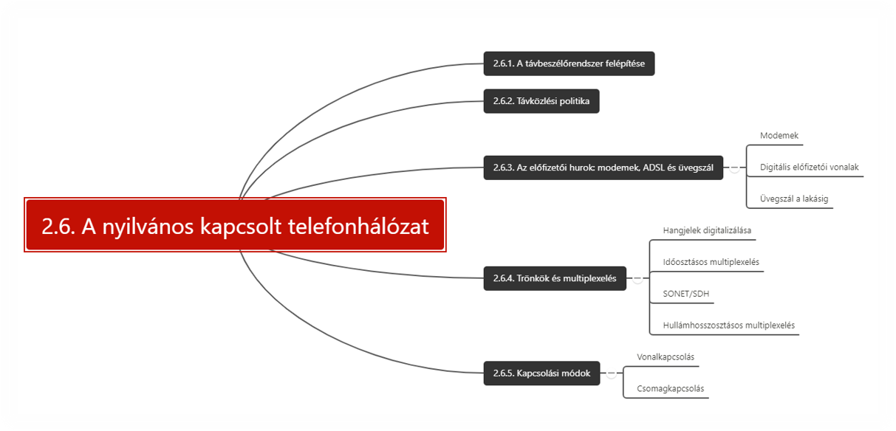

## 2.7. A mobiltelefon rendszer

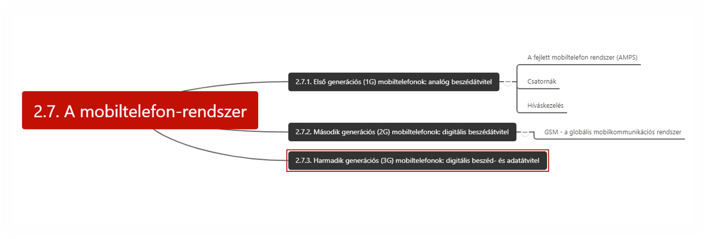

## 2.8. Kábeltelevízió

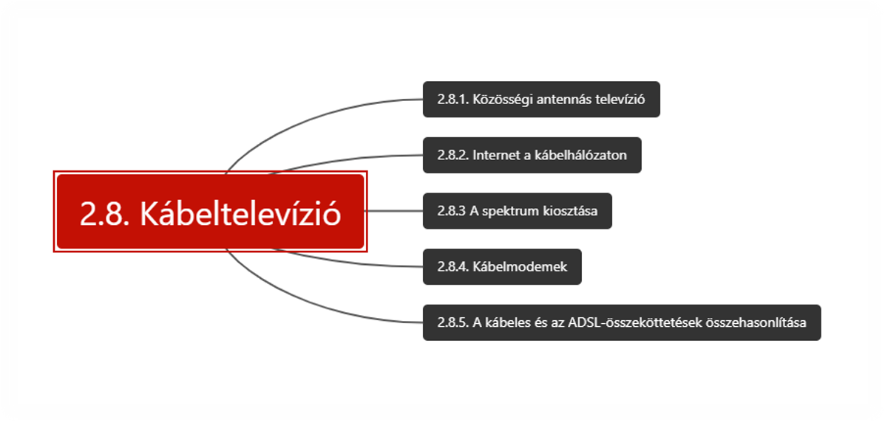
