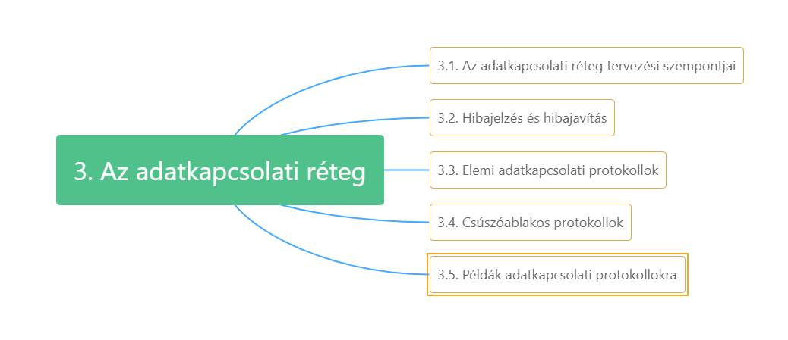
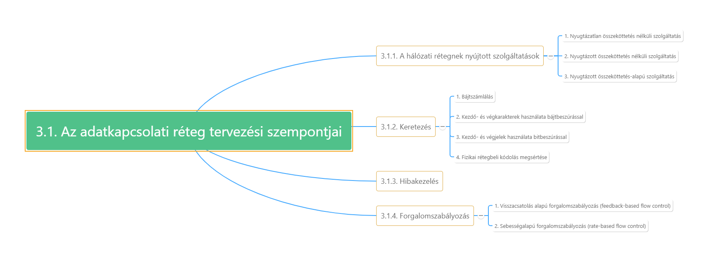
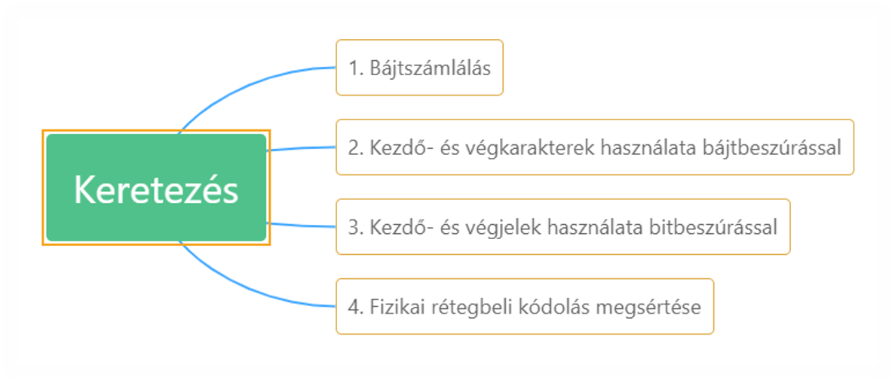
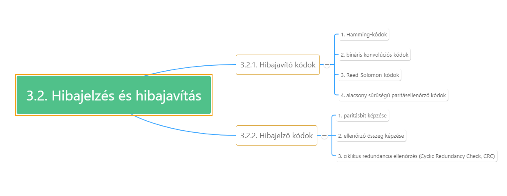

# 3. Az adatkapcsolati réteg {#3}

----

[Overview of the Link Layer videó - Wetherall_3a.1](https://mediaplayer.pearsoncmg.com/_ph_cc_ecs_set.title.3a-1_Overview_of_the_Link_Layer__/ph/streaming/esm/tanenbaum5e_videonotes/3a_1_link_overview_cn5e.m4v)

----

----

[Overview of the Link Layer2 videó - Wetherall_3b.1](https://mediaplayer.pearsoncmg.com/_ph_cc_ecs_set.title.3b-1_Overview_of_the_Link_Layer__/ph/streaming/esm/tanenbaum5e_videonotes/3b_1_link_overview_cn5e.m4v)

----

* Keretek átvitele szomszédos (összekapcsolt) gépek között
* Vezetékszerű csatorna -> továbbított bitek a küldés sorrendjében érkeznek meg
* Kommunikációs áramkörök néha hibáznak, véges adatátviteli sebesség, nem nulla késleletetés

## 3.1. Az adatkapcsolati réteg tervezési szempontjai {#3.1}

***Réteg feladatai:***

1. Jól definiált szolgáltatási interfész biztosítása a hálózati rétegnek
2. Átviteli hibák kezelése
3. Az adatforgalom szabályozása -> lassú vevőket ne árasszák el a gyors adók

**Hálózati réteg csomagjait keretekbe (frame) ágyazza.**

* Keretfejrész
* Adatmező
* Keretfarokrész

### 3.1.1. A hálózati rétegnek nyújtott szolgáltatások {#3.1.1}

**Legfontosabb szolgáltatás:**

* adatok átvitele adógép hálózati rétegétől vevőgép hálózati rétegéig.

**Látszólagos (virtuális) adatút:**

* adatkapcsolati réteg a másik gép adatkapcsolati rétegével kommunikál

**Tényleges adatút vagy kommunikáció:**

* alsóbb rétegeken keresztül

**Nyugtázatlan összeköttetés nélküli szolgáltatás (pl. Ethernet):**

* Forrásgép egymástól független kereteket küld a célgép felé, amely nem nyugtázza azok megérkezését
* Nincs kapcsolatfelépítés, lebontás
* Nincs hibakeresés és javítás az adatkapcsolati rétegben -> hibajavítás felsőbb rétegekben
* Megfelelő, ha a hibaarány nagyon alacsony, vagy valós idejű forgalom esetén (pl. beszédátvitel)

**Nyugtázott összeköttetés nélküli szolgáltatás (pl. 802.11):**

* Nincs felépített kapcsolat, de minden keret megérkezését nyugtázza a címzett (keret újraküldhető)
* Megbízhatatlan csatornák esetén hasznos
* A nyugtázás az adatkapcsolati rétegben sosem elvárás, csak optimalizáció (hatékonyabb minden keret nyugtázása, és csak a szükséges újraküldése)

**Összeköttetés alapú szolgáltatás (nagy távolságú telefonvonal):**

* Forrás és a címzett gép felépít egy összekötettést az adatátvitel megkezdése előtt. (Minden keret sorszámozott, adatkapcsolati réteg garantálja, hogy minden keret pontosan egyszer a megfelelő sorrendben megérkezzen)
* Megbízhatatlan csatornákon, mint műholdas összeköt., nagy távolságú telefonvezetékek
* Fázisai:
  * Összeköttetés felépül: mindkét oldalon inicializálódnak a keretek küldéséhez szükséges számlálók és változók
  * Keretek továbbítása
  * Összeköttetés lebontása, változók, pufferek, erőforrások felszabadítása

### 3.1.2. Keretezés {#3.1.2}

----

[Framing videó - Wetherall_3a.2](https://mediaplayer.pearsoncmg.com/_ph_cc_ecs_set.title.3a-2_Framing__/ph/streaming/esm/tanenbaum5e_videonotes/3a_2_framing_cn5e.m4v)

----

* Fizikai rétegben bitsorozat továbbítása -> ha a csatorna zajos, a fizikai réteg redundanciát ad a kimenő jelekhez, de az érkező jelek hibamentességét a fizikai réteg nem garantálja.
* Adatkapcsolati réteg feladata, hogy jelezze és kijavítsa a hibákat. -> keretekre tördelés, ellenőrző összegek számítása
* Keret megérkezésekor ellenőrző összeg újraszámolása, ha különbözik a keretben lévőtől -> hiba -> kezelés, pl. eldobja a rossz keretet és hibajelzést küld vissza
* Bitfolyam keretekre tördelése nehéz -> keretek kezdetének felismerését lehetővé kell tenni elenyésző csatorna-sávszélesség mellett.

***Módszerek:***

* Bájtszámlálás:
  * keretben lévő bájtok megadására a keretben egy bájtszámmező -> címzett adatkapcsolati réteg tudja mennyi bájtnak kell érkeznie, hol a keret vége
  * Egy átviteli hiba elronthatja a bájtszámmezőt, nem tud újraszinkronizálni
* Kezdő- és végkarakterek használata bájtbeszúrással:
  * Minden keret elején és végén jelzőbájt (flag byte) -> könnyű újraszinkronizálás
  * Bináris adatok (kép vagy zene) átvitelénél -> jelzőbájt bitmintája megjelenhet az adatok között, belezavar a keretezésbe -> küldő adatkapcsolati rétege kivételbájtot (escape byte, ESC) helyez minden véletlenül adatmezőbe került jelzőbájt elé.
  * Vevő adatkapcsolati réteg eltávolítja a kivételbájtot -> módszer: bájt beszúrás (byte stuffing)
  * Ha a felhasználó adatai egy kivételbájtot tartalmaznak, azt is megjelölik egy kivételbájttal -> kivételbájt-sorozat (escape sequence) -> kerethatárok megtalálhatók két egymás mellett jelzőbájt keresésével
  * PPP protokoll
* Kezdő- és végjelek használata bitbeszúrással (bit stuffing):
  * Tetszőleges számú bit lehet egy keretben (nem kötelező 8), alkalmazott karakterkódok is tetszőleges számú bitet tartalmazhatnak.
  * HDLC (Highlevel Data Link Control – magas szintű adatkapcsolati vezérlés) protokollhoz fejlesztették ki.
  * Működése:
    * Minden keret egy jelző- (flag) bájt mintával kezdődik (01111110 hexadecimálisan 0x7E)
    * Amikor az adó adatkapcsolati rétege 5 egymást követő 1-est talál, beszúr egy 0-t -> bitbeszúrás
    * Legkevesebb átmenet, fizikai réteg könnyebben szinkronban marad
    * USB-nél alkalmazzák
    * Amikor a vevő 5 egymás utáni 1-est talál, amit 0 követ, törli a 0-s bitet
    * Ha a felhasználói adat tartalmazza a jelzőbájt bitmintáját (6 db 1-est egymás után, aztán 0), -> beszúródik a 6. 1-es elé egy 0 -> 01111110 -> 011111010-ként továbbítódik -> így a minta kerethatárok között sohasem fordulhat elő
      Bit- és bájtbeszúrásnál is a keret hossza a szállított adatok tartalmától függ.
* Fizikai rétegbeli kódolás megsértése
  * Redundanciát tartalmazó kódolás esetén a fizikai rétegben, bizonyos jelek nem fordulhatnak elő ->
    * például a 4B/5B séma 4 adatbitet kódol 5 jellel a megfelelő mennyiségű jelátmenetért -> 32 lehetséges jelből 16-ot nem használnak -> fenntartott jelek használhatók a keret elejének és végének a jelzésére
  * Keretezés kódsértéssel -> könnyű megtalálni, nem kell módosítani az adatmezőt, nem kell beszúrni
    Sok adatkapcsolati protokoll ezek kombinációját alkalmazza.

### 3.1.3. Hibakezelés {#3.1.3}

Biztonságos átvitel megvalósításának módja: -> valamilyen visszacsatolás, mi történik a vonal túlsó végén

* Tipikusan az adó megköveteli a vevőtől, hogy speciális vezérlőkereteket küldjön vissza -> pozitív vagy negatív nyugta
* Hardverhibák, zaj, egy keret teljes eltűnését okozhatják, nyugta is elveszhet ->
  * adatkapcsolati rétegben időzítők bevezetése ->
  * elég idővel, hogy a keret elérje a célt, feldolgozódjon, nyugta visszatérjen. ->
  * ha a nyugta visszaér, az időzítő törlődik
  * Ha nyugta elvész, időzítő lejár -> keret újraküldése
  * Hogy megakadályozzuk, hogy egy keretet többször vegyen a vevő és többször adja át a hálózati rétegnek -> keretek sorszámozása
    Az adatkapcsolati réteg fontos feladata a fenti eszközökkel, hogy biztosítsa a pontosan egyszeri megérkezését a kereteknek a címzett állomás hálózati rétegéhez.

### 3.1.4. Forgalomszabályozás {#3.1.4}

Meg kell oldani, ha az egyik fél gyorsabb, ne árassza el adatokkal a másikat.

* Visszacsatolás alapú forgalomszabályozás (feedback-based flow control):
  * A vevő információt küld vissza a feladónak, engedélyt ad neki további adatküldésre, vagy tájékoztat pillanatnyi állapotáról.
  * Adatkapcsolati és felsőbb rétegekben is
  * Adatkapcsolati réteget megvalósító hardverek elég gyorsak -> hálózati csatoló kártya (Network Interface Card, NIC) „vonali sebességen fut”, a beérkező kereteket olyan gyorsan tudja feldolgozni, ahogy a vonalról a vevőbe érkeznek. Túltöltéssel felsőbb rétegek foglalkoznak
  * Jól definiált szabályok arra vonatozóan, hogy mikor küldhető a következő keret, engedélyezésig tiltás
* Sebességalapú forgalomszabályozás (rate-based flow control):
  * Protokollba be van építve egy sebességkorlát -> nincs visszacsatolás
  * Sebességalapú forg. szab. csak a szállítási rétegben fordul elő.

## 3.2. Hibajelzés és hibajavítás {#3.2}

----

[Error coding overview videó - Wetherall_3a.3](https://mediaplayer.pearsoncmg.com/_ph_cc_ecs_set.title.3a-3_Error_Coding_Overview__/ph/streaming/esm/tanenbaum5e_videonotes/3a_3_error_overview_cn5e.m4v)

----

***Redundáns információk csatolása az adatokhoz:***

1. Minden elküldött adatblokkhoz annyi redundáns információt mellékelünk, hogy kikövetkeztethető legyen az eredetileg küldött adat.
   * Hibajavító kódok (error-correcting code) -> előre irányuló hibajavítás (Forward Error Correction FEC)
   * Vezeték nélküli összekötettésekben és más sokat hibázó csatornákon
     vagy
2. Csak annyi redundanciát iktatunk az adatok közé, hogy a hiba ténye kikövetkeztethető legyen.
   * Vevő nem tudja milyen hiba, újraküldést kér
   * Hibajelző kódok (error-detecting code)
   * Fényvezető szálakon, nagymértékben megbízható csatornákon

*A redundáns bitek is megérkezhetnek hibásan, nem csak az adatbitek. -> a kódolásnak elég erősnek kell lennie a várható hibák kezelésére.*

***Hibák:***

* Egyik modell szerint a hibákat a termikus zaj időnkénti extrém magas értékei okozzák
* Másik modell szerint a hibák csomókban (burst) csoportosan érkeznek (pl. jelgyengülés – fading) vezeték nélküli csatornán és átmeneti villamos interferencia vezetékes csatornán.
* Törlődéses csatornák (erasure channel): hiba pontos helye ismert, -> a fizikai közeg olyan jelet vett, amely a várt értéktartományból kilóg, ezért érvénytelennek tekinti.

*A hibajavító és hibajelző kódok széles körben használatosak, a megbízhatóság átfogó probléma (fizikai rétegben, itt az adatkapcsolati rétegben, és felsőbb rétegekben is). -> alkalmazott matematika területe -> érdemes megbízható forrásból származó kódokat használni saját kódok készítése helyett -> ez történik a protokollszabványokban is.*

### 3.2.1. Hibajavító kódok {#3.2.1}

----

[Error correction videó - Wetherall_3a.5](https://mediaplayer.pearsoncmg.com/_ph_cc_ecs_set.title.3a-5_Error_Correction__/ph/streaming/esm/tanenbaum5e_videonotes/3a_5_error_correction_cn5e.m4v)

----

1. Hamming-kódok
2. Bináris konvolúciós kódok
3. Reed-Solomon-kódok
4. Alacsony sűrűségű paritásellenőrző kódok.

*Mindegyik valamilyen redundanciát csatol az elküldött információhoz -> m számú adatbit és r számú ellenőrzőbit.*

1. Ha az adatbiteket és ellenőrzőbiteket változtatás, előzetes kódolás nélkül küldjük -> szisztematikus kódolás (systematic code)
2. Ha az r ellenőrző bit az m adatbit lineáris függvénye -> lineáris kód -> a kódolás folyamata mátrixszorzással vagy egyszerű logikai áramkörökkel végezhető.

**Hibajavító kódok vezeték nélküli összeköttetésekben -> zajosak és hajlamosak a hibára.**

### 3.2.2. Hibajelző kódok {#3.2.2}

----

[Error detection videó - Wetherall_3a.4](https://mediaplayer.pearsoncmg.com/_ph_cc_ecs_set.title.3a-4_Error_Detection__/ph/streaming/esm/tanenbaum5e_videonotes/3a_4_error_detection_cn5e.m4v)

----

A jó minőségű rézvezetékeken és a fényvezető szálakon a hibaarány annyira kicsi, hogy a hibafelderítés és újraadás hatékonyabb módszer.

***Hibajelző kódok:***

1. Paritásbit képzése
2. Ellenőrző összeg képzése
3. Ciklikus redundancia ellenőrzés (Cyclic Redundancy Check, CRC)

## 3.3. Elemi adatkapcsolati protokollok {#3.3}

A frame 4 mezőből áll: kind, seq, ack és info ->

* 1-3 vezérlőinformációt tartalmaz, -> a keret fejrésze
  * Kind: azt mondja meg, van-e adat a keretben
  * Seq és ack mezők sorszámozáshoz és nyugtákhoz
* 4 a valódi továbbítandó adat -> ide kerül egy csomag

*A hálózati réteg vesz egy üzenetet a szállítási rétegtől és hozzáteszi a hálózati réteg fejrészét -> ezt a csomagot átadja az adatkapcsolati rétegnek, az beleteszi egy kimenő keret info részébe.*

----

[Retransmissions videó - Wetherall_3b.2](https://mediaplayer.pearsoncmg.com/_ph_cc_ecs_set.title.3b-2_Retransmissions__/ph/streaming/esm/tanenbaum5e_videonotes/3b_2_arq_cn5e.m4v)

----

### 3.3.1. Utópikus szimplex protokoll {#3.3.1}

* Adatok egy irányba továbbítódnak
* Adó és vevő hálózati rétege mindig készen áll
* Feldolgozási idővel nem foglalkozunk
* Végtelen pufferterület
* Csatorna nem rontja vagy veszíti el a jeleket

***Eljárásai:***

1. Küldő- és vevőeljárás
2. Küldő forrásgép adatkapcsolati rétegében fut, vevő a címzett gépében
3. Sorszámozás, nyugtázás nincs
4. Egyetlen lehetséges eseményfajta: sértetlen keret érkezése (frame_arrival)

**Küldő:**

* Végtelen while ciklus,
  * Csomag a hálózati rétegtől
  * Keret összerakása
  * Keret elküldése

**Vevő:**

* Vár
  * Itt csak sértetlen keret érkezhet
  * Adatrész továbbítása a hálózati rétegnek
  * Várakozás a következő keretre – felfüggeszti magát az adatkapcsolati réteg

*Sem forgalomszabályozás, sem hibakezelés nincs.*

### 3.3.2. Szimplex megáll-és-vár hibamentes csatornához {#3.3.2}

1. Elárasztás problémájának megoldása
2. Egyirányú adatforgalom
3. Hibamentesnek feltételezett csatorna

***Megoldások:***

2.1. Vevőt olyan gyorsra tervezzük, hogy képes legyen szünet nélkül, szorosan egymást követő kereteket feldolgozni (vagy adatkapcsolati réteget megfelelően lassúra tervezzük)

* Megfelelő méretű pufferek és feldolgozási kapacitás kell
* Hozzárendelt célhardvert igényel és nagyon erőforrás pazarló, ha adatkapcsolati réteg kihasználtsága kicsi

2.2. A vevő visszacsatolást biztosít a küldő állomás felé -> vevő átadta a csomagot a hálózati rétegének -> visszaküld egy álkeretet a küldőnek -> engedély a következő keret továbbítására

* A küldő egy keret elküldése után nyugtára vár mielőtt továbbmenne -> megáll-és-vár (stop-and-wait) protokoll

*A valóságban adatáralmlás viszont kétirányú, adatkapcsolati rétegek közötti csatornának képesnek kell lennie erre.*

* Áramlás irányának szigorú változása -> először a küldő küld keretet -> aztán vevő küld keretet -> megint küldő -> megint vevő -> fél-duplex csatorna is megfelelő.

**Küldő:**

* Csomagot kér hálózati rétegtől, keretet alkot, elküldi ->
* Várakoznia kell nyugtakeretre
* Olvasnia sem kell a nyugtát, mindegy mi van benne, csak megérkezése fontos

### 3.3.3. Szimplex megáll-és-vár zajos csatornához {#3.3.3}

1. Zajos, hibás csatorna problémájának megoldása
2. Feltételezzük, hogy sérült keret felismerése megtörténik az ellenőrző összeg számításkor -> ha sérült keretnél ellenőrző összeg helyes (nagyon ritka) ez a protokoll (és az összes többi is) hibázhat -> hibás keret kézbesítődik a hálózati rétegnek.

***Megoldás:*** *időzítő*

**Újabb probléma:** nyugtakeret is elveszhet, nem csak adat -> keretek megkülönböztetése -> keretsorszámozás a keret fejlécében -> megkettőzöttet el kell dobni -> 1 bites sorszám elegendő, 0 vagy 1

Protokollok, melyekben a küldő állomás pozitív nyugtára vár mielőtt továbblépne ->

* **PAR** *(Positive Acknowledgement with Retransmission – pozitív nyugtázás újraküldéssel)*, vagy
* **ARQ** *(Automatic Repeat reQuest – automatikus ismétléskérés)*. -> egyirányú adattovábbítás

*Adónak és vevőnek is van olyan változója, amelynek emlékszik az értékére, az adatkapcsolati réteg várakozása alatt.* ->

* **adó**: következő elküldendő keret sorszámát tárolja, ->
* **vevő**: következő venni kívánt keret sorszámát

*Adóállomás* keret továbbítása után időzítőt indít, ha már ment lenullázódik (megfelelő időtartamú időzítő!) -> adó várakozik

* Nyugtakeret érkezhet sértetlenül -> újabb keretképzés, sorszám léptetés
* sérült nyugtakeret érkezhet -> puffer és sorszám nem változik, újraküldés
* vagy időzítő lejárhat -> puffer és sorszám nem változik, újraküldés

*Vevő:*

* érvényes keret érkezésekor megvizsgálja sorszámát, duplikátum-e -> ha nem elfogadja, továbbadja a hálózati rétegnek és nyugtát küld
* Duplikátum és sérült keret esetén eldob, nyugtáz az utolsó hibátlan keretről

## 3.4. Csúszóablakos protokollok {#3.4}

Előbbiekben adatkeretek csak az egyik irányba haladtak, gyakorlatban mindkét irányba kell. ->

*Duplex adatátvitelhez:*

1. Egy-egy korábbi protokollpéldány egyik szimplex egyik irányba, másik szimplex másik irányba. ->
   * Mindkettőnél egy előremenő (forward) és egy visszajövő (reverse) csatorna (nyugták számára).  -> visszairányú csatorna sávszélessége kihasználatlan
2. Ugyanaz az adatkapcsolat mindkét irányba
   * Adatkeretek keverednek a nyugtakeretekkel, a vevő a beérkező keret kind mezője alapján tudja, hogy adat- vagy nyugtakeret
   * Adatkeret megérkezésekor a vevő várhat, ha a hálózati réteg átadja neki a következő csomagot, a nyugtát hozzácsatolhatja a kimenő adatkerethez (fejrész ack mezőjében) -> „nyugta ingyen utazik a következő adatkerettel” -> **ráültetés (piggybacking)** -> sávszélesség jobb kihasználása
     Ráültetés komplikációi:
     * Meddig várjon a következő csomagra? ->
       * ha lejár az időzítési intervallum, a küldő újaküldi a keretet ->
       * vár rögzített számú millisec-t -> ha van csomag ráülteti a nyugtát, ha nincs önálló nyugtakeretet küld. ->

***Csúszóablakos (sliding window) protokollok:***

* Kétirányú protokollok
* Minden kimenő keret tartalmaz egy sorszámot 0 – meghat max érték.-> adóállomás folyamatosan karbantart egy sorszámhalmazt, amely az elküldhető kereteknek felel meg -> ezek adási ablakba (sending window) esnek.
* Vevőnél vételi ablak (receiving window): keret halmaza, melyeket befogadhat
* Adó és vevő ablakainak nem kell azonos méretűnek lenni, és nem kell azonos alsó és felső határúnak lennie
* Továbbra is
  * Protokoll ugyanolyan sorrendben továbbítja a csomagokat, mint kapta
  * Vezetékszerű fizikai kommunikációs csatorna -> minden keretet a küldés sorrendjében továbbít

*Küldő* ablakába eső sorszámok -> azok a keretek, amelyeket az adó elküldött, vagy amelyek elküldhetők, de a vevő még nem nyugtázta.

* Nyugtázatlan kereteket mindet meg kell tartani újraküldés miatt. J-> megfelelő pufferméret kell. -> ha megtelik:
* A küldő adatkapcsolati rétegének le kell kapcsolnia a hálózati réteget, ameddig egy puffer fel nem szabadul.

*Vevő* adatkapcsolati rétegének ablaka -> azok a keretek, amelyeket az adatkapcsolati réteg fogadhat ->

* olyan keret, amelynek sorszáma egyenlő az ablak alsó szélével -> elfogadja, és átadja a hálózati rétegnek, az ablakot eggyel elforgatja, nyugtáz
* Olyan keret, mely az ablakon kívül esik -> eldobja

### 3.4.1. Egybites csúszóablakos protokoll {#3.4.1}

* Maximum 1 nagyságú ablak
* Megáll-és-vár, küldő elküld egy keretet, megvárja ennek nyugtáját, mielőtt a következőt küldené
* Rendszerint a két adatkapcsolati réteg közül egyik korábban kezd adni -> csak egyik adatkapcsolati réteg programjának kellene tartalmazni az időzítő indítását és a fizikai réteghez továbbítást.
* Csomag hálózati rétegtől -> keret -> vevő megnézi duplikátum-e, -> ha az a keret, amelyiket várta átadja a vevő hálózati rétegének, vevő ablakát feljebb csúsztatja. ->
* nyugta mező utolsó hibátlan keret sorszámát tart. -> ha ez megegyezik annak a keretnek a sorszámával, amit az adó próbál küldeni, az adó tudja, hogy lekérheti a következőt a hálózati rétegtől -> ha a sorszám nem egyezik újra kell küldenie ugyanazt a keretet.
* Mindig, amikor egy keret érkezik, egyet el is küld.
* Megbízhatóan működik, 1 hibalehetőség: egyszerre indított kommunikáció

### 3.4.2. Az n visszalépést alkalmazó protokoll {#3.4.2}

* A nyugtára való várakozás ideje alatt az adó nem ad, jelentős veszteség a sávszélesség kihasználásban (könyv példájában sávszélesség 4%-át használja csak ki).

***Megoldás:***

Várakozási időszak előtt megengedjük w számú keret elküldését.

* Megfelelően megválasztott keretszám mellett nincs várakozás, mert hamarabb érkezik nyugta, mint elfogynának az adható keretek.
* w megválasztása: sávszélesség-késleltetés szorzat (bandwith-delay product)/ keret bitekben mért hossza = hány keret lehet kint a csatornán -> BD -> w=2BD+1
* Adó maximális ablakmérete is ez
  Az a módszer, amely több csomagot is mozgásban tart a csatornán,-> csővezetékezés (pipelining)

**Csővezetékezés (pipelining)** problémája megbízhatatlan komm. Csatornán, ha hibás egy keret, közben nagyszámú további keret érkezik meg. Az adatkapcsolati rétegnek mindenképp sorrendben kell átadnia a kereteket a hálózati rétegnek.

***Megoldás:***

#### 3.4.2.1. N visszalépéses (go-back-n) eljárás {#3.4.2.1}

* Vevő eldobja az összes keretet, amely a hibás után érkezik, nem küld nyugtát róluk vagy
* Adatkapcsolati réteg elutasít minden keretet, kivéve a soron következőt, amit a hálózati rétegnek át kell adnia.  Ha az adó ablaka betelik mielőtt az időzítő lejár, a csővezeték elkezd kiürülni. -> Adónak lejár az időzítő, újraadja az összes nyugtázatlan keretet, kezdve a sérült vagy elveszett kerettel.

**Csővezetékezett keretek** esetén másik hibakezelési stratégia:

#### 3.4.2.2. Szelektív ismétlés (selective repeat) {#3.4.2.2}

* A vevő a rosszul vett kereteket eldobja, az ezután érkező jó kereteket tárolja egy pufferben. Amikor az adó időzítése lejár, csak a legrégebbi nyugtázatlan keretet küldi újra -> megérkezése után a vevő a helyes sorrendben küldi tovább a hálózati rétegnek
* Gyakran alkalmazzák együtt azzal a megoldással, hogy a vevő **negatív nyugtát (negative acknowledgenent, NAK)** küld, amikor hibát észlel -> pl. hibás ellenőrzőösszeg vagy nem soron következő keret -> negatív nyugták időzítő lejárta előtt kikényszerítik az újraküldést -> javítják a rendszer hatásfokát
* Ha n visszalépéses protokollban az adatkapcsolati réteg csak sorrendben fogadja a kereteket és egy hibás keret esetén az összeset eldobja, -> számolunk a pufferelés problémájával, -> a hálózati réteg nem tud végtelen csomagot továbbítani, meg kell állítani az adatkapcsolati rétegnek -> forgalomszabályozás
* Pufferelés kell az adóállomásnál az újraküldés miatt
* **Halmozott nyugtázás (cumulative acknowledgement):** ha nyugtázódik az n. keret, akkor nyugtázza az n-1-et és n-2-t is. Fontos, ha elvész nyugtahordozó keret.
* Nyugta érkezésekor puffer felszabadítás, újabb csomag a hálózati rétegtől.
* Minden keretnek külön időzítő, járó időzítők láncolt listában, szoftverből szimulálva periodikus megszakításokat okozó hardveridőzítővel

#### 3.4.2.3. Szelektív ismétlést alkalmazó protokoll {#3.4.2.3}

* N visszalépéses protokoll jó, ha hibák ritkán fordulnak elő. Gyenge vonalnál nagy sávszélesség pazarlás a keretek újraküldésére.

**Szelektív ismétlés:**

* vevő elfogadja és puffereli a kereteket, melyek elveszett vagy megsérült keretet követnek.
* Adó: ablak a kint lévő keretek sorszámairól, 0-tól előre def. max-ig
* Vevő: ablak elfogadható keretek sorszámai, rögzített méret, minden ablakában fenntartott sorszámhoz puffere van.
  * Minden pufferhez egy bit (arrived), mutatja, hogy a puffer tele van, vagy üres
* Keret érkezésekor between függvénnyel ellenőrzi, beleesik-e az ablakba. Ha igen, és a keretet nem vette korábban, elfogadja és tárolja.
* Ablakléptetést követően figyelni kell, hogy a sorszámokban ne legyen átfedés az előző ablakban. 3 bit esetén sorszámok 0-7-ig, így csak 4 keret lehet kint (ha újra 0. keret következne, nem lehetne biztos, hogy az az új, vagy a régi 0. keret)
* Szükséges pufferek száma az ablakok méretével egyenlő, = időzítők számával is

## 3.5. Példák adatkapcsolati protokollokra {#3.5}

A legtöbb nagy kiterjedésű hálózati infrastruktúra kétpontos kapcsolatokra épül.

1. Csomagok küldése a SONET optikai kapcsolatokon nagy kiterjedésű hálózatokban
   * Internetszolgáltatók (ISP) hálózatában 2 különböző helyszínen lévő útválasztó összekapcsolására
2. Internet szélén, telefonhálózatok előfizetői szakaszaiban ADSL kapcsolatok formájában ->
   **PPP (Point to Point Protocoll – kétpontos protokoll)**

### 3.5.1. Csomagok küldése SONET-en keresztül {#3.5.1}

1. Nagy kiterjedésű hálózatokban alkalmazott optikai kapcsolatot megvalósító fizikai rétegbeli protokoll, melyet leggyakrabban a kommunikációs hálózatok gerinchálózataiban használnak.
   * Jól definiált sebességű bitfolyam, amelyet adott darabszámú bájtot tartalmazó blokkokba (payload) rendez.
   * Csomagok továbbításához keretezési eljárás, csomagok megkülönböztetésére a folyamatos bitfolyamtól, amelyben a csomagok továbbítódnak. -> IP útválasztókon PPP-t futtatnak.
     *PPP -> SLIP (Serial Line Internet Protocol – soros vonali internetprotokoll) továbbfejlesztése*
   * PPP hibakezelésre, kapcsolatok konfigurálására, több protokoll támogatására, hitelesítésre és több más célra használják.

***PPP három fő képessége:***

1. Olyan keretezési módszer, amely egyértelműen ábrázolja a keret végét és a következő keret kezdetét. Keretformátum megoldja a hibajelzést is.
2. Adatkapcsolati protokoll a vonalak felélesztésére, tesztelésére, az opciók megbeszélésére és a vonalak elegáns rendezésére, amikor már nincs rájuk szükség. Ezt a protokollt LCP-nek (adatkapcsolat-vezérlő protokoll – Link Control Protocol)
3. Egy olyan megoldás a hálózati rétegbeli opciók megbeszélésére, amely független az alkalmazott hálózati rétegbeli protokolltól. A választott módszer az, hogy különböző NCP (Network Control Protocol – hálózatvezérlő protokoll) van mindegyik támogatott hálózati réteghez.

***PPP keretszerkezete:***

* **HDLC (High-Level Data Link Control – magas szintű adatkapcsolati vezérlés)** keretszerkezetéhez nagyon hasonló
* Legfőbb különbség:
  * PPP
    * bájtalapú, -> bájtbeszúrást használ, minden keret egész számú bájtot tartalmaz
    * PPP képes megbízható átvitelt biztosítani zajos csatornákon, de ritkán használják. Helyette „számozatlan üzemmód” -> összeköttetés nélküli, nyugtázatlan szolgáltatás
  * HDLC
    * bitalapú -> bitbeszúrás, megenged valtozó hosszúságú kereteket
    * Megbízható átvitelt biztosít csúszóablakkal, nyugtákkal és időzítőkkel

***PPP keretek szerkezete (269. oldal):***

1. Szabványos HDLC jelzőbájttal kezdődik, 0x7E (011111110)
   * Bájtbeszúrás 0x7D kivételbájttal, ha a jelzőbájt előfordul az Adat mezőben.
2. Cím: mindig bináris 11111111 értékre állítva
3. Vezérlő, alapértéke 00000011
4. Protokoll mező: megmutatja milyen csomag van az adatmezőben (0 kezdetű: IP4, IP6, egyéb hálózati rétegbeli protokolloknak, 1 kezdetű: PPP
5. Adat mező: változó hosszúságú, legjeljebb megegyezett maximum (ha ilyen nincs 1500 bájt). Tördelik (scrambling) -> adatmezőt egy hosszú ál-véletlen sorozattal kizáró vagy kapcsolatba hozzák
6. Ellenőrző összeg: rendszerint 2 bájt, de lehet 4 is

A PPP egy keretezési eljárás, amely különböző protokollok csomagjait képes továbbítani, különböző fizikai rétegek felett.

PPP keretek küldése előtt SONET vonalon a kapcsolatot fel kell építeni és konfigurálni kell.

### 3.5.2. ADSL – Aszimmetrikus digitális előfizetői szakasz {#3.5.2}

* *DSL modem* előfizetői szakaszon
* *DSLAM (DSL Access Multiplexer – DSL hozzáférési multiplexer)* telefontársaságok helyi központjaiban

***ADSL-lel használt protokollok IP csomagok továbbítása:***

* Protokollkészlet:
  * ADSL fizikai réteg alul
  * **ATM (Asynchronous Transfer Mode – aszinkron átviteli mód):** ígértet: világ telekommunikációs problémáit megoldja -> nem így történt, hibái mint OSI-nél
    * Olyan adatkapcsolati réteg, amely rögzített hosszúságú adategységek - cellák átvitelén alapul.
    * Minden cella fejrészében, virtuális áramköri azonosító (virtual circuit)
    * Adatküldéshez adatokat le kell képezni cellák sorozatára „darabolás és összeállítás” folyamat során ->
  * AAL5 (ATM Adaptation Layer 5 – 5. ATM adaptációs réteg)
  * PPP, ugyanaz mint SONET-nél
  * IP

**PPPoA (PPP over ATM):** szabvány, nem is igazán protokoll, specifikáció, mely megadja, hogyan kell dolgozni PPP keretekkel és AAL5 keretekkel.

***Összefoglalás:***

* Internet elsősorban PPP-t használ kétpontos (pont-pont típusú) vonalakon.
* A PPP összeköttetés nélküli, nyugtázatlan szolgáltatást biztosít
* Jelzőbájtokat használ a keretek elválasztására,
* CRC-t használ hibajelzésre
* Csomagok továbbítására használják különböző kapcsolatokon, például nagy kiterjedésű hálózatok SONET-kapcsolatain és ADSL-kapcsolatokban a hozzáférési hálózatokban.
