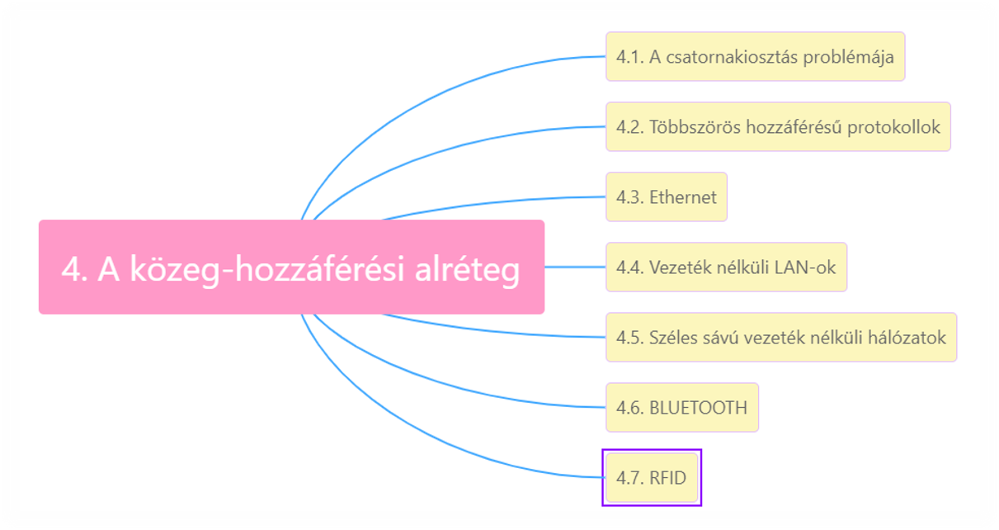
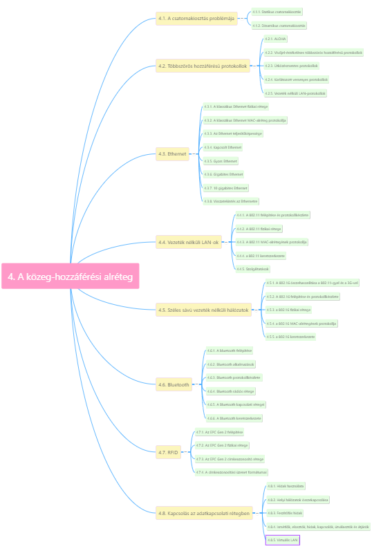
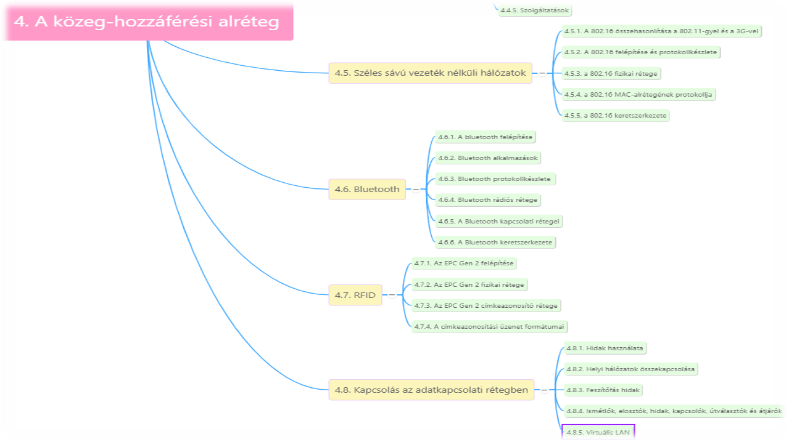
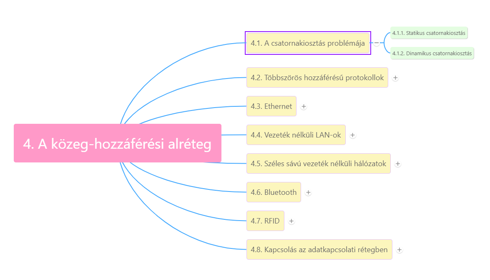
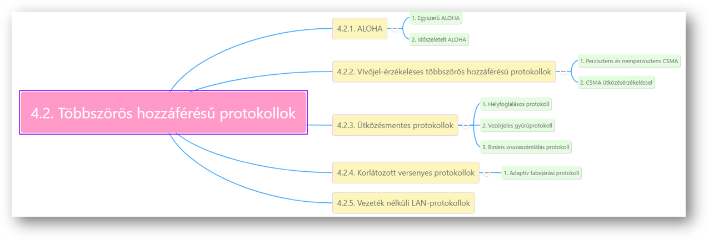
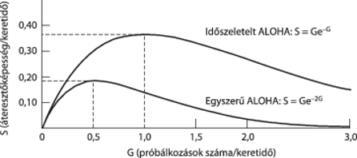
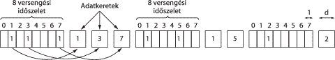
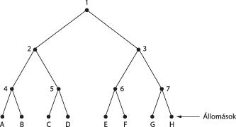
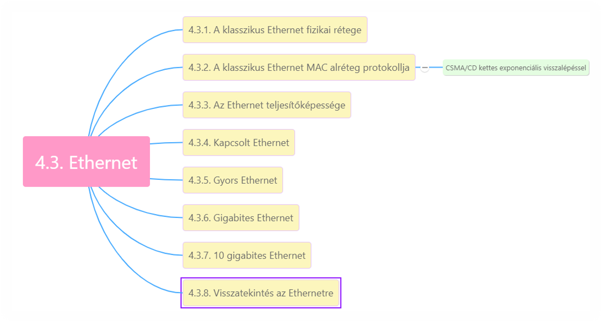

# 4. A közeg-hozzáférési-alréteg

***Hálózatok:***

1. Kétpontos összeköttetés
2. Adatszóró csatorna

Ez a fejezet adatszóró csatornákkal foglalkozik.

**Kulcskérdés**: versenyhelyzetben melyik csatorna nyerje el az adás jogát.

*Egyéb elnevezések adatszóró hálózatokra:*

1. Többszörös hozzáférésű csatorna (multiaccess channel)
2. Véletlen hozzáférésű csatorna (random access channel)

***Az adatkapcsolati réteg MAC (Medium Access Control – közeg-hozzáférési alréteg):***

* Azok a protokollok, amelyek az adatszóró csatorna használatának vezérléséért felelnek.
* Vezeték nélküli LAN hálózatok
* MAC-alréteg az adatkapcsolati réteg legalsó részét képezi (logikailag kétpontos előtt lenne)

## 4.1 A csatornakiosztás problémája

***A hálózatok kategóriái***

* Kétpontos összeköttetést használók (2. fejezetben)
* Adatszóró csatornát használók (itt)

***Adatszóró hálózat***

**Kulcskérdés:** Versenyhelyzetben ki adjon?

* **Adatszóró csatorna** (broadcast channel) = **többszörös hozzáférésű csatorna** (multiaccess channel) = **véletlen hozzáférésű csatorna** (random access channel)
* **MAC-alréteghez** (*Medium Access Control - közeghozzáférési alréteg*) tartoznak azok a protokollok, amelyek az adatszóró csatorna használatát vezérlik
* **Fő téma**: hálózat vezérlése
* Technikailag a MAC-alréteg az adatkapcsolati réteg alsó része, logikailag 3. fejezet lett volna
* Hogyan lehet egy adatszóró csatornát a versengő felek között kiosztani?
  * Csatorna lehet:
    * rádiós spektrum egy szelete
    * egy földrajzi régióban rézezeték, optikai kábel több csatlakozási ponttal
    * *A csatorna minden esetben fizikai összeköttetést biztosít a hozzá csatlakozó felhasználók között -> aktív felhasználó zavarja a többit*

### 4.1.1. Statikus csatornakiosztás

* Felosztás: csatorna kapacitását több részre bontjuk valamelyik nyalábolási módszerrel pl FDM (2.5. szakaszban)
* Ha sok küldő fél és löketes jellegű adatforgalom -> problémák

***Frekvenciaosztásos nyalábolás (FDM, Frequency Division Multiplexing)***

* N felhasználó, n sáv -> saját frekvenciasáv pl. FM rádióállomások
* Sok küldő fél, folyamatosan változik a forgalom -> löketes jellegű adatforgalom -> FDM nem hatékony

***Időosztásos nyalábolás (TDM, Time Divison Multiplexing)***
N felhasználó, n időszelet

### 4.1.2. Dinamikus csatornakiosztás

***Előfeltevések:***

1. Független forgalom: n független állomás (station)
2. Egyetlen csatorna
3. Megfigyelhető ütközések (collision): minden állomás képes észlelni ezeket és újraküldeni
4. Folytonos idő vagy diszkrét idő (slotted time) keretek továbbítása bármelyik időpillanatban vagy idő diszkrét szeletekre osztva.
5. Vivőjel érzékelés (carrier sense), vagy nincs vivőjel érzékelés
   * Szeletelt időkezelés, központi órával, szinkronizálás
   * Vezetékes hálózatok -> vivőjel érzékeléses
   * Vezeték nélküli hálózatok -> nem mindig hatékony vivőjel -> nem minden állomás esik bele a többi állomás hatósugarába -> Vivőjel egyáltalán nem használható, ha a két állomás nem tud közvetlenül kommunikálni egymással -> egyetlen többszörös hozzáférésű hálózat sem biztosít megbízható átvitelt -> adatkapcsolati rétegek felelősek a megbízhatóságért

## 4.2. Többszörös hozzáférésű protokollok

### 4.2.1. ALOHA

* Hawaii-szigetek -> elszigeteltség, kábeles hálózat nincs ->
* rövid hatótávú rádió, minden felhasználó közösen ugyanazt a felirányú (upstream) frekvenciasávot használta a központi számítógéphez keretek továbbítására

*Két változata:*

1. Egyszerű (pure) ALOHA
2. Időszeletelt (slotted) ALOHA

**Különbség:** időt folytonosnak veszik, vagy diszkrét időszeletekre osztottnak.

#### 4.2.1.1 Egyszerű ALOHA

* Engedjük a felhasználót adni, amikor van továbbítandó adata -> ütközések lesznek, keretek el fognak veszni. -> küldőnek meg kell tudni állapítani ezt.
* Állomás elküldi a keretét a központi számítógépnek -> utóbbi a vett keretet adatszórással visszaküldi minden állomásnak -> küldő állomás figyeli ezt, hogy kerete átjutott-e (más rendszerekben, pl. vezetékes LAN-okban a küldő képes lehet ütközésérzékelésre a küldés alatt)
* Ha a keret megsérült, a küldő véletlenszerű ideig vár, majd újraküldi. (véletlenszerű, hogy ne legyen ütközés újra és újra)
* Azok a rendszerek, amelyekben a közös csatorna használata konfliktushelyzetek kialakulásához vezethez, versenyhelyzetes (contention) rendszerek

**Keretgenerálás:**

* Keretek egyforma hosszúak, az ALOHA átbocsátóképessége egyforma keretméretek esetén maximális
* Két keret egyszerre -> ütközés -> mindkét csomag megsérül. Ellenőrzőösszeg számítás, nem különböztet meg teljes ütközést a részlegestől
* Áteresztőképesség és forgalmi igény kapcsolata: legjobb csatornakihasználtság, legfeljebb 18 %

#### 4.2.1.2. Időszeletelt ALOHA

* Egyszerű ALOHA kapacitásának megduplázása
* Időt diszkrét szeletekre (slot) kell osztani, melyek hossza a keretidőkhöz igazodik
* Megegyezés időintervallumok pontos helyében -> szinkronizálás -> egyik lehetséges módja: egyetlen speciális állomás, mely mint egy óra, ütemező jelet bocsát ki minden időintervallum kezdetén -> időszeletelt (vagy réselt) ALOHA (slotted ALOHA)
* Az állomások nem kezdhetnek el adni bármikor, meg kell várni következő időszelet kezdetét
* 1970-ben kidolgozták, kísérleti rendszerekben használták, majd feledésbe merült.
* Jelentősége:
  * Internet kábelen történő elérése -> rengeteg versengő felhasználó ->megoldás: időszeletelt ALOHA
  * RFID: több RFID címke egy olvasónak küld jelet -> időszeletelt ALOHA alapján

### 4.2.2. Vivőjel-érzékeléses többszörös hozzáférésű protokollok

* Tovább növelik a csatorna teljesítőképességét

Azokat a protokollokat, amelyekben az állomások figyelik a csatornán folyó forgalmat, és ennek megfelelően cselekszenek, **vivőjel-érzékeléses protokolloknak (carrier sense protocols)** nevezzük. Ezek:

* *Perzisztens és nemperzisztens CSMA*
  * *1 perzisztens CSMA (Carrier Sense Multiple Access – vivőjel-érzékeléses többszörös hozzáférés)*
  * *Nemperzisztens CSMA (nonpersistent CSMA)*
  * *P-perzisztens CSMA (p-persistent CSMA)*
* *CSMA ütközésérzékeléssel (Carrier Sense Multiple Access with Collision Detection)*

#### 4.2.2.1 Perzisztens és nem perzisztens CSMA

1. ***1-perzisztens CSMA***
   * Állomás adni készül -> belehallgat a csatornába
     * Ha szabad -> elküldi kereteit
     * Ha foglalt -> vár, amíg ismét szabad lesz a csatorna ->
   * elküld egy keretet
     * Ütközés -> véletlen hosszú ideig vár, majd újrakezdi az egészet.
   * 1 perzisztens, mert a várakozó állomás 1 valószínűséggel adni kezd, ha szabad a csatorna
   * Ha két állomás adni készül, mindkettő végigvárja a harmadik adását, majd egyszerre adni kezd -> ütközés
2. Nemperzisztens CSMA
   * Állomás adni készül -> belehallgat a csatornába
     * Ha szabad -> elküldi kereteit
     * Ha foglalt -> nem figyeli folyamatosan a csatornát, hanem véletlen hosszú ideig vár, majd újrakezdi az algoritmust
   * Jobb kihasználtság, de nagyobb késleltetés
3. P-perzisztens CSMA
   * Időszeletelt csatornát alkalmaz
   * Állomás adni készül -> belehallgat a csatornába
     * Ha szabad ->
       * p valószínűséggel elküldi kereteit ->
       * q=1-p valószínűséggel nem ad a következő időszeletig, majd elölről az algoritmus -> ameddig el nem küldi a keretet, vagy másik állomás adni nem kezd ->
       * Ütközésként értékeli -> véletlen ideig vár, majd újrakezdi az algoritmust
   * Ha foglalt -> vár a következő időszeletig, újrakezdi az algoritmust

#### 4.2.2.2. CSMA ütközésérzékeléssel

***CSMA/CD (Carrier Sense Multiple Access with Collision Detection):***

* Klasszikus Ethernet LAN-ok alapja
* t0  : keretküldés befejezése
* Állomások elkezdhetnek adni
  * Ha több egyszerre -> ütközés -> félbehagyja az adást, véletlen hosszú ideig vár, majd újrapróbál
* Ha két állomás t0 időpillanatban ad -> ütközés érzékeléséhez szükséges minimális idő az, ami alatt a jel az egyik állomástól a másikig eljut ->
* Feltételezhetjük, hogy az állomás a teljes terjedési idő letelte után (ha nem észlel ütközést addig) megszerzi a kábel használati jogát. -> legrosszabb esetben teljes terjedési idő 2-szerese kell ehhez
* CSMA/CD = 2-szeres terjedési idő réshosszúságú ALOHA. Különbség: foglalt időszeletekben az adó kereteinek további részei követik ->
* hatékonyabb, ha a keretidő jóval hosszabb a terjedési időnél

### 4.2.3. Ütközésmentes protokollok

CSMA/CD esetén nincs ütközés, ha egy állomás már egyértelműen megszerezte a csatornát -> versengési szakaszban még lehetnek ütközések -> rendszer teljesítőképessége romlik -> CSMA/CD sem mindenhol alkalmazható, nem feltétlenül ideális valós idejű forgalom számára, mint IP-n hangátvitel (VoIP)

Ütközés nélküli protokollok (még a versengési periódusban is):

1. **Helyfoglalásos protokoll**
2. **Vezérjeles gyűrűprotokoll**
3. **Bináris visszaszámlálás protokoll**

#### 4.2.3.1. Helyfoglalásos protokoll

***Alapvető bittérkép-eljárás (basic bit-map method)***

* Ütköztetési periódus pontosan n időszeletből áll -> minden állomásnak időszelet, amiben jelezheti adási szándékát (1-est küld ha adni akar, 0-t ha nem) -> ekkor a többi állomás nem használhatja a csatornát
* Az állomások időszeleteinek letelte után az adni kívánó állomások sorrendben adhatnak.
* Állomások sorrendje fix -> nincs ütközés

Azokat a protokollokat, melyekben a forgalmazási igényt a tényleges adatátvitel előtt kell adatszórással (broadcast) jelezni, helyfoglalásos protokolloknak (reservation protocol) nevezik (előre lefoglalják maguknak a csatornát, megelőzik az ütközést).

#### 4.2.3.2. Vezérjeles gyűrűprotokoll

**Vezérjel (token)**: rövid üzenet -> továbbadnak az állomások egymásnak előre meghatározott sorrendben -> adásra való jogosítás

1. **Vezérjeles gyűrűprotokoll (token ring protocol)**
   * Állomások egymás után gyűrűbe kapcsolva.
   * Keretek is vezérjel haladásának irányában továbbítódnak -> körben a gyűrű mentén és elérik a címzett állomást ->
   * hogy a keret ne menjen a végtelenségig a vezérgyűrűvel -> valamelyik állomásnak el kell távolítani a gyűrűről (küldő vagy célállomás)
2. **Vezérjeles sín protokoll (token bus)**
   * Nem szükséges kör alakúnak lennie, a vezérjel továbbadása mehet egy sínen is -> minden állomás a sínt használja, meghatározott sorrendben

A vezérjeles gyűrű protokollok, nagyjából változatlan formában MAC-protokollok -> *IEEE 802.5 „Token Ring”*
*RPR (Resilient Packet Ring – ellenálló csomagkapcsolt gyűrű) IEEE 802.17.*

#### 4.2.3.3. Bináris visszaszámlálás protokoll (binary countdown)

* Bináris, egyforma hosszú állomáscímek. ->
* Forgalmazni kívánó állomás adatszórással mindenkinek szétküldi a bináris címét, a legnagyobb helyi értékű bittel kezdve
* Ugyanabban a pillanatban elküldött címek azonos helyi értékű bitjeit a csatorna egymással logikai VAGY kapcsolatba hozza.
* Konfliktusok elkerülése érdekében kiegészítő szabály: ha egy állomás észleli, hogy 1-essel felül lett írva egy magasabb helyi értékű bitje, ami 0-s volt -> fel kell adnia a probálkozást.

***Összegezve:***
Kis terhelés esetén a versenyhelyzetes protokollok  (egyszerű és időszeletelt ALOHA) kedvezőbbek kis késleltetésük miatt. Ütközésmentes protokolloknál a fordítva, kis terhelés mellet viszonylag nagy késleltetés, a terhelés növekedésével a csatornakihasználtság javul (csatorna megszerzésével töltött idő rögzített).

### 4.2.4. Korlátozott versenyes protokollok

* Kihasználja korábbiak előnyeit, kis terhelés esetén versenyhelyzetes technikát alkalmaz, nagy terhelés mellett ütközésmentes technikát használ -> korlátozott versenyes protokollok (limited contention protocol)
* Az eddig vizsgált versenyhelyzetes protokolloknál az állomások p valószínűséggel próbálták megszerezni a csatornát (p minden állomásra azonos értékű volt, szimmetrikus protokollok) -> állomásokhoz rendelhetünk különböző valószínűségeket -> aszimmetrikus protokollok.
* Egy állomás csatorna-megszerzési esélyeit növelni csak a versenyhelyzetek számának csökkentésével lehet. -> korlátozott versenyes protokollok
  * Állomások csoportokra osztása: 0-s résért csak 0-s csoport tagjai versenghetnek.
    * Ha valamelyik nyer, elküldi a keretét
    * Ha ütközés van, vagy a rés kihasználatlan -> 1-es csoport tagjai versenyeznek 1-es résért
    * Az állomások megfelelő számú csoportra osztásával a résekre jutó versenyhelyzetek száma csökkenthető. -> az állomásokat a résekhez rendeljük -> olyan dinamikus állomás-hozzárendelés kellene, amely egy réshez kis terhelés esetén sok, nagy terhelés esetén csak néhány állomást rendelne.

**Adaptív fabejárási protokoll:** állomások bináris fa levelei

* Első versengési résben -> összes állomás szabadon verseng a csatorna megszerzéséért
  * Ha sikerül -> minden rendben
  * Ha ütközés -> 1-es résben már csak a 2. csomópont alatti részfa állomásai versenyezhetnek.
    * Ha egyikük megszerzi -> keretküldés -> következő rés 3. csomópont alatti állomásoknak
    * Ha 0-s időszelet alatt ütközés -> fa mélységi bejárása

### 4.2.5. Vezeték nélküli LAN-protokollok

Egy olyan rendszer, amelyben hordozható számítógépek rádión keresztül kommunikálnak, már vezeték nélküli LAN-nak nevezhető. -> adatszóró hálózat

* Tipikus alkalmazása: a hálózat egy irodaházban elhelyezett hozzáférési pontokból (access point, AP) -> rézvezetékes vagy üvegszálas hálózat köti össze, kapcsolatot létesítenek a velük kommunikáló állomásokkal -> hasonló mint celluláris telefonrendszer, de minden cellának csak egyetlen csatornája van. -> a cella összes állomása és a hozzáférési pont is közösen használja ezt a csatornát.
* Vezeték nélküli rendszerek nem tudják az ütközéseket történésük idejében érzékelni. Egy állomás vett jele lehet nagyon gyenge, akár milliószor gyengébb mint a küldött jel. -> Ehelyett nyugták
* Rádióadó korlátozott hatósugár -> állomások nem képesek üzenetet küldeni az összes többi állomásnak.
* Ha egy állomás belehallgat a csatornába, nem hallhatja a hatósugarán kívül lévő állomást -> nem képes észlelni potenciális vetélytársát -> *rejtett állomás problémája (hidden terminal problem)*
* *Megvilágított állomás problémája*: másik két hatósugáron kívül állomás kommunikál -> foglaltnak tekintett csatorna akkor is, ha olyan állomásnak akar küldeni, amely a két kommunikáló állomás hatósugarán kívül van, és nem lenne szükség az adott szakaszra a kommunikációhoz.
* Olyan MAC protokoll kell, amely a rejtett állomás és a megvilágított állomás problémáját is megoldja.
  Adás megkezdése előtt az a fontos van-e rádiósugárzás, CSMA nem tudja ->
* **MACA (Multiple Access with Collision Avoidance – többszörös hozzáférés ütközések elkerülésével)**: az adónak rá kell vennie a vevőt, hogy adjon ki egy rövid keretet, amelyet a hatósugarában tartózkodó állomások érzékelnek, és nem kezdenek adni a következő (hosszabb) adatkeret időtartama alatt. -> vivőjel érzékelés helyett ez
  * *MACA: A keretküldése B-nek*
    * A küld egy RTS (Request To Send – adási engedély kérése) keretet B-nek
      * Ez a 30 bájtos üzenet tartalmazza a soron következő adatkeret hosszát
    * B CTS (Clear To Send – adásra kész) üzenettel válaszol.
      * Szintén tartalmazza adatkeret hosszát, amit RTS-ből másol ki
    * Ha A megkapja CTS-t -> azonnal adni kezd
    * Bármelyik állomás, amely veszi RTS keretet, közel van ahhoz, hogy csendben kelljen maradnia, ameddig a CTS-keret konfliktus nélkül visszaérkezik A-hoz
    * Bármely állomás, amely veszi CTS-keretet közel van B-hez, csendben kell maradnia CTS-t követő adatkeret átvitelének időtartama alatt (hossz CTS-ben)
    * Létrejöhet ütközés -> Ha B és hatósugarán kívüli C egyszerre küld RTS üzenetet A-nak -> ütközni fognak és elvesznek -> sikertelen küldő állomás meghat időkorláton belül nem kap CTS keretet -> véletlenszerű ideig vár, majd újraküld.

## 4.3. Ethernet

