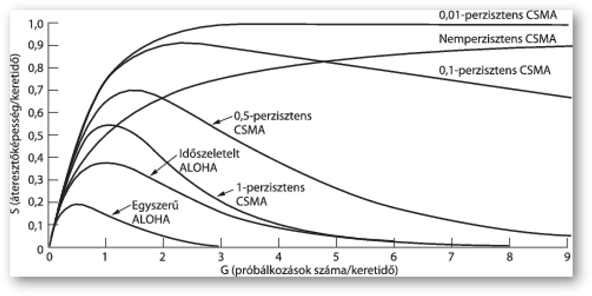

# 4. A közeg-hozzáférési-alréteg

1. [4. A közeg-hozzáférési-alréteg](#4-a-közeg-hozzáférési-alréteg)
   1. [4.1 A csatornakiosztás problémája](#41-a-csatornakiosztás-problémája)
      1. [4.1.1. Statikus csatornakiosztás](#411-statikus-csatornakiosztás)
      2. [4.1.2. Dinamikus csatornakiosztás](#412-dinamikus-csatornakiosztás)
   2. [4.2. Többszörös hozzáférésű protokollok](#42-többszörös-hozzáférésű-protokollok)
      1. [4.2.1. ALOHA](#421-aloha)
         1. [4.2.1.1 Egyszerű ALOHA](#4211-egyszerű-aloha)
         2. [4.2.1.2. Időszeletelt ALOHA](#4212-időszeletelt-aloha)
      2. [4.2.2. Vivőjel-érzékeléses többszörös hozzáférésű protokollok](#422-vivőjel-érzékeléses-többszörös-hozzáférésű-protokollok)
         1. [4.2.2.1 Perzisztens és nem perzisztens CSMA](#4221-perzisztens-és-nem-perzisztens-csma)
         2. [4.2.2.2. CSMA ütközésérzékeléssel](#4222-csma-ütközésérzékeléssel)
      3. [4.2.3. Ütközésmentes protokollok](#423-ütközésmentes-protokollok)
         1. [4.2.3.1. Helyfoglalásos protokoll](#4231-helyfoglalásos-protokoll)
         2. [4.2.3.2. Vezérjeles gyűrűprotokoll](#4232-vezérjeles-gyűrűprotokoll)
         3. [4.2.3.3. Bináris visszaszámlálás protokoll (binary countdown)](#4233-bináris-visszaszámlálás-protokoll-binary-countdown)
      4. [4.2.4. Korlátozott versenyes protokollok](#424-korlátozott-versenyes-protokollok)
      5. [4.2.5. Vezeték nélküli LAN-protokollok](#425-vezeték-nélküli-lan-protokollok)
   3. [4.3. Ethernet](#43-ethernet)
      1. [4.3.1. A klasszikus Ethernet fizikai rétege](#431-a-klasszikus-ethernet-fizikai-rétege)
      2. [4.3.2. A klasszikus Ethernet MAC-alréteg protokollja](#432-a-klasszikus-ethernet-mac-alréteg-protokollja)
         1. [4.3.2.1. CSMA/CD kettes exponenciális visszalépéssel](#4321-csmacd-kettes-exponenciális-visszalépéssel)
      3. [4.3.3. Az Ethernet teljesítőképessége](#433-az-ethernet-teljesítőképessége)
      4. [4.3.4. Kapcsolt Ethernet](#434-kapcsolt-ethernet)
      5. [4.3.5. Gyors Ethernet](#435-gyors-ethernet)
      6. [4.3.6. Gigabites Ethernet](#436-gigabites-ethernet)
      7. [4.3.7. 10 Gigabites Ethernet](#437-10-gigabites-ethernet)
      8. [4.3.8. Visszatekintés az Ethernetre](#438-visszatekintés-az-ethernetre)
   4. [4.4. Vezeték nélküli LAN-ok](#44-vezeték-nélküli-lan-ok)
      1. [4.4.1. A 802.11 felépítése és protokollkészlete](#441-a-80211-felépítése-és-protokollkészlete)
      2. [4.4.2. A 802.11 fizikai rétege](#442-a-80211-fizikai-rétege)
      3. [4.4.3. A 802.11 MAC-alrétegének protokollja](#443-a-80211-mac-alrétegének-protokollja)
      4. [4.4.4. A 802.11 keretszerkezete](#444-a-80211-keretszerkezete)
      5. [4.4.5. Szolgáltatások](#445-szolgáltatások)
   5. [4.5. Széles sávú vezeték nélküli hálózatok](#45-széles-sávú-vezeték-nélküli-hálózatok)
   6. [4.6. Bluetooth](#46-bluetooth)
   7. [4.7. RFID](#47-rfid)
   8. [4.8. Kapcsolás az adatkapcsolati rétegben](#48-kapcsolás-az-adatkapcsolati-rétegben)
      1. [4.8.1. Hidak használata](#481-hidak-használata)
      2. [4.8.2. Helyi hálózatok összekapcsolása](#482-helyi-hálózatok-összekapcsolása)
      3. [4.8.3. Feszítőfás hidak](#483-feszítőfás-hidak)
      4. [4.8.4. Ismétlők, elosztók, hidak, kapcsolók, útválasztók és átjárók](#484-ismétlők-elosztók-hidak-kapcsolók-útválasztók-és-átjárók)
      5. [4.8.5. Virtuális LAN-ok](#485-virtuális-lan-ok)

---

***Hálózatok:***

1. Kétpontos összeköttetés
2. Adatszóró csatorna

Ez a fejezet adatszóró csatornákkal foglalkozik.

**Kulcskérdés**: versenyhelyzetben melyik csatorna nyerje el az adás jogát.

*Egyéb elnevezések adatszóró hálózatokra:*

1. Többszörös hozzáférésű csatorna (multiaccess channel)
2. Véletlen hozzáférésű csatorna (random access channel)

***Az adatkapcsolati réteg MAC (Medium Access Control – közeg-hozzáférési alréteg):***

* Azok a protokollok, amelyek az adatszóró csatorna használatának vezérléséért felelnek.
* Vezeték nélküli LAN hálózatok
* MAC-alréteg az adatkapcsolati réteg legalsó részét képezi (logikailag kétpontos előtt lenne)

## 4.1 A csatornakiosztás problémája

***A hálózatok kategóriái***

* Kétpontos összeköttetést használók (2. fejezetben)
* Adatszóró csatornát használók (itt)

***Adatszóró hálózat***

**Kulcskérdés:** Versenyhelyzetben ki adjon?

* **Adatszóró csatorna** (broadcast channel) = **többszörös hozzáférésű csatorna** (multiaccess channel) = **véletlen hozzáférésű csatorna** (random access channel)
* **MAC-alréteghez** (*Medium Access Control - közeghozzáférési alréteg*) tartoznak azok a protokollok, amelyek az adatszóró csatorna használatát vezérlik
* **Fő téma**: hálózat vezérlése
* Technikailag a MAC-alréteg az adatkapcsolati réteg alsó része, logikailag 3. fejezet lett volna
* Hogyan lehet egy adatszóró csatornát a versengő felek között kiosztani?
  * Csatorna lehet:
    * rádiós spektrum egy szelete
    * egy földrajzi régióban rézezeték, optikai kábel több csatlakozási ponttal
    * *A csatorna minden esetben fizikai összeköttetést biztosít a hozzá csatlakozó felhasználók között -> aktív felhasználó zavarja a többit*

### 4.1.1. Statikus csatornakiosztás

* Felosztás: csatorna kapacitását több részre bontjuk valamelyik nyalábolási módszerrel pl FDM (2.5. szakaszban)
* Ha sok küldő fél és löketes jellegű adatforgalom -> problémák

***Frekvenciaosztásos nyalábolás (FDM, Frequency Division Multiplexing)***

* N felhasználó, n sáv -> saját frekvenciasáv pl. FM rádióállomások
* Sok küldő fél, folyamatosan változik a forgalom -> löketes jellegű adatforgalom -> FDM nem hatékony

***Időosztásos nyalábolás (TDM, Time Divison Multiplexing)***
N felhasználó, n időszelet

### 4.1.2. Dinamikus csatornakiosztás

***Előfeltevések:***

1. Független forgalom: n független állomás (station)
2. Egyetlen csatorna
3. Megfigyelhető ütközések (collision): minden állomás képes észlelni ezeket és újraküldeni
4. Folytonos idő vagy diszkrét idő (slotted time) keretek továbbítása bármelyik időpillanatban vagy idő diszkrét szeletekre osztva.
5. Vivőjel érzékelés (carrier sense), vagy nincs vivőjel érzékelés
   * Szeletelt időkezelés, központi órával, szinkronizálás
   * Vezetékes hálózatok -> vivőjel érzékeléses
   * Vezeték nélküli hálózatok -> nem mindig hatékony vivőjel -> nem minden állomás esik bele a többi állomás hatósugarába -> Vivőjel egyáltalán nem használható, ha a két állomás nem tud közvetlenül kommunikálni egymással -> egyetlen többszörös hozzáférésű hálózat sem biztosít megbízható átvitelt -> adatkapcsolati rétegek felelősek a megbízhatóságért

## 4.2. Többszörös hozzáférésű protokollok

----

[Random Multiple Access videó - Wetherall_3b.4](https://mediaplayer.pearsoncmg.com/_ph_cc_ecs_set.title.3b-4_Random_Multiple_Access__/ph/streaming/esm/tanenbaum5e_videonotes/3b_4_random_access_cn5e.m4v)

----

### 4.2.1. ALOHA

* Hawaii-szigetek -> elszigeteltség, kábeles hálózat nincs ->
* rövid hatótávú rádió, minden felhasználó közösen ugyanazt a felirányú (upstream) frekvenciasávot használta a központi számítógéphez keretek továbbítására

*Két változata:*

1. Egyszerű (pure) ALOHA
2. Időszeletelt (slotted) ALOHA

**Különbség:** időt folytonosnak veszik, vagy diszkrét időszeletekre osztottnak.

#### 4.2.1.1 Egyszerű ALOHA

* Engedjük a felhasználót adni, amikor van továbbítandó adata -> ütközések lesznek, keretek el fognak veszni. -> küldőnek meg kell tudni állapítani ezt.
* Állomás elküldi a keretét a központi számítógépnek -> utóbbi a vett keretet adatszórással visszaküldi minden állomásnak -> küldő állomás figyeli ezt, hogy kerete átjutott-e (más rendszerekben, pl. vezetékes LAN-okban a küldő képes lehet ütközésérzékelésre a küldés alatt)
* Ha a keret megsérült, a küldő véletlenszerű ideig vár, majd újraküldi. (véletlenszerű, hogy ne legyen ütközés újra és újra)
* Azok a rendszerek, amelyekben a közös csatorna használata konfliktushelyzetek kialakulásához vezethez, versenyhelyzetes (contention) rendszerek

**Keretgenerálás:**

* Keretek egyforma hosszúak, az ALOHA átbocsátóképessége egyforma keretméretek esetén maximális
* Két keret egyszerre -> ütközés -> mindkét csomag megsérül. Ellenőrzőösszeg számítás, nem különböztet meg teljes ütközést a részlegestől
* Áteresztőképesség és forgalmi igény kapcsolata: legjobb csatornakihasználtság, legfeljebb 18 %

#### 4.2.1.2. Időszeletelt ALOHA

* Egyszerű ALOHA kapacitásának megduplázása
* Időt diszkrét szeletekre (slot) kell osztani, melyek hossza a keretidőkhöz igazodik
* Megegyezés időintervallumok pontos helyében -> szinkronizálás -> egyik lehetséges módja: egyetlen speciális állomás, mely mint egy óra, ütemező jelet bocsát ki minden időintervallum kezdetén -> időszeletelt (vagy réselt) ALOHA (slotted ALOHA)
* Az állomások nem kezdhetnek el adni bármikor, meg kell várni következő időszelet kezdetét
* 1970-ben kidolgozták, kísérleti rendszerekben használták, majd feledésbe merült.
* Jelentősége:
  * Internet kábelen történő elérése -> rengeteg versengő felhasználó ->megoldás: időszeletelt ALOHA
  * RFID: több RFID címke egy olvasónak küld jelet -> időszeletelt ALOHA alapján

### 4.2.2. Vivőjel-érzékeléses többszörös hozzáférésű protokollok

* Tovább növelik a csatorna teljesítőképességét

Azokat a protokollokat, amelyekben az állomások figyelik a csatornán folyó forgalmat, és ennek megfelelően cselekszenek, **vivőjel-érzékeléses protokolloknak (carrier sense protocols)** nevezzük. Ezek:

* *Perzisztens és nemperzisztens CSMA*
  * *1 perzisztens CSMA (Carrier Sense Multiple Access – vivőjel-érzékeléses többszörös hozzáférés)*
  * *Nemperzisztens CSMA (nonpersistent CSMA)*
  * *P-perzisztens CSMA (p-persistent CSMA)*
* *CSMA ütközésérzékeléssel (Carrier Sense Multiple Access with Collision Detection)*

#### 4.2.2.1 Perzisztens és nem perzisztens CSMA

1. ***1-perzisztens CSMA***
   * Állomás adni készül -> belehallgat a csatornába
     * Ha szabad -> elküldi kereteit
     * Ha foglalt -> vár, amíg ismét szabad lesz a csatorna ->
   * elküld egy keretet
     * Ütközés -> véletlen hosszú ideig vár, majd újrakezdi az egészet.
   * 1 perzisztens, mert a várakozó állomás 1 valószínűséggel adni kezd, ha szabad a csatorna
   * Ha két állomás adni készül, mindkettő végigvárja a harmadik adását, majd egyszerre adni kezd -> ütközés
2. Nemperzisztens CSMA
   * Állomás adni készül -> belehallgat a csatornába
     * Ha szabad -> elküldi kereteit
     * Ha foglalt -> nem figyeli folyamatosan a csatornát, hanem véletlen hosszú ideig vár, majd újrakezdi az algoritmust
   * Jobb kihasználtság, de nagyobb késleltetés
3. P-perzisztens CSMA
   * Időszeletelt csatornát alkalmaz
   * Állomás adni készül -> belehallgat a csatornába
     * Ha szabad ->
       * p valószínűséggel elküldi kereteit ->
       * q=1-p valószínűséggel nem ad a következő időszeletig, majd elölről az algoritmus -> ameddig el nem küldi a keretet, vagy másik állomás adni nem kezd ->
       * Ütközésként értékeli -> véletlen ideig vár, majd újrakezdi az algoritmust
   * Ha foglalt -> vár a következő időszeletig, újrakezdi az algoritmust

#### 4.2.2.2. CSMA ütközésérzékeléssel

***CSMA/CD (Carrier Sense Multiple Access with Collision Detection):***

* Klasszikus Ethernet LAN-ok alapja
* t0  : keretküldés befejezése
* Állomások elkezdhetnek adni
  * Ha több egyszerre -> ütközés -> félbehagyja az adást, véletlen hosszú ideig vár, majd újrapróbál
* Ha két állomás t0 időpillanatban ad -> ütközés érzékeléséhez szükséges minimális idő az, ami alatt a jel az egyik állomástól a másikig eljut ->
* Feltételezhetjük, hogy az állomás a teljes terjedési idő letelte után (ha nem észlel ütközést addig) megszerzi a kábel használati jogát. -> legrosszabb esetben teljes terjedési idő 2-szerese kell ehhez
* CSMA/CD = 2-szeres terjedési idő réshosszúságú ALOHA. Különbség: foglalt időszeletekben az adó kereteinek további részei követik ->
* hatékonyabb, ha a keretidő jóval hosszabb a terjedési időnél

### 4.2.3. Ütközésmentes protokollok

----

[Contention-Free Multiple Access videó - Wetherall_3b.6](https://mediaplayer.pearsoncmg.com/_ph_cc_ecs_set.title.3b-6_Contention-Free_Multiple_Access__/ph/streaming/esm/tanenbaum5e_videonotes/3b_6_contention_free_cn5e.m4v)

----

CSMA/CD esetén nincs ütközés, ha egy állomás már egyértelműen megszerezte a csatornát -> versengési szakaszban még lehetnek ütközések -> rendszer teljesítőképessége romlik -> CSMA/CD sem mindenhol alkalmazható, nem feltétlenül ideális valós idejű forgalom számára, mint IP-n hangátvitel (VoIP)

Ütközés nélküli protokollok (még a versengési periódusban is):

1. **Helyfoglalásos protokoll**
2. **Vezérjeles gyűrűprotokoll**
3. **Bináris visszaszámlálás protokoll**

#### 4.2.3.1. Helyfoglalásos protokoll

***Alapvető bittérkép-eljárás (basic bit-map method)***

* Ütköztetési periódus pontosan n időszeletből áll -> minden állomásnak időszelet, amiben jelezheti adási szándékát (1-est küld ha adni akar, 0-t ha nem) -> ekkor a többi állomás nem használhatja a csatornát
* Az állomások időszeleteinek letelte után az adni kívánó állomások sorrendben adhatnak.
* Állomások sorrendje fix -> nincs ütközés

Azokat a protokollokat, melyekben a forgalmazási igényt a tényleges adatátvitel előtt kell adatszórással (broadcast) jelezni, helyfoglalásos protokolloknak (reservation protocol) nevezik (előre lefoglalják maguknak a csatornát, megelőzik az ütközést).

#### 4.2.3.2. Vezérjeles gyűrűprotokoll

**Vezérjel (token)**: rövid üzenet -> továbbadnak az állomások egymásnak előre meghatározott sorrendben -> adásra való jogosítás

1. **Vezérjeles gyűrűprotokoll (token ring protocol)**
   * Állomások egymás után gyűrűbe kapcsolva.
   * Keretek is vezérjel haladásának irányában továbbítódnak -> körben a gyűrű mentén és elérik a címzett állomást ->
   * hogy a keret ne menjen a végtelenségig a vezérgyűrűvel -> valamelyik állomásnak el kell távolítani a gyűrűről (küldő vagy célállomás)
2. **Vezérjeles sín protokoll (token bus)**
   * Nem szükséges kör alakúnak lennie, a vezérjel továbbadása mehet egy sínen is -> minden állomás a sínt használja, meghatározott sorrendben

A vezérjeles gyűrű protokollok, nagyjából változatlan formában MAC-protokollok -> *IEEE 802.5 „Token Ring”*
*RPR (Resilient Packet Ring – ellenálló csomagkapcsolt gyűrű) IEEE 802.17.*

#### 4.2.3.3. Bináris visszaszámlálás protokoll (binary countdown)

* Bináris, egyforma hosszú állomáscímek. ->
* Forgalmazni kívánó állomás adatszórással mindenkinek szétküldi a bináris címét, a legnagyobb helyi értékű bittel kezdve
* Ugyanabban a pillanatban elküldött címek azonos helyi értékű bitjeit a csatorna egymással logikai VAGY kapcsolatba hozza.
* Konfliktusok elkerülése érdekében kiegészítő szabály: ha egy állomás észleli, hogy 1-essel felül lett írva egy magasabb helyi értékű bitje, ami 0-s volt -> fel kell adnia a probálkozást.

***Összegezve:***
Kis terhelés esetén a versenyhelyzetes protokollok  (egyszerű és időszeletelt ALOHA) kedvezőbbek kis késleltetésük miatt. Ütközésmentes protokolloknál a fordítva, kis terhelés mellet viszonylag nagy késleltetés, a terhelés növekedésével a csatornakihasználtság javul (csatorna megszerzésével töltött idő rögzített).

### 4.2.4. Korlátozott versenyes protokollok

* Kihasználja korábbiak előnyeit, kis terhelés esetén versenyhelyzetes technikát alkalmaz, nagy terhelés mellett ütközésmentes technikát használ -> korlátozott versenyes protokollok (limited contention protocol)
* Az eddig vizsgált versenyhelyzetes protokolloknál az állomások p valószínűséggel próbálták megszerezni a csatornát (p minden állomásra azonos értékű volt, szimmetrikus protokollok) -> állomásokhoz rendelhetünk különböző valószínűségeket -> aszimmetrikus protokollok.
* Egy állomás csatorna-megszerzési esélyeit növelni csak a versenyhelyzetek számának csökkentésével lehet. -> korlátozott versenyes protokollok
  * Állomások csoportokra osztása: 0-s résért csak 0-s csoport tagjai versenghetnek.
    * Ha valamelyik nyer, elküldi a keretét
    * Ha ütközés van, vagy a rés kihasználatlan -> 1-es csoport tagjai versenyeznek 1-es résért
    * Az állomások megfelelő számú csoportra osztásával a résekre jutó versenyhelyzetek száma csökkenthető. -> az állomásokat a résekhez rendeljük -> olyan dinamikus állomás-hozzárendelés kellene, amely egy réshez kis terhelés esetén sok, nagy terhelés esetén csak néhány állomást rendelne.

**Adaptív fabejárási protokoll:** állomások bináris fa levelei

* Első versengési résben -> összes állomás szabadon verseng a csatorna megszerzéséért
  * Ha sikerül -> minden rendben
  * Ha ütközés -> 1-es résben már csak a 2. csomópont alatti részfa állomásai versenyezhetnek.
    * Ha egyikük megszerzi -> keretküldés -> következő rés 3. csomópont alatti állomásoknak
    * Ha 0-s időszelet alatt ütközés -> fa mélységi bejárása

### 4.2.5. Vezeték nélküli LAN-protokollok

----

[Wireless Multiple Access videó - Wetherall_3b.5](https://mediaplayer.pearsoncmg.com/_ph_cc_ecs_set.title.3b-5_Wireless_Multiple_Access__/ph/streaming/esm/tanenbaum5e_videonotes/3b_5_wireless_access_cn5e.m4v)

----

Egy olyan rendszer, amelyben hordozható számítógépek rádión keresztül kommunikálnak, már vezeték nélküli LAN-nak nevezhető. -> adatszóró hálózat

* Tipikus alkalmazása: a hálózat egy irodaházban elhelyezett hozzáférési pontokból (access point, AP) -> rézvezetékes vagy üvegszálas hálózat köti össze, kapcsolatot létesítenek a velük kommunikáló állomásokkal -> hasonló mint celluláris telefonrendszer, de minden cellának csak egyetlen csatornája van. -> a cella összes állomása és a hozzáférési pont is közösen használja ezt a csatornát.
* Vezeték nélküli rendszerek nem tudják az ütközéseket történésük idejében érzékelni. Egy állomás vett jele lehet nagyon gyenge, akár milliószor gyengébb mint a küldött jel. -> Ehelyett nyugták
* Rádióadó korlátozott hatósugár -> állomások nem képesek üzenetet küldeni az összes többi állomásnak.
* Ha egy állomás belehallgat a csatornába, nem hallhatja a hatósugarán kívül lévő állomást -> nem képes észlelni potenciális vetélytársát -> *rejtett állomás problémája (hidden terminal problem)*
* *Megvilágított állomás problémája*: másik két hatósugáron kívül állomás kommunikál -> foglaltnak tekintett csatorna akkor is, ha olyan állomásnak akar küldeni, amely a két kommunikáló állomás hatósugarán kívül van, és nem lenne szükség az adott szakaszra a kommunikációhoz.
* Olyan MAC protokoll kell, amely a rejtett állomás és a megvilágított állomás problémáját is megoldja.
  Adás megkezdése előtt az a fontos van-e rádiósugárzás, CSMA nem tudja ->
* **MACA (Multiple Access with Collision Avoidance – többszörös hozzáférés ütközések elkerülésével)**: az adónak rá kell vennie a vevőt, hogy adjon ki egy rövid keretet, amelyet a hatósugarában tartózkodó állomások érzékelnek, és nem kezdenek adni a következő (hosszabb) adatkeret időtartama alatt. -> vivőjel érzékelés helyett ez
  * *MACA: A keretküldése B-nek*
    * A küld egy RTS (Request To Send – adási engedély kérése) keretet B-nek
      * Ez a 30 bájtos üzenet tartalmazza a soron következő adatkeret hosszát
    * B CTS (Clear To Send – adásra kész) üzenettel válaszol.
      * Szintén tartalmazza adatkeret hosszát, amit RTS-ből másol ki
    * Ha A megkapja CTS-t -> azonnal adni kezd
    * Bármelyik állomás, amely veszi RTS keretet, közel van ahhoz, hogy csendben kelljen maradnia, ameddig a CTS-keret konfliktus nélkül visszaérkezik A-hoz
    * Bármely állomás, amely veszi CTS-keretet közel van B-hez, csendben kell maradnia CTS-t követő adatkeret átvitelének időtartama alatt (hossz CTS-ben)
    * Létrejöhet ütközés -> Ha B és hatósugarán kívüli C egyszerre küld RTS üzenetet A-nak -> ütközni fognak és elvesznek -> sikertelen küldő állomás meghat időkorláton belül nem kap CTS keretet -> véletlenszerű ideig vár, majd újraküld.

## 4.3. Ethernet

----

[Random Multiple Access videó - Wetherall_3b.4](https://mediaplayer.pearsoncmg.com/_ph_cc_ecs_set.title.3b-4_Random_Multiple_Access__/ph/streaming/esm/tanenbaum5e_videonotes/3b_4_random_access_cn5e.m4v)

----

IEEE 802.3 (egy apró különbséget leszámítva megegyezik az Ethernettel)

***Két fajta Ethernet létezik:***

1. Klasszikus Ethernet (classic):
   * Többszörös hozzáférés problémájára a korábbi technikákat alkalmazza
   * 3 és 10 Mb/s
2. Kapcsolt Ethernet (switched):
   * Kapcsolókat használ számítógépek összekötésére
   * 100/1000/10000 Mb/s

### 4.3.1. A klasszikus Ethernet fizikai rétege

* Metcalfe és Boggs 1976 -> Xerox PARC (Palo Alto-i kutatóközpont) -> Ethernet (éterháló) elnevezés, a feltételezett, világmindenséget betöltő anyagi közeg, az éter után -> vastag koaxiális kábel, 3 Mb/s
* 1978 DEC, Intel, Xerox -> 10 Mb/s-os Ethernet szabvány -> DIX-szabvány -> 1983 IEEE 802.3
* Hosszú kábel, melyhez minden számítógép csatlakozott -> vastag Ethernet (thick Ethernet) -> sárga kábel „locsolócső”, 25 méterenként csatlakoztatási pontok
* Vékony Ethernet (thin Ethernet): könnyeb hajlítani és gépeket csatlakoztatni -> BNC csatlakozók, olcsóbb és könnyebb, de 185 méteres szegmensek (500 helyett) és max 30 eszköz (100 helyett)

* Minden Ethernet-verziónak legnagyobb megengedett szegmensenkénti kábelhossz (erősítetlen hossz), amely távolságra a jel terjed ->
* ezen túl **ismétlők (repeater)** -> fizikai rétegben működő eszközök, amelyek fogadják, erősítik (regenerálják, újra előállítják) és mindkét irányba kiküldik a jelet. -> Manchester kódolás
* MAC protokoll miatt korlátozások:
  * Két adó-vevő egymástól max 2,5 km
  * Bármely két adó-vevő között legjfeljebb 4 ismétlő.

### 4.3.2. A klasszikus Ethernet MAC-alréteg protokollja

***Keretformátum:***

1. 8 bájtos **előtag** 10101010 (kivéve utolsó bájt, utolsó 2 bit 11) ->
   * **SOF** -> előbbi utolsó 2 bájt, **Keret kezdete (Start of Frame)**
2. **Címmezők -> Célcím**: 6 bájt
   * Első bitje közönséges címek esetén 0
   * Csoportcímek -> 1 -> több állomás egyetlen címmel megcímzése -> **többesküldés (multicast)**
   * Csupa 1-esekből álló célcím -> **adatszórás (broadcast)** -> összes állomás veszi
3. **Címmezők -> Forráscím**: 6 bájt
   * Globálisan egyediek, az IEEE jelöli ki azért, hogy a világon ne legyen 2 azonos cím -> 48 bitet használ -> első 3 bájt **OUI (Organizationally Unique Identifier – szervezetenkénti egyedi azonosító)** -> IEEE hat. meg. gyártó megjelölésére
4. **Típus (Type)** vagy **Hossz (Length)** mező (attól függően, hogy Ethernet vagy IEEE 802.3)
   * **Ethernet -> Típus** -> a vevőnek mit kell tennie a kerettel -> melyik protokollnak, melyik folyamatnak kell átadni a keretet pl 0x0800 -> IPv4 csomag
   * **IEEE 802.3. -> Hossz** -> korábban Ethernet keretek hosszának megállapítása -> belenéztek adatmezőbe = rétegezés megsértése -> vevő nem tudta mit kezdjen a bejövő kerettel ->
     * **LLC (Logical Link Control – logikai kapcsolatvezérlés)** protokoll fejlécének adatmezőbe szúrásával (8 bájton 2 bájtos protokoll típus info) -> mire közzétették, nagyon sok DIX Ethernet-hardver és szoftver, nem akartak átállni típusról hosszra. -> mindkettő elfogadott
5. **Adatmező**: legfeljebb 1500 bájt, legalább 46 bájt (egyébként **Kitöltés (Pad)** mezőt kell használni)
   * Minimális adatkeret ütközés miatt is, hogy ütközést jelző zajlöket (noise burst) a többi állomás figyelmeztetésére -> bitsorozat (jam) az éterbe -> eredeti adó észrevegye az ütközést -> ha nagyon rövid a keret, befejeződhet az átvitel az ütközésre való figyelmeztetés előtt, -> azt hiheti adó, hogy sikeres az adatküldés
   * Max 2500 m hosszú, 4 ismétlős, 10 Mbit/s LAN-ra számolva -> 512 bites a legrövidebb keret
6. **Kitöltés (Pad)**
7. **Ellenőrző összeg (Checksum)**: 32 bites CRC (hibajelző kód) a keret helyes vételének megállapítására -> csak  hibajelző -> keret eldobása hiba esetén

#### 4.3.2.1. CSMA/CD kettes exponenciális visszalépéssel

1. **1 perzisztens CSMA/CD algoritmus**
   * Küldendő keretnél -> *közegérzékelés* -> ha szabad, küld -> tovább figyeli a csatornát -> ütközés esetén rövid zavarjellel megszakítják a küldést -> véletlen hosszú idő után újraküldik
   * Véletlen hosszú időtartam: ütközés után diszkrét időszeletek olyan hosszúak, amennyi legrosszab esetben kell, hogy jel visszaérjen az éteren keresztül -> Ethernet szabvány: 512 bitidő (51,2 μs)
   * **Kettes exponenciális visszalépés (binary exponential backoff)**
     * 1. ütközés után: minden állomás véletlenszerűen 0 vagy 1 időszeletnyit vár -> majd újrapróbálkozik
     * 2.ütközés után: 0, 1, 2 vagy 3 időszeletnyi várakozás
     * 3.ütközés után:  0 és 23 – 1 időszeletnyi várakozás
     * i.-edik ütközés után: 0 és 2i – 1 időszeletnyi várakozás
     * 10.ütközés után a tartomány nem nő tovább -> 1023 felső korlát
     * 16.ütközés után vezérlő hibajelzést küld a számítógépnek
     * További hibajavítás felsőbb rétegek feladata
   * Ha nincs ütközés -> sikeresnek feltételezett küldés -> nincs nyugta -> megfelelő kis hibaarányt biztosító rézvezetékes és optikai szálas csatornák esetén ->
   * ha mégis hiba -> CRC-nek kell észlelnie, felsőbb réteg helyreállít

### 4.3.3. Az Ethernet teljesítőképessége

### 4.3.4. Kapcsolt Ethernet

----

[LAN switches videó - Wetherall_3b.7](https://mediaplayer.pearsoncmg.com/_ph_cc_ecs_set.title.3b-7_LAN_Switches__/ph/streaming/esm/tanenbaum5e_videonotes/3b_7_switches_cn5e.m4v)

----

***Előzmények, problémák:***

* Új vezetékezési minta: minden állomás egy központi **elosztóba (hub)** csatlakozik
* **Elosztó**: egyszerűen villamos kapcsolatot létesít a hozzá csatlakozó vezetékek között, mintha összeforrasztották volna azokat.
* Telefontársaságok sodrott érpárjainak újrahasznosítása -> megengedett legnagyobb kábelhossz: 100 méter (200 méter Cat5-nél)
* Elosztók nem növelték meg az átviteli kapacitást, mert logikailag a klasszikus Ethernet egyetlen hosszú kábeles kiépítésével egyeztek meg -> minden újonnan csatlakozó állomás csökkenő részt kap a rögzített kapacitásból. ->
* Megoldás:
  * Sebesség növelése -> telítődhet
  * Kapcsolt Ethernet

***Kapcsoló (switch)***

* Nagy sebességű hátlapot (backplane) tartalmaz, ami összekapcsolja az összes portot
* Kívülről mint egy elosztó, mindkettő 4-48 portot tartalmazó doboz -> portjai RJ-45 foglalat sodrott érpár részére -> mind egy-egy számítógéphez csatlakoztat
* Egyszerű állomások hozzáadása és eltávolítása
* Könnyű a hibák helyének meghatározása
* *Kapcsoló eltér az elosztótól:*
  * Kapcsolók csak azokra a portokra teszik ki a kereteket, amelyekre azokat szánták ->
  * meghatározza melyik porthoz melyik cím van hozzárendelve -> kapcsoló ismeri a keret célportját ->
  * hátlapján keresztül továbbítja (több Gb/s sebességű hátlap, egyedi protokollal – nem kell szabvány, el van rejtve) -> célport továbbítja a keretet a vezetéken a célállomásra -> egyetlen másik port sem tud a keret létezéséről
  * Elosztóknál összes állomás egy ütközési tartományt (collision domain) képez -> CSMA/CD kell ->
  * Kapcsolóknál minden porthoz saját ütközési tartomány tartozik ->
  * duplex kábelen az állomás és a port is egyszerre tud keretet küldeni a kábelre anélkül, hogy aggódni kellene más portok és állomások miatt -> ütközések lehetetlenné válnak -> CSMA/CD nem kell.
  * Fél-duplex kábelen állomásnak és portnak versengenie kell az adás jogárét, CSMA/CD kell
  * Kapcsoló használatával több állomás tud egyszerre keretet továbbítani -> de! két ugyanarra a portra továbbítandó keret is érkezhet egyidőben -> puffer kell
  * Biztonság szempontjából is előnyös a kapcsoló:
  * legtöbb LAN-illesztő valogatás nélküli üzemmódban is (promiscuous mode): minden keret továbbítása a számítógépnek, nem csak a neki küldött -> elosztóval minden hozzákapcsolt számítógép láthatja az összes számítógép forgalmát

### 4.3.5. Gyors Ethernet

1992 IEEE gyorsabb Ethernet szabványosítás: ->

1. Javaslat: Tartsák meg a 802.3-at olyannak amilyen, csak tegyék gyorsabbá
   * Új tervezetnek kompatibilisnek kell lennie a létezőkkel
   * **802.3u szabvány** -> 802.3 kiegészítése -> **gyors Ethernet (fast Ethernet)**
   * Alapötlete: megtartani régi keretformátumot, interfészt és eljárási szabályt, a bitidőt csökkenti 100 ns-ről 10 ns-re
   * Elosztók és kapcsolók használata, sodrott érpárral
   * *100BaseT4*: Cat3 UTP, 4 sodrott érpár, Manchester kódolás
   * *100Base-TX*: Cat5 UTP, 4B/5B kódolás, duplex
   * *100Base-FX*: két többmódusú fényvezető szál, 100Mb/s mindkét irányba
   * Nem dobták ki a régi 10 Mb/s-os Ethernet kártyákat -> minden gyors Ethernet kapcsoló képes vegyesen 10 Mb/s és 100 Mb/s állomásokat is kezelni -> **automatikus egyezkedés (autonegotation)** nevű mechanizmus a szabványban: két állomás automatikusan megegyezhet az optimális sebességről és a duplexitásról.
2. Másik javaslat: új tervezés -> **802.12. -> bukás**

### 4.3.6. Gigabites Ethernet

***1999 IEEE 802.3ab***

* Kompatibilitás visszafelé az összes Ethernet szabvánnyal
  * Nyugtázatlan datagramszolgáltatás egyesküldésnél és adatszórásnál,
  * 48 bites címzési séma,
  * régi keretformátum minimális és maximális keretekkel együtt.
  * Kétpontos (point-to-point) kapcsolat
  * Duplex- és félduplex működés (duplex a normál működés ekkor nem kell CSMA/CD, fél-duplexnél igen)
* Kábelhossz lecsökkentése 25 méterre -> ellensúlyozására (200 m-re növelik)
  * **vivőjel-kiterjesztés (carrier extension)**: a hardvernek saját kitöltő bitsorozatával ki kell tölteni az 512 bájtot -> hardver illeszti be és távolítja el.
  * **Keretfűzés (frame bursting)**: adó egyetlen adás során több, egymás után fűzött keretet visz át (itt is hardveres kitöltés 512 bájtra)
* Támogatja réz és fényvezető kábeleket is
* **8B/10B kódolás**
* Támogatja a *forgalomszabályozást* a lehetséges puffertúlcsordulás miatt (szünetre utasítás)
* **Óriáskeret vagy jumbokeret (Jumbo frame)**: 1500 bájtnál nagyobb keretek használata ált. 9 KB felső határig (inkompatibilis korábbi verziókkal -> nem szabványos)

1000Base-SX -> leddel is megvalósítható, 1000Base-LX -> csak lézer

### 4.3.7. 10 Gigabites Ethernet

* Kizárólag **duplex működés** -> CSMA/CD nem kell
* Kompatibilitás miatt **egyezkedés**
* **64B/66B kódolás**

### 4.3.8. Visszatekintés az Ethernetre

* Egyszerű, gyors, olcsó, könnyű karbantartani, megbízható
* Gyors fejlődés a sebességben
* Jól együttműködik a TCP/IP-vel
* Elosztók és kapcsolók megjelenése a kompatibilitás megmaradása mellett
* Sok alternatív hálózati megoldás, amelyek bevezetésükkor gyorsabbak voltak (ATM, FDDI – fényvezetőszálas osztott adatinterfész, Fibre Channel – fényvezetőszálas csatorna), de egyik sem volt kompatibilis az Ethernettel -> túl bonyolultak -> drágák -> nem terjedtek el.

## 4.4. Vezeték nélküli LAN-ok

----

[Wireless Multiple Access videó - Wetherall_3b.5](https://mediaplayer.pearsoncmg.com/_ph_cc_ecs_set.title.3b-5_Wireless_Multiple_Access__/ph/streaming/esm/tanenbaum5e_videonotes/3b_5_wireless_access_cn5e.m4v)

----

### 4.4.1. A 802.11 felépítése és protokollkészlete

***Kétféle üzemmód:***

1. **Hozzáférési ponthoz csatlakozás (Access Point, AP)**: Minden kliensgép AP-hoz, az AP egy másik hálózathoz kapcsolódik.
   * Kliensgép AP-n keresztül küldi és fogadja a csomagjait
   * Több AP összekötve -> **elosztórendszer (distribution system)**
2. Ad hoc hálózat: egy csoport számítógép AP nélkül, közvetlenül kapcsolódik egymáshoz, közvetlen keretküldés

***802-es protokollok:***

1. Fizikai réteg nagyjából OSI fizikai rétegének felel meg
2. Adatkapcsolati réteg: minden 802-es protokollban 2 vagy több alrétegre, 802.11 esetén:
   * **MAC (Medium Access Control – közeg hozzáférési alréteg)**: dönt a csatornakiosztásról
   * **LLC (Logical Link Control – logikai kapcsolatvezérlés)**: elrejti a különböző 802-es változatok eltéréseit, hálózati rétegnek megkülönböztethetetlen így -> manapság ragasztóréteg, mely azonosítja a  802.11-kereten belül szállított protokollt

### 4.4.2. A 802.11 fizikai rétege

***Fizikai réteg -> többféle megoldás, általános tulajdonságok***

* Rövid hatótávolságú rádiók jelek adására 2,4 GHz vagy 5 GHz-es ISM sávban -> külön engedély nélkül használhatók, ingyenesen elérhető
* Több átviteli sebesség -> mindig az aktuális feltételeknek legmegfelelőbb sebesség (gyenge jel kisebb sebesség, erősebb jel nagyobb) -> sebességadaptálás (rate adaption)

***Fizikai réteg -> többféle megoldás:***

1. 1997 -> infravörös átvitel 2,4 GHz-es sávban *frekvenciaugrás (frequency hopping)* -> ma már nem használják + 2,4 GHz *DSSS (Direct Sequence Spread Spectrum – közvetlen sorozatú szórt spektrum)* ->
2. Kibővítették -> akár 11 Mb/s -> **802.11b**
   * Szórósorozat: *Barker-sorozat (Barker sequence)* -> nagyobb sebességen *CCK (Complementary Code Keying – kiegészítő kód billentyűzés)*
3. **802.11a** *OFDM (Orthogonal Frequency Division Multiplexing – ortogonális frekvenciaosztásos nyalábolás)*, 5 GHz, 54 Mb/s, 1999.
Munkacsoportját hamarabb hozták létre mint 802.11b, de 5GHz nehézségei miatt eredmény később
4. **802.11g** *OFDM*, 2,4 GHz, 54 Mb/s, 2003.
5. **802.11n** több antenna, legalább 100 Mb/s -> akár 600 Mb/s
   * Megkétszerezett csatorna 20 MHz-ről 40 MHz-re
   * Akár 4 antenna -> 4 információfolyam, vevőnél interferencia -> *MIMO (Multiple Input Multiple Output – több bemenet-több kimenet)* el tudja különíteni

### 4.4.3. A 802.11 MAC-alrétegének protokollja

Eltér Ehernet MAC protokolltól -> vezeték nélküli komm. Két jelensége miatt

1. A rádiók majdnem mindig fél-duplexek -> nem képesek ugyanazon frekvencián adni és zajlöketet venni. Vett jel milliószor gyengébb a küldött jelnél -> egyszerre nem hallani mindkettőt ->
   * **CSMA/CA (CSMA with Collision Avoidance – CSMA ütközéselkerüléssel)**
2. Különböző állomások hatótávolsága különböző lehet
   * Vezetékesnél minden állomás hall minden állomást
   * Rádiófrekvenciás terjedés más -> rejtett állomás problémája -> nincs minden állomás egymás hatótávolságán belül
   * Megvilágított állomás problémája
   * Csatornafigyelési módszer **NAV (Network Allocation Vector – hálózatkiosztási vektor)**

***CSMA/CA (CSMA with Collision Avoidance – CSMA ütközéselkerüléssel)***

* Figyeli a csatornát mielőtt adni kezd, 2-es exponenciális visszalépés eljárás ütközések után
* Állomás küldendő kerettel:
  * véletlen ideig vár, nem vár viszont ütközésre -> az állomás addig vár, amíg a csatorna szabad lesz (nincs jel DIFS ideig) ->
  * visszaszámol tétlen időszeleteket, szünet, ha valaki keretet küld -> 0-nál küldi kereteit ->
  * Ha keret megérkezett, célállomás rövid nyugta
  * Nyugta hiánya hiba, mindegy miért -> megduplázza visszalépés időtartamát, majd újraküld (keret megérkezéséig, vagy max küldési számig)
* Ethernethez képest két lényegi különbség:
  * Visszalépés korai kezdése ütközések elkerülése
  * Nyugtákból kell ütközésekre következtetni, nem lehet érzékelni ->
* **DCF (Distributed Coordination Function – elosztott koordinációs funkció)**: minden állomás a többitől függetlenül cselekszik, bármilyen központi irányítás nélkül.
* **PCF (Point Coordination Function – pont-koordinációs funkció)** egy hozzáférési pont vezérel minden tevékenységet a saját cellájában -> gyakorlatban nem használják

***Csatornafigyelés:***

* Csatornafigyelési módszer fizikai és virtuális érzékeléssel ->
* Fizikai érzékelés: közegvizsgálat, van-e rajta jel
* Virtuális érzékelés: minden állomás feljegyzi, hogy a csatornát mikor használják, figyelemmel kíséri a NAV-ot

***NAV (Network Allocation Vector – hálózatkiosztási vektor):***

* Minden keret hordoz egy NAV mezőt -> megmondja milyen hosszú a sorozat, melynek a keret része ->
* Az állomások, amelyek hallják -> tudják, hogy csatorna foglalt NAV által jelzett ideig
* NAV mező időt is tartalmaz, ami a nyugta küldéséhez kell -> állomások megvárják a nyugtát
* NAV jeleket nem adják le, belső emlékeztetőként szolgál, hogy az állomás bizonyos ideig csendben maradjon

Egy opcionális RTS/CTS mechanizmus használja a NAV-ot egyszerre küldés megelőzésére

* A küld B-nek, C az A vételkörzetén belül van, D a B vételkörzetén belül és az A vételkörzetén kívül
* A RTS -> B CTS -> A keretküldés,  ACK időzítő -> helyes vételnél B ACK kerettel válaszol
* Ha A ACK-ja lejár, mielőtt B ACK-ját megkapja -> ütközésnek veszi, egész protokoll megismétlődik
* C az A vételkörzetén belül, RTS-ből tudja a küldést
* D nem hallja RTS-t, de CTS-t igen, frissíti NAV-ját

***Egyéb mechanizmusok, melyet a 802.11-hez fejlesztettek ki:***

1. **Megbízhatóság igénye miatt**: Vezeték nélküli hálózatok zajosak és megbízhatatlanok, más eszközök interferenciái: mikrohullámú sütő, stb.
   * Csökkenteni kell az átviteli sebességet -> robosztusabb moduláció -> adatok  nagyobb eséllyel hiba nélkül -> ha túl sok keret vész el, állomás csökkentheti a sebességet
   * Rövidebb keretke küldése -> nagyobb valószínűséggel érkeznek meg helyesen
     * Hálózati rétegtől elfogadott legnagyobb csomagméret csökkentésével
     * 802.11 lehetővé teszi keretek kisebb részekre, darabokra (fragment) történő szabdalását -> mind saját ellenőrző összeggel
2. **Energiatakarékosság igénye miatt**: akkumulátorok élettartama gond vezeték nélküli eszközöknél -> 802.11 teljesítménygazdálkodás
   * **Jelzőkeretek (beacon frame)**: AP periodikusan üzenetszórja -> hozzáférési pont jelenléte a klienseknek + rendszerparaméterek: hozzáférési pont azonosítója, pontos idő, következő jelzőfénykeretig tartó idő, biztonsági beállítások
   * **Energiatakarékos mód (power save mode)**: kliensek beállíthatnak egy teljesítménygazdálkodás bitet a hozzáférési pontnak küldendő keretekben -> kliens kicsit elszundíthat, hozzáférési pont puffereli forgalmát. -> kliens minden jelzőfénykeretre felébred, ellenőrzi forgalmi térképet, mely jelzőfénykeret részeként megkap
   * **ASDP (Automatic Power Save Delivery – automatikus energiatakarékos kézbesítés)** 2005. -> hozzáférési pont puffereli a kereteket és küldi a kliensnek éppen azután, hogy a kliens egy keretet küldött a hozzáférési pontnak. -> ezután kliens aludhat, ameddig nincs küldendő vagy veendő forgalma
3. **Szolgáltatásminőség igénye miatt**: 802.11e kiegészítésként 2005-ben ->
   * CSMA/CA-t kiterjesztették gondosan definiált keretek közötti intervallumokkal ->
   * 1 keret elküldése után egy bizonyos tétlen időtartam van előírva, hogy ellenőrizzék a csatorna további használtságát ->
   * különböző időintervallumok a különböző típusú keretek számára (DIFS, SIFS, 2 AIFS, EIFS)
   * **TXOP (Transmission Opportunity – átviteli lehetőség)**:
     * 802.11 a/g esetén lehet, hogy egyik állomás 6 Mb/s sebességgel, a másik 54 Mb/s-sel ad ->
     * egyenlőtlenség miatt gyors adó lelassul, nagyjából a lassú sebességére -> sebességanomália (rate anomaly) ->
     * TXOP-val minden állomás ugyanannyi adásidőt kap és nem ugyanannyi elküldendő keretet

***Különböző időintervallumok a különböző típusú keretek számára***

1. **DIFS (DCF InterFrame Spacing – DCF-keretek közti időköz)** -> DIFS időnyi tétlenség, ütközés esetén kettes exponenciális visszalépés
2. **SIFS (Short InterFrame Spacing – rövid keretek közti időköz)** -> egyik fél egy üzenetváltás során elsőnek kezdjen el adni -> SIFS időnyi várakozás: állomás egy keretével ne ugorhasson az üzenetváltás közepébe
3. **2 AIFS (Arbitration InterFrame Space – döntési keretek közti időköz)**: AP a beszéd- és más nagy prioritású forgalmat várakozási sor elejére hozhatja. 2 AIFS két különböző prioritási szintre ad példát: SIFS < AIFS1 < DIFS, DIFS < AIFS4
4. **EIFS (Extended InterFrame Spacing – kiterjesztett keretek közti időköz)**: csak olyan állomások, amelyek épp egy hibás vagy ismeretlen keretet vettek

### 4.4.4. A 802.11 keretszerkezete

3 különböző keretosztály: mindegyiknek saját fejrésze van, különböző mezőkkel, melyeket a MAC alrétegben használnak

1. **Adatkeret**
2. **Vezérlőkeret**
3. **Menedzsmentkeret**

***Adatkeret mezői:***

1. **Keretvezérlés (Frame Control)**: -> 11 almező
   1. **Protokollverzió (Protocol version)**, 00-ra állítva
   2. **Típus (Type)**: (adat-, vezérlés- és menedzsment)
   3. **Altípus (Subtype)**: (pl. RTS v. CTS)
   4. **DS-hez (To DS)**: elosztórendszerhez
   5. **DS-től (From DS)**: elosztórendszertől
   6. **Több darab (More Fragments)**: további darabok következnek
   7. **Újraküldés (Retry)**
   8. **Teljesítménygazdálkodás (Power Management)**: küldő készenléti állapotba fog lépni
   9. **Több adat (More data)**: adónak további keretei vannak
   10. **Védett keret (Protected Frame)**: keret törzsét bizt. okokból titkosították
   11. **Sorrend (Order)**: felső réteg érkezező keretek sorozatát szigorú sorrendben várja
2. **Időtartam (Duration)**: keret és nyugta mennyi ideig fogja lefoglalni a csatornát (mindenfajta keretben)
3. **Címek**: forrás- célcím + távoli végpont címe
4. **Sorszám (Sequence)**: keretek sorszámozása
5. **Adat (Data)** Legfeljebb 2312 bájt
   * Első bájtjai **LLC -> ragasztó**, mely a felső rétegbeli protokollt azonosítja, amihez a felhasználói adatot továbbítani kell
6. **Keretellenőrző összeg (Frame Check Sequence)**

***Menedzsmentkeret felépítése:***

* Mint adatkereté, csak kiegészítve egy adatrészlettel, ami az altípustól függően változik (pl. jelzőfénykeretek paraméterei)

***Vezérlőkeretek:***

* Rövidek, keretvezérlés, időtartam és keretellenőrző összeg mezőkkel
* Csak egyetlen címmező
* Nincs felhasználói adat
* Legfontosabb információk részét az Altípus (Subtype) hordozza (pl. ACK, RTS, CTS)

### 4.4.5. Szolgáltatások

***802.11 szolgáltatásai, hogy kliensek, hozzáférési pontok és hozzájuk kapcsolódó hálózat előírásoknak megfelelő LAN hálózat legyen***:

* **Kapcsolódás (association)**: mozgó állomások, hogy csatlakozzanak a hozzáférési ponthoz -> ha belépett AP adáskörzetébe ->
  * Képességek jelzőfénykeretből vagy közvetlenül AP-tól (támogatott sebesség, biztonsági beállítások, teljesítménygazdálkodási képességek, szolgáltatásminőség támogatás stb.)
  * Állomás kapcsolódási kérés AP-nak -> elutsíthatja vagy elfogadhatja
* **Újrakapcsolódás (reassociation)**: állomások kiválaszthatják általuk előnyben részesített AP-t
* **Szétkapcsolódás (disassociation)**: állomás és AP is kezdeményezheti
* **Hitelesítés (authentication)**:
  * 802.11 hálózat nyílt, mindenki használhatja.
  * Ajánlott **WPA2 (Wi-Fi Protected Access 2 – Wi-Fi védett hozzáféréssel 2)**: 802.11i szabvány -> hozzáférési pont egy felhasználónév- és jelszóadatbázissal rendelkező hitelesítő szerverrel kommunikálhat jogosultság megállapítására
  * WPA előtt **WEP (Wired Equivalent Privacy – vezetékessel egyenértékű titkosság)**: előre megosztott kulccsal történő hitelesítes a kapcsolódás előtt történik -> *nem javasolt tervezési hibái miatt -> könnyen feltörhető, ingyen beszerezhető szoftverekkel*
* **Elosztás (Distribution)**: meghatározza, hogyan kell a beérkező keretek forgalomirányítását elvégezni -> címzett állomás AP közelében -> közvetlenül rádiós összeköttetésen keresztül, egyébként vezetékes hálózaton keresztül.
* **Integráció (integration)**: kezeli a leképezést, amikor szükséges, ha egy keret 802.11 LAN-ról akar menni, vagy egy másik hálózatról be akar jönni.
* **Adatkézbesítő (data delivery) szolgáltatás**: lehetővé teszi, hogy az állomások adatot küldjenek és fogadjanak korábbi protokollokkal -> de hibák észlele és javítása felsőbb rétegekben
* **Titoktartás (privacy)**: titkosítás és megfejtés részleteit kezeli -> *WPA2 AES-en alapul (Advanced Encryption Standard – fejlett titkosító szabvány, USA 2002.)* -> titkosításhoz használt kulcsokat hitelesítés alatt állapítják meg
* **QoS-forgalomütemező (QoS traffic scheduling)**: különböző prioritású forgalom kezeléséhez -> beszéd és videóforgalmat különleges bánásmódban részesíti a best-effort és háttérforgalomhoz képest
* **Adásiteljesítmény-szabályozó (transmit power control)**: spektrumhasználat menedzselése, ellátja az állomást információval a régióról régióra változó adási teljesítmény előírt korlátjairól.
* **Dinamikus frekvenciaválasztó (dynamic frequency selection)**: spektrumhasználat -> információ az állomásoknak, hogy el tudják kerülni az 5 GHz-es sávhoz tartozó frekvenciákon történő adást, amit egy közeli radar éppen használ.

## 4.5. Széles sávú vezeték nélküli hálózatok

## 4.6. Bluetooth

## 4.7. RFID

## 4.8. Kapcsolás az adatkapcsolati rétegben

***Sok szervezet több LAN-nal -> szeretnék összekötni***

* LAN-ok nagyobb LAN-ná **hidakkal (bridge)** = **Ethernet kapcsoló** -> híd=kapcsoló ->
  * ezek adatkapcsolati rétegben működnek -> annak címeit vizsgálják meg a keretek továbbításához -> keretek adatmezejét nem vizsgálják, képesek IP- vagy másfajta csomgokat kezelni.
* **Útválasztók**: a csomagokban található címeket vizsgálják meg, azok alapján végzik az útválasztást -> csak azzal a protokollal működnek, amely kezelésére tervezték.
* **VLAN (Virtual LAN – virtuális LAN)**: egy fizikai LAN-t több logikai LAN-ként kezel

### 4.8.1. Hidak használata

----

[LAN switches videó - Wetherall_3b.7](https://mediaplayer.pearsoncmg.com/_ph_cc_ecs_set.title.3b-7_LAN_Switches__/ph/streaming/esm/tanenbaum5e_videonotes/3b_7_switches_cn5e.m4v)

----

----

[Switch Spanning Tree videó - Wetherall_3b.8](https://mediaplayer.pearsoncmg.com/_ph_cc_ecs_set.title.3b-8_Switch_Spanning_Tree__/ph/streaming/esm/tanenbaum5e_videonotes/3b_8_spanning_tree_cn5e.m4v)

----

***Több LAN okai:***

1. Hálózatok tulajdonosainak autonómiája miatt több LAN
2. Földrajzilag szétszórt LAN-ok
3. Terhelése megosztása miatt egyetlen LAN több (kapcsolók által összekapcsolt) logikai szegmensre bontása
   * 2 különálló LAN kétszer akkora kapacitású mint 1 LAN
   * Megbízhatóbb 1 állomás meghibásodása esetén
   * Ezen előnyökhöz teljesen átlátszó hidak kellenek, ne kelljen hardvert, szoftvert módosítani, ne kelljen címeket beállítani, ne kelljen útválasztó-táblázatokat vagy más paramétereket letölteni
   * Átlátszó hidak létrehozása két algoritmussal:
     * **Hátrafelé tanulás algoritmus**: hogy megakadályozzák a forgalom olyan helyre küldését, ahova nem szükséges
     * **Feszítőfa algoritmus**: összevissza kábelezés során esetlegesen  kialakult hurkokat feltörjék

### 4.8.2. Helyi hálózatok összekapcsolása

***Egymáshoz kapcsolt hálózatok topológiájának két esete: (hidak ugyanúgy működnek mindkét esetben)***

1. Egy híd, amely két többpontos LAN-t kapcsol össze
   * Egy híd többpontos LAN-ba építésével a hidat új állomásként kell csatlakoztatni mindkét többpontos LAN-hoz
2. Hidak (és egy elosztó), amely hét kétpontos állomást kapcsol össze
   * Kétpontos LAN-ok összekapcsolásához az elosztók csatlakoztathatók egy hídhoz, vagy az elosztók helyettesíthetők híddal a teljesítőképesség növelése érdekében.
   * Különböző típusú kábeleket lehet egy hídhoz csatlakoztatni

***Hidak tulajdonságai:***

* Minden összekapcsolási topológiánál ugyanúgy működik
* Minden híd válogatás nélküli üzemmódban (promiscuous mode) működik, azaz elfogad minden keretet, amely valamely portjára csatlakozó állomástól származik.
* Minden keretről el kell döntenie, továbbítania vagy eldobnia kell,
* Minden keretről el kell döntenie, hogy melyik porton küldje ki -> célcím használatával ->
  * *hash-struktúrájú tábla a hídban*, mely felsorolja az összes lehetséges célállomást, és hozzá a megfelelő kimeneti portot
  * Először bekapcsolt hidak táblái üresek -> *elárasztásos algoritmus* -> minden ismeretlen keret minden porton -> megtanulják merre találhatók célállomások
  * *Hátrafelé tanulás (backward learning)*: hálózat topológiája változhat -> dinamikusan változó topológia kezelése érdekében minden alkalommal új táblabejegyzés alkalmával eltárolják időpontját is -> időpontok megadják a híd mikor vett utoljára keretet az adott álomástól
  * Egy folyamat a hídban időnként végignézi a táblát -> *törli néhány percnél régebbi bejegyzéseket*

***Egy beérkező keret útválasztása függ: forrásport és célcím***

1. Ha a célcímhez tartozó port és a forrásport azonos, -> keretet el kell dobni
2. Ha a célcímhez tartozó port és a forrásport különböző -> keretet továbbítani kell a célporton
3. Ha a célport ismeretlen, -> elárasztást kell alkalmazni -> a keretet a forrásport kivételével minden porton ki kell küldeni.

***Átvágó kapcsoló (cut-through switching) vagy féreglyuk útválasztás (wormhole routing):***

* A hidak csak a MAC címeket vizsgálják egy keret továbbításakor -> továbbítást elkezdik, amint a célcímmező beérkezett, mielőtt a keret többi része megérkezik ->
* csökken a keret késleltetése, amely a hídon való áthaladásból következik, és kevesebb keretet kell pufferelni.

***Hidak működése protokollkészlet szemszögéből***

* A állomás MAC-e felad egy keretet vezetéken
* A híd felszedi
* A híd fizikai rétege feladja a keretet az Ethernet MAC-rétegnek
  * Ez a réteg kiterjedtebb feldolgozási képességekkel rendelkezik, mint egy állomás MAC rétege
* Továbbadja a keretet egy átjátszónak (relay), ami szintén a MAC réteg része
  * Átjátszó funkció csak az Ethernet MAC fejrészt használja, hogy megállapítsa, hogyan kezelje a keretet
  * Egy adott rétegbeli átjátszó újraírhatja az adott rétegnek szánt fejrészt
* Továbbítja a keretet annak a MAC rétegbeli portnak, amelyiken keresztül el lehet érni a D állomást

### 4.8.3. Feszítőfás hidak

* A megbízhatóság növelése érdekében redundáns adatkapcsolatokat lehet használni a hidak között ->
* Hurkok a topológiában -> hidak kommunikálnak egymással, és lefedik a hálózat aktuális topológiáját egy olyan feszítőfával (spanning tree), amely eléri az összes hidat ->
* Miután a hidak megállapodtak a feszítőfában, az állomások közötti összes továbbítás ezt a fát követi -> minden forrás és cél között csak egyetlen útvonal létezik.
* Feszítőfa felépítéséhez elosztott algoritmus -> minden híd periodikusan konfigurációs üzenetet küld az összes portján a szomszédainak, és feldolgozza a más hidaktól bejövő üzeneteket.
  * Hidaknak maguk közül ki kell választani egyet -> feszítőfa gyökere -> kiválasztás érdekében minden állomás a konfigurációs üzenetébe tesz egy MAC-címén alapuló azonosítót, valamint gyökérnek gondolt hídnak azonosítóját (MAC címeket gyártók állítják be, egyediek, azonosító is egyedi lesz) -> hidak legkisebb azonosítójú hidat választják gyökérnek.
  * Gyökértől minden egyes hídhoz menő legrövidebb útvonalat kijelölő fa meghatározása -> pl. egy ugrással elérhető -> döntetlen feloldása – kisebb azononítójú híd. -> hidak gyökértől való távolságukat belerakják a konfigurációs üzenetbe
  * Miután a feszítőfa elkészült -> algoritmus tovább fut -> hálózat topológiai változásainak észlelésére, fa frissítésére

Algoritmust Radia Perlman fejlesztette ki -> **feszítőfa algoritmus: IEEE 802.1D**

### 4.8.4. Ismétlők, elosztók, hidak, kapcsolók, útválasztók és átjárók

----

[LAN switches videó - Wetherall_3b.7](https://mediaplayer.pearsoncmg.com/_ph_cc_ecs_set.title.3b-7_LAN_Switches__/ph/streaming/esm/tanenbaum5e_videonotes/3b_7_switches_cn5e.m4v)

----

----

[Switch Spanning Tree videó - Wetherall_3b.8](https://mediaplayer.pearsoncmg.com/_ph_cc_ecs_set.title.3b-8_Switch_Spanning_Tree__/ph/streaming/esm/tanenbaum5e_videonotes/3b_8_spanning_tree_cn5e.m4v)

----

***Eszközök különböző rétegekben*** ->

* Különböző eszközök más és más információkat használnak a kapcsolás módjának eldöntésére

***Tipikus eset:***

1. Felhasználó előállít adatot -> távoli gépnek akarja küldeni
2. Adat szállítási rétegbe kerül -> hozzáad egy (pl TCP) fejrészt -> tovább hálózati rétegnek
3. Hálózati réteg hozzáadja saját fejrészét -> hálózati rétegbeli (pl. IP) csomag - >
4. Csomag adatkapcsolati réteghez -> fejrész és ellenőrző összeg -> átadás fizikai rétegnek (pl. LAN-on keresztüli) átvitelre

***Kapcsolóeszközök:***

1. **Ismétlők**:
   * Fizikai rétegben, analóg eszközök
   * Egyik kábelszegmensen lévő jelet megtisztítja, felerősíti, átrakja másikra -> csak feszültségszintek értelmezhetők
2. **Elosztó (hub)**:
   * Számos bemeneti vonal, melyekre egyszerűen villamosan lehet csatlakozni. Bármelyik vonalon beérkező keret összes többi vonalon ki
   * Két keret egyszerre érkezik -> ütközés
   * Elosztók általában nem erősítik a beérkező jeleket és több bemenetük lehet
   * Fizikai rétegbeli eszközök -> nem vizsgálják vagy haszálják az adatkapcsolati címeket
3. **Hidak és kapcsolók**
   * Adatkapcsolati réteg
   * Jobb teljesítmény az elosztóknál, portok elszigeteltsége -> bemeneti vonalak különböző sebességen és különböző hálózaton is képesek futni.
   * Pufferelés
   * Különböző típusú LAN-ok összekapcsolása
   * Kapcsolók modern hidak elnevezései -> különbség minimális -> hidak korábbi fejlesztés, kevés LAN összekapcsolására -> modern hálózatok kétpontos adatkapcsolatok -> kapcsolóknak sok portjuk van.
4. **Útválasztók**:
   * Csomag megérkezik az útválasztóhoz -> keret fej- és farokrészét eltávolítják -> a keret adatmezejében lévő csomagot átadják az útválasztó szoftvernek -> csomag fejrészének segítségével választja ki a megfelelő kimeneti vonalat.
5. **Szállítási átjárók**: következő rétegben
   * Két olyan számítógépet kötnek össze, melyek eltérő összeköttetés-alapú szállítási protokollt használnak -> szállítási átjáró másolja a csomagokat, szükséges módon átalakítja formátumukat
6. **Alkalmazási átjárók**
   * Adatok formátumát és tartalmát is megértik -> képesek lefordítani üzeneteket egyik formátumról a másikra

### 4.8.5. Virtuális LAN-ok

***LAN-ok elkülönítésének okai:***

1. **Biztonság**: mindenhez az férjen hozzá, akinek jogosultsága van
2. **Terhelés**: pl. kutatási osztályon kísérlet, ne terhelje teljesen le az egész hálózatot
3. **Adatszórásos forgalom kérdése**: hálózati illesztő meghibásodásakor, vagy rosszul konfigurálva adatszórással végtelen keretfolyam -> adatszórási vihar (broadcast storm)

***Épületek szoftveres úton való átkábelezése -> VLAN (Virtual LAN)***

* A VLAN-ok VLAN képes kapcsolókon alapulnak
* Rendszergazda eldönti hány VLAN-t fog használni, gyakran színekkel nevezi el
* Ábrán két VLAN egy kapcsolt LAN-on, szürke VLAN tagjai két kapcsolón elszórva (két gép elosztón keresztül)
* VLAN helyes működéséhez konfigurációs táblázatokat kell felállítani a kapcsolókban -> megmondják egy VLAN-okat melyik port segítségével lehet elérni ->
* Ha beérkezik egy keret a szürke VLAN-ról, minden S jelű portra továbbítani kell (hagyományos forgalmat is, többesküldés és adatszórásos forgalmat is) -> egy portot több VLAN címkével is lehet címkézni. -> a kereteket nem küldik ki S-sel nem címkézett portokon -> a híd tudja, hogy nincs elérhető szürke VLAN-ba tartozó számítógép

***Az IEEE 802.1Q szabvány:***

* a séma megvalósításához szükséges, hogy a hidak tudják, hogy a beérkező keretek melyik VLAN-hoz tartoznak.
* Ha új LAN-t terveznénk, könnyű lenne hozzáadni egy VLAN mezőt a fejrészhez, de Ethernetnél nincs ilyen
* IEEE 802-es bizottsága 1995-ben megváltoztatta az Ethernet fejrészt -> új formátum: 802.1Q szabványban 1998-ban

***Problémák:***

* Ki kell majd dobni a több százmillió meglévő Ethernet kártyát?
* Ha nem, akkor ki fogja előállítani az új mezőket?
* Mi lesz azokkal a keretekkel, amelyek már enélkül is elérték a maximális keretméretet? ->

***Megoldás:***

* Felismerés, hogy a VLAN mezőket ténylegesen csak a hidak és a kapcsolók használják, nem a felhasználók gépei -> elég, ha a hidak között menő vonalakon szerepelnek -> a VLAN-ok használatához tehát a hidaknak kell VLAN képesnek lenniük
* Régi Ethernet kártyák megmaradnak, mindenesetre az újak már megfelelnek a 802.1Q szabványnak és helyesen töltik ki a VLAN mezőket.
* Azoknál a számítógépeknél és kapcsolóknál, amelyek nem ismerik a VLAN-t, a kerettel találkozó első VLAN-képes híd helyezi el a VLAN-mezőt, az útvonalon utolsóként szereplő pedig eltávolítja azt (az ábrán a sötéttel jelzett eszközök VLAN-képesek, a többi nem)
* Keretek színezése:
  * az alapján, hogy melyik proton érkeztek -> az összes számítógépnek ugyanahhoz a VLAN-hoz kell tartoznia -> csökkenti a rugalmasságot
  * A híd használhatja a felsőbb rétegbeli protokollokat a szín kiválasztására -> ugyanarról a portról érkező keretek különböző LAN-okra kerülhetnek attól függően, hogy IP csomagokat vagy PPP-kereteket szállítanak
  * Más módszert nem támogat a 802.1Q (pl. MAC-cím alapján lehetne meghatározni a VLAN színét)
* 802.1Q megemelte a keretek határát 1518 bájtról 1522-re (csak a VLAN-képes számítógépeknek és kapcsolóknak kell támogatniuk ezt).

***Formátum:***

* Változás 802.3 Ethernethez képest: 2 db 2 bájtos mező hozzáadása
  * **VLAN protokollazonosító (VLAN protocol ID)**, értéke mindig 0x8100 (a szám nagyobb 1500-nál, ezért az Ethernet kártyák nem hosszként, hanem típusként értelmezik) -> hagyományos kártyák ilyen keretek küldését nem támogatják
  * Második 2 bájtos mező: 3 almező
    * **VLAN-azonosító (VLAN identifier)**: alsó 12 bit, VLAN színe, amelyikhez a keret tartozik
    * **Prioritás (Priority)**: 3 bit, semmi köze VLAN-okhoz, szigorú, kevésbé szigorú követelményeket támasztó valós idejű, vagy nem időérzékeny fogalmak megkülönböztetésére -> jobb szolgáltatásminőség érdekében beszédátvitelnél
    * **CFI (Canonical Format Indicator – kanonikus formátumjelző)**: eredetileg, hogy megkülönböztessék vele a bitek sorrendjét a MAC-címekben, de használata elsikkadt

* Tehát, ha egy címkézett keret érkezik egy VLAN-képes kapcsolóhoz, akkor a kapcsoló a VLAN-azonosító alapján keresi ki a táblázatból, melyik porton kell a keretet kiküldeni. -> honnan jön a táblázat?
* Ha kézzel kéne állítani, nem jó -> átlátszó hidak lényege: összeállítjuk és működik. -> VLAN-képes hidak is képesek magukat automatikusan konfigurálni az elhaladó címkék megfigyelése alapján
* 802.1Q a 802.1D megfelelő részeire hivatkozva kifejti, hogyan kell dinamikusan felépíteni a táblázatokat
