# 5. A hálózati réteg

|[5.1. A hálózati réteg tervezési kérdései](#51-a-hálózati-réteg-tervezési-kérdései) | [5.2. Útválasztó algoritmusok](#52-útválasztó-algoritmusok) | [5.3. Torlódáskezelési algoritmusok](#53-torlódáskezelési-algoritmusok) |
|[5.4. A szolgáltatás minősége](#54-a-szolgáltatás-minősége) | [5.5. Hálózatok összekapcsolása](#55-hálózatok-összekapcsolása) | [5.6. Hálózati réteg az interneten](#56-hálózati-réteg-az-interneten) |

---

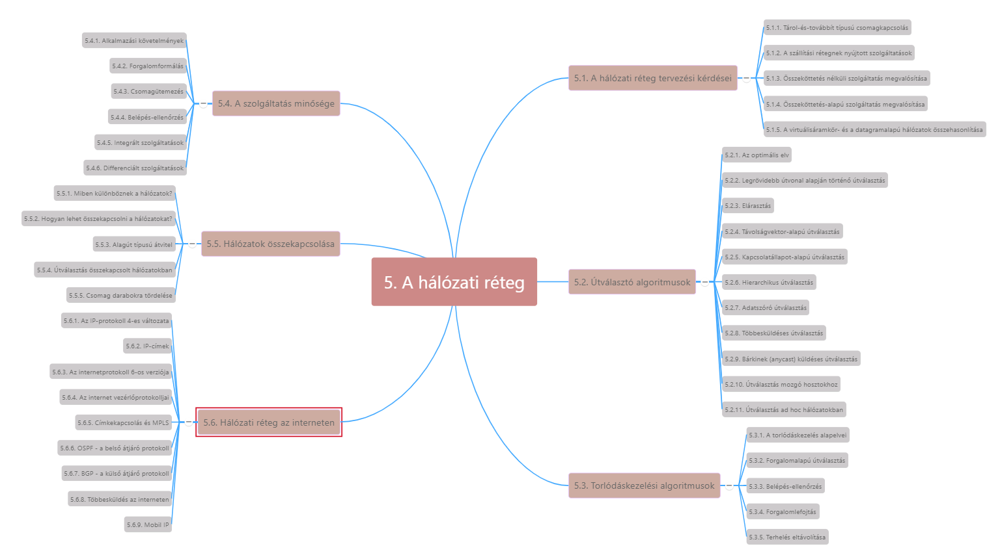

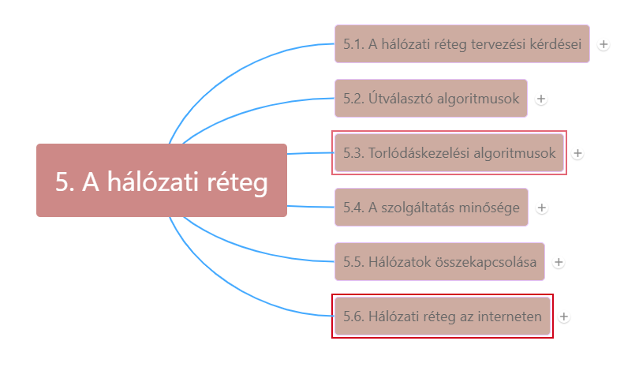

***Feladata:***

* csomagokat a forrástól egészen a célig eljuttassa
* Ehhez a csomagnak esetleg több útválasztón is keresztül kell haladnia
* A hálózati réteg a legalacsonyabb réteg, amely két végpont közti átvitellel foglalkozik (adatkapcsolati réteg -> vonal egyik végétől a másikig)

***Célok elérése érdekében:***

* Ismernie kell a hálózat (vagyis az útválasztók és az adatkapcsolatok halmazának) topológiáját, megfelelő útvonalakat kell találnia azon keresztül
* Úgy kell kiválasztania útválasztókat, hogy elkerülje néhány vonal és útválasztó túlterhelését, míg mások tétlenül maradnak
* Megoldása, ha a forrás és cél különböző hálózatokhoz tartoznak

----

[Network Layer Overview videó - Wetherall_4.1](https://mediaplayer.pearsoncmg.com/_ph_cc_ecs_set.title.4-1_Network_Layer_Overview__/ph/streaming/esm/tanenbaum5e_videonotes/4_1_network_overview_cn5e.m4v)

----

----

[Routing Overview videó - Wetherall_5.1](https://mediaplayer.pearsoncmg.com/_ph_cc_ecs_set.title.5-1_Routing_Overview__/ph/streaming/esm/tanenbaum5e_videonotes/5_1_routing_overview_cn5e.m4v)

----

## 5.1. A hálózati réteg tervezési kérdései

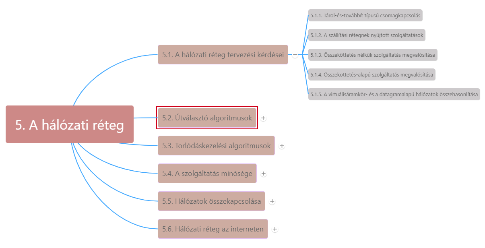

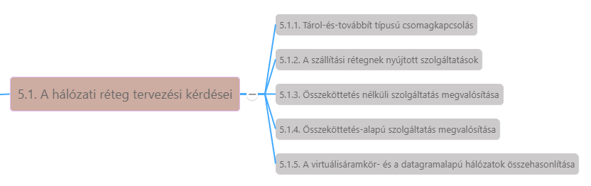

----

[Network Services videó - Wetherall_4.2](https://mediaplayer.pearsoncmg.com/_ph_cc_ecs_set.title.4-2_Network_Services__/ph/streaming/esm/tanenbaum5e_videonotes/4_2_network_service_cn5e.m4v)

----

### 5.1.1. Tárol-és-továbbít típusú csomagkapcsolás

***Berendezések működése:***

* Hosztok az elküldeni kívánt csomagokat a saját LAN-on vagy a szolgáltató felé vezető kétpontos (point-to-point) kapcsolaton keresztül a legközelebbi útválasztóhoz továbbítják ->
* Útválasztó tárolja a csomagot, amíg a teljes be nem érkezik -> ellenőrző összeg kiszámítása miatt. ->
* Csomag soron következő útválasztóhoz kerül, míg el nem éri a címzett hosztot -> tárol-és-továbbít (store-and-forward) típusú csomagkapcsolás
* Ábrán szürke ISP szolgáltató, bérelt vonalon

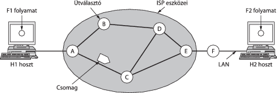

### 5.1.2. A szállítási rétegnek nyújtott szolgáltatások

***A hálózati réteg és a szállítási réteg közötti interfészen***

1. A szolgáltatásoknak függetlennek kell lenniük az útválasztók kialakításától
2. A szállítási réteg elől el kell takarni a jelenlévő útválasztók számát, típusát és topológiáját
3. A szállítási réteg rendelkezésére bocsátott hálózati címeknek egységes számozási rendszert kell alkotniuk, még LAN-ok és WAN-ok esetén is

***Kérdés: a hálózati réteg összeköttetés-alapú vagy összeköttetés nélküli szolgáltatást nyújtson-e?*** Két különböző vélemény:

1. Internet közössége: A hálózat eredendően megbízhatatlan, függetlenül annak tervezésétől. -> megbízhatatlanság tény -> hibavédelem (hibajelzés, hibajavítás) és forgalomszabályozás maguknak elvégzendő -> összeköttetés nélküli kell, nincs szükség a csomagok sorrendi kezelésére és forgalomszabályozásra, hosztok megteszik -> pl. végponttól végpontig tervezési alapelv (en-to-end argument)
2. Telefontársaságok: A hálózatnak megbízható, összeköttetés-alapú szolgáltatást kell nyújtania -> szolgáltatásminőség meghatározó tényező -> összeköttetések nélkül nehéz, különösen valós idejű forgalmak esetén

### 5.1.3. Összeköttetés nélküli szolgáltatás megvalósítása

* Beérkező csomagok egyenként és egymástól függetlenül továbbítódnak -> előzetes összeköttetésfelépítésre nincs szükség
* Csomagok itt datagramok (datagram, DG), a hálózat pedig datagramalapú hálózat (datagram network)
* Egy üzenethez tartozó csomagok eltérő útvonalon is továbbítódhatnak -> azt az algoritmust, mely a táblázatok karbantartását végzi és meghozza az útválasztó döntéseket, útválasztó algoritmusoknak (routing algorithm) nevezzük
* Internetprotokoll (IP, Internet Protocol), amely a teljes internet alapját képezi, meghatározó példája az összeköttetés nélküli hálózati szolgáltatásnak -> minden csomag tart. címzett IP címet, melyet útválasztók használnak
* IPv4 csomagok címe 32 bites, IPv6 128 bites

### 5.1.4. Összeköttetés-alapú szolgáltatás megvalósítása

* A forrás és a cél útválasztó között előre ki kell építeni egy útvonalat adatcsomagok küldése előtt
* A kapcsolat virtuális áramkör (virtual circuit, VC), a hálózat virtuálisáramkör-alapú hálózat (virtual circuit subnet)
* Elkerülik, hogy minden csomag számára újra útvonalat kelljen választani -> már az összeköttetés felépülésekor kiválasztanak egy forrás és címzett közti utat -> útválasztók tárolják táblázataikban -> teljes forgalom itt -> összeköttetés megszűnésekor virtuális áramkör felbomlik
* Folyamat **címkekapcsolás (label switching)**
* Pl. többprotokollos címkekapcsolás (MultiProtocol Label Switching, MPLS) -> ezt használják az ISP hálózatok az interneten -> IP csomagba 20 bites összeköttetés-azonosító vagy összeköttetés-címkét tartalmazó MPLS fejrész.

### 5.1.5. A virtuálisáramkör- és datagramalapú hálózatok összehasonlítása

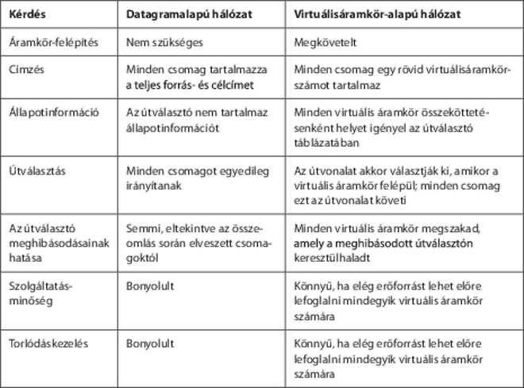

## 5.2. Útválasztó algoritmusok

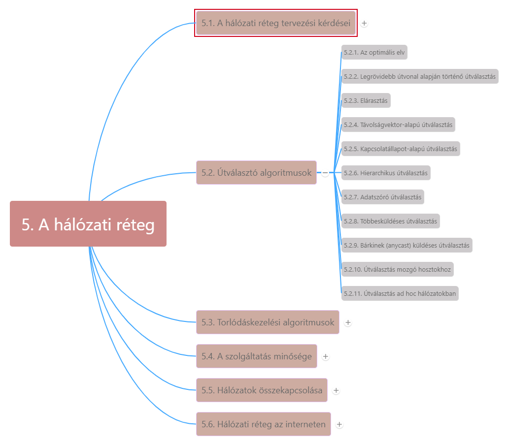

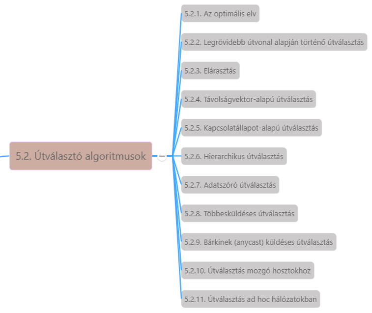

***Útválasztó algoritmus (routing algorithm):***

* a hálózati réteg szoftverének azon része, amely azért a döntésért felelős, hogy a bejövő csomag melyik kimeneti vonalon kerüljön továbbításra
* Virtuális áramkörök esetén viszony-útválasztás (session routing)
* Továbbítás (forwarding): eltér az útválasztástól (útvonalról döntés) -> ez a beérkező csomagokat kezeli mindegyiknek kikeres egy kimeneti vonalat. Az útválasztás az útválasztó táblázatok feltöltéséért és karbantartásáért felelős -> útválasztó algoritmusok

***Útválasztó algoritmussal kapcsolatos elvárások:***

* Helyesség, egyszerűség, robusztusság, stabilitás, igazságosság, optimálás és hatékonyság

***Két nagy osztályba sorolhatók:***

1. **Adaptív algoritmusok (adaptive algorithms):** úgy változtatják útválasztó döntéseiket, hogy azok tükrözzék a topológiában és néha a forgalomban is történt változásokat -> dinamikus útválasztó algoritmusok
   * különbség közöttük: honnan kapják az információt (pl. helyileg, a szomszédos útválasztótól vagy az összes útválasztótól) és
   * milyen metrikát használnak az optimalizáláshoz (pl. távolság, ugrások száma, becsült áthaladási idő) -> 2. fejezet algoritmusai mind a topológia alapján döntenek
2. **Nem adaptív algoritmusok (nonadaptive algorithms):** döntéseikben nem támaszkodnak mérésekre, becslésekre az aktuális forgalomról és topológiáról -> útvonal kiszámolása előre, offline módon -> hálózat indításakor letöltik az útválasztóba -> statikus útválasztás
   * Nem reagál a hibákra -> ott jó, ahol útválasztás egyértelmű

### 5.2.1. Az optimalitási elv

* **Optimalitási elv (optimality principle, Bellmann, 1957)** -> az összes forrásból egy adott célba tartó optimális útvonalak egy fát alkotnak, melynek gyökere a cél -> **nyelőfák (sink tree)** -> távolság mértéke: ugrások száma
* Minden útválasztó algoritmus célja a **nyelőfák felderítése és használata** az összes útválasztó számára
* Nyelőfa nem feltétlenül egyedi, létezhetnek azonos úthosszal más fák is -> ha összes útvonal kiválasztható -> **aciklikus gráf, DAG (Directed Acycle Graph – irányított aciklikus gráf)** -> nem tartalmaz hurkokat
* Optimalitási elv és nyelőfa egy mérőszámot adnak, amelyhez más útválasztó algoritmusokat viszonyíthatunk.

----

[Shortest Path Routing videó - Wetherall_5.2](https://mediaplayer.pearsoncmg.com/_ph_cc_ecs_set.title.5-2_Shortest_Path_Routing__/ph/streaming/esm/tanenbaum5e_videonotes/5_2_shortest_path_cn5e.m4v)

----

----

[Equal-Cost Multi-path Routing videó - Wetherall_5.7](https://mediaplayer.pearsoncmg.com/_ph_cc_ecs_set.title.5-7_Equal-Cost_Multi-path_Routing__/ph/streaming/esm/tanenbaum5e_videonotes/5_7_ecmp_cn5e.m4v)

----

### 5.2.2. Legrövidebb útvonal alapján történő útválasztás

* Kiszámítja az optimális útvonalakat, és a hálózat teljes képét megadja -> ötlet: építsük fel a hálózat gráfját, (útválasztó = csomópont, él = komm. vonal) -> az algoritmus két útválasztó között a legrövidebb utat keresi
* Legrövidebb út lehet:
  * Ugrások száma legkevesebb
  * Földrajzilag legrövidebb
  * Élsúlyozás tesztcsomagra vonatkozó sorbanállási és átviteli késleltetés, óránkénti próbafuttatásokkal -> leggyorsabb út
  * Általában: élsúlyozás távolság, sávszélesség, átlagos forgalom, kommunikációs költség, átlagos sorhosszúság, mért késleltetés + más értékek alapján számítódik

***Sok algoritmus legrövidebb út kiszámítására***

* **Dijsktra (1959)**: a hálózatban a forráscsomópont és az összes többi csomópont mint nyelőcsomópont közötti legrövidebb utat hat. meg.
  * Minden csomópontot felcímkézünk (zárójelben) a forráscsomóponttól való legrövidebb ismert út mentén mért távolsággal -> kezdetben nem ismert ilyen, címke végtelen -> algoritmus előrehaladásával címkék módosulnak -> egyre jobb utak.
  * Címke lehet ideiglenes vagy állandó

----

[Shortest Path Routing videó - Wetherall_5.2](https://mediaplayer.pearsoncmg.com/_ph_cc_ecs_set.title.5-2_Shortest_Path_Routing__/ph/streaming/esm/tanenbaum5e_videonotes/5_2_shortest_path_cn5e.m4v)

----

----

[Computing Shortest Paths with Dijkstra videó - Wetherall_5.3](https://mediaplayer.pearsoncmg.com/_ph_cc_ecs_set.title.5-3_Computing_Shortest_Paths_with_Dijkstra__/ph/streaming/esm/tanenbaum5e_videonotes/5_3_dijkstra_cn5e.m4v)

----

### 5.2.3. Elárasztás

***Helyi módszer az elárasztás (flooding):***

* Minden bejövő csomagot minden kimenő vonalon kiküldünk
* Nagyszámú kettőzött csomagok ->
  * **visszafogására** minden csomag fejrészében ugrásszámláló, minden ugráskor csökken eggyel, ha eléri a 0-t a csomagot eldobjuk -> ideális esetben kezdeti érték forrástól a célig vezető út hossza
  * **Visszafogására másik lehetőség**: nyilvántartjuk mely csomagokkal végeztünk már elárasztást
    * Forrás útválasztó minden csomagban elhelyez egy sorszámot, melyet hosztjaitól kap -> minden forrás útválasztónak kell lista, ez alapján mely sorszámokat látta már. Ha beérkező csomag rajta van, nem küldi tovább
    * Minden listát ki kell egészíteni egy számlálóval, k-val melynek a jelentése, hogy k-ig minden sorszám előfordult már
* **Elárasztás alkalmazási helye:**
  * Csomag hálózat minden csomópontjához eljusson, adatszórásnál hatékony módszer
  * Rendkívül robusztus, útválasztók kiesésekor talál útvonalat a csomag célbajuttatásához
* **Útválasztónak csak szomszédait kell ismernie**

----

[Flooding videó - Wetherall_5.5](https://mediaplayer.pearsoncmg.com/_ph_cc_ecs_set.title.5-5_Flooding__/ph/streaming/esm/tanenbaum5e_videonotes/5_5_flooding_cn5e.m4v)

----

### 5.2.4. Távolságvektor-alapú útválasztás

Általában dinamikus algoritmust használnak

***Távolságvektor alapú útválasztás (distance vector routing):***

* Minden útválasztónak egy táblázatot (vagyis vektrot) kell karbantartania, melyben minden célhoz minden legrövidebb ismert távolság és a vonal azonosítója -> táblázatok frissítése: szomszédokkal való információcsere
* **Elosztott Bellman-Ford útválasztó algoritmusnak** is nevezik (ARPANET eredeti útválasztó algoritmusa + interneten RIP néven)
* Táblázat, melyet a hálózatban lévő összes útválasztó szerint indexelnek + mindegyikhez tartalmaz egy bejegyzést:
  * Adott célhoz előnyben részesített kimeneti vonal
  * Becsült távolság (ugrások száma, vagy egyéb mérték)

----

[Distance Vector Routing videó - Wetherall_5.4](https://mediaplayer.pearsoncmg.com/_ph_cc_ecs_set.title.5-4_Distance_Vector_Routing__/ph/streaming/esm/tanenbaum5e_videonotes/5_4_distance_vector_cn5e.m4v)

----

#### 5.2.4.1. A végtelenig számolás problémája

**A hálózatban a lehetséges útvonalak közül a legjobb út beállítását konvergenciának nevezik.**

* Távolságvektor-alapú útválasztás hasznos, de komoly hátránya -> konvergál a helyes megoldáshoz, de nagyon lassan
* **Végtelenig számolás (count-to-infinity):**
  * Soha nincs egyik útválasztónak sem több mint 1-gyel magasabb értéke, mint a szomszédainak minimuma -> fokozatosan mindegyik útválasztó felküzdi magát végtelenig, de az ehhez szükséges cserék száma a végtelen ábrázolásához használt számtól függ
  * ha X elmondja Y-nak, hogy van egy valahová vezető útja, Y-nak sehogy sem áll módjában megtudnia, hogy vajon ő maga rajta van-e ezen az úton

### 5.2.5. Kapcsolatállapot-alapú útválasztás

***ARPANET-ben távolságvektor alapú útválasztást 1979-ben felváltotta a kapcsolatállapot-alapú útválasztás***

* Az algoritmus egyensúlyba kerülése túl sokáig tartott a hálózati topológia változása után (végtelenig számolás problémája miatt)
* Kapcsolatállapot-alapú útválasztás (link state routing) váltotta fel (IS-IS és OSPF, széles körben használják nagy hálózatokban és interneten) -> minden útválasztónak tennie kell:
  1. Felkutatni a szomszédjait és megtudni a hálózati címeiket
  2. Beállítani a távolság vagy a költség értékét a minden szomszédjáig mért késleltetés alapján
  3. Összeállítani egy csomagot, amely a most megtudottakat tartalmazza
  4. Elküldeni ezt a csomagot az összes többi útválasztónak
  5. Kiszámítani az összes többi útválasztóhoz vezető legrövidebb utat
* Teljes topológia eljut összes útválasztóhoz -> Dijsktra-algoritmust futtatják az útválasztók, legrövidebb út megtalálásához

----

[Link State Routing videó - Wetherall_5.6](https://mediaplayer.pearsoncmg.com/_ph_cc_ecs_set.title.5-6_Link_State_Routing__/ph/streaming/esm/tanenbaum5e_videonotes/5_6_link_state_cn5e.m4v)

----

#### 5.2.5.1. A szomszédok megismerése

* Egy speciális hello csomagot küld ki minden hozzá kapcsolódó kétpontos vonalon
* A másik végén lévő útválasztótól elvárja, hogy küldjön vissza választ azonosítójával -> globálisan egyedi jelek kellenek
* Üzenetszórásos adatkapcsolat esetén (pl. kapcsoló, gyűrű, klasszikus Ethernet) -> üzenetszórásos LAN minden csatlakoztatott útválasztópár között kapcsolatot létesít

#### 5.2.5.2. Az adatkapcsolat költségének beállítása

* A kapcsolatállapot-alapú útválasztó algoritmus megköveteli, hogy minden adatkapcsolat rendelkezzen a legrövidebb út megtalálására vonatkozó távolság vagy költség mérőszámmal
* Szomszédok elérésének költsége beállítható automatikusan, vagy hálózat operátora által
* Ha földrajzilag kiterjedt a hálózat, adatkapcsolatok késleltetését is figyelembe lehet venni -> speciális echo csomag kiküldése (másik oldalnak azonnal vissza kell küldenie)

#### 5.2.5.3. A kapcsolatállapot-csomagok összeállítása

* Minden útválasztó összeállít egy csomagot, amely az összes adatot tartalmazza
  * Feladó azonosítója
  * Sorszám
  * Korérték
  * Szomszédok listája, felé vezető
  * költség
* Összeállítása egyszerű, kérdés mikor
  * Periodikusan, szabályos időközönként
  * Amikor valami jelentős esemény történik

#### 5.2.5.4. A kapcsolatállapot-csomagok szétosztása

***Alapvető szétosztó algoritmus:***

* Elárasztás, csomagsorszámmal, mely minden csomagküldésnél 1-gyel nő
* Útválasztók számontartanak minden forrásútválasztó – sorszám párt
* Új kapcsolatállapot csomag érkezik, összevetik a már látott csomagok listájával
  * Ha új, továbbítják minden vonalon
  * Ha sorszáma kisebb mint legnagyobb látott sorszám -> eldobják

***Problémái:***

* Átfordulás -> 32 bites sorszámokat kell használni
* Útválasztó összeomlásakor elfelejti melyik sorszámnál tartott, ha 0-ról kezdi, nem továbbítják
* Sorszám megsérül, magasabb sorszám érkezésekor az alattiakat elavultként visszautasítja

***Megoldás:***
Minden csomagba a sorszáma után a csomag életkorát is bele kell tenni, másodpercenként 1-gyel csökkenteni

***Robusztusabbá tételhez:***
Kapcsolatállapot-csomag ideiglenes tárolóterületre kerül, várakozik -> ha még egy ugyanattól a forrástól sorszámösszehasonlítás -> ha egyenlők másodpéldányt eldobja

#### 5.2.5.5. Új útvonalak kiszámítása

***Hálózat teljes gráfjának megszerkesztése***

* Kapcsolatállapot csomagok teljes készlete ->
* Helyileg Dijsktra-algoritmus
* **IS-IS (Intermediate System to Intermediate System Intradomain Routing Protocol – közbenső rendszertől közbenső rendszerig történő körzeten belüli útválasztó protokoll)**:
  * DECnet számára tervezték -> ISO átvette OSI protokollhoz -> átalakították más protokollokat is kezeljen (pl IP-t)
  * **OSPF (Open Shortest Path First – nyílt hozzáférésű, a legrövidebb utat előrevevő protokoll)** -> IETF fejlesztette ki IS-IS után évekkel -> IS-IS számos újítását átörökítve

### 5.2.6. Hierarchikus útválasztás

* Hálózatok méretének növekedésével útválasztók táblázatai is egyre nőttek -> több memória, több CPU idő ->
* Hierarchikus útválasztás ->
  * útválasztókat **tartományokra (regions)** osztják, minden útválasztó ismeri saját tartományát, de nem ismeri a többit ->
  * nagyon nagy hálózatok esetén többszintű hierarchia, **kerületek** -> zónák -> csoportok stb. -> többszintű hierarchia
  * Kamoun és Kleinrock (1979) felfedezték, hogy egy **N** útválasztóból álló hálózathoz a szintek optimális száma **ln N**, amely ***e*** **ln N** bejegyzést igényel útválasztónként 

----

[Hierarchical Routing videó - Wetherall_5.9](https://mediaplayer.pearsoncmg.com/_ph_cc_ecs_set.title.5-9_Hierarchical_Routing__/ph/streaming/esm/tanenbaum5e_videonotes/5_9_hierarchical_cn5e.m4v)

----

### 5.2.7. Adatszóró útválasztás

Néhány alkalmazásban a hosztoknak üzeneteket kell küldeniük néhány másik hosztnak, vagy az összes többinek pl. időjárás-jelentés, élő rádióműsor -> egy csomag mindenhová történő egyidejű elküldése **adatszórás (broadcasting)**

***Adatszórás (broadcasting) módszerek:***

* Egyik adatszóró eljárás: a forrás egyszerűen külön csomagot küld minden rendeltetési helyre -> 
  * sávszélességpazarló
  * lassú
  * megköveteli a forrástól a rendeltetési helyek teljes listáját
* **Többcélú útválasztás:** előző továbbfejlesztett változata
  * minden csomagban lista a rendeltetési helyekről, vagy bittérkép, amely a rendeltetési helyeket jelzi
  * útválasztó másolatot készít a csomagról minden minden használandó kimeneti vonalnak, csak azokkal a célcímekkel, amiket a vonal fog használni
* **Elárasztás:** 
  * Forrásonkénti sorszámozással hatékonyan használja a vonalakat az útválasztók döntési szabályaival
* **Visszairányú továbbítás (reverse path forwarding):**
  * Ha a csomag az útválasztóhoz azon az úton érkezett, amelyet az útválasztó használ a küldő irányába való továbbításhoz -> útválasztó másolatot továbbít minden adatkapcsolatra (kivéve, ahonnan érkezett)
  * Ha a csomag másik adatkapcsolaton érkezett, mint a mit az útválasztó használ -> csomagot eldobja, mint valószínű másodpéldányt
  * Hatékony és könnyen megvalósítható
  * Csomagot minden adatkapcsolaton csak egyszer küldi ki mint elárasztásnál, de az útválasztónak csak azt kell tudnia, hogy egyes célok hogyan érhetők el (nem kell megjegyeznie sorszámokat, egyéb módszert, vagy felsorolni a csomagban az összes célt)
* **Feszítőfa:**
  * explicit módon használja a nyelőfát az adatszórást kezdeményező útválasztóhoz
  * feszítőfa részhalmaza annak a hálózatnak, amely tartalmazza az összes útválasztót, de nem tartalmaz hurkot
  * Ha minden útválasztó ismeri a feszítőfához tartozó vonalat -> le tudja másolni a bejövő adatszórásos csomagot a feszítőfa vonalaira (kivéve, amelyiken érkezett)
  * Minden útválasztónak ismerni kell néhány feszítőfát a módszer alkalmazásához (kapcsolatállapot-alapú útválasztás esetén az összes útválasztó ismeri a teljes topológiát -> ki tudnak számítani egy feszítőfát)

### 5.2.8. Többesküldéses útválasztás

## 5.3. Torlódáskezelési algoritmusok

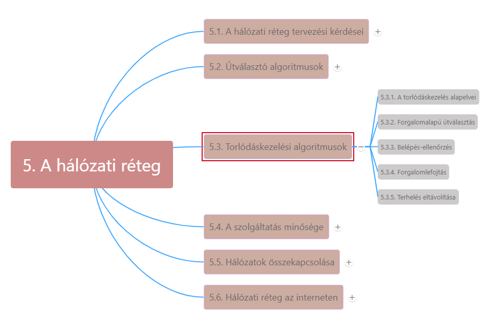

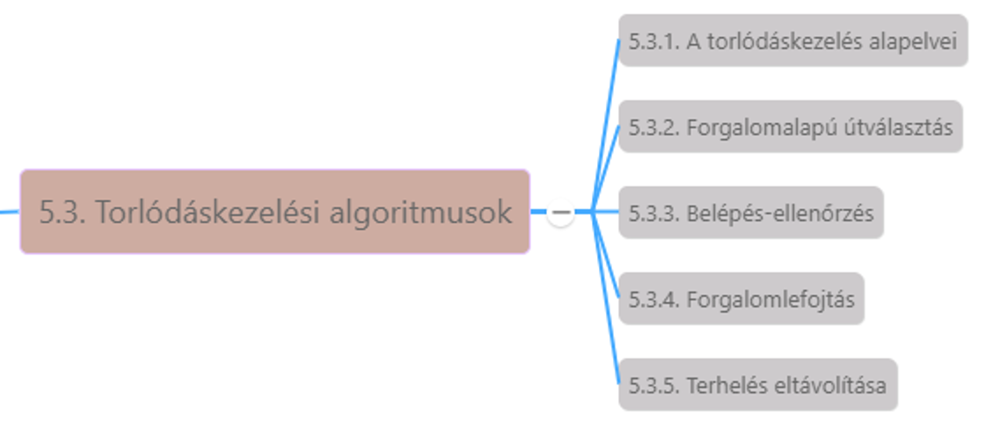

* Túl sok csomag a hálózatban -> teljesítőképesség visszaesik -> késleltetés -> **torlódás (congestion)**
* Hálózati és szállítási réteg megosztja a torlódáskezelést -> hálózati réteg érzékeli, dönt mi legyen a többletcsomagokkal -> leghatékonyabb módszer: csökkentjük a szállítási réteg miatti terhelést
* Rosszul megtervezett hálózat esetén a torlódás *összeomlást okozhat* -> teljesítőképesség gyorsan csökken
* **Hasznos átbocsátóképesség (goodput)** mutatja az arányt, mellyel a hálózat a hasznos csomagokat kézbesíti
* Kis sávszélességű adatkapcsolatok és útválasztók is okozhatnak torlódást -> forgalom egy részének átirányításával javítható, vagy gyorsabb hálózat kiépítése
* **Torlódáskezelés:** a hálózat képes legyen elszállítani a forgalmat. Globális kérdés, minden hoszt minden útválasztó viselkedésére vonatkozik.
* **Forgalomszabályozás:** adott küldő és adott fogadó közötti forgalomra vonatkozik. Feladata: megakadályozni, hogy adó gyorsabban adjon, mint vevő fogadni tudja

### 5.3.1. A torlódáskezelés alapelvei

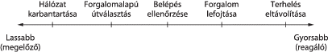

* **Torlódás** = *terhelés (ideiglenesen) nagyobb, mint amit az erőforrások kezelni tudnak* (ábrán torlódáskezelés megoldásai időskálán)
  * Erőforrások növelése
  * Terhelés csökkentése
* **Torlódáskezelési megoldások**
  * Karbantartás: néha további erőforrások dinamikusan használhatók, tartalék
  * Forgalomalapú útválasztás (traffic-aware routing): forgalom több útvonal közötti felosztása is lehetséges
  * Belépésellenőrzés (admission control): terheléscsökkentés, virtuálisáramkör-alapú hálózat esetén új összeköttetések felépítése visszautasítható
  * Terheléslefojtás (load shedding): a hálózatot kényszeríteni kell a nem kézbesíthető csomagok eldobására.

### 5.3.2. Forgalomalapú útválasztás

* Az interneten az útválasztó protokollok általában nem a terheléstől függően állítják be az útvonalakat.
* A beállítás általában az útválasztó protokollokon kívül történik, a bemenet lassú módosításával -> **forgalomtervezés (traffic engineering)**

### 5.3.3. Belépés-ellenőrzés

* Virtuálisáramkör alapú hálózatokban
* **Lyukas vödör (leaky bucket)** vagy a **vezérjeles vödör (token bucket)** algoritmus
  * Lyukas vödör: két paraméterrel, mely meghatározza a forgalom átlagos sebességét és pillanatnyi löketet

### 5.3.4. Forgalomlefojtás

***Torlódáselkerülés (congestion avoidance):*** torlódás közeledésekor értesíteni kell a küldőket, hogy fogják vissza átviteleiket, lassítsanak le.

1. **Lefojtócsomagok (choke packet)**: kis sebességgel visszaküldeni a forráshosztnak -> csökkentenie kell forgalmat pl. 50%-kal
2. **Explicit torlódásjelzés (Explicit Congestion Notification - ECN)**: IP csomag fejrészében lévő két bit rögzíti, a csomag észlelt-e torlódást. Torlódást észlelő útválasztó megjelöli.
3. **Lépésről lépésre történő visszaszorítás (hop-by-hop backpresure):** minden csomópontra ható lefojtócsomag
4. **Terhelés eltávolítása (load shedding)**: útválasztók olyan csomagokat, melyekkel nem tudnak megbirkózni, egyszerűen eldobják
5. **Véletlen korai detektálás (Random Early Detection – RED)**: útválasztók figyelik sorhosszaik pillanatnyi állapotát, ez alapján már korán elkezdenek csomagokat eldobálni (sorhossz küszöbszinten túl) -> véletlenszerű eldobás

## 5.4. A szolgáltatás minősége

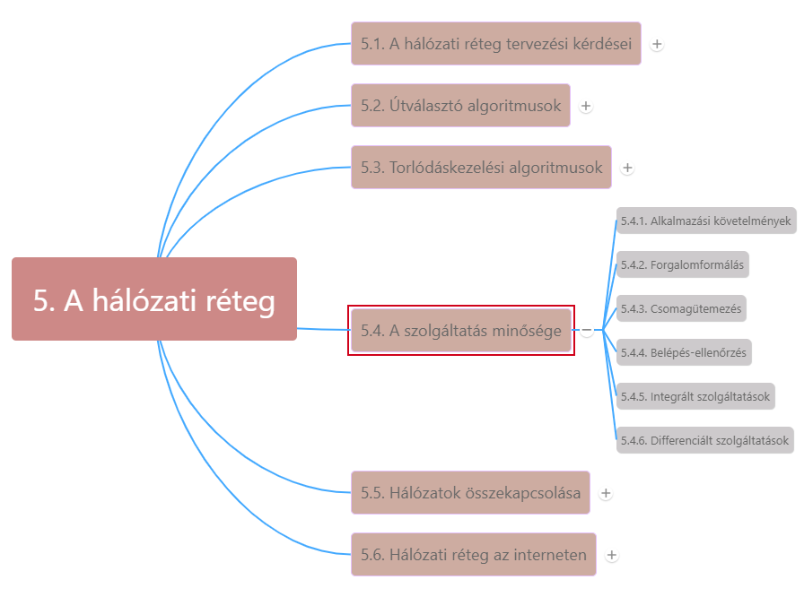

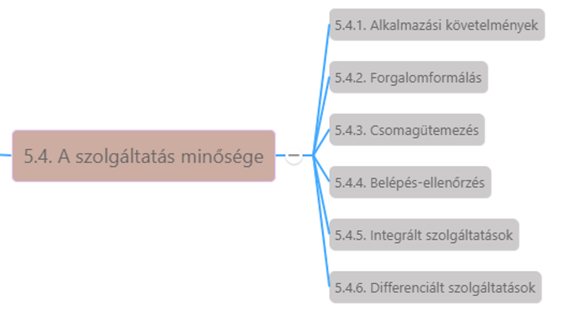

## 5.5. Hálózatok összekapcsolása

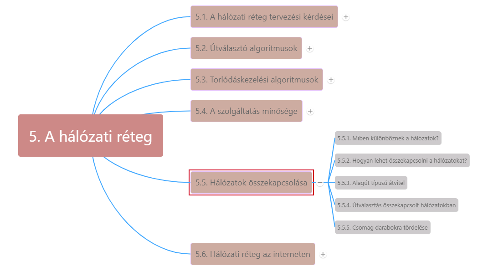

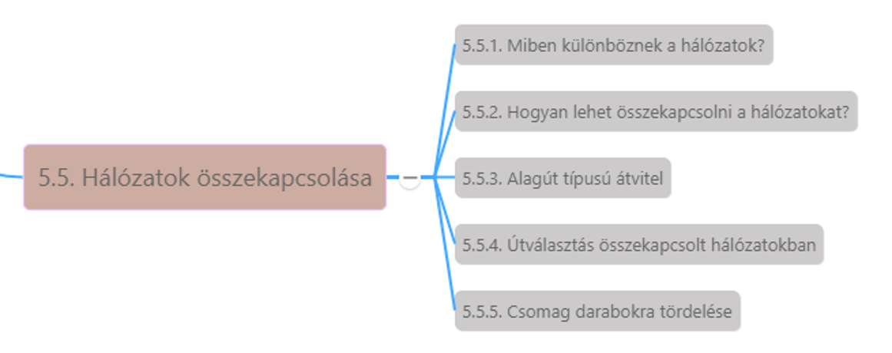

----

[Internetworking videó - Wetherall_4.3](https://mediaplayer.pearsoncmg.com/_ph_cc_ecs_set.title.4-3_Internetworking__/ph/streaming/esm/tanenbaum5e_videonotes/4_3_internetworking_cn5e.m4v)

----

----

[Packet Fragmentation videó - Wetherall_4.7](https://mediaplayer.pearsoncmg.com/_ph_cc_ecs_set.title.4-7_Packet_Fragmentation__/ph/streaming/esm/tanenbaum5e_videonotes/4_7_fragmentation_cn5e.m4v)

----

## 5.6. Hálózati réteg az interneten

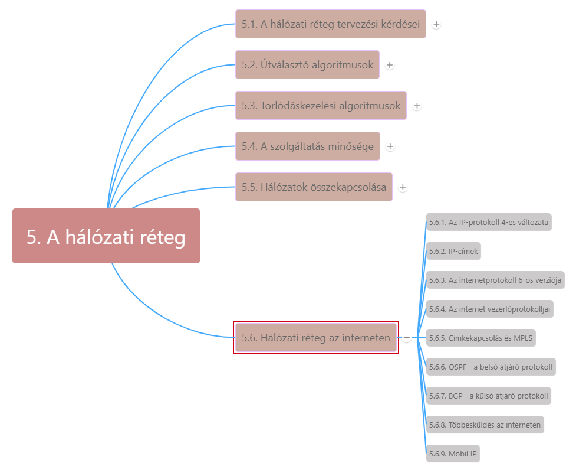

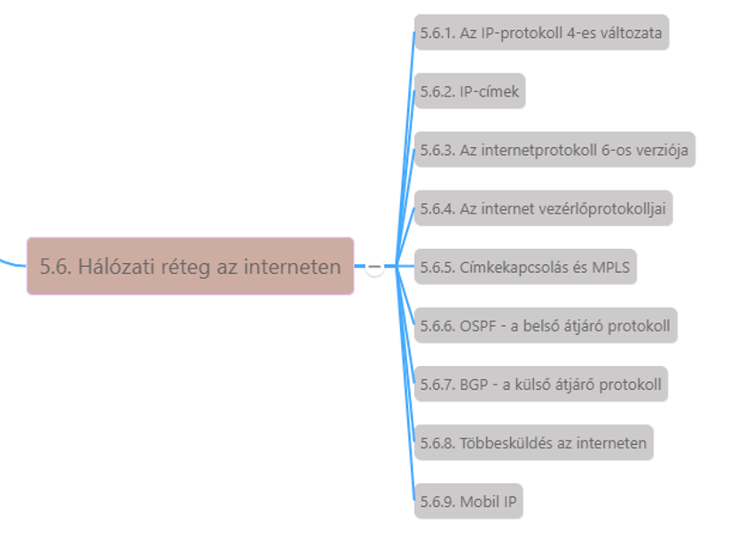

* Az internet hálózatok gyűjteményének, vagy autonóm rendszerek összekapcsolt együttesének tekinthető.
  * 1.rétegű hálózatok -> legnagyobb gerinchálózat
  * ISP-k
  * Regionális és középszintű hálózatok, stb.
*A ragasztó, amely az internetet egyben tartja -> **IP (Internet Protocol – internetprotokoll)**
* Kommunikáció az interneten:
  * Szállítási réteg adatfolyamokat feltördeli, hogy azok IP csomagként küldhetők legyenek (elméletben 64 KB, gyakorlatban 1500 bájt -> Ethernet-keret)
  * IP-útválasztók minden csomagot továbbítanak az interneten keresztül
  * Célnál hálózati réteg átadja adatokat a szállítási rétegnek

### 5.6.1. Az IP-protokoll 4-es változata

***IP datagramok formátuma***

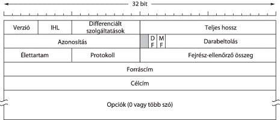

* **Fejrész** (ábrán)
  * **Verzió**: a datagram a protokoll melyik verziójához tartozik
  * **IHL**: fejrész hossza nem állandó, ez adja meg a fejrész hosszát (5-15)
    * fejrész max 60 bájt, Opciók mező max. 40 bájt
  * **Differenciált szolgáltatások**: különbséget tegyen az eltérő szolgáltatási osztályok között. 6 bit a csomag szolgáltatási osztályának jelzésére
    * Alsó 2 bit explicit torlódásértesítési információk
  * **Teljes hossz (total length)**: a datagram minden része belértendő, fejrész és adatrész is. Max. hossz: 65535 bájt
  * **Azonosítás (Identification)** mező a daraboláskor szükséges ahhoz, hogy a címzett hoszt eldönthesse melyik datagramhoz tartozik az új darab.
  * **1 kihasználatlan bit**
  * **1-1 bit darabolással kapcsolatos**:
    * **DF: Don’t Fragment**: útválasztóknak szól, ne darabolják fel a csomagot
    * **MF: More Fragments**: minden darabban, kivéve az utolsóban -> hogy tudjuk, hogy egy datagram minden darabja megérkezett-e
  * **Darabeltolás**: hova tartozik a mostani darab a datagramban (Azonosítás, MF és Darabeltolás együtt valósítja meg a darabolást)
  * **Élettartam**: számláló, a csomag élettartamának korlátozására
    * Gyakorlatilag az ugrásokat számolja, csökkenteni kell, ha eléri 0-t, eldobni
  * **Protokoll**: összeállított teljes datagramról mondja meg, melyik szállítási folyamatnak adja át (TCP, UDP, stb)
  * **Fejrész-ellenőrző összeg (Header Checksum)**: fejrész lényeges információ -> kiszámítja saját ellenőrző összegét.
  * **Forráscím**: forrás hálózati interfészének IP-címe
  * **Célcím:** cél hálózati interfészének IP-címe
  * **Opciók**: változó hosszúságú, egyéb információk (2. ábrán) ->
    * Sok útválasztó figyelmen kívül hagyja, nem támogatja
* Törzsrész

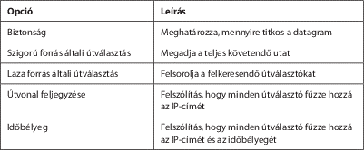

----

[Internetworking videó - Wetherall_4.3](https://mediaplayer.pearsoncmg.com/_ph_cc_ecs_set.title.4-3_Internetworking__/ph/streaming/esm/tanenbaum5e_videonotes/4_3_internetworking_cn5e.m4v)

----

----

[IP prefixes videó - Wetherall_4.4](https://mediaplayer.pearsoncmg.com/_ph_cc_ecs_set.title.4-4_IP_Prefixes__/ph/streaming/esm/tanenbaum5e_videonotes/4_4_ip_prefixes_cn5e.m4v)

----

----

[IP forwarding videó - Wetherall_4.5](https://mediaplayer.pearsoncmg.com/_ph_cc_ecs_set.title.4-5_IP_Forwarding__/ph/streaming/esm/tanenbaum5e_videonotes/4_5_ip_forwarding_cn5e.m4v)

----

### 5.6.2. IP-címek

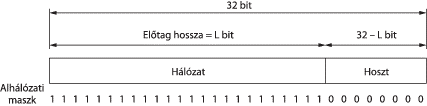

* IPv4 meghatározója 32 bites cím ->
* IP cím nem hoszthoz tartozik, igazából egy hálózati interfészre utal (2 hálózathoz csatlakozó hoszt 2 IP cím)
* Hierarchikusak
* Minden 32 bites cím változó hosszúságú hálózati részből (felső bitek) és hosztrészből (alsó bitek) áll.
* IP-címeket pontokkal elválasztott decimális jelölésrendszerben (dotted decimal notation) írják -> minden 4 bájt 10-es számrendszerben 0-255-ig

1. ***Előtagok (prefix):***
   * = **hálózati rész** -> egy hálózaton lévő összes hoszt esetén megegyezik
     * Bizonyos esetekben előtagokat egyszerűen hosszuk írja le -> pl. /16
     * Előtag hossza megfelel az 1-esek bináris maszkjának a hálózati részben
   * **Alhálózati maszk (subnet mask)** ÉS kapcsolatba hozva az IP címmel, megkapjuk a hálózati részt
2. ***Alhálózatok***
   * A hálózatszámokat **ICANN** (Internet Corporation for Assigned Names and Numbers – Internettársaság Kiosztott Nevek és Számok Kezelésére) kezeli
   * Címblokkok szétvágása több részre, de a külvilág számára továbbra is egyetlen hálózatnak látszik -> **alhálózatra osztás (subnetting)**
   * Az alhálózati felosztások később szükség esetén módosíthatók a hálózat összes útválasztójának alhálózati maszkjának frissítésével
   * A hálózaton kívülről az alhálózati felosztás nem látható -> nem kell felvenni a kapcsolatot az ICANN-nel, nem kell külső adatbázisokat módosítani
3. ***CIDR – Osztály nélküli körzetek közti útválasztás***
   * Internet közepén ISP-k és gerinchálózatok útválasztói -> internet alapértemezés nélküli zónájában (default-free zone) -> óriási táblák, és rengeteg csomag -> speciális hardver és gyors memória ->
   * **Útvonal-csoportosítás (route aggregation)**: több kis előtag egyesítve egyetlen nagyobb előtagba (alhálózatoknál használt módszerhez hasonlóan) -> szuperhálózat (supernet)
   * **CIDR (Classless InterDomain Routing, osztály nélküli körzetek közti útválasztás)**: alhálózatokra bontást használ
4. ***Osztályalapú és speciális címzés***
   * 1993 előtt IP-címek 5 kategóriába: A, B, C, D, E
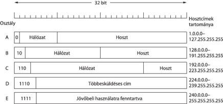
5. ***NAT – hálózati címfordítás***
   * IP címek szűkös erőforrások -> takarékos technikák
     * **Dinamikus IP címek** -> kapcsolat lezárásakor vissza is veszik.
     * Hosszú távú megoldás -> átállás **IPv6-ra**
     * Gyors javítás -> **NAT (Network Address Translation – hálózati címfordítás)**
   * **NAT:**
     * **Alapötlete**: internetszolgáltató minden otthon vagy cég számára egy vagy kevés IP-t oszt ki
     * Egy vállalati hálózaton belül minden számítógép egyedi IP-címet kap, amit a házon belüli forgalom irányítására használnak ->
     * Amikor a csomag elhagyja a vállalati hálózatot, és kimegy az ISP felé ->
       * **címfordítás NAT-doboz (NAT box)** -> egyedi belső IP-cím helyett – osztott nyilvános IP cím ->
       * TCP vagy UDP Forrásport mezőjét ki kell cserélni egy mutatóra, amely a NAT doboz fordítási táblázatába mutat (forrásport önmagában nem elég) -> indexként használják -> belső IP címre mutat
     * Fordítás 3 címtartományt használ, amelyet privát használatra jelöltek ki -> hálózatok belsőleg tetszőlegesen használhatják -> az interneten nem jelenhetnek meg ezek a címek
       * 10.0.0.0 – 10.255.255.255/8
       * 172.16.0.0 – 172.31.255.255/12
       * 192.168.0.0 – 192.168.255.255/16
     * NAT doboz gyakran tűzfallal együtt
     * NAT problémái RFC 2993

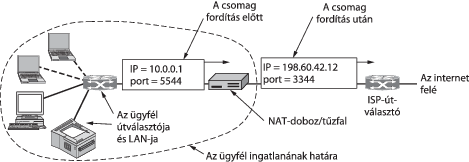

----

[IP prefixes videó - Wetherall_4.4](https://mediaplayer.pearsoncmg.com/_ph_cc_ecs_set.title.4-4_IP_Prefixes__/ph/streaming/esm/tanenbaum5e_videonotes/4_4_ip_prefixes_cn5e.m4v)

----

----

[IP forwarding videó - Wetherall_4.5](https://mediaplayer.pearsoncmg.com/_ph_cc_ecs_set.title.4-5_IP_Forwarding__/ph/streaming/esm/tanenbaum5e_videonotes/4_5_ip_forwarding_cn5e.m4v)

----

----

[Network Address Translation videó - Wetherall_4.10](https://mediaplayer.pearsoncmg.com/_ph_cc_ecs_set.title.4-10_Network_Address_Translation__/ph/streaming/esm/tanenbaum5e_videonotes/4_10_nat_cn5e.m4v)

----

----

[IP Prefix Aggregation and Subnets videó - Wetherall_5.10](https://mediaplayer.pearsoncmg.com/_ph_cc_ecs_set.title.5-10_IP_Prefix_Aggregation_and_Subnets__/ph/streaming/esm/tanenbaum5e_videonotes/5_10_aggregation_cn5e.m4v)

----

### 5.6.3. IPv6

IPv4 címek elfogynak -> IPv6
***IPv6:***

* 128 bites címet használ
* Új szabvány **SIPP (Simple Internet Protocol)** -> **IPv6**
* Nem kompatibilis IPv4-gyel, de az összes többi internetprotokollal igen
* Fejrész egyszerűsítése -> csak 7 mező (IPv4 13 mezője helyett) -> útválasztók: gyorsabb feldolgozás -> javítja az átbocsátást
* Opciók jobb támogatása -> korábban megkövetelt fejrész mezők most opcionálisak lettek – opciók megjelenése is más, egyszerűbb kezelés útválasztóknak -> csomagfeldolgozási idő gyorsítása
* **Biztonság**: hitelesítés és titkosság az új IP kulcstulajdonsága (visszamenőleg IPv4-be is beépítették)
* **Szolgáltatásminőségnek** több figyelem

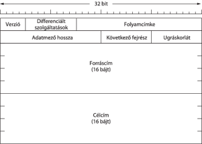

1. ***A fő IPv6 fejrész:***
   * **Verzió**: mindig 6 (IPv4-nél 4)
   * **Differenciált szolgáltatások** (eredetileg Forgalmi Osztály)
     * Különbséget tesz a csomagok között valós idejű szállítással kapcsolatban
     * 1-2. bit: explicit torlódás jelzésére
   * **Folyamcímke**: forrás és cél megjelöli azon csomagok csoportját, amelyek különleges elbánást igényelnek
   * **Adatmező hossza**: megmondja mennyi bájt következik a 40 bájtos fejrész után (fejrészt itt már nem számolják bele, 65535 bájt lehet)
   * **Következő fejrész**: opcionális, kiegészítő fejrész -> megmondja melyik szállítási protokoll kezelőjének (TCP, UDP) kell a csomagot továbbítani.
   * **Ugráskorlát**: minden ugrásnál érték csökkentése, 0-nál eldobás
   * **Forráscím és Célcím**: 16 bájtos címek, leírásukra új jelölésrendszer:
     * 8, 4-4 hexadecimális számjegyből álló csoportként írjuk le a címet, a csoportok között kettősponttal. Három ésszerűsítés:
       * Egy csoporton belül a bevezető 0-k elhagyhatók,
       * Egy vagy több 16 nullából álló csoport két kettősponttal helyettesíthető,
       * Az IPv4 címek 2 kettőspont és a régi, pontokkal elválasztott decimális szám formájában írhatók fel
   * **Ellenőrző összeg eltűnt!!**
2. ***Kiegészítő fejrészek (extension header)***
   * Opcionális, használhatók hatékony módon kódolt külön információ biztosítására
   * Ha több mint egy van, közvetlenül a rögzített fejléc után kell szerepelniük, célszerűen az adott sorrendben
   * Óriás datagramok, jumbgramok

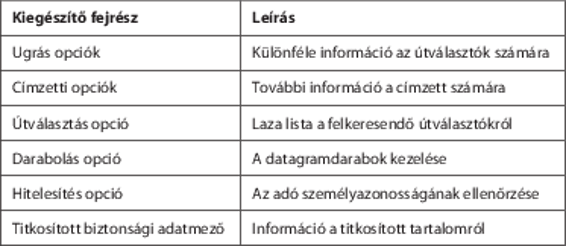

----

[IP Version 6 videó - Wetherall_4.9](https://mediaplayer.pearsoncmg.com/_ph_cc_ecs_set.title.4-9_IP_Version_6__/ph/streaming/esm/tanenbaum5e_videonotes/4_9_ipv6_cn5e.m4v)

----

### 5.6.4. Az internet vezérlőprotokolljai

----

[Helping IP with ARP, DHCP videó - Wetherall_4.6](https://mediaplayer.pearsoncmg.com/_ph_cc_ecs_set.title.4-6_Helping_IP_with_ARP,_DHCP__/ph/streaming/esm/tanenbaum5e_videonotes/4_6_ip_helpers_cn5e.m4v)

----

----

[IP Errors with ICMP videó - Wetherall_4.8](https://mediaplayer.pearsoncmg.com/_ph_cc_ecs_set.title.4-8_IP_Errors_with_ICMP__/ph/streaming/esm/tanenbaum5e_videonotes/4_8_ip_errors_cn5e.m4v)

----

### 5.6.5. Címkekapcsolás és MPLS

### 5.6.6. OSPF - a belső átjáró protokoll

----

[Link State Routing videó - Wetherall_5.6](https://mediaplayer.pearsoncmg.com/_ph_cc_ecs_set.title.5-6_Link_State_Routing__/ph/streaming/esm/tanenbaum5e_videonotes/5_6_link_state_cn5e.m4v)

----

----

[Equal-Cost Multi-path Routing videó - Wetherall_5.7](https://mediaplayer.pearsoncmg.com/_ph_cc_ecs_set.title.5-7_Equal-Cost_Multi-path_Routing__/ph/streaming/esm/tanenbaum5e_videonotes/5_7_ecmp_cn5e.m4v)

----

### 5.6.7. BGP - a külső átjáró protokoll

----

[Routing with Multiple Parties videó - Wetherall_5.11](https://mediaplayer.pearsoncmg.com/_ph_cc_ecs_set.title.5-11_Routing_with_Multiple_Parties__/ph/streaming/esm/tanenbaum5e_videonotes/5_11_policy_cn5e.m4v)

----

----

[Border Gateway Protocol (BGP) videó - Wetherall_5.12](https://mediaplayer.pearsoncmg.com/_ph_cc_ecs_set.title.5-12_Border_Gateway_Protocol_(BGP)__/ph/streaming/esm/tanenbaum5e_videonotes/5_12_bgp_cn5e.m4v)

----

### 5.6.8. Többesküldés az interneten

### 5.6.9. Mobil IP

***Összefoglalás***

----

[Combining Hosts and Routers - Wetherall_5.8](https://mediaplayer.pearsoncmg.com/_ph_cc_ecs_set.title.5-8_Combining_Hosts_and_Routers__/ph/streaming/esm/tanenbaum5e_videonotes/5_8_hosts_router_cn5e.m4v)

----