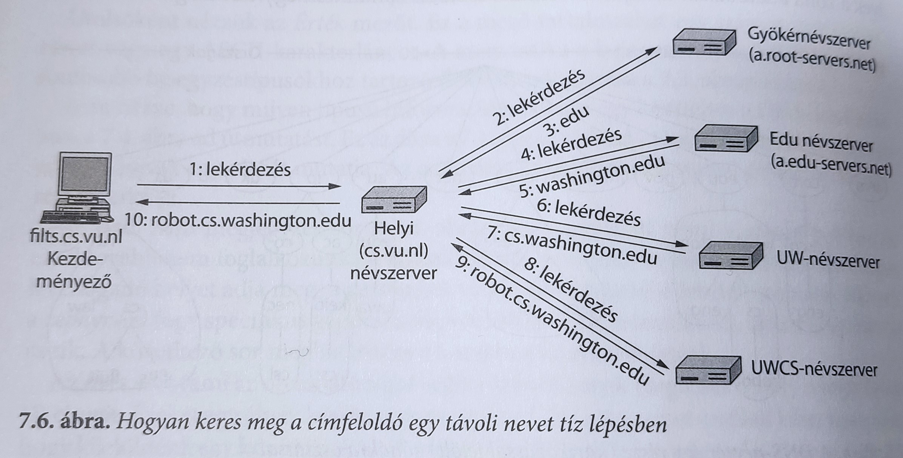

# 7. Az alkalmazási réteg


* Az **alkalmazási réteg** alatt található egyéb rétegek a *megbízható szállítási szolgáltatást biztosítják, de a felhasználó számára nem végeznek tényleges munkát* -> **igazi hálózati alkalmazások itt**
* Kiegészítő protokollok -> alkalmazások működését biztosítják
  * **DNS** -> nevek kezeléséért felelős az interneten

---

## 7.1. DNS - a körzetnévkezelő rendszer


* A programok képesek hivatkozni weboldalakra, levelesládákra és más erőforrásokra a számítógépek hálózati címeinek (például IP) felhasználásával -> ezt viszont emberek nem tudják megjegyezni
* **IP cím megváltozik** -> gond, ha IP cím alapján böngésznénk ->
* *Magas szintű, olvasható neveket* vezettek be, hogy különválasszák a gépek neveit a gépek címeitől
* A hálózat persze továbbra is numerikus -> **átalakító mechanizmus** kell

***ARPANET idejében:***
* **egy fájl, hosts.txt** -> fel voltak benne sorolva a számítógépek nevei és azok IP-címei.
* Minden éjszaka az *összes hoszt kiolvasta* ezt ->
* Jól működik néhány száz nagy időosztásos gép esetében
* **Nem működhet örökké** -> túl nagy fájl + hosztnevek állandóan ütköznének, ha nem központilag kezelnék a neveket (terhelés és késleltetés miatt elkerülhetetlen nagy, nemzetközi hálózatokban)

***DNS (Domain Name System - körzetnévkezelő rendszer)***
* 1983
* **Hierarchikus körzetalapú névkiosztási séma**, és azt megvalósító **osztott adatbázisrendszer**
* **Hosztnevek megfeleltetése IP címeknek** (más célokra is)
* RFC 1034, 1035, 2181 definiálja
* **Használata:**
  * Felhasználói program meghívja a **címfeloldó (resolver)** nevű könyvtári eljárást
  * Címfeloldó **lekérdezi a nevet a helyi DNS-szervertől**
  * Szerver megkeresi és **visszaküldi az IP-címet** a címfeloldónak
  * Címfeloldó vissza hívónak
* **UDP csomagokkal** valósul meg
* IP cím birtokában hívó felépíthet TCP összeköttetést a célgéppel, vagy küldhet UDP csomagokat

### 7.1.1. A DNS-névtér

* Nagy mennyiségű, állandóan változó nevek
* Kezelése, mint postai levélen
  * Névhierarchia legfelső szintje: **ICANN (Internet Corporation for Assigned Names and Numbers - Internettársaság Kiosztott Nevek és Számok Kezelésére)** szervezet kezeli
    * több mint 250 **elsődleges körzet (top-level domain)**
      * lehetnek **általánosak** és **országra vonatkozók**
      * Minden körzet alkörzetekre -> tovább és tovább osztva
      * Országra vonatkozó körzetek -> minden országhoz országkörzet ISO 3166-nak megfelelően
      * 2010 - nemzetközi, nem csak latin betűs körzetnevek (kínai, arab, cirill, stb)
      * ICANN adminisztrátorai kezelik
  * **Másodlagos körzetnevek** -> könnyű hozzájutni
    * Megfelelő elsődleges körzet adminisztrátoránál igényelni (pl. ceg-neve.com)
    * Ha még nem foglalt, éves kisebb összegért megkapható
    * **Cybersquatting (kiberkivárás):** egy körzetet csak azért jegyeznek be, hogy utána drágábban ki lehessen adni


* Minden körzet nevét az adott névtől a (névtelen) gyökérhez felfelé vezető út adja
* A komponenseket **pont** választja el egymástól (dot)
* **Körzetnevek lehetnek:**
  * **Abszolútak**: ponttal végződnek
  * **Realatívak**: 
    * nem ponttal végződnek
    * Egy adott környezetben kell értelmezni jelentésük megállapításához
* Kis- és nagybetű mindegy
* Névkomponensek maximum 63 karakter, összesen max. 255 karakter
* Egy új körzet létrehozásához engedély kell attól a körzettől, amelyhez tartozni fog
* Az elnevezések nem a hálózat fizikai elrendezését, hanem a szervezetek határait követik

### 7.1.2. Erőforrás-nyilvántartás

* Minden körzethez tartozhat egy **erőforrás-bejegyzés (resource record)** halmaz -> DNS adatbázis
  * egyedüli hoszt esetén ez csak az IP cím ->
  * sok másféle is lehet
  * címfeloldó a DNS-nek küldött körzetnévhez tartozó erőforrás-bejegyzéseket kapja vissza -> DNS valódi feladata: *megfeleltesse a körzetnevet az erőforrás-bejegyzésnek.*

***Erőforrás-bejegyzés adatötöse:***
1. **Körzet_név:** körzet, melyhez a rekord tartozik -> elsődleges kulcs a kereséshez
2. **Élettartam:** jelzés, hogy a bejegyzés mennyire stabil.
3. **Osztály:** internethez tartozó információknál mindig IN.
4. **Típus:** bejegyzés értékének típusára vonatkozik -> sokféle DNS bejegyzés


* **SOA:**
  * elsődleges információforrás neve a zónához tartozó névszerverről
  * adminisztrátor e-levél címe
  * egyedi sorozatszám
  * különböző jelzők és időzítők
* Az **A (Cím)** bejegyzés
* **MX** bejegyzés: a hoszt neve, amely kész a körzethez tartozó levelek fogadására -> nincs minden gép felkészülve e-levelek fogadására.
* **NS** bejegyzés: névszervert határoz meg a körzet vagy alkörzet számára
* **CNAME** bejegyzések: álneveket lehet létrehozni ->
  * átirányítani az embereket és programokat a helyes útra ->
  * egy makró, egy mechanizmus, mely karakterláncokat másra cserél
* **PTR**: szintén másik névre mutat
  * Valódi DNS adattípus, értelmezése adott környezettől függ
  * Gyakorlatban név megfeleltetése IP-címnek -> **fordított keresés (reverse lookup)**
* **SRV**: egy hoszt valamilyen szolgáltatásra való kijelölése a körzeten belül.
* **SPF**: 
  * információ kódolás -> a körzet mely gépei küldenek levelet az internet többi részére
  * megkönnyíti címzett gépeknek a levél érvényességének ellenőrzését -> hamisított levélszemét felismerése -> ha adott körzetből nem a küldő gép küld levelet, hanem más néven érkezik
* **TXT**: eredetileg -> körzetek tetszés szerinti módon azonosíthassák magukat
  * manapság -> gépek számára olvasható információk, **SPF infók**

5. **Érték** mező: szám, körzetnév, vagy ASCII karakterlánc (ld. előző ábra)


### 7.1.3. Névszerverek

Elvileg egyetlen szerver elég lenne -> folyamatosan túlterhelt lenne -> ha elromlik, egész internet lebénulna
* Egymást nem átlapoló **zónak (zones)**


* Egy **elsődleges** (lemezen lévő fáljból info) és **több másodlagos** névszerver (elsődlegestől info)
* **Névfeloldás:** egy név megkeresése, és a hozzá tartozó információ meghatározása
* **Hiteles bejegyzés (authoritative record):** bejegyzés attól a szervtől származik, amelyik azt kezeli
* **Gyorstárban lévő bejegyzések (cached records):** hiteles bejegyzéssel ellentétben idejétmúltak lehetnek
* **Távoli lekérdezés:** ha nincs információ a helyi adatok közt
  1. *Lekédezés a helyi névszerverhez* (keresett körzet neve, típus (A) és osztály (IN))
  2. *Gyökérszerver (root name server)* megkérdezése
  3. *Továbbítás helyi névszervernek*



Névfeloldási folyamat megvizsgálása UNIX-rendszeren: **dig** programmal [^1]

```dig @a.edu-servers.net robot.cs.washington.edu```

**Rekurzív lekérdezés (recursive query):** a névszerver lekérdezésekor *részleges infókat nem küld vissza* a hosztnak -> *addig végzi a névfeloldást, amíg sikeres nem lesz* -> ekkor küldi vissza.

**Iteratív lekérdezése (iterative query):** a *gyökérnévszerver nem folytatja rekurzív módon a lekérdezést* a helyi névszerver által kezdeményezett lekérdezést -> részleges választ ad vissza -> *helyi névszerver felelős a névfeloldás folytatásáért*

* Egyetlen névfelolás mindkét módszert használhatja
* Gyorstárcsázás: minden válasz a gyorstárakba kerül -> másik, körzeten belüli hoszt kéri ugyanazt a címet -> válasz már ismert lesz
* Gyorstárak infói -> nem hitelesek, nem frissítek -> nem érdemes túl hosszú időtartamúnak lenniük -> **Élettartam bejegyzés**
* **UDP:** 
  * lekérdezésekhez használt szállítási protokoll -> egyszerű formátumú UDP csomagok a lekérdezésekhez, válaszokhoz ->
  * ha rövid időn belül nincs válasz megismétli a lekérdezést -> néhány ismételt próbálkozás után a körzet más szerverénél kér
  * Minden lekérdezésben 16 bites azonosító, másolódik a válaszba -> névszerver illeszteni tudja több lekérdezés esetén is

**DNS jellemzői:**
* nagy és összetett elosztott rendszer, többmillió együttműködő névszerverrel
* kapcsolat emberek számára olvasható körzetnevek és IP-címek között
* Redundanciát és gyorsítótárazást alkalmaz, rendkívül robusztus
* tartalommegosztó hálózatok alkalmazása

**DNSSec:**
* biztonsági bővítmények 8. fejezetben

---

## 7.2. Elektronikus levél


---
Lábjegyzetek:
[^1]: ld még Tanenbaum könyv 645. old