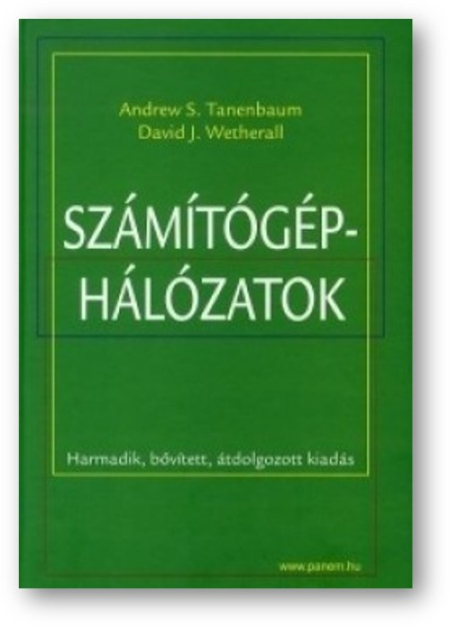

# Adrew S. Tanenbaum - David J. Wetherall: Számítógép hálózatok [^1]

## Bevezető, linkgyűjtemény, videók

A társszerző, David J. Wetherall által készített videók elérhetők a linkeken.

----

[Goals and Motivation videó - Wetherall_1.1](https://mediaplayer.pearsoncmg.com/_ph_cc_ecs_set.title.1-1_Goals_and_Motivation__/ph/streaming/esm/tanenbaum5e_videonotes/1_1_goals_motivation_cn5e.m4v)

----

[Lecture Organization videó - Wetherall_1.9](https://mediaplayer.pearsoncmg.com/_ph_cc_ecs_set.title.1-9_Lecture_Outline__/ph/streaming/esm/tanenbaum5e_videonotes/1_9_lecture_outline_cn5e.m4v)

----

[Könyv elérhetősége interneten: *https://gyires.inf.unideb.hu/GyBITT/30/index.html*](https://gyires.inf.unideb.hu/GyBITT/30/index.html)

----

[Összes videó elérhetősége](https://media.pearsoncmg.com/ph/streaming/esm/tanenbaum5e_videonotes/tanenbaum_videoNotes.html)

----

## Fejezetek

1. [Bevezetés](1.md)
2. [Fizikai réteg](2.md)
3. [Az adatkapcsolati réteg](3.md)
4. [A közeg-hozzáférési alréteg](4.md)
5. [A hálózati réteg](5.md)
6. [A szállítási réteg](6.md)
7. [Az alkalmazási réteg](7.md)
8. [Hálózati biztonság](8.md)

---

## Jegyzetek

* [Útválasztó algoritmusokhoz Mammoth Online kurzus](https://training.mammothinteractive.com/courses/enrolled/2571339)
* ~~3-4.md fájlokban nincsenek videók linkelve~~
* ~~4.md hiányos, 4.3. Ethernet következik~~
* ~~5.md következik~~
* ~~5.md videói: Packet Forwarding and internetworking, 4-...~~
* ~~5.2.5.7. hiányzik~~
* 5.md-ben hiányosságok
* ~~5.md-ben a nyilak hibái, tableten jól látszik, laptopon könnyű javítani~~
* 5.4, 5.5, 5.6.4, 5.6.5, 5.6.6, 5.6.7, 5.6.8, 5.6.9, 5.7 hiányzik
* 6.md következik
* 6.md videók
* ~~7.md DNS~~
* 7.md Elektronikus levél
* 7.md videók

----
[^1]: Andrew S. Tanenbaum - David J. Wetherall: Számítógép hálózatok, Panem, 3. kiadás, Budapest 2013. (A mű eredeti címe: Computer Networks. Fifth edition)