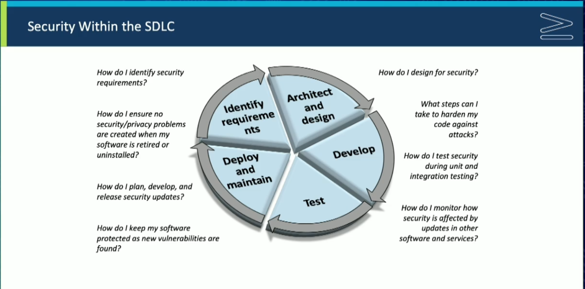

# Cyber Secure Coder (CSC-110) Videó

## 1. Biztonság a szoftverben

### 1.1. Áttekintés

- Justin Dennison, Daniel Lowrie bemutatkozás
- Pearson tanúsítvány információk

### 1.2. Előzetes ismeretek és elvárások

- Identifying the Need for Security in Your Software Projects (
A biztonság iránti igény azonosítása szoftverprojektjei során)
- Handling Vulnerabilities (Sebezhetőségek kezelése)
- Designing for Security (Biztonsági tervezés)
- Developing Secure Code (Biztonságos kód fejlesztése)
- Implementing Common Protections (Közös védelmek megvalósítása)
- Testing Software Security (Szoftverbiztonság tesztelése)
- Maintaining Security in Deployed Software (A telepített szoftver biztonságának fenntartása)

### 1.3. Gather Software Requirements (Gyűjtsd össze a szoftverkövetelményeket)

- szoftverkövetelmények, biztonsági követelmények
- felhasználói követelmények
- platformkövetelmények
- vállalkozás esetén -> üzleti követelmények (1.3. videó, 5:35) -> gyakran változhatnak, ha nem jól meghatározottak -> fontos lenne jól meghatározni
- vízesés modell - nehéz visszaadni, miután elkészült és már a tesztelési fázisban van.
- iteratív ciklusokkal - korábban kiderül a probléma, könnyebben javítható

- szabványok és megfelelések (1.3. videó, 6:34)
  - HIPAA https://hu.wiktionary.org/wiki/HIPAA
  - PCI DSS: Payment Card Industry Data Security Standard – a kártya-műveletekkel kapcsolatos adatvédelmi biztonsági szabályok, amelyek a https://www.pcisecuritystandards.org/ honlapon érhetők el. A kereskedő köteles részletesen megismerni a PCI DSS-t és betartani a benne foglalt szabályokat. https://www.pcisecuritystandards.org/document_library/?document=pci_dss
  - FERPA
  - keretrendszerek
- Felhasználói elvárások -> gyorsan változnak (1.3. videó, 8:48)
  - vízesés gyenge pontja: könnyebb, ha valaki megmondja mit nem szeret, mint hogy mit szeret
  - bejelentkezés 
    - SSO: Az SSO a Single Sign-on rövidítése, amely egy hitelesítési séma, amely lehetővé teszi a felhasználók számára, hogy több szoftverrendszerbe is bejelentkezzenek egyetlen identitással. Ez azt jelenti, hogy a felhasználók egyetlen bejelentkezési hitelesítő adatokkal jelentkezhetnek be több rendszerbe.
    - felhőalapú felhasználás
  - proaktívnak kell lenni
- Platform követelmények (1.3. videó 9:43)
  - On-premise, helyi alkalmazás
  - felhőhöz csatlakozik, AWS, Azure, GCP
- Consequences of Not Meeting Security Requirements (1.3. videó, 10:50)

### 1.4. Feladat: Követelmények meghatározása

### 1.5. Tevékenység: Követelmények meghatározása

- alkalmazás fejlesztése
  - katalógus a termékekről, termékleírással képekkel, árral
  - több nyelven
  - keresni tudnak a felhasználók kulcsszavakra
  - új felhasználók regisztrálnak felhasználói fiókot
    - termékek online vásárlása
    - visszajelzések
    - bejelentkezés Google-ön keresztül OAuth autentikálással
  - adminisztrátor kezeli a felhasználói fiókokat
- felhasználók elvárási adatvédelem terén
- fizetések kezelése -> PCI, GDPR

### 1.6. A szoftverbiztonságot aláásó tényezők

- Szoftverbiztonság 3P-je (videó: 1:40)
  - **Product**
    - common defects harm security (a gyakori hibák rontják a biztonságot)
    - components and platforms are not secure (az alkatrészek és a platformok nem biztonságosak)
    - configuration of software and host system is not secure (a szoftver és a gazdarendszer konfigurációja nem biztonságos)
    - security policies are poorly implemented (a biztonsági politikákat rosszul hajtják végre)
  - **People**
    - operator error
    - incorrect assumptions about software behavior (helytelen feltételezések a szoftver viselkedésével kapcsolatban)
    - Falling prey to attacks (A támadások áldozatává válás)
    - unintentional unsecure behavior (nem szándékos bizonytalan viselkedés)
    - malicious behavior (rosszindulatú viselkedés)
    - nem bízhatunk meg a felhasználókban
      - lehetnek rosszingulatúak
      - nem biztos, hogy tudják mit kell csinálniuk
  - **Process**
    - security is not integrated into the entire process (a biztonság nem integrálódik a teljes folyamatba)
    - overall design is unsecure (az általános kialakítás nem biztonságos)
    - software and deployments are not maintained adequately (a szoftverek és a telepítések karbantartása nem megfelelő)
    - development tools don't promote security (A fejlesztési eszközök nem támogatják a biztonságot)
- Program készítésekor át kell gondolni, hogyan mennek rosszul a dolgok. Hogyan támadnának meg, hogyan védhetem meg az alkalmazásom?
- Dokumentáció -> oktatni az embereket
- Kódelemzés, CI (A szoftverfejlesztés területén a folyamatos integráció (CI – continuous integration) az a fejlesztési folyamat, amikor a fejlesztők a munkájuk másolatát naponta akár többször is megosztják a verziókezelő rendszerben).

### 1.7. Szoftver sebezhetőségek és támadási fázisok

- Hacking: nem feltétlenül rossz, csak "bütykölőt" jelent, trükközést
  - White hat
  - Black hat
  - Gray hat
- Másképp
  - Builder
  - Breaker
    - felmér és értékel
    - kihasznál és behatol
    - fenntartja a hozzáférést vagy kiterjeszti a jogosultságokat
    - lebontsa az egészet (Denial of service - DOS)

### 1.8 Támadási minták