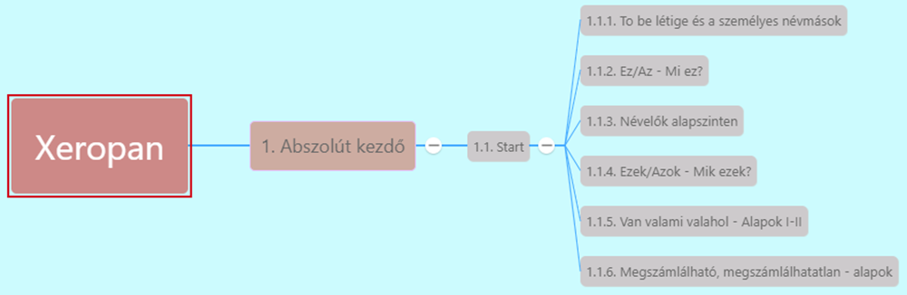

# Ez/Az - Mi ez? [^1]

[Előző](1-To_be_letige_es_szemelyes_nevmasok.md)

* **this**: közel mutat
* **that**: távolra mutat
* Megmondani, mi ez a tárgy: **This/That + is + a/an + főnév**
* Megkérdezni, mi ez a tárgy: *What is this?*/ *What is that?*
* Bemutatunk valakit: *This is my brother, Paul.*

[Következő](3-Nevelok_alapszinten.md)

---
[^1]: Abszolút kezdő, Start lecke, 3. fejezet - Ez, az éa az a másik dolog