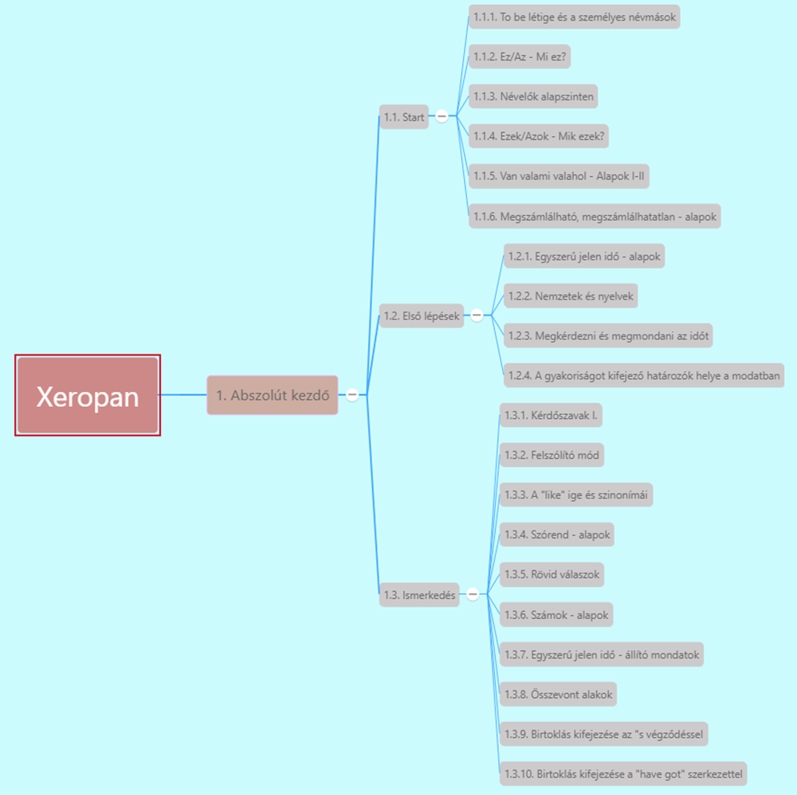

# 1. Abszolút kezdő

1. Start
   1. [To be létige és személyes névmások](1.1-Start/1-To_be_letige_es_szemelyes_nevmasok.md)
   2. [Ez az](1.1-Start/2-ez_az.md)
   3. [Névelők alapszinten](1.1-Start/3-Nevelok_alapszinten.md)
   4. [Ezek, azok. Mik ezek?](1.1-Start/4-Ezek_azok-Mik_ezek.md)
   5. [Van valami, valahol](1.1-Start/5-Van_valami_valahol-alapok.md)
   6. [Megszámlálható, megszámlálhatatlan](1.1-Start/6-Megszamlalhato_megszamlalhatatlan-alapok.md)
2. Első lépések
   1. [1](1.2-Elso_lepesek/1.md)
   2. [2](1.2-Elso_lepesek/2.md)
   3. [3](1.2-Elso_lepesek/3.md)
   4. [4](1.2-Elso_lepesek/4.md)
3. Ismerkedés
   1. [1](1.3-Ismerkedes/1.md)
   2. [2](1.3-Ismerkedes/2.md)
   3. [3](1.3-Ismerkedes/3.md)
   4. [4](1.3-Ismerkedes/4.md)
   5. [5](1.3-Ismerkedes/5.md)
   6. [6](1.3-Ismerkedes/6.md)
   7. [7](1.3-Ismerkedes/7.md)
   8. [8](1.3-Ismerkedes/8.md)
   9. [9-10](1.3-Ismerkedes/9-10.md)

## Jelölések

* *Dőlt* - angol nyelvű példamondat
* **Félkövér** - kulcsszó, lényegesebb információ
* ***Félkövér-dőlt*** - definiálandó fogalom
