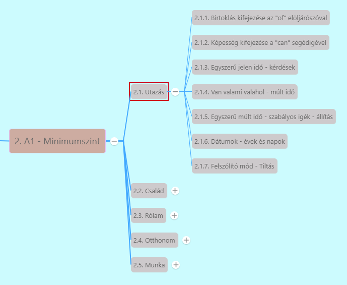

# 2.1.7. Felszólító mód - tiltás

[Előző](6.md)

>***Felszólító mondatok*** [^1]
>
>* Mindig E/2 és T/2-re vonatkozik a felszólítás (mindkét esetben megegyezik)
>* **Nem használunk alanyt** a felszólításban, **csak az ige szótári alakját** (ragozatlan igét "to" nélkül)
>* Angolban **nincs felkiáltójel a mondat végén**
>* **Nincs különbség tegezés és magázás között.**
>* Ha van **módosítószó**: az **ige elé** kell tenni
>  * *Never try any drugs.* - Soha ne próbálj ki semmilyen drogot.
>  * *Always be friendly and polite.* - Mindig légy barátságos és udvarias.
>
>*Sit down.* - Ülj le!/ Üljetek le!/ Üljön le!/ Üljenek le!
>
>*Go straight and then turn left.* - Menj egyenesen, majd fordulj balra!

***Felszólító mód - tiltás*** [^2]

* **Tiltó mondatok** -> **felszólító mondatok** + **"do not" (don't)**
  * *Don't drink alcohol.*
  * *Don't turn up the volume.*

***További felszólító módra vonatkozó szabályok***

* **T/1** -> **let (=enged, hagy)** -> **Let's = let us**
  * *Let's see how we can use it.* - Nézzük meg, hogyan tudjuk használni!
  * *Let's go to the beach.* - Menjünk a strandra!
* Felszólító mód magában **barátságtalan** -> udvarias a *please* szóval
  * *Sit down, please.* - Ülj le kérlek
  * *Put the chairs around the table, please*
* **Angolul mindig E/2 és T/2 személyre vonatkozik a felszólítás.**
  * Üljenek le -> más szerkezettel -> pl. *"tell"* (=mond) igével
    * *Tell them to sit down.* - Mondd meg nekik, hogy üljenek le!
    * *Tell her to stop smoking.* - Mondd meg neki, hogy hagyja abba a dohányzást

[Következő](../2.2-Csalad/1.md)

---
[^1]: Abszolút kezdő, Ismerkedés, 2. fejezet - Menned kell!
[^2]: Minimumszint, Utazás, 10. fejezet - Egy idegenvezető tanácsai