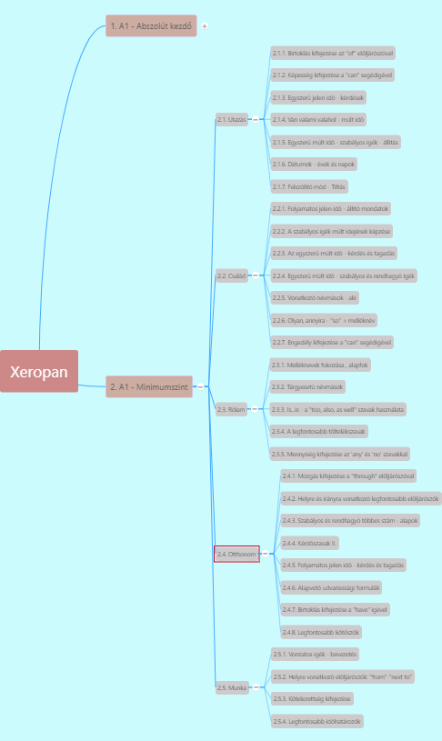
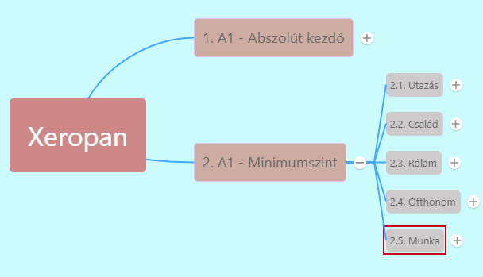

# 2. Minimumszint leckecsoport nyelvtani leckéi

1. Utazás
   1. [1](2.1-Utazas/1.md)
   2. [2](2.1-Utazas/2.md)
   3. [3](2.1-Utazas/3.md)
   4. [4](2.1-Utazas/4.md)
   5. [5](2.1-Utazas/5.md)
   6. [6](2.1-Utazas/6.md)
   7. [7](2.1-Utazas/7.md)
2. 2. Család
   1. [1](2.2-Csalad/1.md)
