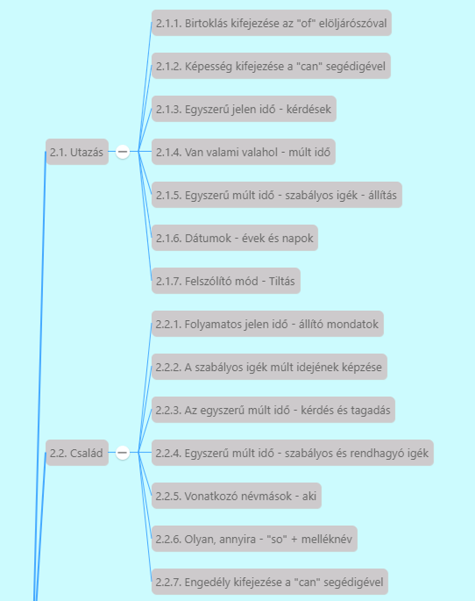
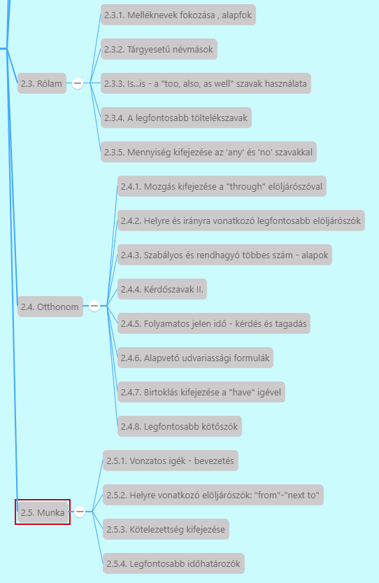

# 2. Minimumszint leckecsoport nyelvtani leckéi

1. Utazás
   1. [Birtoklás kifejezése az of elöljárószóval](2.1-Utazas/1.md)
   2. [Képesség kifejezése a can segédigével](2.1-Utazas/2.md)
   3. [Egyszerű jelen idő - kérdések](2.1-Utazas/3.md)
   4. [Van valami valahol - múlt idő](2.1-Utazas/4.md)
   5. [Egyszerű múlt idő - szabályos igék - állítás](2.1-Utazas/5.md)
   6. [Dátumok - évek és napok](2.1-Utazas/6.md)
   7. [Felszólító mód - tiltás](2.1-Utazas/7.md)
2. Család
   1. [Folyamatos jelen idő - állító mondatok](2.2-Csalad/1.md)
   2. [A szabályos igék múlt idejének képzése](2.2-Csalad/2.md)
   3. [Az egyszerű múlt idő - kérdés és tagadás](2.2-Csalad/3.md)
   4. [Egyszerű múlt idő - szabályos és rendhagyó igék](2.2-Csalad/4.md)
   5. [Vonatkozó névmások - aki](2.2-Csalad/5.md)
   6. [Olyan, annyira - "so" + melléknév](2.2-Csalad/6.md)
   7. [Engedély kifejezése a "can" segédigével](2.2-Csalad/7.md)
3.  Rólam
    1.  [Melléknevek fokozása, alapfok](2.3-Rolam/1.md)
    2.  [Tárgyesetű névmások](2.3-Rolam/2.md)
    3.  [Is... is - a "too, also, as well" szavak használata](2.3-Rolam/3.md)
    4.  [A legfontosabb töltelékszavak](2.3-Rolam/4.md)
    5.  [Mennyiség kifejezése az 'any' és 'no' szavakkal](2.3-Rolam/5.md)
4. Otthonom
   1. [Mozgás kifejezése a "through" elöljárószóval](2.4-Otthonom/1.md)
   2. [Helyre és irányra vonatkozó legfontosabb elöljárószók](2.4-Otthonom/2.md)
   3. [Szabályos és rendhagyó többes szám - alapok](2.4-Otthonom/3.md)
   4. [Kérdőszavak II.](2.4-Otthonom/4.md)
   5. [Folyamatos jelen idő - kérdés és tagadás](2.4-Otthonom/5.md)
   6. [Alapvető udvariassági formulák](2.4-Otthonom/6.md)
   7. [Birtoklás kifejezése a "have" igével](2.4-Otthonom/7.md)
   8. [Legfontosabb kötőszók](2.4-Otthonom/8.md)
5. Munka
   1. [Vonzatos igék - bevezetés](2.5-Munka/1.md)
   2. [Helyre vonatkozó elöljárószók: "from" - "next to"](2.5-Munka/2.md)
   3. [Kötelezettsége kifejezése](2.5-Munka/3.md)
   4. [Legfontosabb időhatározók](2.5-Munka/4.md)
