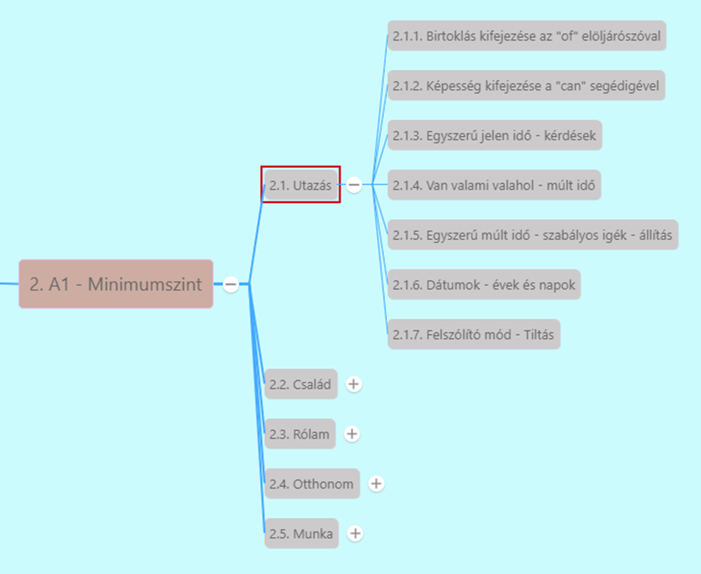

# 2.1.4. Van valami valahol - múlt idő

[Előző](3.md)

[Van valami valahol - alapok I-II](../../1-Abszolut_kezdo_A1/1.1-Start/5-Van_valami_valahol-alapok.md) [^1]

***Van valami valahol - múlt idő*** [^2]

**There was/there were** szerkezet a **there is/there are** múlt idejű változata -> múlt időben fejezi ki valaminek a létezését, vagy hiányát, nem létezését.
* **was/were** a létige múlt idejű alakjai

1. Állító mondat
   * pl. *There was a bee in the living room* - Volt egy méhecske a nappaliban
   * *There was enough food for the dogs*
   * *There were many people on the train.*
   * *There were heavy storms last week.*
2. Kérdő mondat
   * *Was there a fire in our village?* - Tűz volt a falunkban?
   * *What was there in your hands?* - Mi volt a kezedben?
   * *Were there many students at school?*
   * *Why were there so many wars in the past?* - Miért volt olyan sok háború a múltban?
3. Tagadó mondat
   * *There wasn't enough sugar in the cake.* - Nem volt elég cukor a tortában.
   * *There wasn't any homework for today.* - Nem volt mára házi feladat.
   * *There weren't mobile phones 50 years ago.*
   * *There weren't any fans in the stadium. = There were no fans in the stadium.* - Nem voltak szurkolók a stadionban.
   * *There wasn't anybody there. = There was nobody there. = Nobody was there.* - Senki nem volt ott.

[Következő](5.md)

---
[^1]: Abszolút kezdő, Start, 10. fejezet - Nincs határa a tanulásnak, 11. fejezet - Tanulj új szavakat!
[^2]: Minimumszint, Utazás, 7. fejezet - A legjobb hely, amit láttam