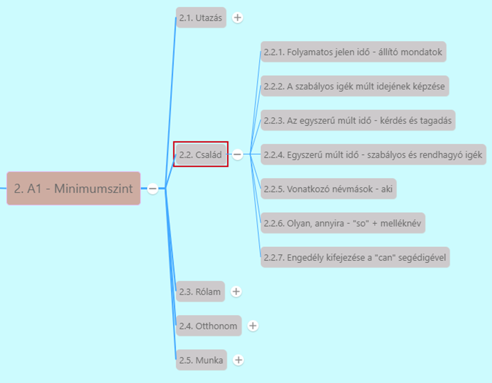

# Folyamatos jelen idő - állító mondatok [^1]

[Előző](../2.1-Utazas/7.md)

***Present Simple***
* Szokások, ismétlődő események, általános igazságok
* *I play football.* (Focizom - ez a hobbim)

***Present Continuous***
* Folyamatos jelen
* Adott pillanatban mi történik
* **Alany** + **a be ragozott alakja** + **az ige -ing végződéssel**
* *I am playing football.* - (Most éppen) focizom.
* Ha ige **-e-re végződik**, az -ing hozzáadásával -e eltűnik.
  * *We dance.* - Táncolunk
  * *We are dancing.* - Most éppen táncolunk.

[Következő](2.md)

---
[^1]: Minimumszint, Család, 2. fejezet - Családi fotók