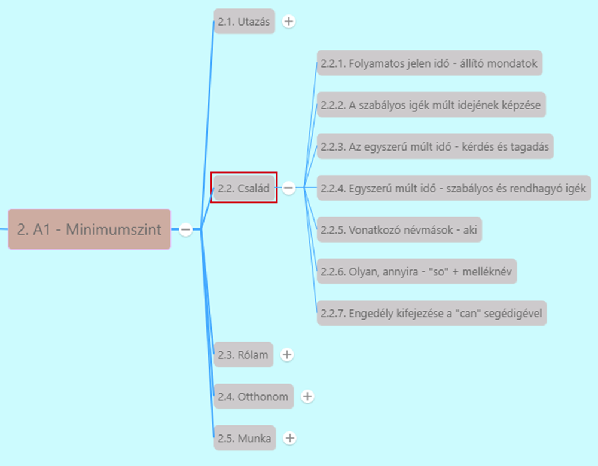

# Az egyszerű múlt idő - kérdés és tagadás

[Előző](2.md)

* **Egyszerű múlt (Past simple)** -> már lezárult események
  * *Christine opened the door.*
* **Kérdések egyszerű múlt időben:** [^1]
  * **do** ige múlt idejű alakja -> **did** segédigeként + **ige jelen idejű alakja**
    * *Did you see Tom?*
    * *Did he go to school?*
    * *What did you do last night?*
    * *Why did they leave so early?*
  * **Múltbéli események időpontjára** is kérdezhetünk ezzel az igeidővel
    * *When did you start learning English?*
    * *When did you last go shopping?*
  * **Létige** használatakor -> **nincs segédige**, a **be** múlt idejű alakjával kérdezünk
    * *Was he at home last night?*
    * *Were you at school yesterday?*
    * *Were they glad to see you?*
* **Tagadó mondat:**
  * **did** segédigeként + **not** (össze lehet vonni) + **ige jelen idejű alakja**
  * *I didn't do the homework.*
  * *I didn't finish my work.*
  * *I didn't find my cap.*
* **Létige tagadásánál nem használunk segédigét.**
  * *I wasn't happy with your work.*
  * *She wasn't old enough to smoke.*
  * *They weren't at home when I called them.*

[Következő](4.md)

---
[^1]: Minimumszint, Család, 5.fejezet - Egy megismerkedés története