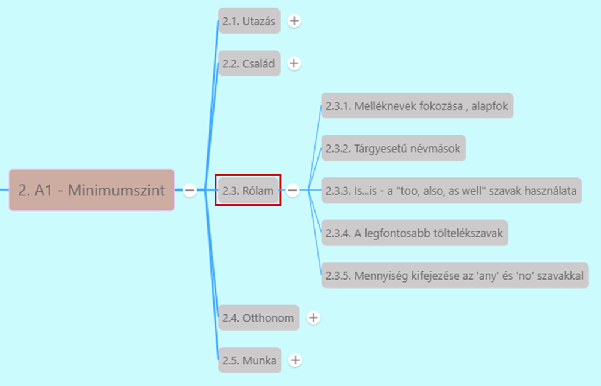

# A legfontosabb töltelékszavak [^1]

[Előző](3.md)

Töltelékszavak: némelyik kicsit módosítja a jelentést, időhúzás, ameddig kitalálják mit akarnak mondani -> nem fontosak

* **Like...**
  * Általában két dolog egymással való összehasonlítására
  * Töltelékszóként -> a beszélő nem tudja, hogyan fejezze ki magát
  * *I like... don't know what to think of him.*
  * *The food was great, but like... is wasn't that great.*
* **Kind of (kinda')**
  * Mondandó tompítására, ne legyen sértő vagy túlzó vagy
  * Bizonytalanok az adott dologban
  * *I kinda' like cycling.* - Szeretek biciklizni, de nem ez a kedvenc hobbim
  * *He's a good person but he's also kind of rude.* - Ő egy jő ember, de egy kicsit goromba is (goromba, de nem túlzottan)
  * *I kind of think this is a bad idea.* - Szerintem ez talán rossz ötlet (=de nem vagyok benne biztos)
* **Anyway**
  * Jelentése: amúgy
  * Beszélő megpróbálja kihagyni a törénet egy részét, témát akar váltani
  * *I had so much work today. Anyway, do you want to go out?* Ma nagyon sok mukám volt. Amúgy nem akarsz elmenni valahova?
  * *So we had lunch and then watched a movie... anyway, what was your day like?*
* **You know**
  * Beszélő nem emlékszik bizonyos szóra, de próbálja megmagyarázni
  * *You know what I mean* rövidítése is
  * *Could you give me the... you know, the thing you write with?* - Ide tudnád adni a... tudod, azt amivel írsz.
  * *I think the film was too short, you know?*
* **Well**
  * Jelentése: hát, nos
  * Beszélgetés késleltetése a gondolkodás alatt
  * *Well... I think she didn't mean it.* - Ööö, szerintem nem úgy értette.
  * *Well... cats and dogs have whiskers too.* - Nos... macskáknak és kutyáknak is van bajszuk (nem csak amit mondtál)

[Következő](5.md)

---
[^1]: Minimumszint, Rólam, 8. fejezet - Mit szeretsz csinálni?