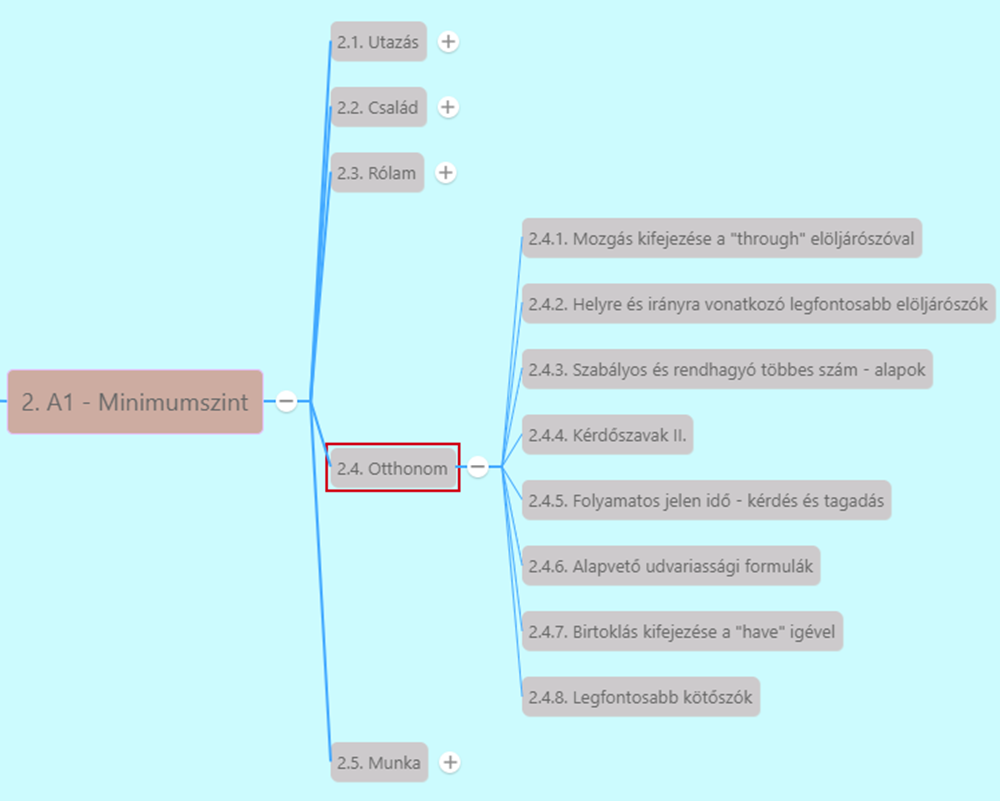

# Birtoklás kifejezése a "have" igével

[Előző](6.md)

> Többféleképpen tudunk **birtoklást kifejezni**
>
> 1. ***'s ragos birtokos szerkezet*** [^1] -> *This is Jack's car*, *The family's house is very large.*
>     * Többes számú főnevek esetén:
>       * *The students' homework is easy.*
>       * **Szabályosan képezve csak egy aposztróffal jelöljük!.**
>     * Nem -s-re végződő többes számú főnevek esetén:
>       * ugyanúgy megkapják az 's ragot
>       * *Where are the children's toys?*
>     * 's végződést jellemzően előlényekkel kapcsolatban használjuk
>
 2. ***Igével, vagy igét tartalmazó szerkezettel***
    1. ***"have"*** [^2]

***Have***
* Formálisabb mint a have got -> hivatalos szövegkörnyezetben a briteknél is ez
* **Kijelentő mondat**
  * *I have a brother*
  * *We have a lot of plants in the house.*
  * *He has a lot of toys.*
  * *Have got*-nál a have + személyes névmás összevonható, itt nem
  * Have és have got felcserélhető -> de ha **ismétlődő** eseményről van szó, csak **have**
  * *She's got a headache. / She has a headache* -> *She often has a headache* ~~*She often has got a headache*~~
* **Tagadó mondat** 
  * **do** + **not** -> **don't** / **E/3** -> **doesn't**
  * *I don't have a car, I have a motorbike*
  * *We don't have much time*
  * *He doesn't have a computer*
  * *My mother doesn't have a cookbook.*
* **Kérdő mondat**
  * **do** az alany előtt
  * *Do you have a sharp knife?*
  * *Why do they have so many bags?*
  * *Does she have many friends?*

>    2. ***"have got"*** szerkezet [^3]
>       * **"have" segédigei szerepben** ->
>         * **tagadásban** ehhez csatoljuk a not tagadószót
>         * **kérdésben** ezt tesszük az alany elé
>         * **Kijelentő mondatban**: *I have got a black car.*
>         * **E/3-ban**: *He has got a lot of free time.*
>         * Személyes névmást gyakran összevonják -> *I've got a good plan*, *He's got two children.*, *They've got many dogs.*
>         * **Tagadó mondat**:
>           * "have" segédigeként, "not" tagadószót hozzá csatoljuk -> *I haven't got a dictionary.* - Nincs szótáram, *She has'nt got any friends.* - Nincsenek barátai, *They have'nt got tickets.*
>         * **Kérdő mondat**:
>           * "have" szintén segédigeként -> *Have you got a pen?*, *How many bikes have they got?*, *Has he got much homework?*
>
> Jelentésbeli különbség nincs, csak földrajzi ->
>
> * **"have got"** -> brit angol
> * **"have"** -> amerikai angol
>
>3. ***OF*** [^4]
>
>* Általában nem használjuk 's-t' **élettelen dolgoknál** -> **of** elöljárószót használjuk
>  * *The door of the house.*
>  * *The back of the car*
>* Ha **valaminek a helyéről vagy a részéről** beszélünk -> *I always go home at the end of the film* - (A film végén mindig hazamegyek)
>  * *The end of*
>  * *The back of*
>  * *The middle of*

[Következő](8.md)

---
[^1]: Abszolút kezdő, Ismerkedés lecke 12. fejezet - Hadd mutassam be a családom
[^2]: Minimumszint, Otthonom, 10. fejezet - Gyere, körbevezetlek!
[^3]: Abszolút kezdő, Ismerkedés lecke 13. fejezet - Találkoztál már a családommal?
[^4]: Minimumszint, Utazás, 1.fejezet - A szombat az én napom