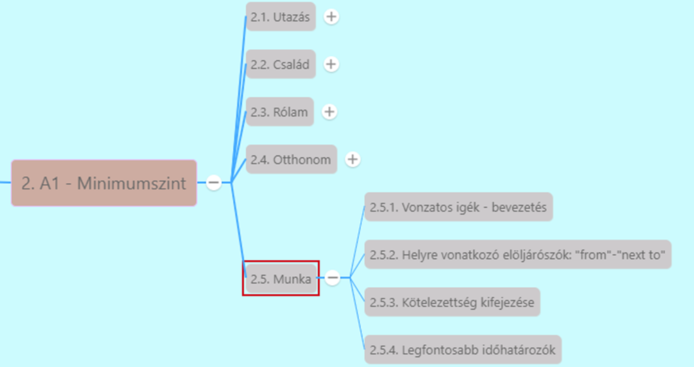

# Vonzatos igék - bevezetés [^1]

[Előző](../2.4-Otthonom/8.md)

***phrasal verb***
* **Jellemzően kéttagú kifejezések** -> egy **ige** és egy **határozószó** vagy **elöljárószó** (hasonló a magyar igekötős igékhez, fordított sorrendben)
  * ***grow up*** (felnő)
    * *I want my children to grow up in a different country.* - Azt akarom, hogy a gyerekeim egy másik országban nőjenek fel
  * ***come in*** (bejön)
    * *Hey Steve, come in.*
  * ***sit down*** (leül)
    * *Sit down after 10 minutes.*
* Vannak olyan phrasal verbek (szópárok), ahol a **kifejezés teljesen mást jelent, mint a két szó**, ami alkotja
  * ***break down*** (nem letörik, hanem elromlik, lerobban)
    * *If your car breaks down, call this number.*
* Két jelentéssel bíró phrasal verbek
  * ***go out*** (kimegy vagy elmegy szórakozni, bulizni)
    * *Go out of the room please.*
    * *My friends and I go out every Friday*
  * ***check out*** (szálloda elhagyásánál kijelentkezik, vagy megynézünk valamit)
    * *Good morning. I would like to check out. Your room number please.*
    * *Let's check out London's most famous sights.* - Nézzük meg London leghíresebb látnivalóit

[Következő](2.md)

---
[^1]: Minimumszint, Munka, 2. fejezet - Orvos, művész vagy akár pék?