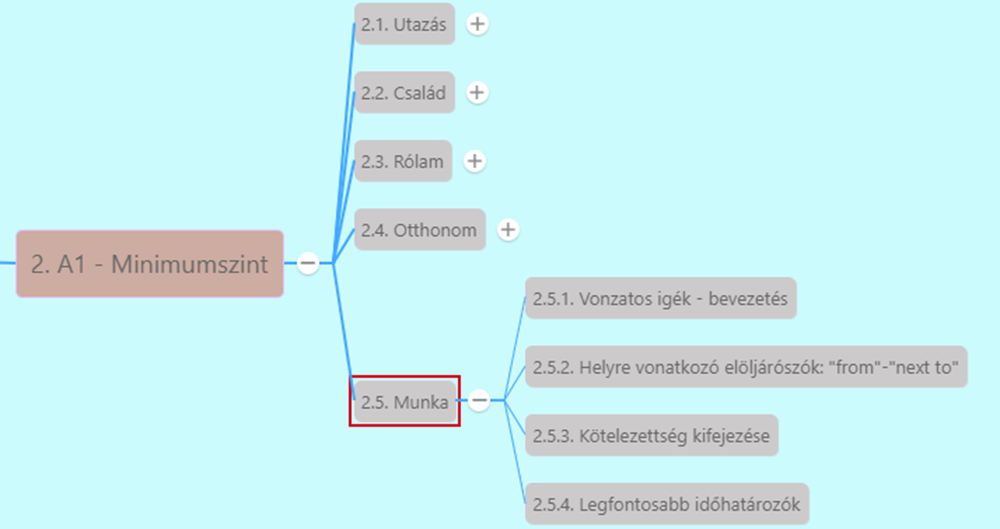

# Helyre vonatkozó elöljárószók: "from" - "next to" 

[Előző](1.md)

[Helyre és időre vonatkozó legfontosabb elöljárószók](../2.4-Otthonom/2.md) [^1]

* **down** - le [^2]
  * *Can you write down my message?*
* **from** - ból, -ből, -tól, -től
  * *Which company do you come from?*
  * *Her accent is strange. Which country is she from?*
* **in** - -ban, -ben, -on, -en, -ön
  * *I live in Hungary*
  * *I saw a black cat in the street.*
  * *The children are in the garden.*
* **in front of** - előtt
  * *The car is in front of the house.*
  * *There were a lot of books in front of him.* - Sok könyv volt előtte (névmás prepozíció után tárgyesetben áll!)
* **outside** is használható "előtt" jelentés kifejezésére
  * *I'll meet you outside the train station.* - Találkozunk a vasútállomás előtt
* **inside** - valamin belül
  * *It's raining, we should stay inside.*
* **into** - -ba, -ba, valamibe bele
  * *Why don't we go into the house?*
* **near** - valami közelében
  * *Is there a post office near the bank?*
* **next to** - mellett
  * *What's that next to the door?*

[Következő](3.md)

---
[^1]: Minimumszint, Otthonom, 2. fejezet - Hol játrál eddig?
[^2]: Minimumszint, Munka, 5. fejezet - A kérdés: karrier vagy család?