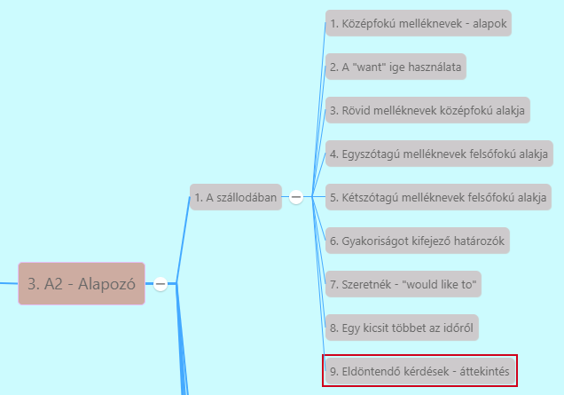

# Középfokú melléknevek - alapok [^1]

[Előző](../../2-Minimumszint_A1/2.5-Munka/4.md)

**Két dolog összehasonlításakor** -> egyikre egy minőség inkább jellemző:
1. Minőséget jelző melléknévhez hozzátesszük az **"-er" végződést**
   * Rövid melléknevek esetén
     * *small -> smaller*
     * *high -> higher*
2. Melléknév előtt ***more*** határozót használjuk
   * hosszabb melléknevek esetén
     * *beautiful -> more beautiful*
     * *incredible -> more incredible*

**Összehasonlított dolgok közé** a ***"than"*** szó kerül (mint) (nem összekeverendő a *then*-nel = akkor, azután)
* *My car is faster than my neighbor's*
* *The Eiffel Tower is taller than the Great Pyramid of Giza*
* *Hungarian girls are more beautiful than any other European girls*

***More*** szót lehet **névelőként** és magában **névmásként** is használni -> utóbbi **nagyobb mennyiséget** jelöl
* *She ate more chocolate*
* *Please, tell me more*

**Kisebb mennyiségek** -> ***less*** szó
* *She drinks less coffee than me*

[Következő](2.md)

---
[^1]: Alapozó, A szállodában, 1. fejezet - A szállodában