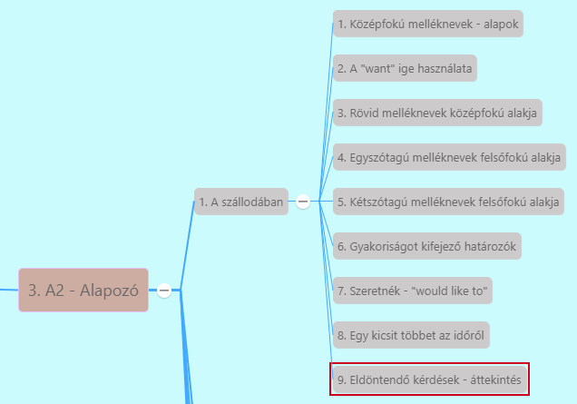

# Kétszótagú melléknevek felsőfokú alakja [^1]

[Előző](4.md)

- Kétszótagú melléknevek -> **"-est" végződéssel**
  - Ha melléknév ***""-y""-ra*** végződik -> ***-est*** előtt ***""-y"" ""-i""-re módosul***
    - *happy + est -> happiest*
    - *easy + est -> easiest*
    - *shy* helyesírás szempontjából kivétel (bár egyszótagú) -> *shy + est -> shyest*
  - Ha melléknév ***-er-re*** végződik
    - *clever + est -> cleverest
  - Ha melléknév ***-le-re*** végződik
    - *simple + est -> simplest*
  - Ha melléknév ***-ow-ra*** végződik
    - *narrow + est -> narrowest* - a legszűkebb
  - Többi kétszótagú melléknévnél **rövid és hosszú melléknevek képzésére vonatkozó szabályok is** (felsőfokú alak *-est* végződéssel és a "most" szó használatával is)
    - *modern -> modernest/most modern*
    - Ha nem vagyunk biztosak -> inkább "most" szóval
    - Mondatban felsőfokú alak előtt: ***"the"***
      - *What is the simplest way to be happy?*
      - *She is the shyest girl in the group.*
      - *This is the narrowest brigde I-ve ever seen.*

[Következő](6.md)

---
[^1]: Alapozó, A szállodában, 7. fejezet - Egy szülőbarát hotel