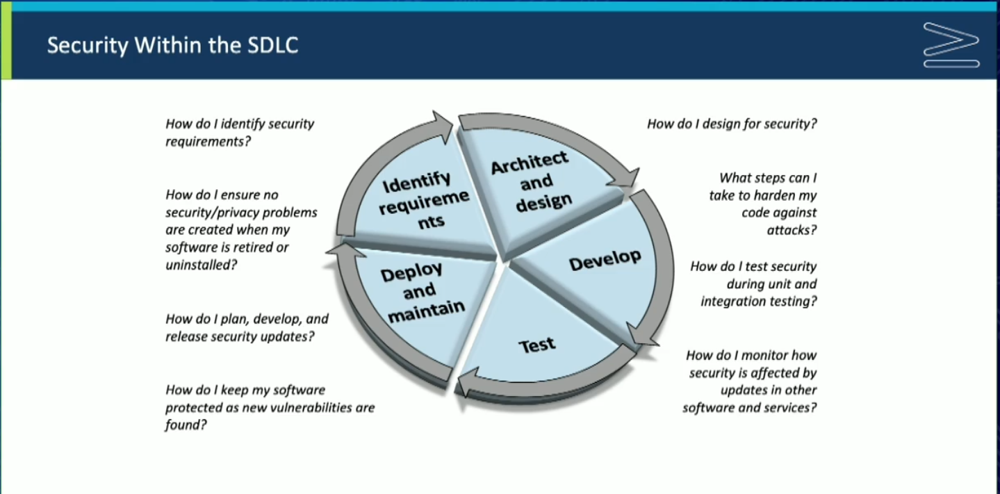
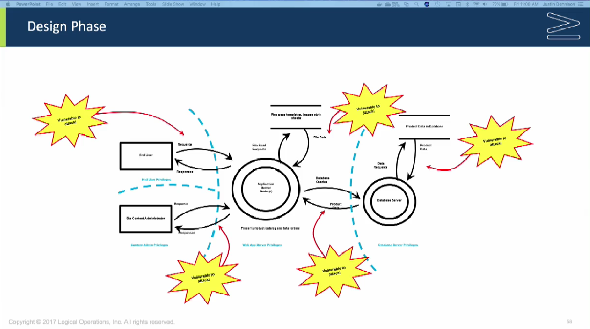

# Cyber Secure Coder (CSC-110) Videó

## 1. Biztonság a szoftverben

### 1.1. Áttekintés

- Justin Dennison, Daniel Lowrie bemutatkozás
- Pearson tanúsítvány információk

### 1.2. Előzetes ismeretek és elvárások

- Identifying the Need for Security in Your Software Projects (
A biztonság iránti igény azonosítása szoftverprojektjei során)
- Handling Vulnerabilities (Sebezhetőségek kezelése)
- Designing for Security (Biztonsági tervezés)
- Developing Secure Code (Biztonságos kód fejlesztése)
- Implementing Common Protections (Közös védelmek megvalósítása)
- Testing Software Security (Szoftverbiztonság tesztelése)
- Maintaining Security in Deployed Software (A telepített szoftver biztonságának fenntartása)

### 1.3. Gather Software Requirements (Gyűjtsd össze a szoftverkövetelményeket)

- szoftverkövetelmények, biztonsági követelmények
- felhasználói követelmények
- platformkövetelmények
- vállalkozás esetén -> üzleti követelmények (1.3. videó, 5:35) -> gyakran változhatnak, ha nem jól meghatározottak -> fontos lenne jól meghatározni
- vízesés modell - nehéz visszaadni, miután elkészült és már a tesztelési fázisban van.
- iteratív ciklusokkal - korábban kiderül a probléma, könnyebben javítható



- szabványok és megfelelések (1.3. videó, 6:34)
  - HIPAA https://hu.wiktionary.org/wiki/HIPAA
  - PCI DSS: Payment Card Industry Data Security Standard – a kártya-műveletekkel kapcsolatos adatvédelmi biztonsági szabályok, amelyek a https://www.pcisecuritystandards.org/ honlapon érhetők el. A kereskedő köteles részletesen megismerni a PCI DSS-t és betartani a benne foglalt szabályokat. https://www.pcisecuritystandards.org/document_library/?document=pci_dss
  - FERPA
  - keretrendszerek
- Felhasználói elvárások -> gyorsan változnak (1.3. videó, 8:48)
  - vízesés gyenge pontja: könnyebb, ha valaki megmondja mit nem szeret, mint hogy mit szeret
  - bejelentkezés 
    - SSO: Az SSO a Single Sign-on rövidítése, amely egy hitelesítési séma, amely lehetővé teszi a felhasználók számára, hogy több szoftverrendszerbe is bejelentkezzenek egyetlen identitással. Ez azt jelenti, hogy a felhasználók egyetlen bejelentkezési hitelesítő adatokkal jelentkezhetnek be több rendszerbe.
    - felhőalapú felhasználás
  - proaktívnak kell lenni
- Platform követelmények (1.3. videó 9:43)
  - On-premise, helyi alkalmazás
  - felhőhöz csatlakozik, AWS, Azure, GCP
- Consequences of Not Meeting Security Requirements (1.3. videó, 10:50)

### 1.4. Feladat: Követelmények meghatározása

### 1.5. Tevékenység: Követelmények meghatározása

- alkalmazás fejlesztése
  - katalógus a termékekről, termékleírással képekkel, árral
  - több nyelven
  - keresni tudnak a felhasználók kulcsszavakra
  - új felhasználók regisztrálnak felhasználói fiókot
    - termékek online vásárlása
    - visszajelzések
    - bejelentkezés Google-ön keresztül OAuth autentikálással
  - adminisztrátor kezeli a felhasználói fiókokat
- felhasználók elvárási adatvédelem terén
- fizetések kezelése -> PCI, GDPR

### 1.6. A szoftverbiztonságot aláásó tényezők

- Szoftverbiztonság 3P-je (videó: 1:40)
  - **Product**
    - common defects harm security (a gyakori hibák rontják a biztonságot)
    - components and platforms are not secure (az alkatrészek és a platformok nem biztonságosak)
    - configuration of software and host system is not secure (a szoftver és a gazdarendszer konfigurációja nem biztonságos)
    - security policies are poorly implemented (a biztonsági politikákat rosszul hajtják végre)
  - **People**
    - operator error
    - incorrect assumptions about software behavior (helytelen feltételezések a szoftver viselkedésével kapcsolatban)
    - Falling prey to attacks (A támadások áldozatává válás)
    - unintentional unsecure behavior (nem szándékos bizonytalan viselkedés)
    - malicious behavior (rosszindulatú viselkedés)
    - nem bízhatunk meg a felhasználókban
      - lehetnek rosszindulatúak
      - nem biztos, hogy tudják mit kell csinálniuk
  - **Process**
    - security is not integrated into the entire process (a biztonság nem integrálódik a teljes folyamatba)
    - overall design is unsecure (az általános kialakítás nem biztonságos)
    - software and deployments are not maintained adequately (a szoftverek és a telepítések karbantartása nem megfelelő)
    - development tools don't promote security (A fejlesztési eszközök nem támogatják a biztonságot)
- Program készítésekor át kell gondolni, hogyan mennek rosszul a dolgok. Hogyan támadnának meg, hogyan védhetem meg az alkalmazásom?
- Dokumentáció -> oktatni az embereket
- Kódelemzés, CI (A szoftverfejlesztés területén a folyamatos integráció (CI: continuous integration) az a fejlesztési folyamat, amikor a fejlesztők a munkájuk másolatát naponta akár többször is megosztják a verziókezelő rendszerben).

### 1.7. Szoftver sebezhetőségek és támadási fázisok

- Hacking: nem feltétlenül rossz, csak "bütykölőt" jelent, trükközést
  - White hat
  - Black hat
  - Gray hat
- Másképp
  - Builder
  - Breaker
    - felmér és értékel
    - kihasznál és behatol
    - fenntartja a hozzáférést vagy kiterjeszti a jogosultságokat
    - lebontsa az egészet (Denial of service - DOS)

### 1.8. Támadási minták

- Hogyan támadná meg valaki, hogyan törné meg? Hogyan védekezhetek ellene? -> Megfelelő gondolkodásmód
- **Reconnaissance (Felderítés, felmérés, feltárás)**: milyen webalkalmazást futtat, verziószámok stb. Információgyűjtés ezekről, URL piszkálás, URL-be beírogatás, nyitott portok keresése stb. Minden lehetséges információ összegyűjtése a sebezhetőségek felderítéséhez és kihasználásához. Fontos. -> Nem szabad információt adni, ha nem muszáj -> nem tűnik rosszindulatú tevékenységnek, ha nincs naplózás vagy hozzáférési minták nyomon követése.
  - **Excavation (kiásás)**: 
    - a célpont utáni kutatás, információk kiásása (Kukucskálj bele a célpontba, hogy "kiásd" az információkat)
    - Tartalmazza az URL-ek és lekérdezési karakterláncok vizsgálatát és módosítását (webes alkalmazásban), a konfigurációk és beállítások módosítását, a weboldalak forrásainak megtekintését, a rendszernaplók felfedezését és egyebeket
    - Tartalmazza a visszaélési taktikákat, például érvénytelen vagy nem szokványos bemeneti értékek megadását a hibák kikényszerítésére, a kezeletlen kivételek felfedésére, valamint a bőbeszédű hibaüzenetek, veremnyomok, konfigurációs adatok, útvonalak és így tovább felfedésére.
  - **Footprinting**:
    - Keressen olyan konfigurációs információkat, amelyek hasznosak lehetnek egy támadásnál - nyitott portok, verziószámok, network topology információk, stb.
  - **Fingerprinting**: 
    - hasonlítsa össze a rendszer kimenetét az ismert "ujjlenyomatokkal", amelyek egyedileg azonosítják a rendszer részleteit
  - **Reverse Engineering**: 
    - Elemezhetem-e egy objektum, erőforrás vagy rendszer szerkezetét, funkcióját és összetételét annak megállapítására, hogyan épült fel vagy hogyan működik?
    - A cél általában az, hogy a funkcionalitás egészét vagy egy részét megkettőzze
  - **Functionality Misuse** - Funkcionalitás visszaélés
    - Visszaélhetek az alkalmazás funkcióival negatív műszaki hatás elérése érdekében?
    - A rendszer funkcióit nem változtatják vagy módosítják, hanem egyszerűen olyan módon használják, amilyennek nem szánták. Ez gyakran a funkcionalitás túlzott használatával vagy a hibás funkciók kihasználásával valósul meg, amelyek lehetővé teszik a visszaélést.
- **Gain Access Privileges** - hozzáférési jogosultságokat szerezni
  - **Brute force attacks**: 
    - gyorsan és ismételten beírja a különböző titkos értékeket, amíg a keresés fel nem oldja a hozzáférést
    - A titkos érték lehet jelszó, titkosítási kulcs, adatbázis-keresési kulcs vagy más olyan érték, amelyet a jogos felhasználónak ismernie kell.
    - tényezők, amelyek lehetővé teszik a sikeres támadást
      - kevesebb variáció a titkos értékben (pl. 8 karakter használata 16 helyett)
      - Használjon olyan mintákat (például valós világot), amelyek a szótárban kereshetők
      - a sikertelen próbálkozások gyors átfutása
  - **Authentication abuse**
    - jogosulatlan hozzáférést kaphat a hitelesítési könyvtár vagy annak használatának gyengesége miatt.
    - a hibás szoftverek feltételezéseket tehetnek a bizalmi kapcsolatról vagy a titkos értékek létrehozásáról, amelyek lehetővé teszik a támadó számára, hogy gondos lépéssorozat végrehajtásával hozzáférjen.
  - **Authentication bypass**
    - Kiváltságos hozzáférés megszerzése a normál hitelesítési útvonalon kívül.
    - példa: Miután a felhasználók bejelentkeznek, egy rosszul megtervezett webhely általában betölt egy adott URL-t, hogy érzékeny tartalmat tartalmazó oldalt jelenítsen meg. A támadó ezt az URL-t közvetlenül a címsorba írja be, hogy hitelesítés nélkül közvetlenül a biztonságos tartalomhoz juthasson.
- **Memory manipulation**: Olvashatok vagy írhatok adatokat egy memóriahelyre oly módon, hogy az aláássák a biztonságot?
  - **Buffer manipulation**
    - Adatok olvasása vagy írása egy memóriahelyre szokatlan módon, amely lehetővé teszi a támadó számára, hogy azon kívül is olvasson vagy írjon adatokat.
    - Célozza meg a memóriahelyeket, ne pedig azt a kódot, amelyik beolvassa vagy írja azokat.
    - Általában a támadás során a memóriába helyezett tartalom nem számít. A tipikus puffertámadás kiszorítja a pufferben tárolt eredeti tartalmat, ami egy másik memóriahely olvasását vagy felülírását eredményezi.
  - **Pointer manipulation**
    - A pointerváltozók értékeinek módosítása a nem kívánt memóriahelyek eléréséhez.
    - Ez hozzáférést biztosíthat olyan adatokhoz vagy funkciókhoz, amelyek normál esetben nem lennének elérhetők
- **Parameter Injection**
  - Módosíthatom a kérésparaméterek tartalmát a biztonság aláásása érdekében?
- **Input Data Manipulation**
  - Megadhatok-e fájlt vagy egyéb bemeneti adatokat unortodox formában a biztonsági védelem megkerülésére?
- **Action Spoofing**
  - Elrejthetem-e, álcázhatom-e az egyik műveletet a másiknak, és ezáltal rávehetem-e a felhasználót, hogy egyfajta műveletet kezdeményezzen, amikor egy másik műveletet szándékozik kezdeményezni?
  - Példa: Egy webalkalmazás felhasználója kiválaszt egy Küldés feliratú gombot, de lekérdezés helyett letölti a szoftvert a felhasználó számítógépére. Ezt meg lehet valósítani a clickjacking segítségével, amelyben a felhasználó látja az egyik felületet, de valójában egy másik, láthatatlan felülettel lép kapcsolatba.
- **Software Integrity Attack**:
  - Rábírhatok-e egy felhasználót, programot, kiszolgálót vagy eszközt olyan műveletekre, amelyek aláássák a szoftverkód, az eszköz, az adatszerkezetek vagy az eszköz firmware-ének integritását?
  - Azt eredményezi, hogy a célpont nem biztonságos állapotba kerül, ami felhasználható egy következő támadás előkészítésére.
- **Infect the Application with Malicious Code**:
  - Hozzáadhatom saját rosszindulatú kódomat vagy erőforrásaimat az alkalmazáshoz?
  - A támadók különféle technikákat használhatnak arra, hogy saját rosszindulatú kódjukat hozzáadják egy futó alkalmazáshoz.
    - **Code inclusion**
    - **Code injection**
    - **Command injection**
    - **Content spoofing**
    - **Resource location spoofing**
  - **Denial of Service**
    - Elvégezhetek bizonyos műveleteket, amelyek megakadályozzák a jogos felhasználókat a szoftver használatában?
    - A szolgáltatás megtagadása többféle megközelítéssel is megvalósítható, amelyek közvetlenül letiltják a szolgáltatásokat, vagy annyira leblokkolják a rendszert, hogy az már nem tudja támogatni a szolgáltatást.
      - Excessive allocation - Túlzott elosztás
      - Flooding - elárasztás
      - Resource leak exposure - Erőforrás-szivárgás expozíció
      - Sustained client engagement - Tartós ügyfélelköteleződés
  - **Repudiation** - Megtagadás, elutasítás:
    - Lebonyolíthatok-e tranzakciót, de úgy tehetem, hogy a rendszer ne tudja bizonyítani, hogy a tranzakció valóban megtörtént?
    - Akkor fordul elő, ha a rendszer nem követi megfelelően és nem naplózza megfelelően a felhasználók műveleteit, vagy nem védi a naplókat.
    - A támadó manipulálhatja a rendszert, hogy hibás adatokat naplózzon, és úgy tűnik, hogy a tranzakció nem történt meg, vagy más típusú tranzakció történt.
    - Példa: A támadó képes lehet hitelkártyás vásárlást végrehajtani, miközben lehetetlenné teszi a rendszer számára annak bizonyítását, hogy a vásárlás egy adott kártyaszámmal történt.
- **Megelőzés**: 
  - Sanitized - fertőtlenítés
    - Szűrés: nem használhat pontosvesszőt, nem használhat csőoperátorokat vagy & jeleket
    - Karakterkorlát

### 1.9. Feladat - Sebezhetőségek keresése

### 1.10. Sebezhetőségek keresése

### 1.11. Feladat Új jelszókövetelmények

### 1.12. Új jelszókövetelmények

### 1.13. Feladat Jelszavak hash-elése

- Soha nem tárolhatók jelszavak plain-textben!!!
- sha256 hashelési algoritmus
- Salt: sózás -> véletlenszerű karakterkészlet hozzáadva a jelszóhoz hash-elés előtt. Só hozzáadása => hash-elés

### 1.14. Jelszavak hash-elése

- md5 nem túl robosztus, könnyen feltörhető szivárványtáblával
  - hash ütközési problémák
  - nem javasolt a használata jelszavak tárolásához
  - checksumhoz kiváló (ellenőrző összeg)
- sha512 ajánlott
- salt hard code (kemény kódolás - változóban tárolva mindenkinek ugyanaz) -> nem jó -> ha ezt valahogy megszerzik szivárványtáblával szintén megszerezhetők az információk (brute force)
- salt tárolása: adatbázisban a jelszó hash-sel, mindenkinek más -> kriptográfiailag biztonságos só generálása mindenkinek -> ezt kell tenni egy **hitelesítési rendszerben**
- jelszó megadásakor azt újra hash-eljük, és összehasonlítjuk a tárolt jelszó hash-sel.
- Soha nem szabad plain textet hasonlítani plain texthez -> hash-eket kell hasonlítani
- hash algoritmusok
  - sha256
  - sha384
  - sha512
  - blake2b
  - blake2s
- Pythonban pbkdf2_hmac algoritmusnak megadható (python dokumentációban)
  - hash név
  - password
  - salt,
  - iterációk: teljesítménytől függ, (100.000, 1.000.000)
  - dklen: származtatott kulcs néhány bit hosszúságból

#### Python példa:

  ```
  def GeneratePasswordHash(password, SALT):
    try:
      import binascii
      dk = hashlib.pbkdf2_hmac('sha512', password, SALT, 100000)
      return True, binascii.hexlify(dk)
    except:
      return False, "Hashing Failure"
  ```

  hibát okozhat Pythonban

  ```
  def GeneratePasswordHash(password, SALT):
    import binascii
    dk = hashlib.pbkdf2_hmac('sha512', password.encode(), SALT.encode(), 100000)
    return True, binascii.hexlify(dk)
  ```


- Mi az oka, hogy még mindig sokan használnak elavult, nem biztonságos megoldásokat?
  - kezdők nem ismerik
  - lustaság, fejlesztőként nem adunk hozzá funkciókat, amire nem lesz szükség -> biztonság kivétel ez alól
  - ha szerződésben nincs rögzítve a jelszavak hash-elése, a fejlesztók 60%-a plain-textben tárolja -> pedig tulajdonképpen csak függvényhívás (olyanokat kell használni, amelyek tesztelve vannak, alaposan kutatott, bizonyított hashelési módszerek)
  - Ha gyorsabbá kell tenni a bejelentkezést -> csökkentik a biztonságot
- 

### 1.15. Sebezhetőségi intelligencia

- Információforrások a szoftverprojektjeit érintő sebezhetőségekről:
  - Általában ingyenesen használhatók (Are typically free to use)
  - Előfizetésen keresztül értesítheti Önt (például RSS hírfolyamokon vagy e-mail listákon) (May notify you through subscription (RSS feeds or email lists, for example))
- Ügyeljen arra, hogy figyelje a projektjei által használt összes szoftver információforrását:
  - Platformok
  - Alkalmazásokká összeállított modulok (Modules complied into applications)
  - Alkalmazáson kívüli modulok, de ez a futtatás ugyanaz a folyamatterület (Modules external to application, but that run is same process space)
  - Helyi külső API-k, amelyeket az alkalmazás hív meg (Local external APIs your application calls)
  - Web- és felhőszolgáltatások, amelyeket az alkalmazás hív (Web and cloud services your application calls)
- Lépést kell tartani a függőségek sebezhetőségeivel például NPM -> a függőségeknek is vannak függőségeik... -> örökölhetünk sebezhetőségeket -> ezek a sebezhetőségek (vulnerabilities) kizsákmányolásokhoz vezethetnek (exploits).
- Valós eljárások, kódok vagy végrehajtható fájlok, amelyek kihasználják a sebezhetőségeket (Actual procedures, code, or executables that take advantage of vulnerabilities)
- Elősegítheti a szoftverprojektjein végzett tesztek egy részét. (May drive some of the tests you perform on your software projects.)
- Bizonyos helyzetekben illegális vagy veszélyes lehet kísérletezni (legyen óvatos!) (May be illegal or dangerous to experiment with in some situations (Be careful!))
- Ellenőrzött környezetben kell kísérletezni. (Should be experimented with in a controlled environment.)
- A weben különböző forrásokból szerezhető be. (May be obtained through various sources on the web.)
  - Examples
    - Offensive Security databes: https://www.exploit-db.com
    - Common Exploits at http://www.commonexploits.com
- Sebezhetőségi adatbázisok (Vulnerabilities databases)
  - Különféle kormányzati és kereskedelmi szervezetek adják ki (Published by various government and commercial organizations)
  - Nem mindig tartalmazza a legfrissebb információkat, de általában igen (Do not always contain the latest information, but are generally)
    - Átfogó (Comprehensive)
    - Tartalmaz keresési lehetőségeket (Include search capabilities)
    - Automatikusan kereshető fejlesztési automatizálási szkriptekkel (Can be searched automatically by development automation scripts)
    - Lehet benn POC (Proof of concept - részletes leírás, hogy használható ki a sebezhetőség)
  - National Vulnerability Database
    - https://nvd.nist.gov
    - The U.S government's repository of vulnerability management data.
    - A Security Content Automation Protocol (SCAP) által meghatározott géppel olvasható formátumban tartva. (Maintained in the machine-readable format specified by the Security Content Automation Protocol (SCAP))
    - Tartalmazza a biztonsági ellenőrzőlisták adatbázisait, a biztonsággal kapcsolatos szoftverhibák hibás konfigurációit, a termékneveket és a hatásmérőket. (Includes databases of security checklists, security-related software defects misconfigurations, product names, and impact metrics.)
  - Offensive Security's Exploit Database
  - https://www.exploit-db.com/
  - A kihasználások és a sebezhető szoftverek kereshető archívuma, CVE formátumban. (A searchable archive of exploits and vulnerable software, supplied in the CVE format.)
- Command Attack Pattern Enumeration and Classification (CAPEC)
  - https://capec.mitre.org
  - Maintained by MITRE Corporation (A MITRE karbantartója)
  - A list of common attack patterns
- OWASP Top 10
  - https://www.owasp.org/index.php/Category:OWASP_Top_Ten_Project
  - Maintained by Open Web Application Security Project (OWASP)
  - A list of common threats and strategies for countering them. (A gyakori fenyegetések listája és a leküzdésük stratégiái.)
  - Owasp provides many other resources
- CWE/SANS Top 25 Most Dangerous Software Errors
  - https://cwe.mitre.org/top25
  - Maintained by the SANS Institute, working with MITRE and other organizations
  - A list of the most widespread and critical software errors that can lead to serious vulnerabilities in software. (A legelterjedtebb és legkritikusabb szoftverhibák listája, amelyek súlyos szoftver sérülékenységekhez vezethetnek.)
  - Overlaps the OWASP Top 10, and the CWE website provides a comparison to the OWASP Top 10 (Átfedi az OWASP Top 10-et, és a CWE webhely összehasonlítást nyújt az OWASP Top 10-hez)
  - While OWASP focuses on web and mobile apps, CWE/SANS tends to cover all types of software, include desktop applications.
- Biztonsági közlemények és tanácsok (Security bulletins and advisories)
  - Published by vendors of systems, application runtime environments, frameworks, web browsers, and other platforms and tools you use in your software projects. (Rendszerek, alkalmazás-futási környezetek, keretrendszerek, webböngészők és egyéb, a szoftverprojektjeiben használt platformok és eszközök szállítói által közzétéve.)
  - Provide the most comprehensive and timely source of vulnerability and exploit information for the technologies they cover. (A sebezhetőség legátfogóbb és legidőszerűbb forrása, és az általuk lefedett technológiákkal kapcsolatos információk kihasználása.)
  - Microsoft Security Bulletins https://technet.microsoft.com/en-us/security/bulletins.aspx
  - Apple Security Updates https://support.apple.com/en-us/HT201222
  - Android Security Bulletins https://source.android.com/security/bulletin/
  - Ubuntu Security Notices https://www.ubuntu.com/usn/
  - Amazon Web Services Latest Bulletins https://aws.amazon.com/security/security-bulletins/
  - jQuery Updates Blog https://blog.jquery.com
  - Chrome Releases https://chromereleases.googleblog.com
- Open source software project issue trackers
  - Legfrissebb információkkal szolgál a frissítésekről és a folyamatban lévő problémákról
  - Examples:
    - Node.js https://groups.google.com/forum/#forum/nodejs-sec
    - Python Bug Tracker https://bugs.python.org/
    - Hadoop Issue Tracking https://hadoop.apache.org/issue_tracking.html
    - MySQL Bugs https://bugs.mysql.com
    - Docker Issues https://github.com/docker/docker/issues
- "Vulnerability is the capacity to exploit something" (A sebezhetőség valaminek a kihasználásának a képessége.)

### 1.16. Vulnerablity Search - Feladat

- Attacking various websites and applications yourself (Különféle webhelyek és alkalmazások saját maga megtámadása)
  - One of the best ways to gain experience with common vulnerabilities (Az egyik legjobb módja annak, hogy tapasztalatokat szerezzen a gyakori sebezhetőségekkel kapcsolatban)
  - Probably illegal (Valószínűleg illegális)
  - Will annoy system operators and users (Zavarja a rendszerüzemeltetőket és a felhasználókat)
- A legal more polite alternative - use example applications and websites expressly provided for this purpose (Jogilag udvariasabb alternatíva – használjon példaalkalmazásokat és kifejezetten erre a célra szolgáló weboldalakat)
  - OWASP Juice Shop Project - Used in this course provide the "Woodworker's Wheelhouse" online store catalog
  - OWASP Vulnerable Web Applicatons Directory Project
  - 15 Vulnerable Sites To (Legally) Practice Your Hacking Skills - 2016 Update (https://www.checkmarx.com/ ...)
  - 40+ Intentionally Vulnerable Websites To (Legally) Practice Your Hacking Skills (https://www.bonkersabouttech.com/security/ ...)
  - Penetration Testing Practice Lab - Vulnerable Apps/Systems (https://www.amanhardikar.com/mindmaps/Practice.html)
- Woodworkers Wheelhouse
  - Serves as the "setting" for activities in this course
  - Imaginary company that sells hardwood lumber, tools, and other supplies for woodworkers and other hobbyists, as well as some home improvement and interior decorating supplies
- You will work on a web-based application for Woodworkers Wheelhouse
  - Includes a product catalog from which customers can order products online, and various other features.
  - Prototype app started by another developer.
  - Developed in:
    - Node.js version 6.10.3
    - Express.js
    - Angular.js
    - Bootstrap
    - Other web development frameworks
  - To begin, you will research Node.js on the web to identify and vulnerabilities in this version.

### 1.17. Vulnerablity Search - Tevékenység

- sanitize-html csomag a package.jsonban
- jsonwebtoken
- snyk.io-n Vulnerablity DB -> https://security.snyk.io/
- https://docs.npmjs.com/about-semantic-versioning
  - Using semantic versioning to specify update types your package can accept
You can specify which update types your package can accept from dependencies in your package's package.json file.

For example, to specify acceptable version ranges up to 1.0.4, use the following syntax:

Patch releases: 1.0 or 1.0.x or ~1.0.4
Minor releases: 1 or 1.x or ^1.0.4
Major releases: * or x
For more information on semantic versioning syntax, see the npm semver calculator.

Example: 

```
"dependencies": {
  "my_dep": "^1.0.0",
  "another_dep": "~2.2.0"
},
```

- Ellenőrizhetők automatizált eszközökkel -> pl. SonarQube https://www.sonarsource.com/products/sonarqube/
- Nagyobb frissítések elronthatják a program működését

## 2. Sebezhetőségek keresése

### 2.18. Szoftverhibák

- Szoftvernek és bugoknak is van életciklusa
  - Bugoknál, hibajelentés, javítás (remélhetőleg nem vezet be újabb hibákat) -> biztonsági problémák -> buffer overflow
  - Terms that describe software problems correspond to phases of the development process (A szoftverproblémákat leíró kifejezések a fejlesztési folyamat fázisainak felelnek meg)
    - **Error** - A mistake that someone makes when producing software (during design, programming, installation, configuration) (Hiba – Hiba, amelyet valaki a szoftver gyártása során követ el (tervezés, programozás, telepítés, konfigurálás során))
    - **Fault** - An error manifested within code. When you can point to a problem are in code that is leading to a security problem (a bug), you are identifying the fault. (Hiba – A kódon belüli hiba. Ha olyan kódban lévő problémára tud rámutatni, amely biztonsági problémához (hibához) vezet, akkor azonosítja a hibát.)
    - **Defect** - A deviation from requirements (resulting from a fault) - when something doesn't work the way it should, or doesn't live up to quality requirements. (Hiba – a követelményektől való eltérés (hiba miatt) – amikor valami nem úgy működik, ahogy kellene, vagy nem felel meg a minőségi követelményeknek.)
    - **Failure** - A real-world problem that occurs when a defect is released to customers. (Meghibásodás – Valós probléma, amely akkor jelentkezik, amikor a hibát kiadják az ügyfeleknek.)
- Security defects may be placed in code maliciously. (A biztonsági hibák rosszindulatúan helyezhetők el a kódban.)
- More often, they are simply due to a development mistake, such as:
  - A programming error
  - Mistaken or incomplete assumptions, such as:
    - The environment in which software will operate
    - How specific APIs or functions work
    - Access rights users will have
  - A change in the context in which te software runs
  - Using third-party code that is not secure
  - Bugs introduced through maintenance updates
- Build Security into your Design Processes
  - The stronger your design early on, the less code you will have to change later on.
  - To build security into your design processes:
    - Be sure that you understand what you are trying to build.
    - Identify the environment in which your software will run.
    - Identify the major modules in your software.
    - List all of the errors that might occur in various modules, and how you will deal with them
    - Resist adding features that are not driven by requirements
    - Adhere to secure coding standards for the languages and environments you use:
      - SEI CERT Oracle Coding Standard for Java
      - SEI CERT Android Secure Coding Standard
      - SEI CERT C Coding Standard
      - SEI CERT C++ Coding Standard
      - SEI CERT Perl Coding Standard
>- A biztonsági hibák rosszindulatúan helyezhetők el a kódban. (A biztonsági hibák rosszindulatúan helyezhetők el a kódban.)
>- Gyakrabban egyszerűen fejlesztési hibából adódnak, például:
> - Programozási hiba
> - Téves vagy hiányos feltételezések, például:
> - A környezet, amelyben a szoftver működik
> - Az egyes API-k vagy funkciók működése
> - A felhasználóknak hozzáférési joguk lesz
> - Változás a szoftver futási környezetében
> - Harmadik féltől származó, nem biztonságos kód használata
> - A karbantartási frissítéseken keresztül bevezetett hibák
>- Építsen be biztonságot tervezési folyamataiba
> - Minél erősebb a tervezés korai szakaszában, annál kevesebb kódot kell később módosítania.
> - A biztonság beépítése a tervezési folyamatokba:
> - Győződjön meg arról, hogy megérti, mit akar felépíteni.
> - Határozza meg a környezetet, amelyben a szoftver futni fog.
> - Határozza meg a szoftver főbb moduljait.
> - Sorolja fel az összes hibát, amely a különböző modulokban előfordulhat, és hogyan fogja kezelni őket
> - Ne adjon hozzá olyan funkciókat, amelyeket nem a követelmények vezérelnek
> - Tartsa be az Ön által használt nyelvekre és környezetekre vonatkozó biztonságos kódolási szabványokat:
> - SEI CERT Oracle kódolási szabvány Java számára
> - SEI CERT Android Secure Coding Standard
> - SEI CERT C kódolási szabvány
> - SEI CERT C++ kódolási szabvány
> - SEI CERT Perl kódolási szabvány

### 2.19. Külső könyvtárak

- Problem in standard libraries
  - Standard libraries
    - Provide classes, templates subroutines, macros, global variables, and other commonly used constructs
    - Are included with every implementation of a programming language
    - Are treated by developers almost as part of the programming language itself
    - Are used extensively by developers
    - May contain functions that are inheretly insecure or that can easily be used inappropriately in ways that make them unsecure
>- Probléma a szabványos könyvtárakban
> - Szabványos könyvtárak
> - Osztályokat, sablon alprogramokat, makrókat, globális változókat és egyéb gyakran >használt konstrukciókat biztosítanak
> - A programozási nyelv minden megvalósítása tartalmazza
> - A fejlesztők szinte a programozási nyelv részeként kezelik
> - A fejlesztők széles körben használják
> - Tartalmazhat olyan funkciókat, amelyek eredendően nem biztonságosak, vagy amelyek könnyen nem megfelelően használhatók olyan módon, hogy azok nem biztonságosak

- Pythonban néhány library technikailag third party -> sok ember erőfeszítése, remélhetőleg foglalkoznak a biztonsággal -> elolvasni hozzá a dokumentációt, biztonsági figyelmezetetéseket.
- Dependencies
  - Third party source code libraries:
    - Enable developers to develop faster, using functionally developed and tested by others
    - May in turn use third-party code, which would make it fouth-party code, from your perspective.
    - May be of very high quality, but you shouldn't simply assume that they will be.
    - Example:
      - OpenSSL Heartbleed vulnerability
  - You need to ensure that you are aware of all of the code dependencies
>- Függőségek
> - Harmadik fél forráskód-könyvtárai:
> - Lehetővé teszi a fejlesztők számára, hogy gyorsabban fejlesszenek, a funkcionálisan kifejlesztett és mások által tesztelt termékek használatával
> - Használhat harmadik féltől származó kódot, ami az Ön szemszögéből negyedik fél kódját eredményezné.
> - Lehet, hogy nagyon jó minőségűek, de nem szabad egyszerűen feltételezni, hogy azok lesznek.
> - Példa:
>  - OpenSSL Heartbleed sebezhetőség
>- Győződjön meg arról, hogy tisztában van az összes kódfüggőséggel
- Most developers don't have the time or experience to develop encryption that is better than what is provided in high-quality encryption libraries.
- Megfelelő titkosítási algoritmus választása! -> MD5 hash ütközési problémák
- Security of Host Sytems and Service Providers
  - Cloud services
    - Seem inherently less secure than on-premises, based on common-sense analysis.
    - In many cases, actually provide greater security than on-premises, according to evidence.
    - Add another layer of complexity to IT systems.
- - A gazdagép rendszerek és a szolgáltatók biztonsága
 - Felhőszolgáltatások
   - A józan ész elemzése alapján eredendően kevésbé biztonságosnak tűnik, mint a helyszíni.
   - A bizonyítékok szerint sok esetben valóban nagyobb biztonságot nyújt, mint a helyszíni.
   - Adjon hozzá egy újabb komplexitási réteget az IT-rendszerekhez.

### 2.20. A hibák biztonságos kezelése

- Error messaging
  - Default error messaging
  - Approach to Error Handling
  - Even when error messages do not give details, subtle clues may be provided to an attacker.
- A hibaüzenetekben nem szabad egyértelmű információkat kiadni, például bejelentkezésnél nem írjuk ki, hogy a jelszó hibás -> információ, hogy a felhasználónév jó
  - Fejlesztés során viszont fontos az egyértelmű hibamegjelölés -> utána ki kell kapcsolni
- Fail-Safe
  - A fail-safe system ensures that after a failure, the system is in the least harmful (or most secure) state for the data, the user, and anything else affected by the system.
  - A bad example:
  
```
if (IsAccessAllowed( ) == -1) {
  //Inform user that acces is denied here.
} else {
  //Allow user to do something here.
}
```

  - Ha a hozzáférés nem engedélyezett, tájékoztassa a felhasználót róla, ha engedélyezett csak engedélyezze
  - Improved example:

```
if (IsAccessAllowed( ) == 1) {
  //Allow user to do something here.
} else {
  //Inform user that access is denied here.
}
```

- Failure Recovery
  - Calls to the operating system, libraries, services, and APIs may return a value that indicates whether the call succeeded of failed.
  - Check return values that identify whether the call succeeded or failed, and respond appropriately.
  - When you write code to recover from failure:
- Implement Secure Error Handling
  - Exception handlers:
    - Place code that might throw an exception in a try block and code that handles exceptions in a catch block. (The mechanism for doing this varies from one language to other.)
    - Use the most specific exception for the code you're writing.
    - Avoid catching a fundamental exception type and handling all exception types in a generic way.
    - If you're using a language that supports a finally code block that in always called (whether an exception is thrown or not), then use it to return resources to the state they were in before the try block was executed.
    - Examples: Release connections to database/services, delete temporary files, release temporary data structures
    - Legyen nagyon konkrét a hibaleírás
-  Functions:
   -  Check return codes and respond appropriately when making calls to the operating system, libraries, services, and APIs.
   -  Avoid using functions that fail silently, and find safer alternative functions.
   -  If pass/fail return code not provided, check the return value to determine how to proceed:
      -  Safe to perform further calculations.
      -  Some other remediation is necessary.
- Respond to failures.
  - Due to an expected reason
    - Provide code to recover appropriately.
  - Due to an unexpected reason or a reason the program can't recover from
    - Log the unexpected value.
    - Cleanly terminate (break sessions, delete temporary files, destroy other resources an attacker might use.)
    - Ha kapcsolatot nyitok, naplózom a nyitását, zárását
    - Folyamatos naplózásra van szükség
    - A webalkalmazás számára elérhető naplófájlok készítése nagyon rossz!!! -> El kell kerülni, a naplófájlokat is védeni kell. 
    - Naplófájlok, időbélyegek használata

### 2.21. Emberi vonatkozású biztonság

- Az ember a gyenge láncszem, ha szoftverről és technológiáról van szó.
- Vulnerabilities Attributed to the Human Element
  - Using passwords that are easily broken by an attacker.
  - Providing credentials or access to an attacker:
    - Posting them in unsecure locations.
    - Leaving logged-in devices unattended.
    - Providing them directly to an attacker.
  - Storing files in unsecure locations.
  - Attaching unsecure devices to otherwise secure networks.
  - Leaving sensitive information on unsecure devices.
  - Transferring electronically secured information to unsecure outputs, such as printed hard copy.
  - Passing highly sensitive information in unsecure email.
  - Including sensitive information in a "Reply All" response
  - Accidentally addressing the wrong recipient in a confidential email.
  - Disabling or circumventing software security features.
  - Enabling unsecure software features, such as file-sharing, remote access, and so forth.
  - Skipping critical security checks to save time.
  - Downloading and (unintentionally) installing malware.
  - Visiting risky websites and blindly permitting malware to gain a foothold.
  - Falling for scams in email, text messaging services, and social networking sites.
  - Allowing unauthorized people into secure locations.
  - Changing security-related settings that they don't understand.
  - Mistakes by software developers and system administrators:
    - Accidentally changing the configuration of a firewall or server to a less ...
    - Forgetting to enable or re-enable important security monitoring or log...
    - Bypassing or disabling critical security checks.
- Social Engineering Attacks
  - Tailgating and piggybacking
  - Phishing
  - Spear phising
  - Baiting
  - Click-baiting
  - Social media reconnaissance
  - Nem szabad linkekre kattintani -> fel kell menni a szolgáltató saját oldalára, ott minden meglesz, nem kell a link
- Input validation
  - Critical security component of many applications, sice it protects angainst some of the most dangerous vulnerabilities.
  - Consider developing a centralized input validation function to reduce complexity, increase consistently, and makes it easier to improve and maintain.
  - Do not rely solely on client-side input validation since client-side code is generally easer to bypass or modify than server side.
  - All input to server operations should be validated on the server side.
  - Use client-side validation as well - to improve performance, for example.
  - Input validation can check for a number of factors, such as:
    - The type of data allowed (e.g., decimal numbers, currency)
    - The range of data allowed
    - Which characters are allowed
    - The minimum and maximum length of data

### 2.22. Biztonsági követelmények és tervezés

- The CIA Triad: Through development, ensure that your software provides three aspects of security:
  - Confidentiality - Keep information and communications private and protect them from unauthorized access.
  - Integrity - Keep an organization's information accurate, without error, and without unauthorized modification.
  - Availability - Ensure that systems operate continuously and that authorized users and access the data that they need.
- Evaluating Security Requirements
  - **S**ymbiotic: 
    - Don't conflict ot contradict each other
    - Work together as a system
  - **E**vident:
    - Each requirement is plain and clear
    - Can only be interpreted one way
  - **C**omplete:
    - Taken as a whole, the requirements communicate all security expectations for the project
  - **U**nitary:
    - Each requirement addresses one and only one thing
  - **R**ealistic:
    - Appropriate
    - Possible
    - Attainable
  - **E**valuable:
    - Expressed as something that can be measured 
    - Can be evaluated as passing or failing

### 2.23. Biztonság a szoftver életciklusán keresztül

- Igények összegyűjtése
  - Felhasználói igények
  - Platformkövetelmények
  - Biztonsági követelmények
  


Csillag: a sebezhetőség helye

---


1. [ ] [Cyber Secure Coder](https://subscription.packtpub.com/video/cloud-and-networking/9781835884348/p2/video2_1/bugs-in-software)