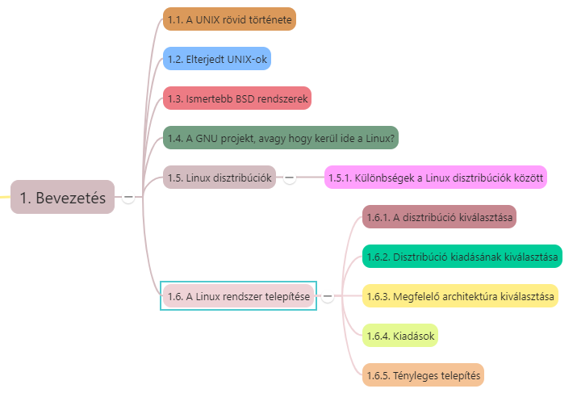

# 1. Bevezetés

* UNIX régi operációs rendszer, stabilan és egyre növekvő arányban
* Korábban egyetemi szféra -> banki, vállalati, adatfeldolgozó szféra
* Dinamikusság, alkalmazkodóképesség -> ugyanaz a környezet multiprocesszoros mainframe-nél és PC-n -> hardvertől, platformtól függetlenül tudja ugyanazt nyújtani

## 1.1 A UNIX rövid története

* Első változat: 1969, **Ken Thompson és Dennis Ritchie** -> *AT&T Bell* Laboratóriumában PDP-7 típusú számítógépre
* 1973-ban átírták a rendszer magját C nyelvre -> könnyű hordozhatóság
* AT&T ingyen az amerikai egyetemeknek adta a forráskódját -> 10 éven belül százezer működő UNIX rendszer
* Gyors terjedés -> egységes ellenőrzés hiánya -> számos helyi változat -> *Legjelentősebbek:*
  * Berkeley Egyetemen kifejlesztett **BSD UNIX**
  * AT&T hivatalos változata: **System V (Sytem Fiv - SVR4)** -> UNIX System Laboratories fejleszt tovább -> később felvásárolta Novell
* Népszerű -> szabványosítás fontossága
  * USL -> SVR4
  * BSD -> OSF (Open System Foundation) ajánlása: OSF/1
  * Független bizottságok (nem az érdekelt cégek támogatásával működnek) -> *IEEE* (ANSI és ISO támogatásával) a **POSIX** (Portable Operating System Interface(x)) ajánlást -> igyekszik egységesíteni a két fő szabványt
* Korán *Intel PC* alapú UNIXok is

## 1.2 Elterjedt UNIX-ok

* Solaris -> Sun Microsystems -> Oracle
* AIX
* IRIX
* HP-UX
* MAC-OSX

## 1.3 Ismertebb BSD rendszerek

* **FreeBSD**
  * A legnépszerűbb BSD származék
  * Szabad Unix-szerű OS
  * AT&T UNIX-ból Berkeley Software Distribution (BSD) egyik leszármazottja
  * Nem UNIX klón, de hasonló, UNIX kompatibilis
* PCBSD megszűnt
* **NetBSD**
  * Minőségi tervezési megoldások, megbízhatóság, teljesítmény
  * Hordozhatóság, barátságos lincencelés -> leginkább beágyazott rendszerekben
* **OpenBSD**
  * 1995 -> kivált NetBSD-ből
  * Forráskód nyíltsága, minőségi dokumentáció
  * Forráskód helyesség, biztonságosság
* **DragonflyBSD**
  * Szabad UNIX-szerű OS
  * Matthew Dillon -> FreeBSD 4.8 kiadásából, annak logikai folytatásának indult -> eltávolodott
  * Light Weight Kernel Threads (LWKT) és ráépülő pehelysúlyú üzenetküldési rendszer

## 1.4. A GNU projekt, avagy hogy kerül ide a Linux

* UNIX egyetemi és akadémiai szférában -> körülötte *hatalmas programkörnyezet* (szövegszerkesztés, mindenféle apró utility, fordítóprogramok, stb) -> nonprofit szervezetek szoftverei -> *publikussá tették* -> egységes C nyelv és környezet miatt *mindenki lefordíthatta, használhatta, módosíthatta, továbbfejleszthette* ->
* Richard Stallman -> **FSF (Free Software Foundation)** alapítvány -> szabadon, (forráskódban is) ingyen hozzáférhető szoftverkörnyezet bárki számára ->
* 1983 **GNU project** (GNU is Not UNIX) -> **GPL (GNU General Public Licence)**
  * bárki készíthet ilyen szoftvert
  * használhat, módosíthat -> ha továbbadáskor adja teljes forráskódját is, esetleges módosításai feltüntetésével
  * Szoftverért, annak módosításáért pénzt kérni nem szabad
* OS mag hiányzott, amely nem tartalmaz copyright alá eső kódot ->
  * Linus Torvalds, helsinki egyetemista -> több segítőjével együtt létrehozta a Linuxot ->
  * UNIX-klón, nem követi szigorúan egyik szabványt sem, legközelebb a független POSIX-hoz áll

## 1.5. Linux disztribúciók

* A disztribúció egy Linux kernelen alapuló teljes (működőképes) UNIX rendszer, segédprogramokkal, alkalmazásokkal együtt.
* Elkészítése: 
  * C forrásban meglévő utility-k, programok lefordítása
  * jegyzékstruktúrába helyezése és
  * összekonfigurálása

---

[Információk a Linux disztribúciókról: *https://distrowatch.com/*](https://distrowatch.com/)

---

### 1.5.1. Különbségek a disztribúciók között

***Milyen közönségnek és milyen feladatra készítik***

***Csomagkezelők:***
* Lehetnek eltérők is
* Disztrók egyik fő jellemzője az egyes programcsomagok installálásának, eltávolításának és frissítésének megkönnyítése és támogatása
* Ismert csomagkezelők: **apt, rpm, yum,** stb

***Kiadási idő:***
* lehet fix (pl. 6 hónap)
* lehetséges, hogy nincs kötött kiadási ciklus
* Kereskedelmi terjesztések

***Kernelverzió**
* Nem minden disztró ugyanazt a kernelverziót használja
* Sok disztró saját igényeinek megfelelően módosítja a hivatalosan kiadott, ún. vanilla kernelt.

## 1.6. Linux rendszer telepítése

### 1.6.1. Disztribúció kiválasztása

