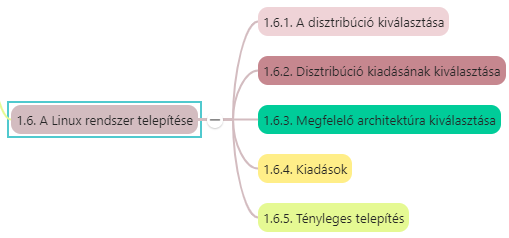

# 1. Bevezetés

## Tartalomjegyzék

1. [1. Bevezetés](#1-bevezetés)
   1. [Tartalomjegyzék](#tartalomjegyzék)
   2. [1.1 A UNIX rövid története](#11-a-unix-rövid-története)
   3. [1.2 Elterjedt UNIX-ok](#12-elterjedt-unix-ok)
   4. [1.3 Ismertebb BSD rendszerek](#13-ismertebb-bsd-rendszerek)
   5. [1.4. A GNU projekt, avagy hogy kerül ide a Linux](#14-a-gnu-projekt-avagy-hogy-kerül-ide-a-linux)
   6. [1.5. Linux disztribúciók](#15-linux-disztribúciók)
      1. [1.5.1. Különbségek a disztribúciók között](#151-különbségek-a-disztribúciók-között)
   7. [1.6. Linux rendszer telepítése](#16-linux-rendszer-telepítése)
      1. [1.6.1. Disztribúció kiválasztása](#161-disztribúció-kiválasztása)
      2. [1.6.2. Disztribúció kiadásának kiválasztása](#162-disztribúció-kiadásának-kiválasztása)
      3. [1.6.3. Megfelelő architektúra kiválasztása](#163-megfelelő-architektúra-kiválasztása)
      4. [1.6.4. Kiadások](#164-kiadások)
      5. [1.6.5. Tényleges telepítés](#165-tényleges-telepítés)

---

* UNIX régi operációs rendszer, stabilan és egyre növekvő arányban
* Korábban egyetemi szféra -> banki, vállalati, adatfeldolgozó szféra
* Dinamikusság, alkalmazkodóképesség -> ugyanaz a környezet multiprocesszoros mainframe-nél és PC-n -> hardvertől, platformtól függetlenül tudja ugyanazt nyújtani

## 1.1 A UNIX rövid története

* Első változat: 1969, **Ken Thompson és Dennis Ritchie** -> *AT&T Bell* Laboratóriumában PDP-7 típusú számítógépre
* 1973-ban átírták a rendszer magját C nyelvre -> könnyű hordozhatóság
* AT&T ingyen az amerikai egyetemeknek adta a forráskódját -> 10 éven belül százezer működő UNIX rendszer
* Gyors terjedés -> egységes ellenőrzés hiánya -> számos helyi változat -> *Legjelentősebbek:*
  * Berkeley Egyetemen kifejlesztett **BSD UNIX**
  * AT&T hivatalos változata: **System V (Sytem Fiv - SVR4)** -> UNIX System Laboratories fejleszt tovább -> később felvásárolta Novell
* Népszerű -> szabványosítás fontossága
  * USL -> SVR4
  * BSD -> OSF (Open System Foundation) ajánlása: OSF/1
  * Független bizottságok (nem az érdekelt cégek támogatásával működnek) -> *IEEE* (ANSI és ISO támogatásával) a **POSIX** (Portable Operating System Interface(x)) ajánlást -> igyekszik egységesíteni a két fő szabványt
* Korán *Intel PC* alapú UNIXok is

---

## 1.2 Elterjedt UNIX-ok

* Solaris -> Sun Microsystems -> Oracle
* AIX
* IRIX
* HP-UX
* MAC-OSX

---

## 1.3 Ismertebb BSD rendszerek

* **FreeBSD**
  * A legnépszerűbb BSD származék
  * Szabad Unix-szerű OS
  * AT&T UNIX-ból Berkeley Software Distribution (BSD) egyik leszármazottja
  * Nem UNIX klón, de hasonló, UNIX kompatibilis
* PCBSD megszűnt
* **NetBSD**
  * Minőségi tervezési megoldások, megbízhatóság, teljesítmény
  * Hordozhatóság, barátságos lincencelés -> leginkább beágyazott rendszerekben
* **OpenBSD**
  * 1995 -> kivált NetBSD-ből
  * Forráskód nyíltsága, minőségi dokumentáció
  * Forráskód helyesség, biztonságosság
* **DragonflyBSD**
  * Szabad UNIX-szerű OS
  * **Matthew Dillon** -> FreeBSD 4.8 kiadásából, annak logikai folytatásának indult -> eltávolodott
  * *Light Weight Kernel Threads (LWKT)* és ráépülő pehelysúlyú üzenetküldési rendszer

---

## 1.4. A GNU projekt, avagy hogy kerül ide a Linux

* UNIX egyetemi és akadémiai szférában -> körülötte *hatalmas programkörnyezet* (szövegszerkesztés, mindenféle apró utility, fordítóprogramok, stb) -> nonprofit szervezetek szoftverei -> *publikussá tették* -> egységes C nyelv és környezet miatt *mindenki lefordíthatta, használhatta, módosíthatta, továbbfejleszthette* ->
* **Richard Stallman** -> **FSF (Free Software Foundation)** alapítvány -> szabadon, (forráskódban is) ingyen hozzáférhető szoftverkörnyezet bárki számára ->
* 1983 **GNU project** (GNU is Not UNIX) -> **GPL (GNU General Public Licence)**
  * bárki készíthet ilyen szoftvert
  * használhat, módosíthat -> ha továbbadáskor adja teljes forráskódját is, esetleges módosításai feltüntetésével
  * Szoftverért, annak módosításáért pénzt kérni nem szabad
* **OS mag hiányzott**, amely nem tartalmaz copyright alá eső kódot ->
  * **Linus Torvalds**, helsinki egyetemista -> több segítőjével együtt létrehozta a **Linuxot** ->
  * *UNIX-klón*, nem követi szigorúan egyik szabványt sem, legközelebb a független POSIX-hoz áll

---

## 1.5. Linux disztribúciók

* *A disztribúció egy Linux kernelen alapuló teljes (működőképes) UNIX rendszer, segédprogramokkal, alkalmazásokkal együtt*.
* Elkészítése: 
  * C forrásban meglévő utility-k, programok lefordítása
  * jegyzékstruktúrába helyezése és
  * összekonfigurálása

---

[Információk a Linux disztribúciókról: *https://distrowatch.com/*](https://distrowatch.com/)

---

### 1.5.1. Különbségek a disztribúciók között

***Milyen közönségnek és milyen feladatra készítik***

***Csomagkezelők:***
* Lehetnek eltérők is
* Disztrók egyik fő jellemzője az egyes programcsomagok installálásának, eltávolításának és frissítésének megkönnyítése és támogatása
* Ismert csomagkezelők: **apt, rpm, yum,** stb

***Kiadási idő:***
* lehet fix (pl. 6 hónap)
* lehetséges, hogy nincs kötött kiadási ciklus
* Kereskedelmi terjesztések

***Kernelverzió***
* Nem minden disztró ugyanazt a kernelverziót használja
* Sok disztró saját igényeinek megfelelően módosítja a hivatalosan kiadott, ún. vanilla kernelt.

---

## 1.6. Linux rendszer telepítése

### 1.6.1. Disztribúció kiválasztása

Disztribúció telepítési útmutatójának tanulmányozása -> telepítés körültekintően

### 1.6.2. Disztribúció kiadásának kiválasztása

* Általában kódnevekkel a különböző kiadások -> pl. Debian Jessie, Debian Wheezy, Linux Mint Petra, stb.
* Legtöbbször legfrissebb kiadás

### 1.6.3. Megfelelő architektúra kiválasztása

* telepítési képek -> image-ek típusának kijelölése (32 v 64 bites -> amd64 v ARM -> arm64)
* Telepítési lehetőségek:
  * DVD alapú -> DVD-ről bootol, és rögtön telepítő
  * Live CD/DVD alapú telepítés -> telepítés nélkül is kipróbálható a rendszer
  * Internet alapú -> egy nagyon kicsit image fájlról bootolunk be, a rendszer a szükséges részeit egy internetes repositoryból tölti le.
    * stabil és gyors internetkapcsolat kell.

### 1.6.4. Kiadások

* Sokféle ablakkezelő és rengeteg csomag
  * Cinnamon Edition (Cinnamon asztali környezetet használ)
  * MATE Edition (MATE asztali környezet)
  * KDE Edition
  * GNOME Edition
  * XFCE Edition

### 1.6.5. Tényleges telepítés

* Natív telepítés: 
  * valós operációs rendszerként telepítjük
  * vagy másik OS-ként a Windows mellé -> particionálás kell -> Linux: saját fájlrendszer
* Virtuális gép -> lassúbb rendszer, korlátozottabb élmény

[Következő](2.md)

---