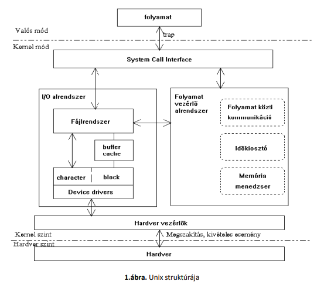

# 2. A Linux működésének rövid áttekintése

## 2.1. A 386-os csoda

***Linux valódi többfeladatos (multitask) és többfelhasználós (multiuser) operációs rendszer.***

* Eredetileg Intel 80386 processzorra -> mára nagyon sok hardverre adaptálták
* Linux a 386-os processzor "védett" módját használja a kernel (OS mag) futtatására -> kernelnek hozzáférése van a gép összes fizikai erőforrásához
* Felhasználói folyamatok (processzek) user módban futnak.
* Több, egymástól független user módú task -> 
  * egymástól védettek -> 
    * nem tudják egymás és a felügyelő kernel memóriaterületeit olvasni,
    * módosítani,
    * a gép közvetlen hardvererőforrásaihoz sincs hozzáférésük
* Bármilyen perifériaművelet csak a kernel meghívása útján -> biztonságos fájlrendszer
* Kernel teljes mértékben, fizikai szinten hozzáfér a gép erőforrásaihoz, fizikai szinten kezeli a hardvert -> lehető legnagyobb teljesítmény

## 2.2. Memóriakezelés röviden

***Lapozásos virtuális memóriakezelés***
* Fizikai memóriát kiegészítjük a winchesterről vett virtuális memóriával (page vagy swap terület)
* Teljes memória virtuális lapokra osztva -> folyamatokhoz rendeli, gondoskodik, hogy éppen szükséges lapok a memóriában legyenek
* Virtuális tárkezelés mindkét fajtája:
  * lapozás (paging): szükséges adatok beolvasása, ha memória megtelt ritkábban használt lapokat diszkre írja
  * tárcsere (swapping): egyes folyamatok aktivitásának figyelése -> ha szabad memória kell inaktív folyamat egészét háttértárra írja
* Linux ezek keverékét használja:
  * ha van elég memória: csak ki/be lapoz
  * ha egy folyamat régóta inaktív és sok memóriát igényel -> folyamathoz tartozó összes fizikai lapot diszkre menti.

### 2.2.1. Buffer Cache alapú megoldás

Kapcsolódik memória-lapkezelés mechanizmusához

**Buffer Cache:** Unix rendszerek diszk eléréshez használt gyorsítótárja, melyet a kernel kezel
* Buffer Cache mérete dinamikusan, rendszer-terheléstől függően változik
* A diszk-írások is a buffer cache-en keresztül történnek
* Megfelelő shutdown (rendszer lelövése, leállítása) procedúra nélkül soha ne kapcsoljuk ki a gépet! -> kikapcsolás előtt diszk tartalmának szinkronizálása, nyitott file-ok lezárása -> ha nem adatok veszhetnek el (bár eszközök infrmációvesztés minimalizálására, korrekt file-rendszer visszaállítására)

### 2.2.2. További gyorsító megoldások

***Demand paging:***
* Futtatható fájl végrehajtásakor nem az egész fájl töltődik be a memóriába, mindig csak a szükséges lapjai

***Osztott kódkönyvtárak használatának alapelve:***
* Programok nagy része C nyelven, vannak olyan függvények, amelyek más programokban is előfordulnak ->
* elég egyszer a memóriába tölteni, elérhetőségük átadása a programoknak ->**dinamikus linker**

***Copy-on-write mechanizmus:***
* Új folyamat létrehozása -> másik folyamat memóriájának lemásolásával
* Egy memórialapra több folyamat memóriatérképéből tudunk hivatkozni -> nem kell a lapot lemásolni, csak hivatkozni
* Módosításhoz viszont le kell másolni az adott folyamatnak

## 2.3. A folyamatok ütemezése

