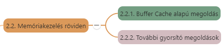

# 2. A Linux működésének rövid áttekintése

[Előző](1.md)

## Tartalomjegyzék

1. [2. A Linux működésének rövid áttekintése](#2-a-linux-működésének-rövid-áttekintése)
   1. [Tartalomjegyzék](#tartalomjegyzék)
   2. [2.1. A 386-os csoda](#21-a-386-os-csoda)
   3. [2.2. Memóriakezelés röviden](#22-memóriakezelés-röviden)
      1. [2.2.1. Buffer Cache alapú megoldás](#221-buffer-cache-alapú-megoldás)
      2. [2.2.2. További gyorsító megoldások](#222-további-gyorsító-megoldások)
   4. [2.3. A folyamatok ütemezése](#23-a-folyamatok-ütemezése)
   5. [2.4. Több felhasználós működés](#24-több-felhasználós-működés)
      1. [2.4.1. Felhasználók megkülönböztetése](#241-felhasználók-megkülönböztetése)

---

---

## 2.1. A 386-os csoda

***Linux valódi többfeladatos (multitask) és többfelhasználós (multiuser) operációs rendszer.***

* Eredetileg Intel 80386 processzorra -> mára nagyon sok hardverre adaptálták
* Linux a 386-os processzor "védett" módját használja a kernel (OS mag) futtatására -> kernelnek hozzáférése van a gép összes fizikai erőforrásához
* Felhasználói folyamatok (processzek) user módban futnak.
* Több, egymástól független user módú task -> 
  * egymástól védettek -> 
    * nem tudják egymás és a felügyelő kernel memóriaterületeit olvasni,
    * módosítani,
    * a gép közvetlen hardvererőforrásaihoz sincs hozzáférésük
* Bármilyen perifériaművelet csak a kernel meghívása útján -> biztonságos fájlrendszer
* Kernel teljes mértékben, fizikai szinten hozzáfér a gép erőforrásaihoz, fizikai szinten kezeli a hardvert -> lehető legnagyobb teljesítmény

## 2.2. Memóriakezelés röviden

***Lapozásos virtuális memóriakezelés***
* Fizikai memóriát kiegészítjük a winchesterről vett virtuális memóriával (page vagy swap terület)
* Teljes memória virtuális lapokra osztva -> folyamatokhoz rendeli, gondoskodik, hogy éppen szükséges lapok a memóriában legyenek
* Virtuális tárkezelés mindkét fajtája:
  * **lapozás (paging):** szükséges adatok beolvasása, ha memória megtelt ritkábban használt lapokat diszkre írja
  * **tárcsere (swapping):** egyes folyamatok aktivitásának figyelése -> ha szabad memória kell inaktív folyamat egészét háttértárra írja
* Linux ezek keverékét használja:
  * ha van elég memória: csak ki/be lapoz
  * ha egy folyamat régóta inaktív és sok memóriát igényel -> folyamathoz tartozó összes fizikai lapot diszkre menti.

### 2.2.1. Buffer Cache alapú megoldás

Kapcsolódik memória-lapkezelés mechanizmusához

**Buffer Cache:** Unix rendszerek diszk eléréshez használt gyorsítótárja, melyet a kernel kezel
* Buffer Cache mérete dinamikusan, rendszer-terheléstől függően változik
* A diszk-írások is a buffer cache-en keresztül történnek
* Megfelelő shutdown (rendszer lelövése, leállítása) procedúra nélkül soha ne kapcsoljuk ki a gépet! -> kikapcsolás előtt diszk tartalmának szinkronizálása, nyitott file-ok lezárása -> ha nem adatok veszhetnek el (bár információvesztés minimalizálása, korrekt file-rendszer visszaállítás).

### 2.2.2. További gyorsító megoldások

***Demand paging:***
* Futtatható fájl végrehajtásakor nem az egész fájl töltődik be a memóriába, mindig csak a szükséges lapjai

***Osztott kódkönyvtárak használatának alapelve:***
* Programok nagy része C nyelven, vannak olyan függvények, amelyek más programokban is előfordulnak ->
* elég egyszer a memóriába tölteni, elérhetőségük átadása a programoknak ->**dinamikus linker**

***Copy-on-write mechanizmus:***
* Új folyamat létrehozása -> másik folyamat memóriájának lemásolásával
* Egy memórialapra több folyamat memóriatérképéből tudunk hivatkozni -> nem kell a lapot lemásolni, csak hivatkozni
* Módosításhoz viszont le kell másolni az adott folyamatnak

---

## 2.3. A folyamatok ütemezése

1 processzor - több feladat -> CPU idő megosztása

***Preemptív időosztásos ütemezés***
* rendelkezésre álló CPU idő egyenlő részekre osztja
* időszeletek kiosztása prioritás alapján
* preemptív, mert a kijelölt időszelet letelte után a kernel megszakítja a folyamat futását, átadja a vezérlést

**UNIX nem valós-idejű (real-time) OS:**
* Több folyamat fut egyszerre, vezérlés egyiktől másikhoz, de valamekkora idő múlva vissza is kapja -> többnyire pár tized másodperc alatt

---

## 2.4. Több felhasználós működés

* Egyidejűleg több felhasználó, mind akár több programot is futtathat
* Minden bejelentkezett felhasználóhoz egy **terminált** = billentyűzet + megjelenítő együttese
* Kitüntetett terminál: UNIX-os géphez legközvetlenebbül csatolt terminál (Linuxnál gép saját billentyűzete és monitora = **konzol terminál**) -> bizonyos rendszeradminisztrációs feladatok csak innen hajthatók végre
* Felhasználókhoz -> pszeudo terminál
* Megnevezések:
  * **tty:** terminálok
  * **pty** vagy **ttyp:** pszeudo terminálok
* Ha csak konzolról használjuk a gépünket -> konzol terminál azonosítója: console

### 2.4.1. Felhasználók megkülönböztetése

* Minden felhasználónak **azonosítója** -> ehhez **jelszó**
* Felhasználókat **csoport**okba oszthatjuk
* Minden felhasználóhoz numerikus felhasználó és (esteleg több) csoport-azonosító
  * **UID**: felhasználói azonosító
  * **GID**: csoportazonosító
  * Kitüntetett felhasználónevek: **"root"** -> rendszergazda, mindent megtehet
  * Több **roottal ekvivalens** felhasználót is létrehozhatunk -> összes olyan felhasználó, akinek UID-je 0

[Következő](3.md)

---