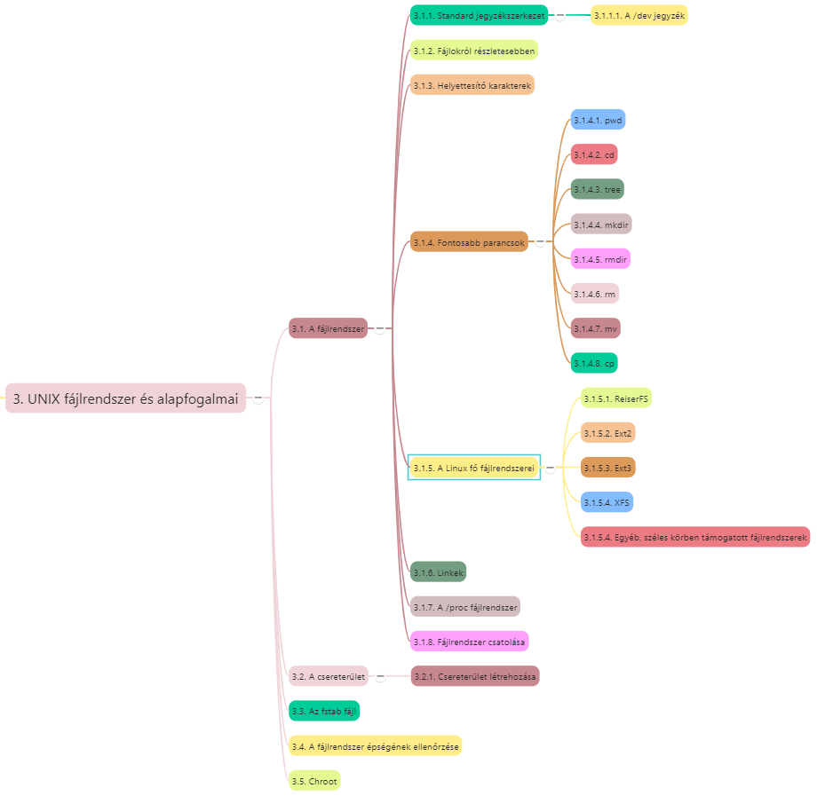
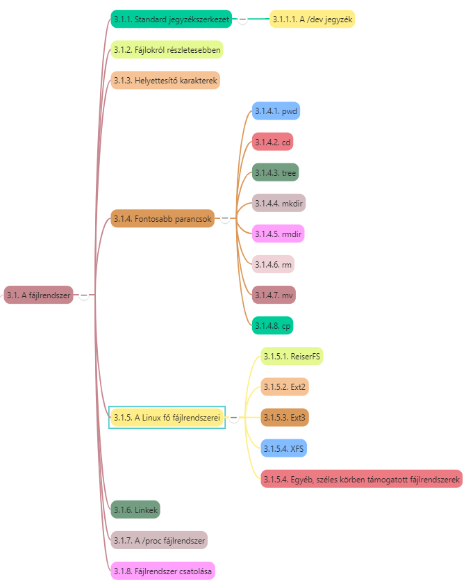
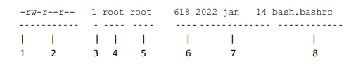
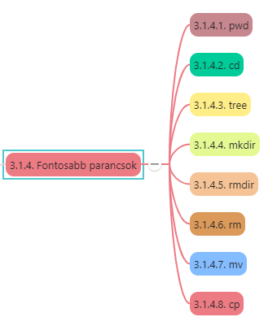
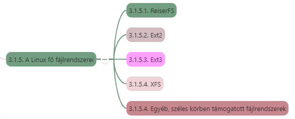

# A UNIX fájlrendszer és alapfogalmai

[Előző](2.md)

## Tartalomjegyzék

1. [A UNIX fájlrendszer és alapfogalmai](#a-unix-fájlrendszer-és-alapfogalmai)
   1. [Tartalomjegyzék](#tartalomjegyzék)
   2. [3.1. A fájlrendszer](#31-a-fájlrendszer)
      1. [3.1.1. Standard jegyzékszerkezet](#311-standard-jegyzékszerkezet)
         1. [3.1.1.1. A /dev jegyzék](#3111-a-dev-jegyzék)
      2. [3.1.2. Fájlokról részletesebben](#312-fájlokról-részletesebben)
      3. [3.1.3. Helyettesítő karakterek](#313-helyettesítő-karakterek)
      4. [3.1.4. Fontosabb parancsok](#314-fontosabb-parancsok)
         1. [3.1.4.1. pwd](#3141-pwd)
         2. [3.1.4.2. cd](#3142-cd)
         3. [3.1.4.3. tree](#3143-tree)
         4. [3.1.4.4. mkdir](#3144-mkdir)
         5. [3.1.4.5. rmdir](#3145-rmdir)
         6. [3.1.4.6. rm](#3146-rm)
         7. [3.1.4.7. mv](#3147-mv)
         8. [3.1.4.8. cp](#3148-cp)
      5. [3.1.5. Linux fő fájlrendszerei](#315-linux-fő-fájlrendszerei)
         1. [3.1.5.1. Reiser FS](#3151-reiser-fs)
         2. [3.1.5.2. Ext2](#3152-ext2)
         3. [3.1.5.3. Ext3](#3153-ext3)
         4. [3.1.5.4. XFS](#3154-xfs)
      6. [3.1.6. Linkek](#316-linkek)
      7. [3.1.7. A /proc fájlrendszer](#317-a-proc-fájlrendszer)
      8. [3.1.8. Fájlrendszer létrehozása](#318-fájlrendszer-létrehozása)
   3. [3.2. A csereterület](#32-a-csereterület)
   4. [3.3. Az fstab fájl](#33-az-fstab-fájl)
   5. [3.4. A fájlrendszer épségének ellenőrzése](#34-a-fájlrendszer-épségének-ellenőrzése)
   6. [3.5. Chroot](#35-chroot)

---




***Fájlrendszer:***
A háttértáron tárolt fájlok, könyvtárak és egyéb rendszerezésre szolgáló elemek (linkek, named pipe-ok és mások) tárolásának módját, kezelését és elérését értjük.

* UNIX-ban is könyvtárak -> fa struktúra
* Könyvtárak tartalmát, a tartalomjegyzéket a fájrendszer nyilvántartja
* UNIX/Linuxban minden fájl

***Fájl:***
Olyan "kommunikációs végpont", ahova vagy byte-folyamot (byte stream) tudunk írni, vagy byte-folyamot tudunk onnét olvasni (esetleg mindkettőt) 
* -> fájlként kezelhető a billentyűzet, a szöveges képernyő, a nyomtató, a CD író, fizikai memória tartalma, winchester szektorai
* Fájltípusok:
  * Egyszerű fájlok:
    * Bármilyen állomány, ami valamilyen adatot, szöveget tartalmaz
    * pl. program forráskód, futtatható állomány, szöveges dokumentum stb.
  * Jegyzékfájlok (jegyzékek):
    * Lehetővé teszik, hogy minden típusú fájljainkat valamilyen logikai rendszerbe szervezzük
  * Különleges fájlok:
    * Olyan fájlok, amik valamilyen eszközt képviselnek, pl. terminál, hangkártya

## 3.1. A fájlrendszer



UNIXban egyetlen fájlrendszer -> fa szerkezetű struktúra
* Gyökere a / jegyzék
* Minden jegyzék további bejegyzéseket tartalmaz
  * Tartalmazza a saját magára mutató . és a szülőjére mutató .. bejegyzést
  * Gyökérben a .. is saját magára mutat
  * Egy jegyzékben minden bejegyzésnek külön név kell
  * Jegyzék neve 0 és / kivételével bármi lehet, hossza változó 14 - 255 karakter (efölött levágja)

***Fogalmak:***
* **Metaadatok:**
  * A fájlrendszer belső adatstruktúrája ->
  * Biztosítja az adatok megfelelelő szervezését és elérését a lemezen
  * "Adatokról szóló adatok"
  * Ha sérül, fájlrendszeren tárolt adatok elérhetetlenek
* **Inode:**
  * Egyes fájlokkal kapcsolatos információt tartalmazzák: 
    * Méret,
    * Láncok száma,
    * Mutatók a lemezblokkokra, amelyek a fájtartalmat ténylegesen tárolják
    * Létrehozás, módosítás és hozzáférés dátumát és idejét
* **Napló:**
  * Az a belső struktúra a lemezen, amelyben a fájlrendszer tárolja a fájlrendszer metaadatainak módosítását.
  * Naplózás (journaling) csökkenti a Linux-rendszer összeomlását követő helyreállás idejét -> nem kell rendszerindításkor egész rendszert átvizsgálni, csak a naplóban rögzített eseményeket újra végrehajtani.

### 3.1.1. Standard jegyzékszerkezet

UNIXokban hasonló jegyzékszerkezet -> több disztribúcióban jellemzőek
* **/bin:** Létfontosságú bináris programok
* **/dev:** Speciális eszközök helye
* **/etc:** Sok vegyes dolog, programok konfigurációs fájljai, jelszóállományok, stb.
* **/etc/rc.d:** A rendszer indulását és leállását irányító szkriptek
* **/etc/skel:** Az itt lévő fájlokat kapja meg minden új ember a home jegyzékébe
* **/home:** Felhasználók saját jegyzékei
* **/lib:** A legtöbb program futásához nélkülözhetetlen dinamikusan linkelhető könyvtárak
* **/proc:** Linuxokra jellemző, a processzekkel kapcsolatos információkat hordozó virtuális fájlrendszer
* **/root:** A rendszergazda home jegyzéke
* **/sbint:** A rendszergazda számára alapvető fontosságú bináris programok jegyzéke
* **/tmp:** Ideiglenes fájlok, mindenki írhat bele, rendszergazda törölheti x időnél régebbi fájlokat
* **/usr:** Ez a könyvtár a használt lemezterület 80-90%-a
* **/usr/bin:** Bináris programok, nem létfontosságúak
* **/usr/doc:** Dokumentációk
* **/usr/games:** Játékok
* **/usr/info:** Info oldalak
* **/usr/lib:** Mint a /lib
* **/usr/local:** Adott szerverre speciálisan jellemző dolgok -> bin, lib man, sbin, src stb alkönyvtára
* **/usr/man:** Kézikönyv oldalak
* **/usr/sbin:** Mint /sbin, csak kevésbé fontosak
* **/usr/src:** Forráskódok
* **/var:** Sűrűn változó dolgok
* **/var/catman:** Megformázott kézikönyv oldalak
* **/var/log:** Főleg hálózattal kapcsolatos programok logfájljai (naplói)
* **/var/spool:** Várakozási sorok, elküldendő levelek, elvégzendő nyomtatások feljegyzései. Sok UNIXban érkező levelek is itt.

#### 3.1.1.1. A /dev jegyzék

A **/dev** (devices - eszközök) aljegyzékben a rendszer-erőforrásokat reprezentáló speciális fájlok.
* Kapcsolatteremtés kernel **"device driver"** (eszközmeghajtó) nevű, egyes fizikai eszközök kezeléséért felelős komponenesei és a rendszer egyéb részei között
  * **Karakteres eszközmeghatjó:** soros vonalat, vagy terminált reprezentáló fájlhoz tartozó eszközmeghajtó
  * **Blokkos eszközmeghajtó:** pl. winchester
* **/dev** főbb fájlcsoportjai:
  * **/dev/audio:** Ha hangkártya van a kernelbe konfigurálva -> .au formátumú fájlokat ide kiírva meghallgathatjuk
    * pl. ```cat x.au >/dev/audio``` -> ha hangkártya képes digitalizálásra -> a fájl olvasható is
  * **/dev/cdrom:** Link bonyolultabb nevű CD-ROM speciális fájlra.
  * **/dev/cua*:** Soros vonalakat jelentő speciális fájlok ->
    * írásuk vagy olvasásuk küldést/vételt jelent a megfelelő vonalon
  * **/dev/fd*:** Floppy
  * **/dev/hd*:** Rendszerben lévő AT busos winchesterek
    * /dev/hda -> 1. winchester, /dev/hdb -> 2. winchester
    * Ha IDE vagy EIDE vezérlő a gépben -> többi diszk /dev/hd1[ab]
    * Ha file-neveket számokkal folytatjuk -> diszkeken lévő partíciók: pl. ```/dev/hda1, /dev/hda2```
  * **/dev/midi, mixer:** Hangkártyához tartozó file-ok
  * **/dev/mouse, modem:** Linkek valamely soros portra
  * **/dev/pty*:** pszeudo-terminál vonalakat reprezentáló speciális file-ok
  * **/dev/sd*:** SCSI diszkek
  * **/dev/tty*:** A (virtuális) konzol terminálvonalai
  * **/dev/ttyS*:** Soros vonali terminálok
  * **/dev/null:** File, mely minden beleírt adatot elnyel, olvasáskor mindig file-vége jelet ad. ->
    * Ha parancs kimenetét el akarjuk nyomni -> ha nem akarunk hibaüzenetet látni: ```parancs 2>/dev/null```
  * **/dev/zero:** null-hoz hasonló, itt olvasáskor végtelen 0 értékű byte-ot ad vissza. -> pl. ```dd 10kfile bs=1k count=10``` utasítással -> 10 Kbájt hosszú, 10kfile nevű, csupa 0-ból álló fájl létrehozása

### 3.1.2. Fájlokról részletesebben

* **ls parancs:** Könyvtárak tartalmát, tartalomjegyzéket megtekinteni (*ls -> list*). Paraméterek nélkül aktuális könyvtár fájljainak és könyvtárainak nevét mutatja
  * **ls -l:** -l kapcsolóval -> egyes fájlok és könyvtárak részletes adatai (*-l -> long*)



***Oszlopok jelentése:***
* Csoport 1:
  * 1.karakter: **-** vagy **d** (directory) -> adott sorban fájl vagy könyvtár
* Csoport 2:
  * 1.karakter után álló 9 karakter a bejegyzéshez tartozó jogosultságokat írja le
* Csoport 3:
  * A második oszlopban -> linkszám
* Csoport 4-5: 
  * A fájl tulajdonosa és csoportja
* Csoport 6:
  * A bejegyzés mérete
  * Fájlok esetén fájl hossza bájtban
  * Könyvtárak is foglalnak helyet -> van méretük -> ez látszik itt
* Csoport 7:
  * Utolsó  módosítás dátuma és ideje
* Csoport 8:
  * Utolsó oszlop fájl vagy könyvtár neve

### 3.1.3. Helyettesítő karakterek

Speciális karakterek célja, hogy megvalósítható legyen több elemre való együttes hivatkozás. -> pl. szeretnénk egy könyvtárból minden jpg fáljt kimásolni, a png-ket pedig ott hagyni -> másolást végző parancs paraméterezhető így

***Speciális karakterek:***
* ```*```: Több karaktert helyettesít -> ```foto*.jpg``` vagy ```*.j*gp```
* ```?```: Egy karaktert helyettesít, ahova írjuk. pl. ```foto_2022_07_0?.jpg``` -> 2022.07. hónap 1-9 napjának fotói
* ```[]```: E karakterek között több karaktert is felsorolhatunk -> adott pozíción egy karakter lehet azok közül, amiket felsoroltunk pl. ```p[aA]ssword``` -> password és pAssword
  * ```[^]```: Tagadás -> ```p[^aA]ssword``` -> minden betű a két felsorolt kivételével

### 3.1.4. Fontosabb parancsok



#### 3.1.4.1. pwd

***pwd - Print Working Directory*** 
* Az *aktuális könyvtár pontos elhelyezkedése* ->
* Munkakönyvtár, amelyikben éppen dolgozunk
* Gyakran nem használjuk, prompt mutatja

#### 3.1.4.2. cd

***cd - Change Directory***
* *Mozgás a fájlrendszerben*
* Rendszerbe integrált parancs -> közvetlenül Linux Shell hajtja végre
* 1 kötelező paramétere -> könyvtár neve, amelyikbe be akarunk lépni -> leírása:
  * aktuális könyvtárhoz képest -> **relatív elérési út**
  * gyökérkönyvtárhoz viszonyítva -> **abszolút elérési út**
* **Speciális jelölések** az elérési útban:
  * `cd games` -> aktuális könyvtárból nyíló games mappába visz
  * `cd ..` -> aktuális könyvtárból egy szinttel feljebb (.. nevű könyvtár minden könyvtár keletkezésekor létrejön, rendszer hozza létre, szülő könyvtárra mutat)
  * `cd /usr/local/lib` -> gyökérkönyvtárból nyíló usr -> local -> lib könyvtárat teszi aktuálissá (abszolút elérési út)
  * `cd ~` -> saját home könyvtárunkba lép
  * `cd ~<felhasználó>` -> felhasználó home könyvtárába lép
  * előbbiek tetszőlegesen kombinálhatók
* TAB billentyű használatával -> névkiegészítő rendszer

#### 3.1.4.3. tree

***tree*** - *Vizuális könyvtárszerkezet megjelenítés az aktuális vagy meghatározott ponttól*
* Nem része minden UNIX rendszernek -> telepíthető
* `tree /` -> rendszer összes könyvtára és fájlja
* `tree /etc` -> etc-ből kiindulva könyvtárstruktúra
* ` -d` kapcsolóval -> csak a könyvtárakat rajzolja ki, fájlokat nem
* ` -f` kapcsolóval -> mappa tartalma teljes prefixszel

#### 3.1.4.4. mkdir

***mkdir - Make Directory***
* *Új könyvtár létrehozása* -> paraméterként létrehozandó könyvtár neve
* `mkdir Games` -> Games nevű könyvtár létrehozása az aktuális könyvtárban
* Egymás után több mappanevet is megadhatunk
* Csak olyan könyvtár hozható létre, amelynek szülője már létezik -> mkdir Games/Tetris -> csak ha Games már létezik

#### 3.1.4.5. rmdir

* *Egy vagy több könyvtár törlése*
* Paramétere a törlendő mappa neve -> Üresnek kell lennie, minden benne lévő fájl vagy könyvtárat előbb törölni kell

#### 3.1.4.6. rm

* *Törlés* -> eredetileg fájlok törlése
* ` -r` kapcsolóval könyvtárak rekurzív törlése, akkor is, ha nem üres

#### 3.1.4.7. mv

* *Fájlok, könyvtárak mozgatása, áthelyezése*
* *Állomány átnevezése*
* `mv Tetris Mytetris` ->
  * ha MyTetris mappa nem létezik j-> Tetris átneveződik MyTetrisre
  * ha létezik -> Tetris mappa áthelyeződik MyTetrisbe

#### 3.1.4.8. cp

* *Állományok, könyvtárak másolása*
* Könyvtár másolásnál paraméterként forrás és célkönyvtárat is meg kell adni -> 
  * `cp ./alma.txt korte.txt` -> fájl átnevezése
  * `cp -r ./Tetris MyTetris` -> könyvtár másolása, Tetris átmásolódik MyTetris mappába
    * ` -r` kapcsoló -> a target teljes tartalma másolásának jelzése

### 3.1.5. Linux fő fájlrendszerei



* 2.4 és újabb Linux kernelek -> sokféle fájlrendszer támogatása
* Minden fájlrendszernek vannak erősségei és gyengéi

***Alapvetően kétféle fájlrendszer***
* **Naplózó (journaling)**
* **Nem naplózó**

#### 3.1.5.1. Reiser FS

* Hans Reiser és Namesys tervezete
* **Jobb lemezterület-kihasználás:**
  * Összes adat kiegyensúlyozott B*-fastruktúrába szervezve -> 
    * jobb lemezterület-kihasználás, mert kis fájlok közvetlenül B*-fa levélcsomópontjaiban tárolódnak (nem pedig máshol, és csak egy mutató mutat a helyükre)
  * adatok csak a szükséges méretet használják (nem 1 vagy 4 KB-os egységekben)
  * inode-ok dinamikus lefoglalása
* **Jobb lemezhozzáférési teljesítmény:**
  * Kis fájlok esetén az adatok és a "stat-data" (inode) információ ált. egymás mellett tárolódik -> egyetlen lemez I/O művelettel kiolvasható
* **Gyorsabb helyreállás összeomlás után**
  * Legutolsó metaadat-módosítások nyomkövető napló segítségével -> nagyon gyors fájlrendszer ellenőrzés

#### 3.1.5.2. Ext2

#### 3.1.5.3. Ext3

#### 3.1.5.4. XFS

### 3.1.6. Linkek

### 3.1.7. A /proc fájlrendszer

### 3.1.8. Fájlrendszer létrehozása

---

## 3.2. A csereterület


## 3.3. Az fstab fájl

## 3.4. A fájlrendszer épségének ellenőrzése

## 3.5. Chroot

[Következő](4.md)