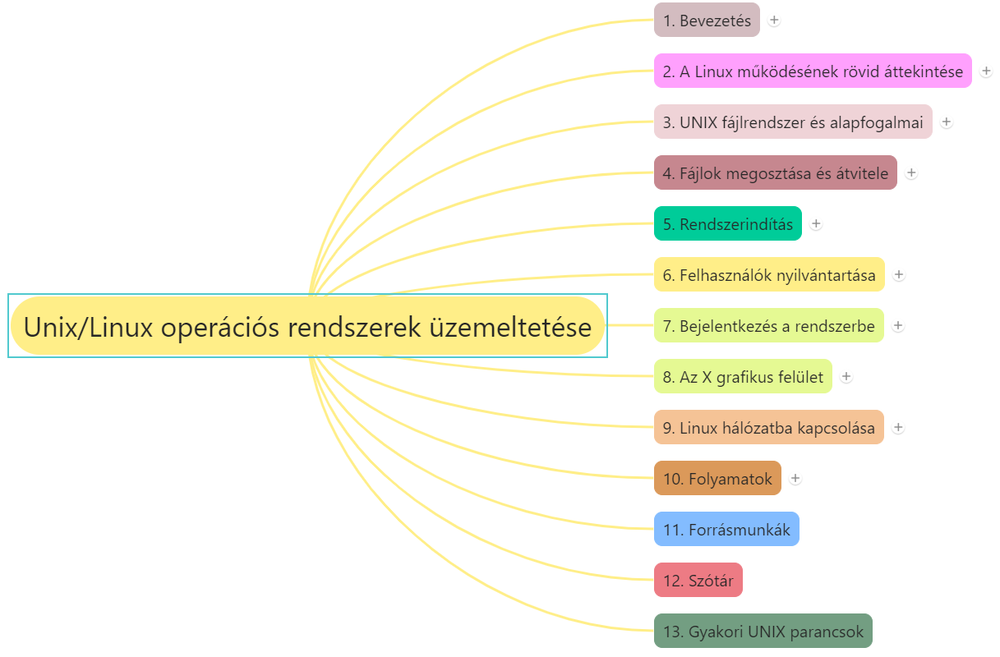
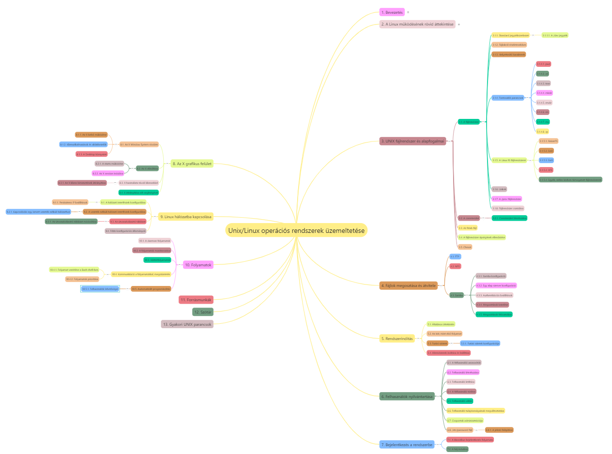

# Dr. Mileff Péter: UNIX/Linux operációs rendszer üzemeltetése (2022) [^1]

## Tartalomjegyzék, linkek

---

## Fejezetek

1. [Bevezetés](1.md)
2. [A Linux működésének rövid áttekintése](2.md)
3. [UNIX fájlrendszer és alapfogalmai](3.md)
4. [A fájlok megosztása és átvitele](4.md)
5. [Rendszerindítás](5.md)
6. [Felhasználók nyilvántartása](6.md)
7. [Bejelentkezés a rendszerbe](7.md)
8. [Az X grafikus felület](8.md)
9. [Linux hálózatba kapcsolása](9.md)
10. [Folyamatok](10.md)

[Könyv elérhetősége: ME oldalán](https://users.iit.uni-miskolc.hu/~mileff/linux/Unix_Linux_rendszergazda_v0.95.pdf)

---

## Jegyzetek

* ~~1.md 1.5 Linux disztribúciók következik~~
* ~~2.md 2.3. A folyamatok ütemezése~~
* 1.md és 2.md lényegkiemelés
* ~~3.md következik~~
* ~~3.1.4. Fontosabb parancsok következik~~
* 3.1.5.2. Ext2 fájlrendszer következik

---
[^1]: Dr. Mileff Péter: UNIX/Linus operációs rendszer üzemeltetése, ME, 2022.