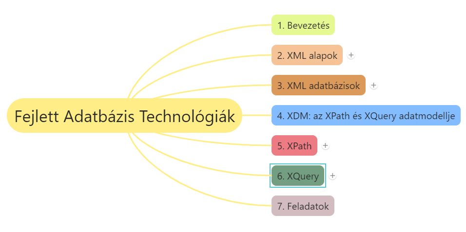
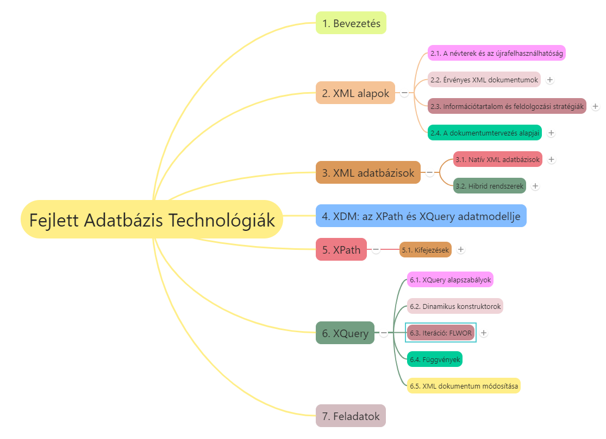
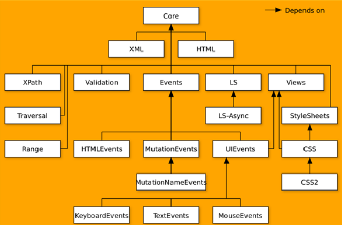
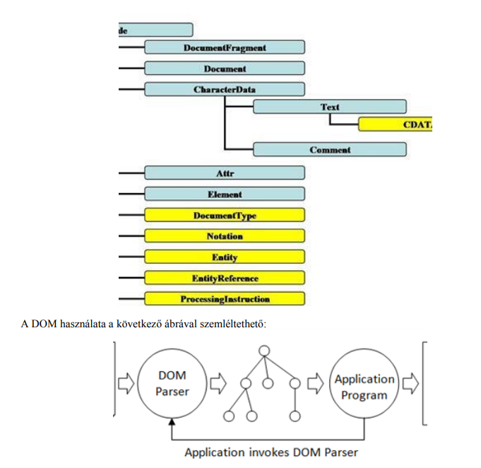
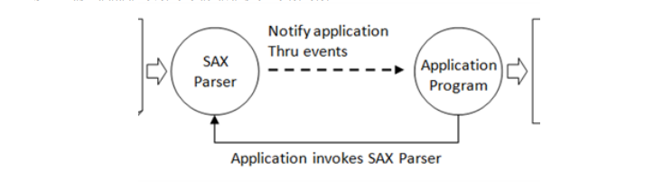

# Dr. Adamkó Attila - Fejlett Adatbázis technológiák





---

1. [Dr. Adamkó Attila - Fejlett Adatbázis technológiák](#dr-adamkó-attila---fejlett-adatbázis-technológiák)
   1. [1. Bevezetés](#1-bevezetés)
   2. [2. XML alapok](#2-xml-alapok)
      1. [2.1. A névterek és az újrafelhasználhatóság](#21-a-névterek-és-az-újrafelhasználhatóság)
      2. [2.2. Érvényes XML dokumentumok](#22-érvényes-xml-dokumentumok)
         1. [2.2.1. XML dialektusok: DTD és XML séma](#221-xml-dialektusok-dtd-és-xml-séma)
            1. [2.2.1.1. Legfontosabb XML Schema elemek](#2211-legfontosabb-xml-schema-elemek)
      3. [2.3. Információtartalom és feldolgozási stratégiák](#23-információtartalom-és-feldolgozási-stratégiák)
         1. [2.3.1. Nyelvfüggetlen feldolgozási stratégiák: DOM és SAX](#231-nyelvfüggetlen-feldolgozási-stratégiák-dom-és-sax)
      4. [2.4. A dokumentumtervezés alapjai](#24-a-dokumentumtervezés-alapjai)
         1. [2.4.1. Leíró- és adat-orientált dokumentum struktúrák](#241-leíró--és-adat-orientált-dokumentum-struktúrák)
      5. [4.2. Építőelemek: attribútumok, elemek és karakteradatok](#42-építőelemek-attribútumok-elemek-és-karakteradatok)
         1. [4.2.1. Az elemek és attribútumok jellemzőinek különbsége](#421-az-elemek-és-attribútumok-jellemzőinek-különbsége)
            1. [4.2.1.1. Az elemek idő és helyigényesebbek mint az attribútumok](#4211-az-elemek-idő-és-helyigényesebbek-mint-az-attribútumok)
            2. [4.2.1.2. Az elemek rugalmasabbak mint az attribútumok](#4212-az-elemek-rugalmasabbak-mint-az-attribútumok)
            3. [4.2.1.3. Karakteradatok vs. attribútumok](#4213-karakteradatok-vs-attribútumok)
         2. [4.2.2. Elemek azonosítójaként használjunk attribútumokat](#422-elemek-azonosítójaként-használjunk-attribútumokat)
         3. [4.2.3. Kerüljük az attribútumok használatát olyan dokumentumoknál, ahol a sorrend fontos](#423-kerüljük-az-attribútumok-használatát-olyan-dokumentumoknál-ahol-a-sorrend-fontos)
      6. [4.3. Buktatók](#43-buktatók)
   3. [3. XML adatbázisok](#3-xml-adatbázisok)
   4. [4. XDM: az XPath és XQuery adatmodellje](#4-xdm-az-xpath-és-xquery-adatmodellje)
   5. [5. XPath](#5-xpath)
   6. [6. XQuery](#6-xquery)


[Könyv elérhetősége](https://gyires.inf.unideb.hu/GyBITT/12/)

---

## 1. Bevezetés


* XML nyelv és technológiák befogadása
* 1999 Tim Berners Lee - a WWW kidolgozója - Szemantikus Web program -> XML nyelv általános elterjedése -> XML dokumentumokra épülő adatbázisok
* XML adatbázisokat kezelő rendszerek alapvetően nem, vagy nem tipikusan XML struktúrákban tárolják az adatokat (felesleges terjengősség -> helypazarlás elkerülése)
* XML dokumentumok lekérdezésére -> W3C konzorcium ajánlásaként -> XQuery és XPath lekérdezőnyelv (2.0-s változatuktól közös adatmodellen alapulnak)
* Ma nem a felhasználók, hanem szoftverek (B2B) állítanak elő és dolgoznak fel automatikusan üzeneteket/lekérdezéseket ->
  * XML jól illeszkedik adatcsere eszközeként
  * jobb mint SQL alapú rendszerek
* Komplex módszerek XML dokumentumok tárolására, (erről nem szól a jegyzet)
* XML dokumentum szerkezeti kialakítása és az egyes megközelítések előnyének és hátrányának áttekintése
* Validálás szabványos technológiákkal

## 2. XML alapok

1. XML célkitűzései:
  * legyen egyszerűen használható a (webes)rendszerekben,
  * az alkalmazások széles körét támogassa,
  * legyen kompatibilis az SGML-el,
  * legyen egyszerű XML dokumentumokat feldolgozó programokat írni,
  * ember által is olvasható, világos szerkezetű dokumentumok legyenek,
  * legyen egyszerű XML dokumentumokat készíteni.
2. HTML és XML -> óriási különbségek
  * A HTML:
    * megjelenítésre koncentráló
    * nem bővíthető jelölésrendszer
    * laza (nem szabványos) szintaxiskezeléssel.
  * Az XML:
    * szigorú szintaktikai ellenőrzéssel rendelkezik,
    * bővíthető,
    * tartalom-orientált jelölésrendszer
* XML tágabban:
  * dokumentum formátum
  * metanyelv -> nyelvek definiálása
    * címkekészlet és struktúra (szókincs és nyelvtan) -> DTD és XML Schema
  * szabványcsalád -> több szervezet által is jegyzett alapszabványok
  * technológia -> sokféle alkalmazási terület
    * webes megjelenés
    * adatcsere - e-Business
    * szövegek reprezentációja és feldolgozása
    * szövegszerkesztők dokumentumformátuma (OpenOffice, MS Office)
    * web 2.0
    * technikai dokumentációk nyelvezete
    * szoftverek konfigurálása (ant, maven)
    * felhasználói interfészek definiálása (XUL)
    * EU önéletrajzok készítese (Europass) stb.
* XML lehetőségek:
  * szöveges formátum -> megjelenítés
  * strukturált -> tartalom, információelérés, adatcsere -> gépi úton is feldolgozhatók

### 2.1. A névterek és az újrafelhasználhatóság

* Újrafelhasználhatóság -> névterek
  * névütközések elkerülése különböző alkalmazások XML dokumentumainak keveredésekor
  * névtér = szintaktikai mechanizmus, egy adott név különböző környezetekben történő felhasználásának megkülönböztetésére 
  * A névtér minősített nevek végtelen halmaza

```
< névtérnév , lokális név >
```

* xmlns (XML Namespace) attribútum társítja a használni kívánt névteret a megadotthoz -> továbbiakban prefixként használva érhetők el a névtérben definiált elemek
* alapértelmezett névtér használata nélkülözhetővé teszi a prefixek használatát, de:
  * megnehezíti a keresést, hogy az elem melyik névtérbe tartozik
  * alapértelmezett névtér használata esetén a névtér csak az elemekre kerül alkalmazásra, az attribútumokra nem.
* alapértelmezett névtér törlése: például ->

```
<person xmlns:account="">
```

### 2.2. Érvényes XML dokumentumok

* **Jól-formázott** XML dokumentumok, amelyek logikai tartalma és felépítése teljesen megegyezik:
  * DTD-vel
  * XML Schemával
  * Relax NG segítségével
* Sémanyelvek célja a **validálás** -> XML-feldolgozó végzi és ellenőrzi
* A sémanyelvek **eszközrendszert** biztosítanak:
  * a dokumentumot alkotó elemek azonosítására szolgáló nevek definiálásához
  * annak szabályozására, hogy a dokumentum egyes elemei hol jelenhetnek meg a dokumentumszerkezetben (azaz leírják a dokumentumok modelljét)
  * annak megadására, hogy mely elemek opcionálisak, ill. melyek ismétlődhetnek
  * attribútomokhoz alapértelmezett érték rendelésére stb.
* A sémanyelvek **megóvják az alkalmazásokat** a váratlan/értelmezhetetlen formátumoktól, információktól
* A sémanyelvek egyfajta **osztályozása**
  * Szabályalapú nyelvek – pl. Schematron
  * Nyelvtanalapú nyelvek – pl. DTD, RELAX NG
  * Objektumorientált nyelvek – pl. XML Schema
* **Validálás során** vizsgálat:
  * szerkezet: az elemek, attribútumok szerkezete ( markupok szintjén)
  * tartalom: a szöveges csomópontok és attribútumok tartalma
  * integritás: egyediségvizsgálat , hivatkozások épsége
  * üzleti szabályok: pl. nettó ár - ÁFA% - bruttó ár összefüggés, vagy akár olyan bonyolult dolog is, mint a helyesírás-ellenőrzés

#### 2.2.1. XML dialektusok: DTD és XML séma

##### 2.2.1.1. Legfontosabb XML Schema elemek

### 2.3. Információtartalom és feldolgozási stratégiák

* W3C InfoSet -> jól-formázott XML dokumentumok információtartalmának leírására szolgáló absztrakt adathalmaz ->dokumentum rendelkezik InfoSettel, ha:
  * jól-formált,
  * megfelel a névtér-specifikációnak.
  * Azonban az érvényesség nem követelmény!
* Alapvetően információelemekből áll -> XML dokumentum absztrakt leírása
  * Dokumentum információs elem
  * Element
  * Attribute
  * Character
  * Namespace

```
<?xml version="1.0"?>
<msg:message doc:date="19990421"
 xmlns:doc="http://doc.example.org/namespaces/doc"
 xmlns:msg="http://message.example.org/">Phone home!</msg:message>
 ```

#### 2.3.1. Nyelvfüggetlen feldolgozási stratégiák: DOM és SAX

* A Dokumentum Objektum Modell (Document Object Model / DOM) egy platform- és nyelvfüggetlen standard programozói interfész amely a HTML, XHTML, XML valamint rokon formátumaiknak a szerkezetét és az objektumaikkal történő interakciókat modellezi
* A DOM egymással szülő-gyermek kapcsolatban álló objektumok rendszere
* A dokumentum tartalmát, illetve a dokumentum valamennyi összetevőjét magában foglalja és a módosítás eredménye mindig visszahat böngészők esetén a megjelenített oldalra

***A DOM architektúrája***



* A DOM legfontosabb jellemzői:
  * a dokumentumot logikailag faként ( Node objektumok hierarchiája) kezeli (szerkezeti modell)
  * objektummodell a klasszikus OO értelemben
    * a dokumentumok (és azok egyes részei) azonossággal, struktúrával, viselkedéssel és kapcsolatokkal is rendelkező objektumok
  * a DOM API kétféle lehetőséget biztosít:
    * egy öröklődési hierarchián alapuló OO megközelítést
    * egy egyszerű (kilapított) nézetet ( „ everything is a Node ” )
  * Alkalmas dokumentumok
    * létrehozására, felépítésére
    * szerkezetének bejárására
    * elemek ill. tartalom hozzáadására, módosítására, törlésére
  * modulokból áll (kékkel a DOM Core , sárgával az XML DOM)



* A SAX egy eseményvezérelt értelmező -> 
  * nem hoz létre egy reprezentációs modellt, mint a DOM, melyet aztán tetszőleges módon bejárhatunk, 
  * a dokumentum feldolgozása - mintha csak végig olvasnánk - lineárisan történik
  * dokumentum = adatfolyam -> bizonyos pontokhoz érve különböző események váltódnak ki -> programozó API függvények megfelelő implementálásával reagálhat



* A DOM-mal szemben nincsenek magának az XML dokumentumnak a reprezentálására szolgáló osztályok, ->  
* az értelmező egy interfészen keresztül szolgáltatja a feldolgozás alatt lévő dokumentumban szereplő adatokat az adott program számára függvényhívások segítségével. Alapvetően négy típussal dolgozik:
  * szöveges csomópontok
  * elem csomópontok
  * feldolgozó utasítások
  * megjegyzések
* Ezért a SAX értelmező
  * rendkívül gyors
  * kiváló megmóriagazdálkodású
* hátránya: használata bonyolultabb tervezést és implementálást igényel -> nincsenek előre elkészített eszközeink
* Nagyméretű XML dokumentumok feldolgozására jó -> jelentős sebességnövekedés

A DOM és a SAX gyors összevetése:
* DOM
  * Fa alapú modell (az adatok csomópontokban vannak)
  * Gyors elérés
  * Lehetőség a csomópontok hozzáadására/törlésére
* SAX
  * Markup elérésekor hívódnak meg a metódusok
  * Nagyobb teljesítmény
  * Kevesebb memória
  * Inkább csak a dokumentum végigolvasására, nem módosítására

### 2.4. A dokumentumtervezés alapjai

1. **Leíró és adat-orientált dokumentum szerkezetek**
   * Leíró dokumentumstruktúra -> XML tartalom már létező szöveg alapú kiegészítése
   * Adat-orientált dokumentumszerkezet -> XML tartalom maga a fontos adat
2. **Építő elemek: attriútumok, elemek és karakter adatok**
   * dizájn, olvashatóság, értelmezhetőség
3. **Buktatók**

#### 2.4.1. Leíró- és adat-orientált dokumentum struktúrák

- leíró dokumentumstruktúra: XML tartalmat már létező, szöveg alapú adat kiegészítésére (hasonlóan HTML címkék weboladalakhoz)
- Adat-orientált dokumentumszerkezet: XML tartalom maga a fontos adat (XML jelölő a fontos adat -> XML jelölők jól struktúrált adatok leírására)

***Adat-orientált dokumentumok***

- Általában alkalmazások számára
- A dokumentumokban szereplő adatok segítségével elképzelhetjük, hogy az adatnak egy az egyhez leképezése van az alkalmazásunk jellemzőivel, az XML dokumentumot ezzel az objektumaink szerializált verziójává alakítva. Ez a szerializáció nagyon gyakori az XML-nél, ilyenkor legtöbbször adat-orientált megközelítést használunk.
- .NETnél (18.old)
- JAVA XML csomagban -> JAVA API for XML Binding (JAXB) -> XML dokumentumok Java osztállyá történő oda-vissza leképezése
- Java Bean-ek is XML-re képezhetők
- XML -> folyamatok leírására Apache Ant
- adat-orientált dokumentumok a legjobb választás bármilyen fajta jól struktúrált adat ábrázolására.

***Leíró dokumentumok***

- felhasználói fogyasztásra tervezve -> emberek által olvasható szövegek XML jelölővel bővítve
- a tartalmat nem a jelölő határozza meg
- a jelölő adat nagyon struktúrálatlan
- HTML weboldalak
- **Megjelenítés:** XHTML -> XML jelölő alkalmazása leíró stílusú dokumentumhoz a megjelenés szabályozására
- **Indexelés:** alkalmazások -> hatékony kiemelés XML jelölőt használva -> majd indexelik a dokumentumot (relációs adatbázist vagy teljes szöveges indexelő szoftvert használva)
- **Annotációk:** alkalmazás XML-lel fűzhet annotációt már létező dokumentumokhoz

### 4.2. Építőelemek: attribútumok, elemek és karakteradatok

***Leíró jellegű dokumentumokban***
- A leíró szöveg egy elem tartalmává válik, az információ a szövegről pedig attribútummá.

#### 4.2.1. Az elemek és attribútumok jellemzőinek különbsége

##### 4.2.1.1. Az elemek idő és helyigényesebbek mint az attribútumok

1. A hely kérdése
   - Elemek mindig több helyet igényelnek mint attribútumok (DOM-ban csomópont összes elemét létre kell hoznia)
2. A feldolgozási idő kérdése
   - Elemek időben is igényesebbek mint az attribútumok (DOM-ban nem dolgozzák fel addig attribútumokat, ameddig nem találkoznak velük)

##### 4.2.1.2. Az elemek rugalmasabbak mint az attribútumok

- Attribútumok limitáltak adat megjelenítésben
- Elemek kimondottan alkalmasak struktúrált adatok befogadására
- struktúrált adat egy attribútumban -> sztring értelmezéséhez nekünk kell kódot írni. pl. dátum attribútumként tárolása -> nagyobb sztring tárolható karakteradatként

##### 4.2.1.3. Karakteradatok vs. attribútumok

- Megfontolandó karakteres adat használata:
  - adat nagyon hosszú
  - nagy számú levédett (escapelt) XML karakter van
    - Használható CDATA szekció
  - adat rövid, de teljesítmény fontos, és SAX-ot használunk
- Megfontolandó attribútum használata
  - adat rövid és struktúrálatlan
  - SAX-ot használva a feldolgozó kódot egyszerűnek akarjuk látni

#### 4.2.2. Elemek azonosítójaként használjunk attribútumokat

#### 4.2.3. Kerüljük az attribútumok használatát olyan dokumentumoknál, ahol a sorrend fontos

- attribútumoknál nincsen kötött sorrend

### 4.3. Buktatók

1. Kerüljük a speciális platformra vagy feldolgozó implementációra való tervezést
  - Jól tervezettnek kell lennie, miután megjelent és írott kódok készültek a szerkezetre, a változtatás majdnem tiltott
  - nem jó dokumentumszerkezetet valamilyen feldolgozó verziójához készíteni
  - A dokumentum struktúrája csak egy szerződés, semmi több, nem interfész és nem implementáció -> értenünk kell dokumentumok használatát, amihez tervezünk
  - Ha dokumentumaink nem kizárólag csak a mi alkalmazásunknak készül, mindenképp győződjünk meg arról, hogy úgy tervezzünk a dokumentum szerkezetét, hogy véletlenül se függjön semmilyen platformspecifikus, vagy feldolgozó implementáció specifikus jellemzőtől.
2. Az alapul szolgáló adatmodell többnyire nem a legjobb választás az XML-hez
  - a legtöbb perzisztens tároló mechanizmus, mint például a relációs adatbáziskezelők, az egyszerű fájlok, az objektum adatbázisok vagy bármi hasonló nem az XML figyelembevételével és annak szerkezetét szem előtt volt tervezve
  - Relációs adatbázisokat használni hierarchikus adatokra általában azt jelenti, hogy van egy adattábla, amely a „szülőt” jelöli a hierarchikus kapcsolatban, és külön egy tábla (vagy táblák) a „gyerekeket” reprezentálva a kapcsolatrendszerben
  - szükségtelen komplikációkat és plusz munkát adna a feldolgozási folyamathoz, mert nem használja az XML egyik legnagyszerűbb jellemzőjét: annak a tudását, hogy hierarchikus adatokat ábrázoljon.
  - A legfontosabb dolog, amit szem előtt kell tartanunk amikor a dokumentumunk szerkezetét tervezzük, hogy arra az absztrakt modellre épüljön, amely leginkább leírja azt, amit kódolni szeretnénk. Véletlenül se a modell valamilyen más technológiában (Java, C++, ...) készült implementációjára
3. Kerüljük a dokumentumok túltelítését
  - bár a lemezen a hely olcsó, mégsem ajánlatos pazarolni,
  - minden egyes bitje a dokumentumnak át fog folyni egy XML feldolgozón, tehát minél hosszabb a dokumentum, annál tovább tart ez a folyamat,
  - ha a dokumentumot kommunikációs eszközként fogják használni, mint például egy SOAP dokumentumot egy XML-alapú webszolgáltatáshoz, az egészet ki kell majd küldeni a hálózatra.
  - Gyakran célravezető, ha a ténylegesen a dokumentumba kerülő adatokat kielemezzük annak érdekében, hogy elkerüljük a fölösleges bitek szaporítását
4. Kerüljük a hivatkozásokkal túlterhelt dokumentum struktúrák használatát
  - Az egyik legfájdalmasabb pont egy XML feldolgozó kód írásánál, ha a feldolgozandó dokumentum szerkezet nagyon sűrűn használ referenciákat

***Összegezve az alábbi kérdésekre kell választ találnunk:*** 
- Elem vagy attribútum? 
  - Gyakori adatváltoztatás 
  - Kis, egyszerű adat, ritka módosítással 
- Hierarchia vagy hivatkozás? 
  - Alstruktúra tartalmazása 
  - Több sor tartalmazása
  - Többszörös előfordulás 
- Stilisztikai választások 
  - Olvashatóság 
  - Készítő / feldolgozó szempontok 

Saját XML alkalmazás tervezése esetén az adatszervezést a következő lépések mentén tegyük: 
1. Elemek meghatározása 
2. Kulcsfontosságú elemek megkeresése 
3. Elemek kapcsolatának feltérképezése

## 3. XML adatbázisok

## 4. XDM: az XPath és XQuery adatmodellje

## 5. XPath

## 6. XQuery