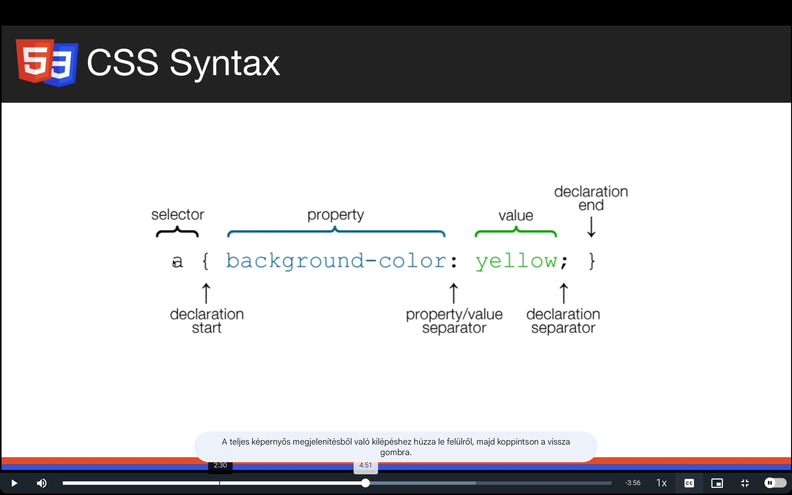

# CSS Basics témakör jegyzetei

## 1. Section intro

---

## 2. Implementing CSS

* Comment: `/* ... */`
* Implementálás:
  * Inline CSS -> tagen belül
  * Internal CSS -> `<head>` tagen belül `` tagen belül
  * Esternal CSS -> külön CSS fájlból hivatkozva -> `<head> </head>` tagek között -> `<link rel="stylesheet" href="src/style.css">`

---

## 3. Basic CSS Selectors

---