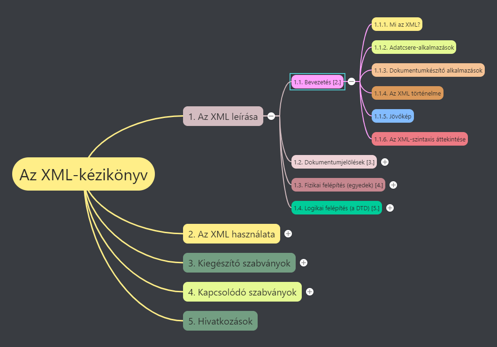
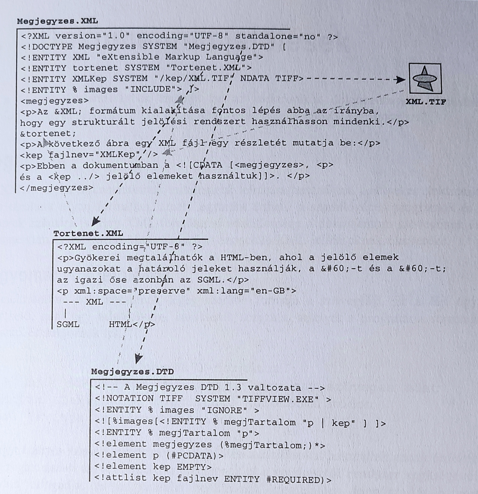
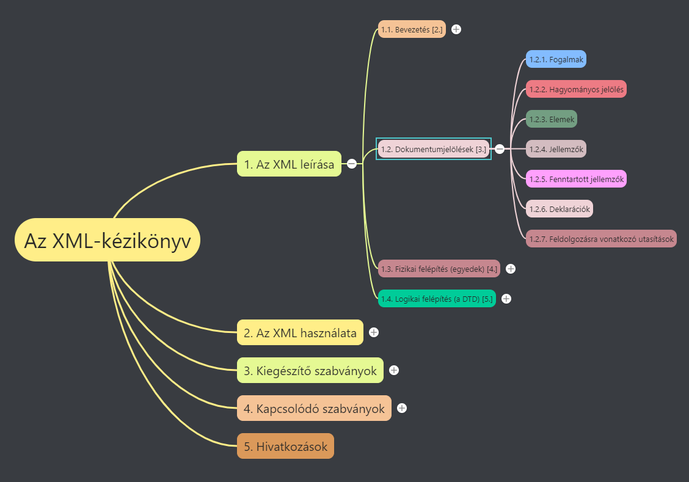
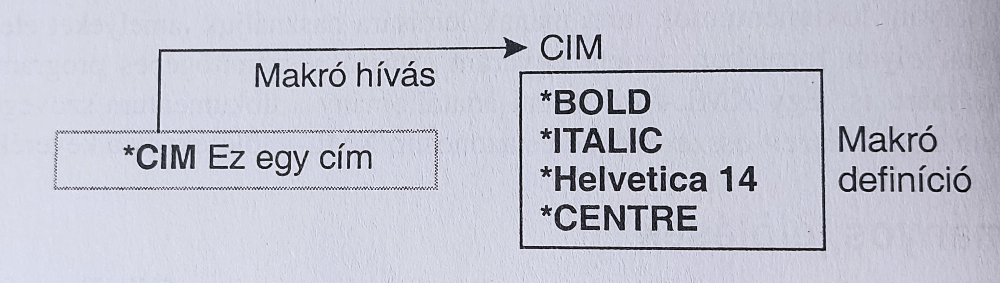
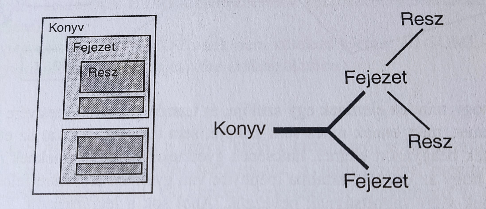
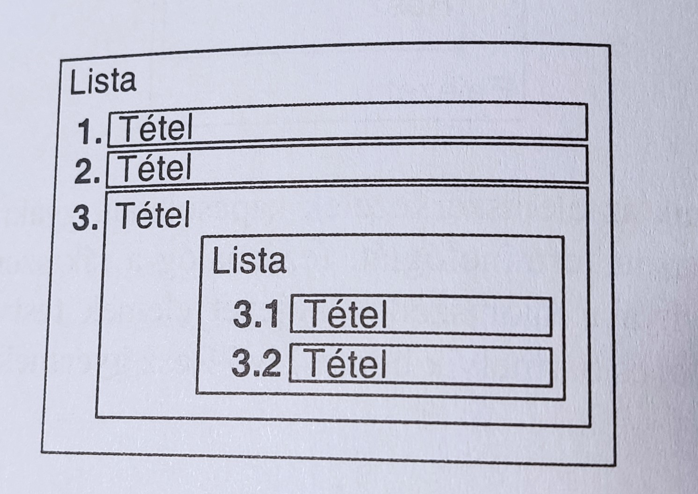
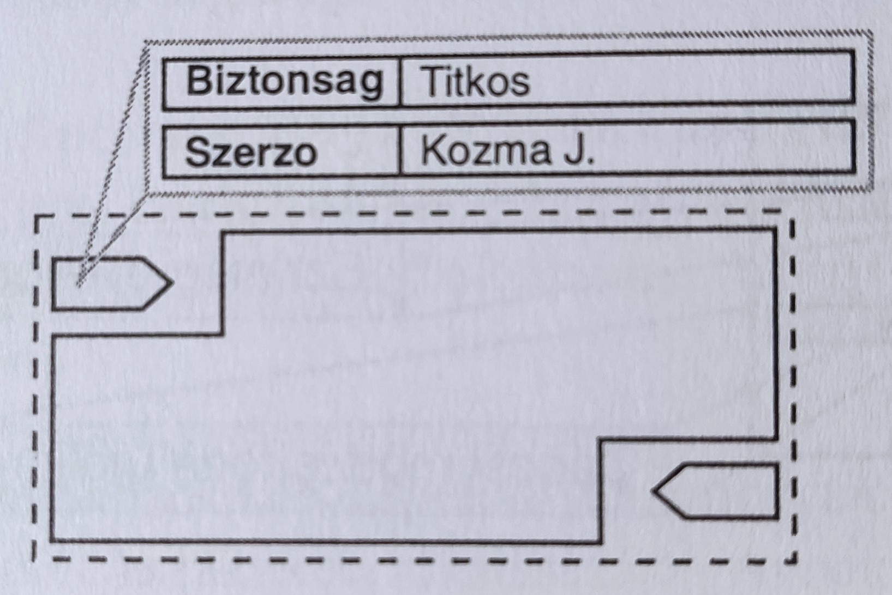
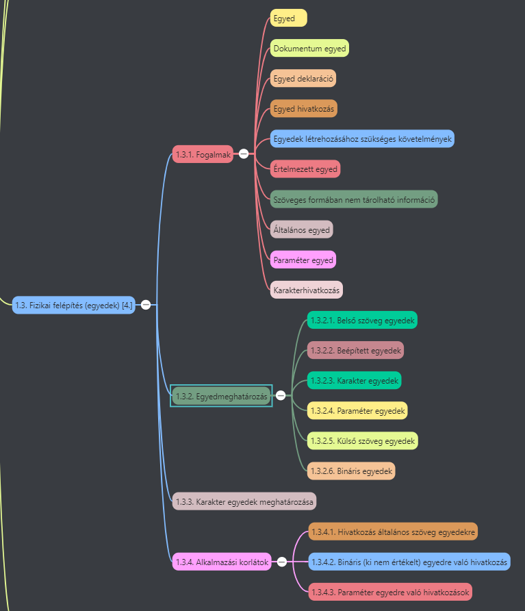

# 1. Az XML leírása [2.]

## 1.1. Bevezetés



Az XML célját és alkalmazási területét mutatja be, a hozzá tartozó szabványokkal együtt.

### 1.1.1. Mi az XML?

* **XML (Extensible Markup Language - Kiterjesztett Jelölő Nyelv)**
* **W3C (World Wide Web Consortium)** fejlesztette ki
* *Ideális adatformátum a különböző médiákon terjesztett, közvetlenül megjelenített struktúrált vagy félig struktúrált szöveg* számára
* **Speciális utasítások**, **jelölő elemek** -> dokumentum egy azonosítható részét határolják
* **Önleíró** -> kliens program tudja értelmezni a kapott adatokat -> kapott feladatok végrehajtása
* **SMIL (Synchronized Multimedia Integration Language - Szinkronizált Multimédia Integrációs Nyelv)**:
  * XML-t alkalmazó szabvány -> szöveg, hang, mozgókép részletet tartalmazó fájlok kezelése
* XML alapú dokumentum
  * **logikai szerkezet:**
    * A dokumentum nevet viselő egységekre, alegységekre bontása -> **elemek**
    * Meg kell felenie megkötéseknek -> **értelmező** segítségével ellenőrizhető -> észlelt hibákat jelzi
    * Több egyedet tartalmazó dokumentum felépítése -> **egyedkezelővel**
    * Mindkettőre alkalmas -> **XML feldolgozó**
  * **fizikai szerkezet:**
    * Dokumentum részei - **egyedek** elnevezése,
    * Külön tárolása olyan **adatállományokban**, ahonnan az *információ újra kinyerhető* ->
    * Nem XML típusú adatokkal (pl. képekkel) *bővíthető*
  * XML **köztes nyelv** -> olyan nyelv, amely más nyelvek leírását tartalmazza.
    * *Nincs előre definiált elemlista* -> alkalmazásnak megfelelő beszédes elemnevek használhatók
  * **DTD (Document Type Definition - Dokumentumtípus meghatározás)**:
    * Meghatározhatók vele egy *adott dokumentumtípusban felhasználható elemek*
    * **Érvényességértelmező:** DTD-ben rögzített szabályokat veti össze az adott dokumentummal
  * XML dokumentumok tetszőleges szövegszerkesztőkkel készíthetők, de vannak *XML érzékeny szövegszerkesztők* -> képesek olvasni DTD-t
  * XML-ben objektum viselkedését leíró elemnevet érdemes használni -> **általánosított jelölés** -> önleíró információ
    * Minden elemhez egy, az elemet leíró stíluslapot kell megadni.
  * **Hypertext kapcsolódások hivatkozásokkal**

### 1.1.2. Adatcsere-alkalmazások

* XML használható relációs adatbázisok adatainak mozgatására
  * **Egy-a-többhöz kapcsolat**: adatokat több táblázatból szedjük össze -> XML struktúrált, de ismételhető elemei
* **EDI (Electronic Data Interchange - Elektronikus Adatcsere)**
  * Dinamikus információszolgáltató technológia -> Microsoft CDF -> XML megvalósítás
* Java képes olvasni az XML adatokat és arra érzékenyen reagálni Java program felhasználója által kért műveletekre
* XML értelmezés -> SAX-, DOM-kapcsolószabványokon keresztül

### 1.1.3. Dokumentumkészítő alkalmazások

* **XML ideális adatleíró nyelv:**
  * Részben struktúrált dokumentumoknak -> referenciamunkák, oktatási anyagok, műszaki kézikönyvek, katalógusok, akadémiai folyóiratok, stb.
  * Alkalmas szabványok, vizsgák, pénzügyi jelentések, kutatói beszámolók jelölésére
  * Mobiltelefonok adatmegjelenítésében
* XML-ben egyszerű a **köztes adatok** generálása és kezelése is (köztes adat: információ az információról, pl. tartalomjegyzék, dátum -> egyik sem része a mű szövegének, csak háttérinformáció)
  * XML képes külön tárolni köztes adatot, hogy nem jelenik meg
  * Program segítségével is generálható, automatikusan (pl. szövegtörzs alapján tartalomjegyzék)
* Hypertextkapcsolatokat létrehozó (XLink és XPointer) és dokumentumformázó (XSL és XSLT) szabványos eljárások -> XPath szabványnak felelnek meg
* Egyéb szabványok kezelése: HTTP, CSS, stb.

### 1.1.4. Az XML történelme

* A HTML és SGML elvei és szabályai alapján információtárolási, -feldolgozási, és -megjelenítési rendszer.
* HTML -> nem kiegészíthető saját nyelvi elemekkel -> 
* W3C 1998. -> XML1.0

### 1.1.5. Jövőkép

* Nem túl aktuális, a könyv 2000-ben lett kiadva

### 1.1.6. Az XML-szintaxis áttekintése



---

## 1.2. Dokumentumjelölések [3.]



### 1.2.1. Fogalmak

* XML-t elektronikus úton tárolt dokumentumok tartalmának leírására használjuk -> olvasható számítógépes programok és emberek számára
* XML adatállomány:
  * **dokumentum szövege**
  * (dokumentum részeit összerendező és azonosító) **XML-jelölések keveréke**

### 1.2.2. Hagyományos jelölések

* Szövegfájl: adatfolyam, karakterek sorozata -> programok sorrendben dolgozzák fel adatokat
* Hagyományos szedési rendszerekben jelölési utasítások -> szerkesztői rendszer -> utasítás vagy jelölőelem, ami nem jelenik meg a szövegben
* Nyomtatásban oldaltördelés
* Modern szövegszerkesztők -> **WYSIWYG (What you see is what you get)** -> jelölőkódok elrejtése
* Legtöbb szövegformázó nyelv -> jelölőelemek listája, előre megadott feladattal
* Makró koncepció -> makró definícióval utasítások csoportjainak külön nevet adunk, mintha utasítás lenne -> erre makróhívással hivatkozunk ->



* általános célú kódolás -> makró neve funkcióra vonatkozik, nem a szöveg stílusára
* Hasonló a stílusalap definíciós lehetőséghez

### 1.2.3. Elemek

* XML jelölőelemek rendszere a makró alapú szövegformázó nyelvek alapjaira épül
* XML-elemek általában közrefogják az azonosítandó objektumot a benne lévő adattal -> Jelölőelem nyitó része + jelölő elem záró része + benne lévő adat = elemi egység
* Adatfájl általában: jelölőelemeket Hagyományos formázó elemekhez rendeljük hozzá
* XML elemeknél lehetnek további beágyazott elemek
* Az egész dokumentumot egyetlen dokumentumelembe kell zárni -> keretben lévő keretek (mint matrjoska babák) vagy faszerkezet



* Minden elemet teljesen be kell zárniuk más elemeknek, egy rész nem tartozhat két fejezethez
* Családfa terminológia: szülő, testvérek, gyermek -> elem, melynek nincsen gyermeke: lezárt elem
* **Rekurzív szerkezeti megoldások** -> egy elem direkt vagy indirekt módon tartalmazhat önmagával azonos típusú elemeket is -> beágyazott elemek



* A hierarchikus és rekurzív szerkezeti megoldásokkal szövegformázás szövegkörnyezettől függetlenül -> minden szövegkörnyezethez definiálhatunk különböző elemeket
* **DTD (Document Type Definition):** tartalmazza az egy dokumentumosztályon belüli minden egyes megengedett elemre vonatkozó szabályokat
* HTML -> DTD nem szükséges HTML-dokumentumokhoz, létezik azonban DTD a HTML-hez -> szabványt írják le
* SGML: DTD XML-nek nem kötelező eleme

### 1.2.4. Jellemzők

**Metaadat:** Információ az információról, jellemzőkben tároljuk -> egy elem több jellemzőt is tartalmazhat -> minden jellemzőnek egyedi név kell
* Ábrán jellemzők: Biztonság, Szerző



* Ha nem használunk DTD-t, a jellemző értékét egyszerűen szövegrésznek tekinti az értelmező
* Ha használunk DTD-t, az egyes jellemzőkben használható értéktartomnányokat mi határozhatjuk meg -> minden jellemző a DTD egy eleméhez tartozik, **jellemzőtípust** rendelünk hozzá ->
* Karakteres adat -> általános karaktereket tartalmaz
* Névtoken jellemző -> csak egyetlen szót tartalmazhat -> nem engedélyez beágyazott szóközöket
* Névtoken lehet -> felsorolásjellemzőben megadott szócsoport (listában megadott szöveges jellemzőértékek közül választhatunk)
* DTD -> meghatározhatja jellemző alapértelmezett értékét is
* DTD speciális szerepet is adhat -> hypertextkapcsolat részeként
* Néhány jellemzőt előre lefoglalt az XML-szabvány -> nevük 'xml:'-lel kezdődik (pl. 'xml: lang' -> tartalom elemben emberi nyelvről információ)

#### 1.2.4.1. Speciális utasítások

* XML-dokumentum XML feldolgozó számára is tartalmazhat utasításokat -> jelölésdeklarációban szerepel

```
<!DOCTYPE SajatKonyv SYSTEM "SajatKonyv.DTD">
```

**Megjegyzések XML-dokumentumokhoz:** 
* Soha sem része a dokumentum szövegének, nem jelenik meg az outputban
* DTD-ben is, felhasznált szabályok szervezésében és dokumentálásában

**Szövegblokkot karakteres adatként** is használhatunk -> 
* nincsenek jelölő elemek

**Feldolgozási utasítások:** feldolgozó alkalmazás használja
* Az XML dokumentum elején (dokumentumtípus deklarációja előtt) szerpelnie kell egy feldolgozó utasításnak, mely megadja:
  * A felhasznált XML típusverzióját,
  * Meghatározza karakterkészletét
  * Jelzi kell-e DTD
   ||
***XML-deklaráció***

```
<?XML version="1.0" encoding="UTF-8" standalone="YES" ?>
```

#### 1.2.4.2. Hagyományos jelölés

* Egyszerű formázási kódok:
  * kocsi-vissza (CR)
  * soremelés (LF)
* Jelöléshatároló karakter: meghatározza a szövegadatba beágyazott utasítás elejét és néha végét is
* Vezérlőkód (Escape code): olyan karakterek helyettesítésére, amelyeket másként nehezen, vagy egyáltalán nem lehetne megjeleníteni
* Keretezés: kikapcsolás jelölésére -> HTML ezt alkalmazza, jelöli a stílus végét

#### 1.2.4.3. Elemek

* XML-jelölőelemek közrefogják az azonosított objektumot az adatfolyamban
  * nyitó-tag -> <> +
  * záró-tag </> = 
  * elem

```
Elmész a <nev>COMDEX</nev> kiállításra?
```

* Elemek:
  * neve érzékeny kis- és nagybetűkre nev != NEV
  * nyitó-tagben lévő elemnévnek meg kell egyeznie záró-tagben lévővel
  * Minden elemet teljes egészében be kell zárni más elemekbe -> kivéve minden más elem ősét
  * Egy elemben direkt vagy indirekt módon önmaga is előfordulhat -> beágyazások szintjének nincs elméleti határa
  * < és > karakterek határolóként ->
    * Vezérlőkarakterek:
```
'&lt;' = <
'&gt;' = >
```
* ```<p>``` jelölőelem -> új bekezdés

#### 1.2.4.4. Tartalomtípusok

* Számos elemben egyszerre gyermek elemek és szövegek -> hordozó elemek
* **Gyermekelemek:** olyan elemek, amelyekben közvetlenül nincs szöveg, de más elemeket tartalmaznak

```
<resz>
  <p>...</p>
  <p>...</p>
  <lista>...</lista>
</resz>
```

* **Vegyes tartalmú elemek:** Olyan elemek, amelyek keverten tartalmaznak szöveget és gyerek elemeket.

```
<p>Ebben a bekezdésben szerepel egy <em>kiemelt kifejezés</em> a közepén</lista>
```

* **Tartalom nélküli elemek:** amelyeknek nincs tartalmuk
* **Üres elemek:** nem tartalmazhatnak adatokat

#### 1.2.4.5. Áthúzódó szerkezetek

* Üres elemekkel lehet megadni olyan szövegblokkot, amely a szerkezetben áthúzódik egyik elemből a másikba

#### 1.2.4.6. Jellemzők

* Egy jellemző részletesebb információt ad egy elemről -> elem nyitó részébe ágyazva
  * Jellemző neve
  * Jellemző értéke -> idézőjelek között -> lehet benne szóköz
  * Köztük egyenlőségjel
  * Mindkettő érzékény kis- és nagybetűkre

```
<tema kulcsszo="XML SGML" id="x123">
<cim>Általánosított jelölés</cim>
...
</fejresz>
```

  * Idézőjel helyett használható aposztróf is ''
  * Ha mindkettő foglalt vezérlőjeles karakter: ```'&quot;'```

### 1.2.5. Fenntartott jellemzők

* Két fenntartott jellemző:
  * 'xml:space'
  * 'xml:lang

#### 1.2.5.1. nyelvek

***'xml:lang'***
* A nyelv és néha az országra vonatkozó részletek tárolására használható
* Értéke egy egyszerű token vagy kód -> leírásuk RFC 1766-ban
* Tartalom lehet kétbetűs országkód -> megfelel ISO 639 leírásnak

```
<bekezd xml:lang="en">This is English text</bekezd>
```

* Tartalom lehet felhasználó által definiált kód is -> x-szel kell kezdődnie (pl. 'x-cardassiai')
* Lehet **IANA (Internet Assigned Numbers Authority - Hozzárendelt Internet Kódok Felügyelete)** által regisztrált kód -> i-vel (vagy I-vel) kell kezdődnie (pl. 'i-yi' -> jiddish)
* Alkódok kötőjellel elválasztva

```
<utasitas xml:lang="en-GB">
Take the lift to floor 3.</utasitas>
<utasitas xml:lang="en-US">
Take the elevator to floor 3.</utasitas>
```

* Érzékeny kis- és nagybetűkre

#### 1.2.5.2. Fontos térközök

* XML-dokumentumban használhatunk térköz karaktereket, sorvége kódot, tabulátorokat -> jelölőkódok értelmezését könnyítik -> *nem befolyásolják a dokumentum végső formáját.*
* ***xml:space*** jellemző használatával alapvető kezelési mód felülbírálható -> **nem valódi térközként** kezeltből lehet **valódi térközre** váltani

### 1.2.6. Deklarációk

* XML-dokumentumban XML-feldolgozó programnak szóló utasítások -> jelölőelemek deklarációja részben
* Szabályos utasítások:
  * Egyedek definíciója
  * Megyjegyzések és Karakteradat részek
  * Alapvető DTD szerkezeti elemek

```
<!...>
```

  * Számos deklarációcsoportba foglalható -> alsóbb elemek szögletes zárójellel elválasztva
* Speciális deklaráció típus:
  * kulcsszó használata -> deklaráció elején, bevezető szóközök nélkül

```
<!DOCTYPE ... >
<!-- ... -->
<![CDATA[ ... ]]>

<!ENTITY ... >
<!NOTATION ... >
<!ELEMENT ... >
<!ATTLIST ... >
<![IGNORE[ ... ]]>
<![INCLUDE[ ... ]]>
```

#### 1.2.6.1. Dokumentumtípus-deklaráció

Dokumentum elején kell megjelennie, ha használjuk

```
<!DOCTYPE SajatKonyv [
  ....
]>
```

#### 1.2.6.2. Megjegyzések

* A megjegyzés deklaráció segítségével kiegészítő információ fűzhető az XML-dokumentumhoz -> dokumentum szövegének soha sem része, nem jelenik meg a szerkesztett szövegben
* Nem jelenhet meg két kötőjel

```
<!-- Ez egy megjegyzes -->
<!-- Ez egy -- ÉRVÉNYTELEN -- megjegyzes -->
```

#### 1.2.6.3. Karakteradatrészek-egyedek

* Ha olyan karaktereket kell használni, amelyek megzavarnák a jelölőelemeket, pl '<' vagy '&' -> egyedhivatkozás pl. ```&lt;``` vagy ```&amp;``` ->
* Ha túl sok ilyen, olvashatatlan a szöveg ->
* **Karakteradatként** deklarálhatjuk

```
<![CDATA[Nyomja meg az <<<ENTER>>> gombot.]]>
```

### 1.2.7. Feldolgozásra vonatkozó utasítások

* XML-adatot feldolgozó alkalmazás számára szükségesek

```
<? ... ?>
```

* A tartalom az adott alkamazásra jellemző kulcsszóval kezdődik, + szóköz + utasítás
* Használható:
  * Információt nyújtsunk egy XML-dokumentumról
  * Azonosítsuk a formázásra használt stíluslapot

#### 1.2.7.1. XML deklaráció

* Speciális jelölőelem minden XML-dokumentum elején
  1. Használt XML verziója
     * version
  2. Felhasznált karakterkészlet neve
     * encoding: milyen kódolási rendszer
     * alapértelmezett: UTF-8
  3. Fontos-e az egyébként kívül definiált jelölések deklarációja a dokumentum tartalmának értelmezéséhez
     * standalone
     * elhagyható
     * külsőleg definiált deklarációs készlet hatással van-e a dokumentum tartalmának értelmezésére

```
<?xml version="1.0" encoding="UTF-8" standalone="YES" ?>
```

* xml-nél nagy betűket nem használhatunk
* Neve ellenére nem a jelölőelemek deklarációjánál szerepel, hanem a feldolgozó utasítások között!

---

## 1.3. Fizikai felépítés (egyedek) [4.]



* Egy XML dokumentum tartalma több adatfájlra is szétbontható -> újrafelhasználhatók ugyanabban vagy másik dokumentumban
* Beilleszthetők nem XML típusú adatok is.

### 1.3.1. Fogalmak

***Egyed:***
* Az információ bármely egysége, egyértelmű azonosítás miatt külön névvel.
* Külön tárolható
* **Dokumentum egyed:**
  * Az egyetlen olyan egyed, amelyhez nem rendelünk nevet ->
  * adatfájl, egész dokumentumot képviseli
  * felhasználó ezt választja ki vagy adja át az értelmezőprogramnak azzal a fájlnévvel, amelyben az adatok megtalálhatók
  * lehet ez az egyetlen egyed
  * lehet keret, mellyel meghatározzuk más egyedek tartalmának helyét
* **Egyed deklaráció:** 
  * dokumentumegyed elején
  * deklarálja egy egyed meglétét, nevet ad neki
  * közvetlenül hordozza az egyed tartalmát vagy fájlra mutat
* **Egyedhivatkozás:**
  * kívánt egyed azonosítása
  * dokumentum egyeddel indulva hierarchikus szerkezet építhető fel
  * egyed nem hivatkozhat önmagára
* Indokolt egyedek haszálata:
  * ugyanazta az információt több helyen használjuk
  * infót egymással nem kompatibilis rendszerek másként jelenítenék meg
  * info nagy dokumentum része -> jobb kezelhetőség érdekében részekre osztani
  * info XML-ben van

***Egyedek létrehozásához szükséges követelmények:***
1. Megkülönböztetni XML és nem XML típusú adatformákat
2. Egyedek tárolhatók:
   * fő dokumentumban -> **belső egyed**
   * külön fájlban -> **külső egyed**
   * lehetséges egyed kombinációk:
     * **belső szöveg egyed**
       * tetszőleges kifejezés vagy szövegrész előre definiálása
     * **külső szöveg egyed**
       * fájl mérete nem korlátozott
       * tartalom elkülönítve egyszerűbben szerkeszthető
       * egyedre minden dokumentumból hivatkozni lehet
       * használhatjuk belső egyedek csoportosítására is, pl. ASCII-ben nem szereplő betűk és jelek (ékezetes karakterek, görög betűk stb.) -> ISO szabványú deklarációk egyedfájlokban
         * ISOnum (jelek)
         * ISOlat1 (ékezetes nyugat-európai betűk)
         * ISOgrk (görög betűk)
         * ISOpub (szövegformázó jelek)
         * ISOtech (műszaki jelek)
     * **(külső) bináris egyed**

**Értelmezett egyed:** 
* külső és belső tárolású, XML adatot tartalazó egyed -> az XML-értelmező képes érvényes dokumentumként felismerni
* helyettesítő szöveget tartalmaz -> adatfolyamban egyed tartalma helyettesíti a rá való hivatkozást

***Szöveges formában nem tárolható információ***
* rajz vagy fotó
* hang vagy mozgókép
* bináris tartalmú külső egyedre hivatkozás -> **bináris egyed**
* külsőként kell definiálni -> XML feldolgozóprogram nem képes a dokumentumba illeszteni
* alkalmazásnak kell kezelnie: XML feldolgozóprogram megadja fájl nevét és helyét, felhasználásának leírását
  * az alkalmazás vagy közvetlenül használja
  * vagy elindít egy másik alkalmazást

Kétféle egyed:
* **általános egyed:**
  * egy dokumentumon belül hivatkozunk rá
  * elérhető a dokumentum szerzői számára
* **paraméter egyed:**
  * csak jelölőelemek deklarációján belül lehet hivatkozni rá
  * csak a DTD tervezők férnek hozzá
* Kettő között kissé **eltérő szintaxis**

Nincs szükség egyeddeklarációra:
* jelölő határoló karakterekkel összekeverhető valós karakterek -> be vannak építve az XML-feldolgozóprogramba
* XML karakterkészletben megtalálható karakterek, amelyek nem érhetők el a billentyűzetről ->
  * **karakterhivatkozás:** bármely karaktert megjeleníthetünk a karakter numerikus ASCII/Unicode-jának használatával

### 1.3.2. Egyedmeghatározás

* Deklarációval -> **dokumentumtípus deklaráció**
* **Egyed (ENTITY)** kulcsóval kell jelölni
* csak angol abc betűi, -, ., _, :, stb.
* kis- és nagybetű érzékeny
* egy egyed 1-nél többször definiálható, az 1. az érvényes
* **egyedhivatkozás:** minden egyedre tetszőleges számban

#### 1.3.2.1. Belső szöveg egyedek

**Belső szöveg egyed** helyettesítő szövege az egyed neve után idézőjelek között  áll (vagy aposztrófok között, ekkor használható az idézőjel is):

```
<!ENTITY XML "eXtensible Markup Language">
```

**Általános szöveg egyedre** való hivatkozás a szövegben ott, ahol arra szükség van
* '&' karakter kezdő határoló + egyed neve + ; -> 

```
Az &XML; formátum egyedeket tartalmaz.
``` 

A helyettesítő szöveg jelenik meg.

#### 1.3.2.2. Beépített egyedek

Minden XML-feldolgozóprogramban beépített egyed deklaráció készlet:

```
&lt; = <
&gt; = >
&amp; = &
&apos; = "
&quot; = '"'
```

* A szövegben helyettesítőkarakter-sorozatokat kell használni '&' karakterek helyett -> félreértés, hivatkozás kezdete is ez
* Idézőjeleket jelölő karakter egyedeket kell használni a belső hivatkozású egyed helyettesítő szövegében, ha idézőjelek mindkét típusa előfordul

```
<!ENTITY pelda "A &quot; és a ' karaktereket használhatja határolóként.">
```

Szövegben:
A " és a ' karaktereket használhatja határolóként.

#### 1.3.2.3. Karakter egyedek

Hivatkozás: '&' + '#' + decimális vagy hexadecimális szám (csak ez előtt &#x) azonosítja a karaktert (ASCII vagy Unicode) [^1]

```
&#60 = <
&#x3C = <
```

#### 1.3.2.4. Paraméter egyedek

#### 1.3.2.5. Külső szöveg egyedek

#### 1.3.2.6. Bináris egyedek

### 1.3.3. Karakter egyedek meghatározása

### 1.3.4 Alkalmazási korlátok

#### 1.3.4.1. Hivatkozás általános szöveg egyedekre

#### 1.3.4.2. Bináris (ki nem értékelt) egyedre való hivatkozás

#### 1.3.4.3. Paraméter egyedre való hivatkozások

---

## 1.4. Logikai felépítés (a DTD) [5.]


---
Lábjegyezetek:

[^1]: ASCII kódok -> táblázat 20. fejezetben (5. Hivatkozások), Unicode kódok 16. fejezet (4.1. Karakterkészletek)