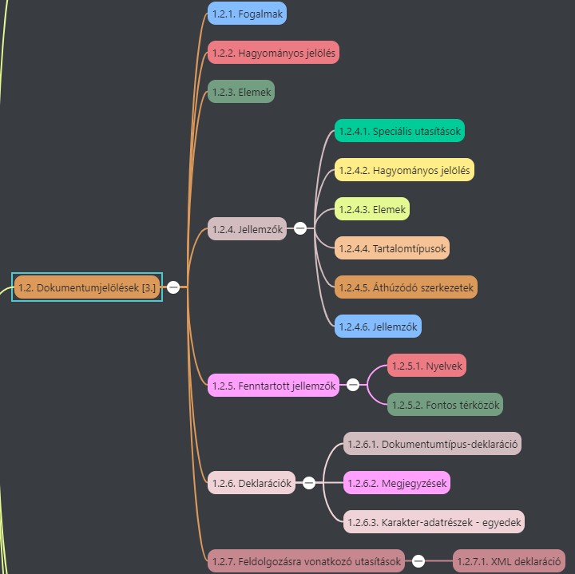

# 1. Az XML leírása [2.]

## 1.1. Bevezetés

Az XML célját és alkalmazási területét mutatja be, a hozzá tartozó szabványokkal együtt.

### 1.1.1. Mi az XML?

* **XML (Extensible Markup Language - Kiterjesztett Jelölő Nyelv)**
* **W3C (World Wide Web Consortium)** fejlesztette ki
* Ideális adatformátum a különböző médiákon terjesztett, közvetlenül megjelenített struktúrált vagy félig struktúrált szöveg számára
* Speciális utasításokat, jelölő elemeket tartalmaz -> dokumentum egy azonosítható részét határolják
* Önleíró -> kliens program tudja értelmezni a kapott adatokat -> kapott feladatok végrehajtása
* **SMIL (Synchronized Multimedia Integration Language - Szinkronizált Multimédia Integrációs Nyelv)**:
  * XML-t alkalmazó szabvány -> szöveg, hang, mozgókép részletet tartalmazó fájlok kezelése
* XML alapú dokumentum
  * **logikai szerkezet:**
    * Dokumentum nevet viselő egységekre, alegységekre bontása -> **elemek**
    * Meg kell felenie megkötéseknek -> **értelmező** segítségével ellenőrizhető -> észlelt hibákat jelzi
    * Több egyedet tartalmazó dokumentum felépítése -> **egyedkezelővel**
    * Mindkettőre alkalmas -> **XML feldolgozó**
  * **fizikai szerkezet:**
    * Dokumentum részei - **egyedek** elnevezése,
    * Külön tárolása olyan adatállományokban, ahonnan az információ újra kinyerhető ->
    * Nem XML típusú adatokkal (pl. képeks) bővíthető
  * XML köztes nyelv -> olyan nyelv, amely más nyelvek leírását tartalmazza.
    * Nincs előre definiált elemlista -> alkalmazásnak megfelelő beszédes elemnevek használhatók
  * **DTD (Document Type Definition - Dokumentumtípus meghatározás)**:
    * Meghatározhatók vele egy adott dokumentumtípusban felhasználható elemek
    * **Érvényességértelmező:** DTD-ben rögzített szabályokat veti össze az adott dokumentummal
  * XML dokumentumok tetszőleges szövegszerkesztőkkel készíthetők, de vannak XML érzékeny szövegszerkesztők -> képesek olvasni DTD-t
  * XML-ben objektum viselkedését leíró elemnevet érdemes használni -> **általánosított jelölés** -> önleíró információ
    * Minden elemhez egy, az elemet leíró stíluslapot kell megadni.
  * Hypertext kapcsolódások hivatkozásokkal

### 1.1.2. Adatcsere-alkalmazások

* XML használható relációs adatbázisok adatainak mozgatására
  * **Egy-a-többhöz kapcsolat**: adatokat több táblázatból szedjük össze -> XML struktúrált, de ismételhető elemei
* **EDI (Electronic Data Interchange - Elektronikus Adatcsere)**
  * Dinamikus információszolgáltató technológia -> Microsoft CDF -> XML megvalósítás
* Java képes olvasni az XML adatokat és arra érzékenyen reagálni Java program felhasználója által kért műveletekre
* XML értelmezés -> SAX-, DOM-kapcsolószabvánokon keresztül

### 1.1.3. Dokumentumkészítő alkalmazások

* **XML ideális adatleíró nyelv:**
  * Részben struktúrált dokumentumoknak -> *referenciamunkák, oktatási anyagok, műszaki kézikönyvek, katalógusok, akadémiai folyóiratok, stb.
  * Alkalmas szabványok, vizsgák, pénzügyi jelentések, kutatói beszámolók jelölésére
  * Mobiltelefonok adatmegjelenítésében
* XML-ben egyszerű a **köztes adatok** generálása és kezelése is (köztes adat: információ az információról, pl. tartalomjegyzék, dátum -> egyik sem része a mű szövegének, csak háttérinformáció)
  * XML képes külön tárolni köztes adatot, hogy nem jelenik meg
  * Program segítségével is generálható, automatikusan (pl. szövegtörzs alapján tartalomjegyzék)
* Hypertextkapcsolatokat létrehozó (XLink és XPointer) és dokumentumformázó (XSL és XSLT) szabványos eljárások -> XPath szabványnak felelnek meg
* Egyéb szabványok kezelése: HTTP, CSS, stb.

### 1.1.4. Az XML történelme

* A HTML és SGML elvei és szabályai alapján információtárolási, -feldolgozási, és -megjelenítési rendszer.
* HTML -> nem kiegészíthető saját nyelvi elemekkel -> 
* W3C 1998. -> XML1.0

### 1.1.5. Jövőkép

* Nem túl aktuális

### 1.1.6. Az XML-szintaxis áttekintése

## 1.2. Dokumentumjelölések

### 1.2.1. Fogalmak

* XML-t elektronikus úton tárolt dokumentumok tartalának leírására használjuk -> olvasható számítógépes programok és emberek számára
* XML adatállomány:
  * dokumentum szövege
  * (dokumentum részeit összerendező és azonosító) XML-jelölések keveréke

### 1.2.2. Hagyományos jelölések

