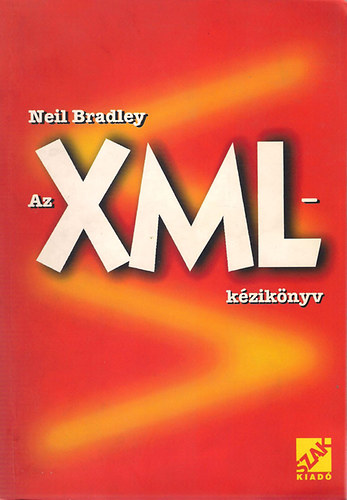
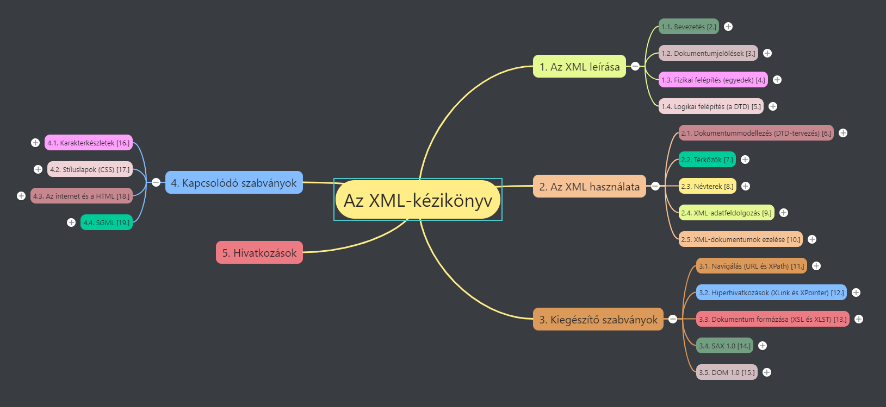

# Neil Bradley: Az XML-kézikönyv jegyzetek [^1]

## Megjegyzések

A könyv fejezetei felsorolásánál, a szögletes zárójelben lévő szám a könyv fejezetszámát tartalmazza. A tartalomjegyzék és a mindmap számozását a struktúra érzékeltetése miatt írtam át.

***XML (Extensible Markup Language - Kiterjesztett Jelölő Nyelv) a World Wide Web Consortium (W3C) által kifejlesztett megjelenítési és dokumentumtárolási formátum.***
* 1998-ban jelent meg
* XML érzékeny a kis- és nagybetűkre

## Jegyzetek a jegyzeteléshez
* ~~1.md Bevezetés~~
* 1.md Dokumentumjelölések (3.)

---
[^1]: Neil Bradley: Az XML-kézikönyv, Szak kiadó, Bicske, 2000. (Az eredeti mű: The XML Companion, Second edition, Pearson, 2000.)