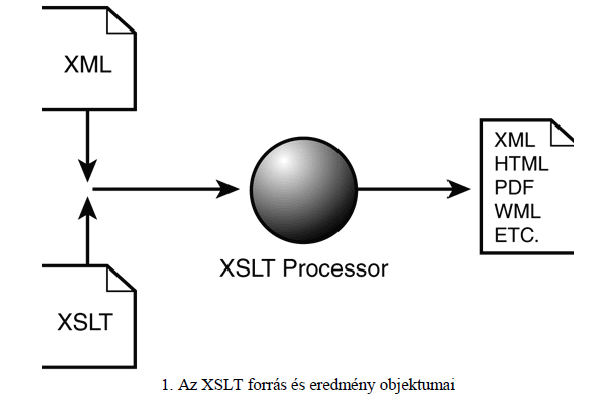
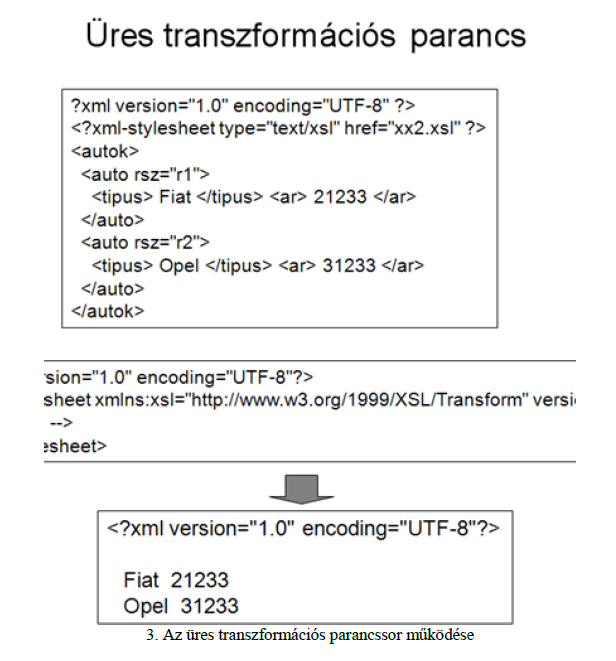

# Kovács László - XML

## Tartalomjegyzék

1. [Kovács László - XML](#kovács-lászló---xml)
   1. [Tartalomjegyzék](#tartalomjegyzék)
   2. [Az XML alapjai](#az-xml-alapjai)
   3. [Az XML-DTD áttekintése](#az-xml-dtd-áttekintése)
   4. [Az XML dokumentumok adatmodellje](#az-xml-dokumentumok-adatmodellje)
   5. [A SAX alapjai](#a-sax-alapjai)
   6. [Az XML-DOM modell alapjai](#az-xml-dom-modell-alapjai)
   7. [Az XML Schema elemei](#az-xml-schema-elemei)
   8. [Az XML adatállományok tervezése](#az-xml-adatállományok-tervezése)
   9. [Az XPath és XLink szabvány elemei](#az-xpath-és-xlink-szabvány-elemei)
   10. [Az XSLT elemei](#az-xslt-elemei)
       1. [Az XSLT áttekintése](#az-xslt-áttekintése)
          1. [Extensible Stylesheet Transformation Language (Bővíthető Stílus leírás Transzformációs Nyelve) - XSLT](#extensible-stylesheet-transformation-language-bővíthető-stílus-leírás-transzformációs-nyelve---xslt)
       2. [Az XSLT működési elve](#az-xslt-működési-elve)
       3. [Az XSLT parancsai](#az-xslt-parancsai)
          1. [1. Mintaillesztés](#1-mintaillesztés)
          2. [2. Feldolgozás továbbléptetése más csomópontokra](#2-feldolgozás-továbbléptetése-más-csomópontokra)
          3. [3. Ciklus utasítás](#3-ciklus-utasítás)
          4. [4. Kifejezések kiértékelése](#4-kifejezések-kiértékelése)
          5. [5. Csomópontok létrehozása](#5-csomópontok-létrehozása)
          6. [6. Feltételes utásítás végrehajtás](#6-feltételes-utásítás-végrehajtás)
          7. [7. Változók használata](#7-változók-használata)
          8. [8. Csoportképzés](#8-csoportképzés)
          9. [9. Parméterezett formulák, függvények](#9-parméterezett-formulák-függvények)
          10. [10. Egyéb elemek](#10-egyéb-elemek)
          11. [11. Külső XSLT transzformációs állomány beolvasása](#11-külső-xslt-transzformációs-állomány-beolvasása)
       4. [Feladatok, mintaprogramok](#feladatok-mintaprogramok)
   11. [Az xQuery nyelv áttekintése](#az-xquery-nyelv-áttekintése)


## Az XML alapjai

## Az XML-DTD áttekintése

## Az XML dokumentumok adatmodellje

## A SAX alapjai

## Az XML-DOM modell alapjai

## Az XML Schema elemei

## Az XML adatállományok tervezése

## Az XPath és XLink szabvány elemei

## Az XSLT elemei

### Az XSLT áttekintése

XML formátum:
- Széles alkalmazási terület
  - adatbázis
  - paraméter adatok tárolása
  - dokumentumok vagy programok leírása
  - XML formátumban tárolhatjuk körlevelek sémáit
  - XML lehet kész levelek formátuma is
- XML dokumentumok hatékony konverziójára igény -> forrás XML dokumentumból cél XML dokumentum
  - DOM is tudja, de célszerűbb egy magasabb szintű, imperatív parancsnyelv használata -> könnyebb később módosítani.

#### Extensible Stylesheet Transformation Language (Bővíthető Stílus leírás Transzformációs Nyelve) - XSLT

- első verzió: 1999. W3C
- CSS stíluslapok használata megjelenítés formázásához -> csak formázási beállítások, tartalom nem módosítható
- Tartalom módosítására irányuló konverziós nyelvként jött létre az XSLT -> XML dokumentumot XML dokumentumba konvertál -> Konverzió menetét megadó parancsállomány szintén XML formátumú
- Forrás XML dokumentum -> transzformációt leíró dokumentum (XSL kiterjesztéssel) -> eredményt tartalmazó XML dokumentum
- XSLT transzformációs nyelv imperatív (hasonlóan SQL-hez) -> nem elemi algoritmusokat kell kidolgozni transzformáció megadására -> magasabb szintű mintákkal lehet dolgozni
- XSLT-t sokan funkcionális nyelvek közé sorolják -> ott is mintákat definiálunk a programban
- XSLT minták listája, minden minta megadja, hogy adott dokumentumrészt milyen más alakra kell transzformálni -> minták célja dokumentum érintett részeinek jelölése



- XSLT nyelv dokumentumot nem karakter-sorozatként, hanem dokumentum faként kezeli -> XDM modellen alapul, hasonlít DOM-hoz, de eltérés utóbbitól:
  - XSLT fa egyszerűbb, kevesebb részlet
  - DOM fa módosítható, XSLT csak olvasás, írás
  - XSLT-fa kezelésénél egyszerűbb szinkronizációs feladatok
- Saját XSLT-fa kezelő motor, de sok esetben SAX és DOM modellek kezelési mechanizmusaira hagyatkozik
  - fában érintett csomópontok halmaza
  - kijelölés rugalmas és funkcionálisan gazdag
    - fában több irányban lehet haladni
    - elemek mellett más csomópontok is
    - egy mintával tetszőleges csomóponthalmaz lefedhető legyen
    - tartalom és struktúra alapú szelekció
    - egyszerű számítások elvégzése
  - XPath szabvány
  - XSLT használatához:
    - forrás XML állomány
    - transzformációt leíró SXLT állomány
    - XSLT értelmező

XSLT forráskód XML állományként tárolva. Forrásállomány gyökér eleme:

```
<xsl:stylesheet xmlns:xsl="http://www.w3.org/1999/XSL/Transform" version="2.0"> 
<!-- transzformációs minták --> 
</xsl:stylesheet>
```

XSLT transzformációs parancsok 

```
http://www.w3.org/1999/XSL/Transform
```

névtérhez tartoznak

Transzformációs parancsokkal:
- csomópontok rendezése a feldolgozáshoz
- kifejezések megadása az eredmény XML dokumentum előállításához
- csomópontok feldolgozási ciklusa,
- változók létrehozása,
- az eredmény dokumentumba új struktúra elem létrehozatala
- feltételes transzformáció végrehajtása



Forrás XML fájlban jelöljük ki, hogy adott állományon transzformációt kell végrehajtani:

```
<?xml-stylesheet type="text/xsl" href="forrás-xsl" ?>
```

- feldolgozási direktíva a dokumentum gyökéreleme előtt
- href elemjellemzőnél transzformációt leíró XSLT állomány

```
X1.XML: 
<?xml version="1.0" ?> 
<?xml-stylesheet type="text/xsl" href="xs1.xsl" ?> 
<autok> 
<auto rsz ="r11"> <tipus> Fiat </tipus> <ar>21233</ar> </auto> 
<auto rsz ="r21"> <tipus> Opel </tipus> <ar> 41233</ar> </auto> 
<auto rsz ="r31"> <tipus> Honda </tipus> <ar>71233</ar> </auto> 
</autok> 

XS1.XSL: 
<?xml version="1.0" ?> 
<xsl:stylesheet xmlns:xsl="http://www.w3.org/1999/XSL/Transform" version="1.0"> 

<xsl:template match="auto"> 
<xsl:value-of select ="./@rsz"/>: <b> <xsl:apply-templates/> </b> <br/> 
</xsl:template> 

<xsl:template match="tipus"> 
<i> <xsl:apply-templates/> </i> 
</xsl:template> 

</xsl:stylesheet> 

X2.XML: 

r11: <b> <i> Fiat </i> 21233 </b> <br/> 
r21: <b> <i> Opel </i> 41233 </b> <br/> 
r31: <b> <i> Honda </i> 71233 </b> <br/>
```

- `match` és `select` elemjellemzők értékeként egy-egy XPath kifejezés -> 
  - mely csomópontoknál kell használni a transzformációt,
  - mely csomópont értékét kell kiíratni az eredmény dokumentumba

### Az XSLT működési elve

- XSLT feldolgozó bemenet -> XML-dokumentumból dokumentumfa
- transzformációs műveletek erre vonatkoznak
- kimenete az eredményfa linearizálásával kapott XML dokumentum
- feldolgozó deep-first mélységi bejárás alapján a gyökérből indulva bejárja a teljes fát, amely csomóponthoz generálási szabály -> előállítja kért XML dokumentum részletet -> eredményfa ezek összevonása
  - feldolgozó rááll gyökér csomópontra
    - van-e feldolgozási utasítás
      - ha nem: sorra veszi gyerek elemeket, ha vannak, mindegyikre rekurzívan elvégzi ezt
      - ha nincs gyerek -> feldolgozás leáll
      - ha szöveg csomópontnál tart a feldolgozás: kiírja szövegelem tartalmát
      - ha van illeszkedő parancs minta -> kiértékelve előáll eredményfa részlet
        - alapesetben csomópont feldolgozása után megáll a feldolgozási lánc -> gyerekeket nem ellenőrzi -> továbbhaladási igénnyel kijelölt elemekre megy tovább a feldolgozás (XPath)
    - alapértelmezett feldolgozási szabályok:
      - minden elemnél (nem beleértve az elemjellemzőt és névteret), ha az nem szövegcsomópont, az eredményfa bővítése nélkül továbblép a gyerek elemek (nem beleértve a jellemzőket és névteret) felé,
      - a szövegcsomópont esetén kiírja az eredménybe ezt a csomópontot (a szövegtartalmat),
      - egyéb csomópontokat figyelmen kívül hagy.

- Az XSLT transzformáció nem garantálja a jól-formáltság feltételeit az eredménydokumentumok esetében -> fejlesztők feladata
- többértelműség: egy csomóponthoz több szabály is definiálva -> sorrendiség = legkésőbb definiált szabály prioritása

***XSLT feldolgozást végző motor általános struktúrája*** -> Saxon rendszer
- **fa felépítő egység** (Tree Constructor), 3 modul
  - SAX API-ra épülve lineárisan átolvassa XML, XSLT dokumentumokat
  - generált köztes dokumentumon normalizálás (felesleges szóközök eltávolítása)
  - felépíti csomópontok fáját
- **XSLT fordító** -> fa elemzése, konvertálása tömörített utasításkódra -> XSL fa (decorated XSL tree).
  - tényleges transzformációvégrehajtás optimalizálása -> döntési fa mellett egyéb optimalizációs lépések
    - szelekciós feltételek egyszerűsítése
    - jellemzők közvetlen elérésének megvalósítása
    - változók elérésének gyorsítása
- **Navigációs modul (Tree navigator)**
  - gyökér elemtől gyerekek felé
  - feldolgozott kontextuscsomóponthoz illeszkedő minta megkeresése
- **XSLT értelmező modul (XSLT Interpreter)**
  - transzformáció tényleges végrehajtása
- **Kiíró modul (Outputter)**

***XSLT transzformációs parancsok***
- mintaillesztési utasítás
- feltételes transzformáció
- változókezelés
- névvel azonosított transzformációk
- XML elemek létrehozása
- elemek rendezése
- csoportképzés
- aggregáció
- segédfüggvények
- XSLT állományok összefűzése

### Az XSLT parancsai

#### 1. Mintaillesztés

#### 2. Feldolgozás továbbléptetése más csomópontokra

#### 3. Ciklus utasítás

#### 4. Kifejezések kiértékelése

#### 5. Csomópontok létrehozása

#### 6. Feltételes utásítás végrehajtás

#### 7. Változók használata

#### 8. Csoportképzés

#### 9. Parméterezett formulák, függvények

#### 10. Egyéb elemek

#### 11. Külső XSLT transzformációs állomány beolvasása

### Feladatok, mintaprogramok

## Az xQuery nyelv áttekintése