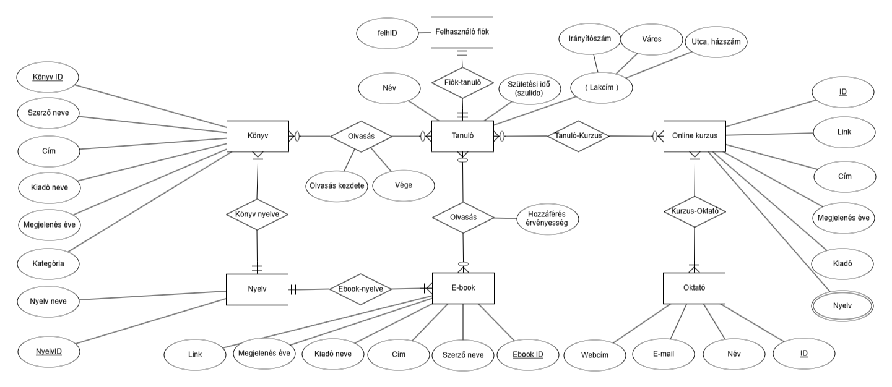

# JEGYZŐKÖNYV

1. [JEGYZŐKÖNYV](#jegyzőkönyv)
   1. [Adatkezelés XML környezetben - Féléves Feladat: Oktatási központ](#adatkezelés-xml-környezetben---féléves-feladat-oktatási-központ)
   2. [Bevezetés](#bevezetés)
   3. [1. Oktatási központ](#1-oktatási-központ)
      1. [1.1. Az adatbázis ER modell tervezése](#11-az-adatbázis-er-modell-tervezése)
      2. [1.2. Az adatbázis konvertálása XDM modellre](#12-az-adatbázis-konvertálása-xdm-modellre)
      3. [1.3. Az XDM modell alapján XML dokumentum készítése](#13-az-xdm-modell-alapján-xml-dokumentum-készítése)
      4. [1.4. Az XML dokumentum alapján XMLSchema készítése](#14-az-xml-dokumentum-alapján-xmlschema-készítése)
   4. [2. A DOM lekérdezések megvalósítása](#2-a-dom-lekérdezések-megvalósítása)
      1. [2.a Adatolvasás](#2a-adatolvasás)
      2. [2.b Adatmódosítás](#2b-adatmódosítás)
      3. [2.c Adatlekérdezés](#2c-adatlekérdezés)
      4. [2.d Adatírás](#2d-adatírás)
   5. [3. Markdown fájl létrehozása a repositoryhoz](#3-markdown-fájl-létrehozása-a-repositoryhoz)


## Adatkezelés XML környezetben - Féléves Feladat: Oktatási központ


Készítette: Kovács Gergely
Neptunkód: mktjs0
Dátum: 2024.12.15.

 
## Bevezetés

A féléves feladat témájának egy oktatási központ adatnyilvántartását választottam. Ebben szerepelnek tanulók adatai, könyvek és e-bookok adatai továbbá még online elérhető, videós kurzusok adatai is. A kurzusokat készítő oktatók neve is szerepel az adatok között. A feladatkiírásnak megfelelően készült a feladat megtervezésekor ER modell, amely ábrázolja az adatok közötti kapcsolatokat. A következő lépés az ER modell XDM modellre konvertálása volt. Ezzel az XML fájlban történő adattároláshoz közelebbivé válik a megjelenítés, a fastruktúra miatt könnyebbe olvashatók az adattagok, azok viszonyai egymáshoz képest, az alá-fölé rendeltségek. 
Ezt követően elkészült maga az XML dokumentum, adattípusait feltöltöttem adatokkal (a feladatkiírásnak megfelelően minden adattípus 4 adattal). Ezután következett az XML fájlhoz a Schema definíció (XSD fájl) elkészítése. A két dokumentum (XML és XSD) hibátlanul egyezik, a validálás megtörtént. 
A következő feladat a DOMParseMktjs0 néven elkészített adatlekérdező java alkalmazás volt, a hu.domparse.mktjs0 csomagban. A feladatkiírásnak megfelelően DomReadMktjs0, DomModifyMktjs0, DomQueryMktjs0 és DomWriteMktjs0 java fájlok készültek, amelyekkel a feladatkiírásnak megfelelően kérdezhetők le az XML fájl adatai.
 
## 1. Oktatási központ
### 1.1. Az adatbázis ER modell tervezése

Az első lépés az ER modell elkészítse volt. Az alábbi ábrában található 7 egyed, amelyek egymással különféle kapcsolatban vannak. A felhasználói fiók és a tanuló egymással 1-1 kapcsolatban áll, a nyelv a könyvvel 1-több kapcsolatban áll, mivel az adattárolás szempontjában ugyanaz a könyv másik nyelven már egy másik egyednek számít, mivel más nyelven adott a címe. Több-több kapcsolat van például a tanulók és könyvek, tanulók és ebookok, tanulók és online kurzusok vagy az online kurzusok és oktatók között. Az egyedek a feladatkiírásnak megfelelően sok attribútummal rendelkeznek.



### 1.2. Az adatbázis konvertálása XDM modellre

A fentebb látható ER modellt átkonvertáltam XDM modellre, ezt használtam az XML fájl készítésekor.


### 1.3. Az XDM modell alapján XML dokumentum készítése

Lentebb látható az XML dokumentum, az XMLmktjs0.xml fájl tartalma. A feladatkiírásnak megfelelően szerepelnek benne az egyedek, azok attribútumai az XDM modell alapján. Tartalmaz kulcsokat a key segítségével létrehozva, azokra való hivatkozást a keyreffel  és szerepel egy unique tag is, a felhasználónév (mivel a felhasználónak ID-ja már volt, a felhasználónévnek elegendő egyedinek lennie, nincs szükség 2 ID tagra a tanuló azonosításához).

```
<?xml version="1.0" encoding="UTF-8" standalone="no"?><oktatas xmlns:xsi="http://www.w3.org/2001/XMLSchema-instance" xsi:noNamespaceSchemaLocation="XSDmktjs0.xsd">
    <tanulok>
        <tanulo felhID="FELH0001" felhnev="kovacsgergely">
            <nev>Kovács Gergely</nev>
            <szulIdo>1990-01-01</szulIdo>
            <lakcim>
                <irsz>3500</irsz>
                <varos>Miskolc</varos>
                <utca>Béla utca 3.</utca>
            </lakcim>
        </tanulo>
        <tanulo felhID="FELH0002" felhnev="kissjanos">
            <nev>Kiss János</nev>
            <szulIdo>1991-02-02</szulIdo>
            <lakcim>
                <irsz>3500</irsz>
                <varos>Miskolc</varos>
                <utca>Deák utca 5.</utca>
            </lakcim>
        </tanulo>
        <tanulo felhID="FELH0003" felhnev="nagypeter">
            <nev>Nagy Péter</nev>
            <szulIdo>1992-03-03</szulIdo>
            <lakcim>
                <irsz>3500</irsz>
                <varos>Miskolc</varos>
                <utca>Erzsébet utca 7.</utca>
            </lakcim>
        </tanulo>
        <tanulo felhID="FELH0004" felhnev="kisgizi">
            <nev>Kis Gizella</nev>
            <szulIdo>1995-01-01</szulIdo>
            <lakcim>
                <irsz>3500</irsz>
                <varos>Miskolc</varos>
                <utca>Béla utca 3.</utca>
            </lakcim>
        </tanulo>
    </tanulok>
    <konyvek>
        <konyv kID="K0001" nyID="NY0001">
            <szerzo>Neil Bradley</szerzo>
            <cim>Az XML-kézikönyv</cim>
            <kiado>Szak kiadó</kiado>
            <megjelenEv>2000</megjelenEv>
            <kategoria>Adatkezelés</kategoria>
            <kategoria>Web</kategoria>
            <kategoria>XML</kategoria>
        </konyv>
        <konyv kID="K0002" nyID="NY0001">
            <szerzo>Jeffrey D. Ullmann</szerzo>
            <szerzo>Jennifer Widom</szerzo>
            <cim>Adatbázis-rendszerek - Alapvetés</cim>
            <kiado>Panem</kiado>
            <megjelenEv>2009</megjelenEv>
            <kategoria/>
        </konyv>
        <konyv kID="K0003" nyID="NY0001">
            <szerzo>Kövesdán Gábor</szerzo>
            <cim>Szoftverfejlesztés Java SE platformon</cim>
            <kiado/>
            <megjelenEv>2014</megjelenEv>
            <kategoria>Java</kategoria>
        </konyv>
        <konyv kID="K0004" nyID="NY0001">
            <szerzo>Thomas H. Cormen</szerzo>
            <szerzo>Charles E. Leiserson</szerzo>
            <szerzo>Ronald L. Rivest</szerzo>
            <cim>Algoritmusok</cim>
            <kiado>Műszaki Könyvkiadó</kiado>
            <megjelenEv>2003</megjelenEv>
            <kategoria>Algoritmusok</kategoria>
        </konyv>
    </konyvek>
    <olvasas>
        <olvas felhID="FELH0001" kID="K0001" olvasID="OLVAS0001">
            <kezdete>2021-01-01</kezdete>
            <vege>2021-01-31</vege>
        </olvas>
        <olvas felhID="FELH0002" kID="K0001" olvasID="OLVAS0002">
            <kezdete>2021-01-01</kezdete>
            <vege>2021-01-31</vege>
        </olvas>
        <olvas felhID="FELH0003" kID="K0001" olvasID="OLVAS0003">
            <kezdete>2021-01-01</kezdete>
            <vege>2021-01-31</vege>
        </olvas>
        <olvas felhID="FELH0004" kID="K0001" olvasID="OLVAS0004">
            <kezdete>2021-01-01</kezdete>
            <vege>2021-01-31</vege>
        </olvas>
    </olvasas>
    <eolvasas>
        <ebook eID="E0001" nyID="NY0002">
            <szerzo>Sashi Banzal</szerzo>
            <cim>XML Basics</cim>
            <kiado>Mercury Learning and Information</kiado>
            <megjelenEv>2020</megjelenEv>
            <link>https://www.packtpub.com/en-hu/product/xml-basics-9781836648741</link>
        </ebook>
        <ebook eID="E0002" nyID="NY0002">
            <szerzo>Dr Adamkó Attila</szerzo>
            <cim>Fejlett adatbázis technológiák</cim>
            <kiado/>
            <megjelenEv>2013</megjelenEv>
            <link>https://dtk.tankonyvtar.hu/handle/123456789/12049</link>
        </ebook>
        <ebook eID="E0003" nyID="NY0002">
            <szerzo>Jeszenszky Péter</szerzo>
            <cim>XML sémanyelvek</cim>
            <kiado>Debreceni Egyetem</kiado>
            <megjelenEv>2010</megjelenEv>
            <link>https://arato.inf.unideb.hu/jeszenszky.peter/xml/book/#d6e30</link>
        </ebook>
        <ebook eID="E0004" nyID="NY0002">
            <szerzo>Kovács László</szerzo>
            <cim>XML technikák</cim>
            <kiado>Miskolci Egyetem</kiado>
            <megjelenEv>2011</megjelenEv>
            <link>https://dtk.tankonyvtar.hu/handle/123456789/12928</link>
        </ebook>
    </eolvasas>
    <onkurzusok>
        <onkurzus nyID="NY0002" oID="O0001">
            <cim>XML Mastery: Unleashing the Power of Data Markup</cim>
            <kiado>EDUCBA Bridging the Gap</kiado>
            <megjelenEv>2024</megjelenEv>
            <link>https://www.udemy.com/course/xml-novice-to-ninja/</link>
        </onkurzus>
        <onkurzus nyID="NY0002" oID="O0002">
            <cim>XML Essentials: Structure and Share Data Efficiently.</cim>
            <kiado>Faris Azam</kiado>
            <megjelenEv>2024</megjelenEv>
            <link>https://www.udemy.com/course/xml-essentials-structure-and-share-data-efficiently/</link>
        </onkurzus>
        <onkurzus nyID="NY0002" oID="O0003">
            <cim>XML and XSD: a complete W3C-content based course (+10 hours)</cim>
            <kiado>Daniel Pinheiro Maia</kiado>
            <megjelenEv>2019</megjelenEv>
            <link>https://www.udemy.com/course/xml-and-xsd-a-complete-w3c-content-based-course/</link>
        </onkurzus>
        <onkurzus nyID="NY0002" oID="O0004">
            <cim>Data Representation and Serialization</cim>
            <kiado>ITPro TV</kiado>
            <megjelenEv>2019</megjelenEv>
            <link>https://www.udemy.com/course/data-representation-and-serialization/?couponCode=KEEPLEARNING</link>
        </onkurzus>
    </onkurzusok>
    <oktatok>
        <oktato oktID="OKT0001">
            <nev/>
            <email/>
            <weboldal/>
        </oktato>
        <oktato oktID="OKT0002">
            <nev/>
            <email/>
            <weboldal/>
        </oktato>
        <oktato oktID="OKT0003">
            <nev/>
            <email/>
            <weboldal/>
        </oktato>
        <oktato oktID="OKT0004">
            <nev/>
            <email/>
            <weboldal/>
        </oktato>
    </oktatok>
    <nyelvek>
        <nyelv nyID="NY0001">
            <nev>Magyar</nev>
        </nyelv>
        <nyelv nyID="NY0002">
            <nev>Angol</nev>
        </nyelv>
        <nyelv nyID="NY0003">
            <nev>Német</nev>
        </nyelv>
    </nyelvek>
</oktatas> 
```

### 1.4. Az XML dokumentum alapján XMLSchema készítése

Lentebb látható az xsd fájl, az XSDmktjs0.xsd fájl tartalma. A Schema fájl megfelel az XML fájlnak, a validálás megtörtént. 

```
<?xml version="1.0" encoding="UTF-8"?>
<xs:schema xmlns:xs="http://www.w3.org/2001/XMLSchema">
    <xs:element name="oktatas">
        <xs:complexType>
            <xs:sequence>
                <xs:element name="tanulok">
                    <xs:complexType>
                        <xs:sequence>
                            <xs:element name="tanulo" minOccurs="1" maxOccurs="unbounded">
                                <xs:complexType>
                                    <xs:sequence>
                                        <xs:element name="nev" type="xs:string"></xs:element>
                                        <xs:element name="szulIdo" type="xs:date"></xs:element>
                                        <xs:element name="lakcim">
                                            <xs:complexType>
                                                <xs:sequence>
                                                    <xs:element name="irsz" type="xs:int"></xs:element>
                                                    <xs:element name="varos" type="xs:string"></xs:element>
                                                    <xs:element name="utca" type="xs:string"></xs:element>
                                                </xs:sequence>
                                            </xs:complexType>
                                        </xs:element>
                                    </xs:sequence>
                                    <xs:attribute name="felhID" type="xs:ID" use="required"></xs:attribute>
                                    <xs:attribute name="felhnev" type="xs:string" use="required"></xs:attribute>
                                </xs:complexType>
                            </xs:element>
                        </xs:sequence>
                    </xs:complexType>
                    <xs:key name="felh-key">
                        <xs:selector xpath="tanulo"></xs:selector>
                        <xs:field xpath="@felhID"></xs:field>
                    </xs:key>
                    <xs:unique name="felhnev-un">
                        <xs:selector xpath="tanulo"></xs:selector>
                        <xs:field xpath="@felhnev"></xs:field>
                    </xs:unique>
                </xs:element>
                <xs:element name="konyvek">
                    <xs:complexType>
                        <xs:sequence>
                            <xs:element name="konyv" minOccurs="0" maxOccurs="unbounded">
                                <xs:complexType>
                                    <xs:sequence>
                                        <xs:element name="szerzo" type="xs:string" minOccurs="1" maxOccurs="unbounded"></xs:element>
                                        <xs:element name="cim" type="xs:string"></xs:element>
                                        <xs:element name="kiado" type="xs:string"></xs:element>
                                        <xs:element name="megjelenEv" type="xs:gYear"></xs:element>
                                        <xs:element name="kategoria" type="xs:string" minOccurs="0" maxOccurs="unbounded"></xs:element>
                                    </xs:sequence>
                                    <xs:attribute name="kID" type="xs:ID" use="required"></xs:attribute>
                                    <xs:attribute name="nyID" type="xs:IDREF" use="required"></xs:attribute>
                                </xs:complexType>
                            </xs:element>
                        </xs:sequence>
                    </xs:complexType>
                    <xs:key name="konyv-key">
                        <xs:selector xpath="konyvek"></xs:selector>
                        <xs:field xpath="@kID"></xs:field>
                    </xs:key>
                    <xs:keyref name="konyvnyelv-ref" refer="nyelv-key">
                        <xs:selector xpath="oktatas/nyelvek/nyelv"></xs:selector>
                        <xs:field xpath="@nyID"></xs:field>
                    </xs:keyref>
                </xs:element>
                <xs:element name="olvasas">
                    <xs:complexType>
                        <xs:sequence>
                            <xs:element name="olvas" minOccurs="0" maxOccurs="unbounded">
                                <xs:complexType>
                                    <xs:sequence>
                                        <xs:element name="kezdete" type="xs:date"></xs:element>
                                        <xs:element name="vege" type="xs:date"></xs:element>
                                    </xs:sequence>
                                    <xs:attribute name="olvasID" type="xs:ID" use="required"></xs:attribute>
                                    <xs:attribute name="felhID" type="xs:IDREF" use="required"></xs:attribute>
                                    <xs:attribute name="kID" type="xs:IDREF" use="required"></xs:attribute>
                                </xs:complexType>
                            </xs:element>
                        </xs:sequence>
                    </xs:complexType>
                    <xs:key name="olvasas-key">
                        <xs:selector xpath="olvas"></xs:selector>
                        <xs:field xpath="@olvasID"></xs:field>
                    </xs:key>
                    <xs:keyref name="felh-olvas-ref" refer="felh-key">
                        <xs:selector xpath="oktatas/tanulok/tanulo"></xs:selector>
                        <xs:field xpath="@felhID"></xs:field>
                    </xs:keyref>
                </xs:element>
                <xs:element name="eolvasas">
                    <xs:complexType>
                        <xs:sequence>
                            <xs:element name="ebook" minOccurs="0" maxOccurs="unbounded">
                                <xs:complexType>
                                    <xs:sequence>
                                        <xs:element name="szerzo" type="xs:string"></xs:element>
                                        <xs:element name="cim" type="xs:string"></xs:element>
                                        <xs:element name="kiado" type="xs:string"></xs:element>
                                        <xs:element name="megjelenEv" type="xs:gYear" minOccurs="0" maxOccurs="1"></xs:element>
                                        <xs:element name="link" type="xs:anyURI"></xs:element>
                                    </xs:sequence>
                                    <xs:attribute name="eID" type="xs:ID" use="required"></xs:attribute>
                                    <xs:attribute name="nyID" type="xs:IDREF" use="required"></xs:attribute>
                                </xs:complexType>
                            </xs:element>
                        </xs:sequence>
                    </xs:complexType>
                    <xs:key name="e-key">
                        <xs:selector xpath="eolvasas"></xs:selector>
                        <xs:field xpath="@eID"></xs:field>
                    </xs:key>
                    <xs:keyref name="enyelv-ref" refer="nyelv-key">
                        <xs:selector xpath="oktatas/nyelvek/nyelv"></xs:selector>
                        <xs:field xpath="@nyID"></xs:field>
                    </xs:keyref>
                </xs:element>
                <xs:element name="onkurzusok">
                    <xs:complexType>
                        <xs:sequence>
                            <xs:element name="onkurzus" minOccurs="0" maxOccurs="unbounded">
                                <xs:complexType>
                                    <xs:sequence>
                                        <xs:element name="cim" type="xs:string"></xs:element>
                                        <xs:element name="kiado" type="xs:string"></xs:element>
                                        <xs:element name="megjelenEv" type="xs:gYear" minOccurs="0" maxOccurs="1"></xs:element>
                                        <xs:element name="link" type="xs:anyURI"></xs:element>
                                    </xs:sequence>
                                    <xs:attribute name="oID" type="xs:ID" use="required"></xs:attribute>
                                    <xs:attribute name="nyID" type="xs:IDREF" use="required"></xs:attribute>
                                </xs:complexType>
                            </xs:element>
                        </xs:sequence>
                    </xs:complexType>
                    <xs:key name="onkurzus-key">
                        <xs:selector xpath="onkurzus"></xs:selector>
                        <xs:field xpath="@oID"></xs:field>
                    </xs:key>
                    <xs:keyref name="onkurzusnyelv-ref" refer="nyelv-key">
                        <xs:selector xpath="oktatas/nyelvek/nyelv"></xs:selector>
                        <xs:field xpath="@nyID"></xs:field>
                    </xs:keyref>
                </xs:element>
                <xs:element name="oktatok">
                    <xs:complexType>
                        <xs:sequence>
                            <xs:element name="oktato" minOccurs="0" maxOccurs="unbounded">
                                <xs:complexType>
                                    <xs:sequence>
                                        <xs:element name="nev" type="xs:string"></xs:element>
                                        <xs:element name="email" type="xs:string"></xs:element>
                                        <xs:element name="weboldal" type="xs:anyURI"></xs:element>
                                    </xs:sequence>
                                    <xs:attribute name="oktID" type="xs:ID" use="required"></xs:attribute>
                                </xs:complexType>
                            </xs:element>
                        </xs:sequence>
                    </xs:complexType>
                    <xs:key name="oktato-key">
                        <xs:selector xpath="oktato"></xs:selector>
                        <xs:field xpath="@oktID"></xs:field>
                    </xs:key>
                </xs:element>
                <xs:element name="nyelvek">
                    <xs:complexType>
                        <xs:sequence>
                            <xs:element name="nyelv" minOccurs="1" maxOccurs="unbounded">
                                <xs:complexType>
                                    <xs:sequence>
                                        <xs:element name="nev" type="xs:string"></xs:element>
                                    </xs:sequence>
                                    <xs:attribute name="nyID" type="xs:ID" use="required"></xs:attribute>
                                </xs:complexType>
                            </xs:element>
                        </xs:sequence>
                    </xs:complexType>
                    <xs:key name="nyelv-key">
                        <xs:selector xpath="nyelv"></xs:selector>
                        <xs:field xpath="@nyID"></xs:field>
                    </xs:key>
                </xs:element>
            </xs:sequence>
        </xs:complexType>
    </xs:element>
</xs:schema>
```
 
## 2. A DOM lekérdezések megvalósítása

### 2.a Adatolvasás

A DOMReadMktjs0 java nyelvű alkalmazás feldolgozza a teljes dokumentumot és kiírja azt struktúrált formában a konzolra, és ezen kívül menti is egy másik fáljban. A kódban megjegyzések is szerepelnek.

```
package hu.domparse.mktjs0;

import org.w3c.dom.*;
import javax.xml.parsers.*;
import java.io.File;
import java.io.FileWriter;

public class DomReadMktjs0 {
    public static void main(String[] args) {
        try {
            // Létrehoz egy DocumentBuilderFactory példányt
            DocumentBuilderFactory factory = DocumentBuilderFactory.newInstance();
            
            // Létrehoz egy DocumentBuilder példányt
            DocumentBuilder builder = factory.newDocumentBuilder();
            
            // Beolvassa az XML fájlt
            Document document = builder.parse(new File("Web\\XML_ME\\Webes_adatkezelo_kornyezetek\\Feleves_feladat\\XMLmktjs0.xml"));
            
            // Normalizálja az XML dokumentumot
            document.getDocumentElement().normalize();
            
            // Kiírja a gyökérelem nevét
            System.out.println("Root element: " + document.getDocumentElement().getNodeName());
            
            // Létrehoz egy FileWriter példányt a fájlba íráshoz
            FileWriter writer = new FileWriter("output.txt");
            
            // Beolvassa az összes elem nevét és értékét
            NodeList nodeList = document.getElementsByTagName("*");
            for (int i = 0; i < nodeList.getLength(); i++) {
                Node node = nodeList.item(i);
                if (node.getNodeType() == Node.ELEMENT_NODE) {
                    Element element = (Element) node;
                    String output = "Element: " + element.getNodeName() + ", Value: " + element.getTextContent();
                    
                    // Kiírja az adatokat a konzolra
                    System.out.println(output);
                    
                    // Kiírja az adatokat a fájlba
                    writer.write(output + "\n");
                }
            }
            
            // Bezárja a FileWriter példányt
            writer.close();
        } catch (Exception e) {
            e.printStackTrace();
        }
    }
}
```
 
### 2.b Adatmódosítás

A feldatkiírásnak megfelelően Az XML dokumentum példányaiból legalább 5-öt módosít a DOMModifyMktjs0 és kiírja azokat a konzolra. A kódban a megjegyzések segítik az értelmezést.

```
package hu.domparse.mktjs0;

import org.w3c.dom.*;
import javax.xml.parsers.*;
import javax.xml.transform.*;
import javax.xml.transform.dom.DOMSource;
import javax.xml.transform.stream.StreamResult;
import java.io.File;

public class DOMModifyMktjs0 {

    public static void main(String[] args) {
        try {
            // Létrehoz egy DocumentBuilderFactory példányt
            DocumentBuilderFactory factory = DocumentBuilderFactory.newInstance();
            
            // Létrehoz egy DocumentBuilder példányt
            DocumentBuilder builder = factory.newDocumentBuilder();
            
            // Beolvassa az XML fájlt
            Document document = builder.parse(new File("XMLmktjs0.xml"));
            
            // Normalizálja az XML dokumentumot
            document.getDocumentElement().normalize();
            
            // Kiírja a gyökérelem nevét
            System.out.println("Root element: " + document.getDocumentElement().getNodeName());
            
            // 1. Módosítás: Egy oktató nevének megváltoztatása
            NodeList oktatoList = document.getElementsByTagName("oktato");
            if (oktatoList.getLength() > 0) {
                Element oktato = (Element) oktatoList.item(0);
                oktato.getElementsByTagName("nev").item(0).setTextContent("Dr. Kovács Gergely");
                System.out.println("Modified oktato nev to Dr. Kovács Gergely");
            }
            
            // 2. Módosítás: Egy nyelv nevének megváltoztatása
            NodeList nyelvList = document.getElementsByTagName("nyelv");
            if (nyelvList.getLength() > 0) {
                Element nyelv = (Element) nyelvList.item(0);
                nyelv.getElementsByTagName("nev").item(0).setTextContent("Spanyol");
                System.out.println("Modified nyelv nev to Spanyol");
            }
            
               // 3. Módosítás: Egy oktató email címének megváltoztatása
               if (oktatoList.getLength() > 1) {
                Element oktato = (Element) oktatoList.item(1);
                oktato.getElementsByTagName("email").item(0).setTextContent("kovacs.gergely@example.com");
                System.out.println("Modified oktato email to kovacs.gergely@example.com");
            }
            
            // 4. Módosítás: Egy nyelv hozzáadása
            Element newNyelv = document.createElement("nyelv");
            newNyelv.setAttribute("nyID", "NY0004");
            Element newNyelvNev = document.createElement("nev");
            newNyelvNev.setTextContent("Francia");
            newNyelv.appendChild(newNyelvNev);
            document.getDocumentElement().getElementsByTagName("nyelvek").item(0).appendChild(newNyelv);
            System.out.println("Added new nyelv with nev Francia");
            
            // 5. Módosítás: Egy oktató törlése
            if (oktatoList.getLength() > 2) {
                Node oktatoToRemove = oktatoList.item(2);
                oktatoToRemove.getParentNode().removeChild(oktatoToRemove);
                System.out.println("Removed oktato with oktID OKT0003");
            }
            
            // Az XML dokumentum mentése
            TransformerFactory transformerFactory = TransformerFactory.newInstance();
            Transformer transformer = transformerFactory.newTransformer();
            DOMSource source = new DOMSource(document);
            StreamResult result = new StreamResult(new File("ModifiedXMLmktjs0.xml"));
            transformer.transform(source, result);
            
            System.out.println("XML módosítások mentve a ModifiedXMLmktjs0.xml fájlba.");
        } catch (Exception e) {
            e.printStackTrace();
        }
    }
}
```

### 2.c Adatlekérdezés

A DOMQueryMktjs0 nevű java kód a feladatkiírásnak megfelelően az XMLmktjs0.xml fájl példányaiból legalább 5 lekérdezést készít, és kiírja azokat a konzolra. A kódban megjegyzések magyarázzák a végrehajtást. 

```
package hu.domparse.mktjs0;

import org.w3c.dom.*;
import javax.xml.parsers.*;
import java.io.File;

public class DOMQueryMktjs0 {

    public static void main(String[] args) {
        try {
            // Létrehoz egy DocumentBuilderFactory példányt
            DocumentBuilderFactory factory = DocumentBuilderFactory.newInstance();
            
            // Létrehoz egy DocumentBuilder példányt
            DocumentBuilder builder = factory.newDocumentBuilder();
            
            // Beolvassa az XML fájlt
            Document document = builder.parse(new File("Web\\XML_ME\\Webes_adatkezelo_kornyezetek\\Feleves_feladat\\XMLmktjs0.xml"));
            
            // Normalizálja az XML dokumentumot
            document.getDocumentElement().normalize();
            
            // Kiírja a gyökérelem nevét
            System.out.println("Root element: " + document.getDocumentElement().getNodeName());
            
            // 1. Lekérdezés: Az összes oktató neve
            NodeList oktatoList = document.getElementsByTagName("oktato");
            System.out.println("Oktatók nevei:");
            for (int i = 0; i < oktatoList.getLength(); i++) {
                Element oktato = (Element) oktatoList.item(i);
                String nev = oktato.getElementsByTagName("nev").item(0).getTextContent();
                System.out.println(" - " + nev);
            }
            
            // 2. Lekérdezés: Az összes nyelv neve
            NodeList nyelvList = document.getElementsByTagName("nyelv");
            System.out.println("Nyelvek nevei:");
            for (int i = 0; i < nyelvList.getLength(); i++) {
                Element nyelv = (Element) nyelvList.item(i);
                String nev = nyelv.getElementsByTagName("nev").item(0).getTextContent();
                System.out.println(" - " + nev);
            }

            // 3. Lekérdezés: Az első oktató email címe
            if (oktatoList.getLength() > 0) {
                Element oktato = (Element) oktatoList.item(0);
                String email = oktato.getElementsByTagName("email").item(0).getTextContent();
                System.out.println("Az első oktató email címe: " + email);
            }
            
            // 4. Lekérdezés: Az összes oktató ID-ja
            System.out.println("Oktatók ID-jai:");
            for (int i = 0; i < oktatoList.getLength(); i++) {
                Element oktato = (Element) oktatoList.item(i);
                String oktID = oktato.getAttribute("oktID");
                System.out.println(" - " + oktID);
            }
            
            // 5. Lekérdezés: Az összes nyelv ID-ja
            System.out.println("Nyelvek ID-jai:");
            for (int i = 0; i < nyelvList.getLength(); i++) {
                Element nyelv = (Element) nyelvList.item(i);
                String nyID = nyelv.getAttribute("nyID");
                System.out.println(" - " + nyID);
            }

             // 6. Lekérdezés: Az összes könyv címe
             NodeList konyvList = document.getElementsByTagName("konyv");
             System.out.println("Könyvek címei:");
             for (int i = 0; i < konyvList.getLength(); i++) {
                 Element konyv = (Element) konyvList.item(i);
                 String cim = konyv.getElementsByTagName("cim").item(0).getTextContent();
                 System.out.println(" - " + cim);
             }

             // 7. Lekérdezés: Az összes tanuló neve
            NodeList tanuloList = document.getElementsByTagName("tanulo");
            System.out.println("Tanulók nevei:");
            for (int i = 0; i < tanuloList.getLength(); i++) {
                Element tanulo = (Element) tanuloList.item(i);
                String nev = tanulo.getElementsByTagName("nev").item(0).getTextContent();
                System.out.println(" - " + nev);
            }

            // 8. Lekérdezés: Az első könyv szerzője
            if (konyvList.getLength() > 0) {
                Element konyv = (Element) konyvList.item(0);
                String szerzo = konyv.getElementsByTagName("szerzo").item(0).getTextContent();
                System.out.println("Az első könyv szerzője: " + szerzo);
            }
            
        } catch (Exception e) {
            e.printStackTrace();
        }
    }
}
```
 
### 2.d Adatírás

A DOMWriteMkjts0-ban egy DOM API program az XMLmktjs0.xml fájl tartalmát beolvassa, fa struktúra formában kiírja a konzolra és egy XMLmktjs0_1.xml nevű fájlba írja. Kommentek itt is szerepelnek.

```
package hu.domparse.mktjs0;

import org.w3c.dom.*;
import javax.xml.parsers.*;
import javax.xml.transform.*;
import javax.xml.transform.dom.DOMSource;
import javax.xml.transform.stream.StreamResult;
import java.io.File;

public class DOMWriteMktjs0 {

    public static void main(String[] args) {
        try {
            // Létrehoz egy DocumentBuilderFactory példányt
            DocumentBuilderFactory factory = DocumentBuilderFactory.newInstance();

            // Létrehoz egy DocumentBuilder példányt
            DocumentBuilder builder = factory.newDocumentBuilder();

            // Beolvassa az XML fájlt
            Document document = builder
                    .parse(new File("Web\\XML_ME\\Webes_adatkezelo_kornyezetek\\Feleves_feladat\\XMLmktjs0.xml"));

            // Normalizálja az XML dokumentumot
            document.getDocumentElement().normalize();

            // Kiírja a gyökérelem nevét
            System.out.println("Root element: " + document.getDocumentElement().getNodeName());

            // Fa struktúra kiírása a konzolra
            printNode(document.getDocumentElement(), 0);

            // Az XML dokumentum mentése egy új fájlba
            TransformerFactory transformerFactory = TransformerFactory.newInstance();
            Transformer transformer = transformerFactory.newTransformer();
            DOMSource source = new DOMSource(document);
            StreamResult result = new StreamResult(
                    new File("Web\\XML_ME\\Webes_adatkezelo_kornyezetek\\Feleves_feladat\\XMLmktjs0_1.xml"));
            transformer.transform(source, result);

            System.out.println("XML dokumentum mentve a XMLmktjs0_1.xml fájlba.");
        } catch (Exception e) {
            e.printStackTrace();
        }
    }

    // Rekurzív függvény a fa struktúra kiírásához
    private static void printNode(Node node, int indent) {
        // Kiírja a behúzást
        for (int i = 0; i < indent; i++) {
            System.out.print("  ");
        }

        // Kiírja az aktuális node nevét és értékét
        System.out.print(node.getNodeName());
        if (node.getNodeType() == Node.ELEMENT_NODE) {
            NamedNodeMap attributes = node.getAttributes();
            for (int i = 0; i < attributes.getLength(); i++) {
                Node attr = attributes.item(i);
                System.out.print(" [" + attr.getNodeName() + "=" + attr.getNodeValue() + "]");
            }
        }
        if (node.getNodeType() == Node.TEXT_NODE) {
            System.out.print(" = " + node.getNodeValue().trim());
        }
        System.out.println();

        // Rekurzív hívás a gyerek node-ok kiírásához
        NodeList nodeList = node.getChildNodes();
        for (int i = 0; i < nodeList.getLength(); i++) {
            printNode(nodeList.item(i), indent + 1);
        }
    }
}
```

## 3. Markdown fájl létrehozása a repositoryhoz

Bár a feladatkiírásban nem szerepel, a repositoryhoz markdown leíró nyelven is elkészítettem a dokumentációt. Mivel ez is egy leíró nyelv, kapcsolódik a tárgyhoz. A dokumentáció a readme.md fájlban is szerepel tehát, a repository megnyitásakor így rögtön látható.
