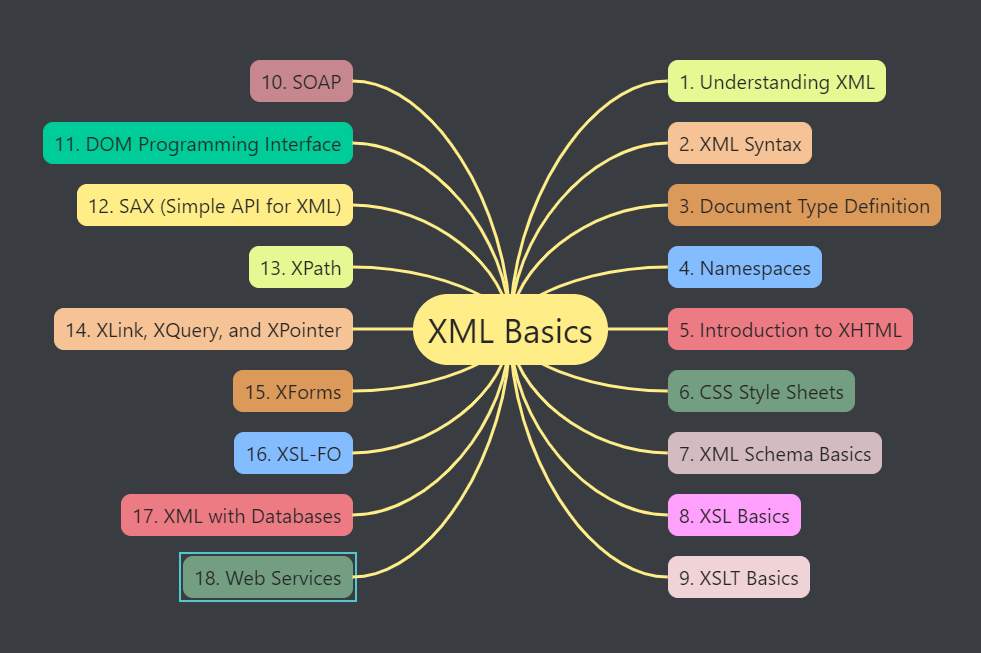
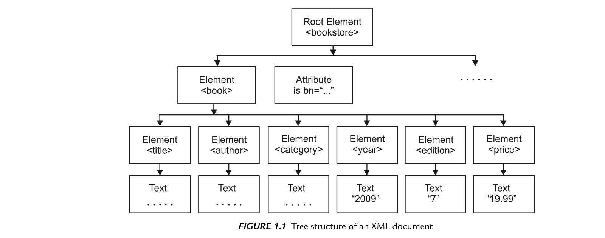
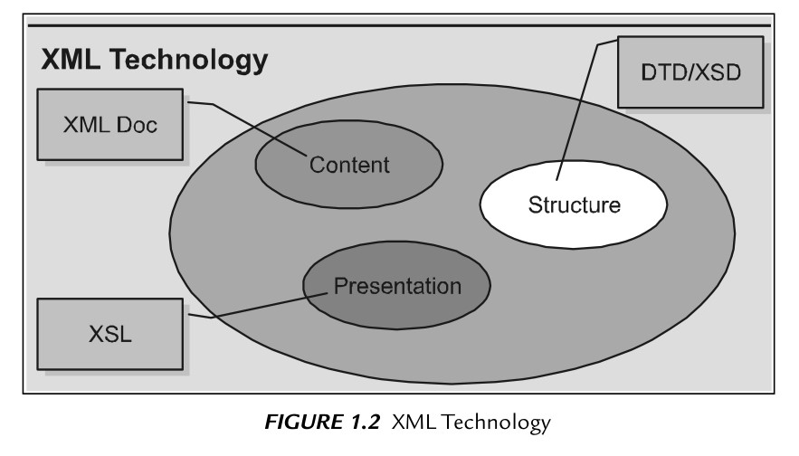
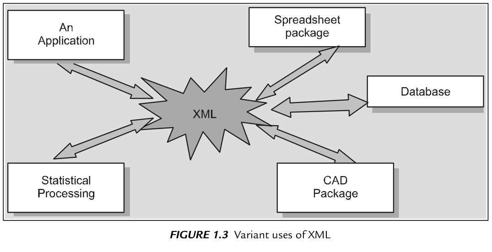

# 1. Az XML megértése

[Előző](readme.md)



## Markup Languages

* "mark up" -> markup = jelölő nyelv
  * Módosítja a formázást
  * Megadja a stuktúrát
  * A dokumentum megjelenése weben
  * Tagekkel (címkékkel) ellátott szöveg -> dokumentum forráskódja
  * Markup languages fajtái:
    * Specific Markup Languages
    * Generalized Markup Languages

## Specific Markup Languages

* Meghatározott jelölő nyelvek speciális célokra -> csak arra a célra használhatók, amire kifejlesztették
* Sok jelölőnyelv jó dokumentumformázó a webre, de nem jó a bennük lévő adatok leírásában -> HTML
* Konkrét jelölőnyelv -> meghatározott címkekészlet -> korlátok
* Nem biztos, hogy hordozható más alkalmazásokhoz -> adatok nem önleírók
* Nyelvnek saját, más jelölőnyelvekkel nem kompatibilis egyedi jelölésrendje -> több jelölőnyelvet kell használni

## Generalized Markup Languages (Általánosított jelölő nyelv)

* 1970-es évek: Dr. C. F. Goldfarb -> szövegleírási módszer, amely nem specifikus alkalmazásra vagy eszközre -> módszer:
  * Jelölés a dokumentum szerkezetére vonatkozik, nem formázási vagy stílusjellemzőire
  * Jelölés szintaxisa szigorúan betartandó -> olvasható legyen szoftverprogram vagy ember számára
* -> Szabványosított Jelölőnyelv (SGML) -> 1986 ISO szabvány

## SGML - A Metalanguage

* Kiegészítések a dokumentumban használandó karakterek azonosítására -> feldolgozó megértse a dokumentum minden részét -> megadja az általa használt karakterkészletet
* Dokumentumban használt objektumok azonosítása -> entitások
* Entitás egy adott helyen történő módosítása -> mindenhol változik
* HTML -> SGML szabványok felhasználásával készült
  * Fő különbség: 
    * SGML bővíthető, saját jelölőnyelv hozható létre saját szabályokkal és célokkal,
    * HTML nem bővíthető, fix jelölések

## Why is XML so adaptable?

* SGML -> 
  * minden idők leginkább alkalmazkodó nyelve
  * Legtöbb használható konstrukció
  * Összetettebb, kevésbé támogatott mint XML
* XML ->
  * SGML utódja -> fontos funkciók öröklése
  * Leginkább támogatott

## XML Over SGML

* XML világhálón való használatra van optimalizálva
* Előnyök SGML-hez képest -> XML kisebb, webre optimalizált
* XML tartalmazza a hiperhivatkozási séma specifikációját -> külön nyelv -> eXtensible Linking Language (XLL)
* XML támogatja HTML alapvető hiperhivatkozásait + kiterjesztett hivatkozásokat.
* XML -> specifikációk **eXtensible Stylesheet Language (XSL)** nevű stíluslapnyelvhez -> támogatja stíluslap-mechanizmust -> különféle stílusokból lehet sablont készíteni
* XML -> önleíró -> minden dokumentumban szabályrendszer, melynek meg kell felelni az adatoknak (többször felhasználható)
* XML -> adatcsere-formátumként használható -> adatok XML-be konvertálhatók majd olvashatók másik rendszer vagy alkalmazás által
* XML -> használható webes adatokhoz -> tartalom XML-fáljban van tárolva, HTML formázásra, megjelenítésre

## Introduction to XML

* XML (eXtensible Markup Language) -> cél: szabványos és hatékony módon lehessen bármilyen adatot írni.
* Metanyelv: olyan nyelv, melyben más nyelvek jönnek létre
* Adatok HTML címkékhez hasonló címkékkel jelölve -> HTML legújabb verziója ->
* XHTML: XML alapú nyelv, XHTML követi az XML szintaktikai szabályait
* Adatok vagy információk tárolására használják -> melyeket emberek vagy gépek olvashatnak
  * Lehetnek erősen struktúrált, adatbázisokban vagy táblázatokban tárolt adatok
  * Laza szerkezetű adatok, pl. levelekben vagy kézikönyvekben tárolt adatok
* Nincs rögzített címkekészlet
* Szabványos megközelítés információk leírásához, rögzítéséhez, feldolgozásához és közzétételéhez
* Rugalmas keretrendszer -> saját testreszabott jelölőnyelv hozható létre
* XML alapú nyelvek közös szintaxisa:
  * Jelölés - címkék gyűjteménye
  * XML címkék - adatok tartalmának azonosítására
  * Bővíthető - felhasználó által meghatározott címkék

## Extensible

* Bővíthető -> saját címkék, saját előfordulási sorrend, saját feldolgozás vagy megjelenítési mód
* Dokumentum fogalmának kiterjesztése
  * Fájl egy fájlszerveren
  * Átmeneti adat -> számítógépek között áramolva

## Markup

* XML címkéi vagy elemei nagyon hasonló HTML-ben létrehozottakhoz -> de saját címkekészlet

## Language

* XML nyelv, sőt metanyelv is -> lehetővé teszi más nyelvek létrehozását vagy meghatározását
* XML-lel más nyelveket is létrehozhatunk: **RSS**, **MathML** (Matematikai jelölőnyelv),
* Vagy eszközöket: **XSLT**

## History of XML

* 1970: IBM -> **SGML** (Standard Generalized Markup Language)
  * Szemantikai és szerkezeti nyelv a szöveges dokumentumokhoz -> nagyon bonyolult
  * HTML az SGML részhalmaza
* 1996: W3C -> **XML Working Group**
* 1998: W3C -> **XML 1.0**
* XML az SGML egy dialektusa -> nem programozási nyelv, inkább szabálykészlet, amely lehetővé teszi struktúrált adatok ábrázolását.
  * Szabályok szabványosak (nyílt szabványok) -> XML-dokumentumok automatikusan generálhatók és feldolgozhatók
* XML-t adatok leírására tervezték -> többplatformos, szoftver- és hardverfüggetlen eszköz információtovábbításra vagy cserére.
  * XML specifikáció tartalmazza XML dokumentumok szintaxisát és nyelvtanát és a DTD-t
* Weboldal tervezés korábban grafikán a hangsúly -> manapság továbbra is szép, de programszerű tervezésű weboldalak.
  * Adatbázisok használata -> XML

## HTML and XML

* HTML a CSS-sel nagyon jó az adatok megjelenítésében
  * többnyire a szöveg megjelenését meghatározó címkékből áll
  * szabványos címkék (W3C)
* XML jó az adatok továbbításában -> arra való, hogy különféle eszközök tucatjával nézzék és elemezzék
  * címkék meghatározzák az adatok szerkezetét és tartalmát -> megjelenést adott alkalmazás vagy kapcsolódó stylesheet adja
  * egyéni címkék
* Mindkettő kiegészítő technológia

## XML structure

* Logikai és fizikai struktúra
  * Logikai:
    * olyan mint egy sablon -> dokumentumba foglalandó elemek és azok sorrendje
    * dokumentum különböző részeinek rendszerezése
    * első elem: opcionális prolog elem
      * XML Declaration
      * Document Type Declaration
  * Fizikai:
    * dokumentum tényleges adatai

## Logical structure - XML Declaration

* XML verzió -> bár nem kötelező, mindig szerepeltetni kell az XML-dokumentumban
  * kisbetűk
  
  ```
  <?xml version="1.0"?>
  ```

* **Encoding declaration** (kódolás deklaráció)
  * Karakterkódolás -> pl UTF-8 vagy EUC-JP

## XML syntax

* XML Declaration
* Címkék definiálása:
  * **CSS**
  * **XSL (eXtensible Style Language)**
  * **Data Island plus Script**
  * **DOM** + script vagy kliensoldali program használata

## How do I structure my XML documents?

* XML-dokumentum szerkezete nagyon fontos
* Következő rész: utasítás a böngészőnek, hol talál XML processzort vagy fájlt -> hogyan kell kezelnie XML-dokumentum információit
  
  ```
  <?xml-stylesheet href="cats.css" type="text/css"?>
  ```

## Need for XML-based Languages

* Saját jelölőnyelv előnye: információk szabadon, hogy mik az adatok és hogyan épülnek fel.

```
<?xml version="1.0" encoding="UTF-8"?>
<?xml-stylesheet type="text/css" href="books.css"?>
<BooksForSale>
    <Title>Paradise Lost</Title>
    <Author>John Milton</Author>
</BooksForSale>
```

## XML Benefits (előnyök)

* ***XML is Everywhere***
  * Az XML a legáltalánosabb eszköz a különféle alkalmazások közötti adatátvitelhez
* ***XML Separates Data from HTML***
  * Dinamikus adatok megjelenítésekor nagy munka HTML-t újraszerkeszteni -> JavaScript kóddal XML beolvasás frissíti a weboldal tartalmát
* ***XML Simplifies Data Sharing***
  * XML szöveges formátumban tárolja az adatokat -> szoftver- és hardverfüggetlen adattárolási mód
* ***XML Simplifies Data Transport***
  * Eltérő kompatibilitású alkalmazások is beolvashatják így az adatokat
* ***XML Simplifies Platform Changes***
  * Szöveges formátumban tárolás megkönnyíti a bővítést vagy frissítést új OS-re, alkalmazásokra, böngészőkre stb. adatvesztés nélkül.
* ***XML Makes Your Data More Readily Available***
  * Eltérő eszközök használhatják
* ***XML is used to Create New Internet Languages***
  * XHTML
  * WSDL (elérhető Webservices leírásához)
  * WAP és WML -> jelölőnyelvek kézi eszközökhöz
  * RSS -> hírfolyamokhoz
  * RDF és OWL -> erőforrások és ontológia
  * SMIL -> multimédia leírása Webhez

## XML Disadvantages (hátrányok)

* Nem tartalmaz megfelelő alkalmazásokat a feldolgozáshoz
* Az XML dokumentumokat HTML formátumba kell konvertálni
* XML -> nincs böngészőtámogatás, és végfelhasználói alkalmás támogatás
* XML nagyon rugalmas -> hátrány is lehet -> címkéiben hibák lehetnek
* "Bőbeszédű nyelv" -> egyetlen platformra sem vonatkozik, gondot okozhat másoknak
* XML bevezetése nehéz, bonyolult és költséges lehet

## XML and Unicode Disadvantages

* XML nem egy rendkívül hatékony modell, nem platformfüggetlen, nem telepíthető minden operációs rendszerre
* A böngészők nem töltik le a DTD-ket -> ha nem érhető el, az alkalmazás leáll (DTD más okok miatt is elérhetetlen lehet)
* SML függőségek problémát okozhatnak a programoknak
* A külső entitások problémát jelentenek -> legjobb nem  használni
* Dokumentumtípusokat nem szabad feltüntetni -> óvintézkedés

## Characteristics of an XML document

* ***Simplicity*** - Egyszerűség
* ***Self-Describing*** - Önleírás

```
<?xml version="1.0" encoding="UTF-8"?>
<note>
    <to>Susan</to>
    <from>Sullivan</from>
    <heading>Reminder</heading>
    <body>Don't forget me this weekend.</body>
</note>
```

1. sor XML deklaráció és kódolás
2. sor root elem leírás -> "Ez egy jegyzet (note)"
3. következő 4 sor -> 4 gyerek elem (to, from, heading, body)
4. utolsó sor a root elem záró címkéje

## Open and Extensible (nyitott és bővíthető)

* Bármikor új elem adható hozzá

## Application independece (alkalmazásfüggetlenség)

* Bármilyen alkalmazás felhasználhatja az adatokat

## Data Format integration

* Bármilyen adattípus -> szöveg, szám, multimédiás objektumok, (hang, videó), aktív összetevők pl. kisalkalmazások

## One data source, multiple views

## Data presentation modification

* XSL stíluslapokkal befolyásolható megjelenés

## Internationalization

* XML támogatja többnyelvű dokumentumokat és az Unicode szabványt

## Future-oriented

* Minden vezető szoftverszolgáltató támogatja, egyre több más iparágban is szabvány, pl. egészségügy

## Improved data searches

* Címkék, attribútumok és elemstruktúra -> kontextus-információ, amely felhasználható tartalom jelentésének értelmezésére -> lehetőségek keresőmotorok és intelligens adatbányászat számára

## Enables e-commerce transactions

* E-kereskedelmi tranzakció azonnali együttműködést követel sok résztvevő között -> XML-ben lehetőség szabványosított adatok cseréjével

## XML documents form a tree structure

* root, gyökérelem -> összes többi elem szülője
* XML-dokumentum elemei dokumentumfát alkotnak -> gyökérnél kezdődik, a fa legalsó szintjéig ágazik
* Minden elemnek lehetnek gyerek elemei
* Szülő, gyerek, testvér -> elemek közötti kapcsolatok
* Minden elemnek lehet -> szöveges tartalom és attribútumok



```
<?xml version="1.0" encoding="UTF-8"?>
<bookstore>
    <book category="COOKING">
        <title lang="en">Indian Food</title>
        <author>Swati Jain</author>
        <year>2011</year>
        <price>200.00</price>
    </book>
    <book category="CHILDREN">
        <title lang="en">Dolls</title>
        <author>J K Jain</author>
        <year>2010</year>
        <price>29.95</price>
    </book>
    <book category="WEB">
        <title lang="en">Learning XML</title>
        <author>G.Ram</author>
        <year>2009</year>
        <price>13.95</price>
    </book>
</bookstore>
```

## All XML elements must have a closing tag

* Mindig kell zárócímke, az XML declaration nem része a dokumentumnak -> arra nem vonatkozik, nem hiba

## XML tags are case sensitive

* Nem jó: 
  
  ```
  <Message>This is incorrect</message>
  ```

* Jó: 
  
  ```
  <message>This is incorrect</message>
  ```

## XML elements must be properly nested

* Mindig megfelelően kell beágyazni -> 

```
<b><i>This text is bold and italic</i></b>
```

## XML document must have a root element

* Kell egy elem, amely mindegyiknek őse -> root element

## XML attribute values must be quoted

* Elemek attribútumai lehetnek név/érték párban (mint HTML-ben)
* Attribútumértékeket mindig idézőjelben kell megadni

## XML is free

* XML ingyenes, egyszerű szövegszerkesztővel is készíthető
* Ingyenes XML szerkesztők:
  * XML Notepad
* Webfejlesztő eszközök:
  * Dream-weaver
  * Visual Studio .NET -> beépített XML támogatás
* XML elemzők:
  * [Microsoft MSXML](https://learn.microsoft.com/en-us/previous-versions/windows/desktop/cc507432(v=vs.85))
  * [Microsoft MSXML](https://www.catalog.update.microsoft.com/Search.aspx?q=973686)
  * [Xerces](https://xerces.apache.org/)

## XML technology

* XML-dokumentumban struktúrált adatok -> **.xml**
* **CSS** használható HTML-hez hasonlóan XML adatok megjelenítéséhez
* **XSL (XML Style Sheet Language)** -> fejlettebb szolgáltatások, teljesítmény és rugalmasság érdekében (XSL = Extensible Stylesheet Language)
* XML-dokumentum adatainak strukturális megszorítások és szabályok érvényesítéséhez -> **DTD (Document Type Definition)** -> **.dtd** fájl
* DTD korlátozásai miatt, DTD XML-alapú alternatívája: W3C -> **XML Schema** -> **.xsd** fájlban (XSD = XML Schema Definition)



## Uses

***Felhasználási célok:***
* Konfigurációs információk tárolása -> olyan adatok egy alkalmazásban, amelyek nincsenek adatbázisban tárolva
  * Legtöbb szerverszoftver konfigurációs fájljai
* XML dokumentum = mini adattár
  * Böngészőkön és nyomtatott médián való megjelenítés
* Adatátvitel alkalmazások között -> cross-platform kliens-szerver alkalmazások problémáinak megoldására



* XML adatok továbbítása különböző rendszerek között -> parser, elemző szoftver -> legtöbb népszerű adatbázisban saját mechanizmus az adatok XML formátumban történő tárolására és lekérésére
* .NET széles körben használja az XML-t
* Adatformátumként mindenhez
  * konfigurációs fáljok
  * metaadatok
  * RPC
  * objektum serialization

## Sample XML document

```
<?xml version="1.0" encoding="UTF-8"?>
<employee>
    <ident>3348498</ident>
    <name>
        <lastname>Peterson</lastname>
        <firstname>Sam</firstname>
        <title>Dr.</title>
    </name>
    <phonedetails>
        <extension>8221</extension>
        <companyprefix>700</companyprefix>
        <regionprefix>1</regionprefix>
        <intprefix>+353</intprefix>
    </phonedetails>
    <department>
        <title>Software Development</title>
        <depid>8</depid>
    </department>
    <location>
        <building>Aston Quay</building>
        <room>A142</room>
    </location>
</employee>
```

* Kétféle információ:
  * **markup (jelölés)** - pl `<firstname>` és `<department>`
  * **text/character adat** - pl "Peterson" és "+353"
* Jelölés és szöveg egy dokumentumban -> jelölés a dokumentum szerkezetét írja le, szöveg a dokumentum tartalma

## XML in practical world

***Content Management***
* Content Management systems -> vállalat marketingtartalma XML-dokumentumban -> átalakítható
  * Word dokumentummá
  * PowerPoint diákká
  * egyszerű szöveges vagy hangformátummá webre
  * saját formátumra
* Tartalomkezelés könnyebb XML-ben
  * Tartalom módosítás, törlés, kiegészítés központi helyen történik -> minden más kimeneti formátumban módosul
  * Formázási módosítások is központi helyen (XSLT módosításával)

***WEB Services***
* XML webszolgáltatások -> kis alkalmazások, amelyek XML-en alapuló nyílt szabványok segítségével érhetők el az interneten
  * **SOAP** - XML-alapú protokoll a webservices interneten keresztül történő átvitelére
  * **WSDL (Web Services Description Language)** - XML alapú nyelv a webszolgáltatások leírására és hívására
  * **UDDI (Universal Discovery Description and Integration)** - címtárbejegyzések XML-dokumentumok -> leírják a csoport által kínált webszolgáltatásokat -> így találhatók meg azok
* XML-lel összetettebb alkalmazások, online adatbázisok, egyedi oldalak, XML style sheettel és dinamikus elemekkel online vásárláshoz kirakat is lehetséges
* Webszolgáltatások lehetővé teszik a személyes és üzleti felhasználóknak, hogy harmadik féltől származó program nélkül online kapcsolódjanak -> webszolgáltatások integrációja XML-lel, egyfajta univerzális fordítóként használják az XML-t (az egyébként nem kompatibilis rendszerek)[^1]

***RDF/RSS Feeds***
* **RDF (Resource Description Framework)** - keretrendszer XML-alapú nyelvek írására -> a weben található információk megjelenítésére
* **RSS (RDF Site Summary)** - RDF keretrendszer megvalósítása, webes tartalmak leírására
  * Használható:
    * tartalom hírcsatornaként elérhetővé tétele (webhely felkeresése nélkül elérhető tartalom)
    * összefoglalók készítése hivatkozásokkal

***Limitations*** (Korlátozások)
* CSS (kompakt és hatékony) -> gyorsan renderel -> kliens oldalon található Style sheet processzor, kis számítási teljesítmény -> stílusalkalmazás algoritmusa egyszerű kell legyen
* Ha információk kívánt sorrendtől eltérő módon tároltak -> CSS-nél erősebb kell -> **XSLT** a dokumentum faábrázolása alapján működik -> nagyobb számítási teljesítmény kell -> egyes böngészők támogatják a kliens-oldali XSLT-feldolgozást, valószínűleg szerver oldalon kell átalakításokat elvégezni

***The CSS Specifications***
* Célja egyszerű de kifejező nyelv létrehozása -> különböző forrásokból származó stílusleírások kombinálása
* **DSSSL** -> SGML dokumentumok formázására -> Bár nagyon erős, túl nagy és bonyolult, teljes programozási nyelv
* 1996 W3C -> első CSS ajánlás

***Syntax***
Három szabály
1. Meg kell felenie valamelyik címjegyzék elemnek a selectornak
2. Nyitott zárójeltől balra selector (választó)
3. Zárójelben lévő elemek -> alkalmazandó tulajdonságok listája

* megyjegyzések: `/*...*/`
* white space: általában figyelmen kívül hagyja, kivétel amikor határoló: 

```
sidebar {
  border: thin solid black
}
```

***Matching Properties to Elements*** (Tulajdonságok illesztése az elemekhez)
* selector lehet összetett: `p.big` -> . a classra való utalás
* több különböző deklarálás esetén (például eltérő betűtípus megadása több szinten: * selectorral, címke selectorral és osztályt tartalmazó selectorral is) -> a legspecifikusabb nyer (osztálselector)

## Property Inheritance (Tulajdonság öröklődés)

* XML dokumentumok hierarchiával rendelkeznek -> ezt használja CSS is a tulajdonságok átadására
* Nem minden tulajdonság öröklődik
  * margók soha

## Combining Stylesheets

* Több Style sheet kombinálható -> bármely stílusbeállítás felülírható
* Stylesheets kombinálásának oka -> több kisebb fájlra bontás
  * pl. Math.css matematikai és text.css sima szöveg tulajdonságok
* `@import` paranccsal

```
@import url(http://www.example.org/mystyles/math.css);
```

```
@import url(http://www.example.org/mystyles/text.css);
```

* Egyes tulajdonságok felülírhatók -> saját stylesheetben újradefiniálva

```
@import url(http://www.example.org/mystyles/text.css);
h1: {font-size: 3em; }
```


## Questions for Discussion[^2]


[Következő](2.md)

---
[^1]: XML Basics pdf 51. old (Könyv 26. számozott oldala)
[^2]: XML Basics pdf 57. old (Könyv 32. számozott oldala)