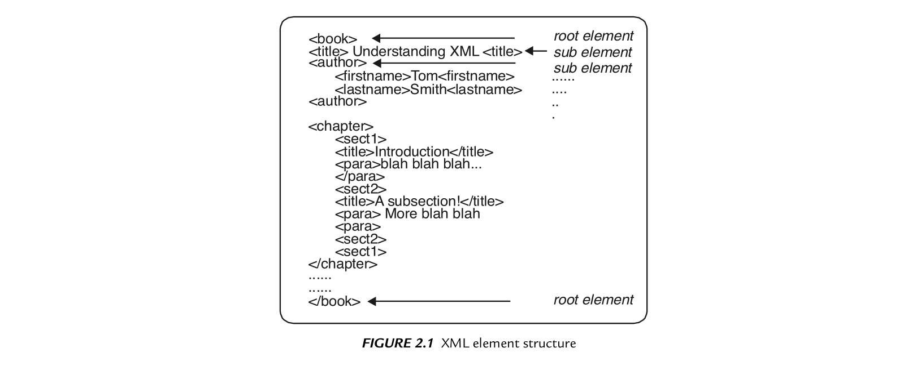
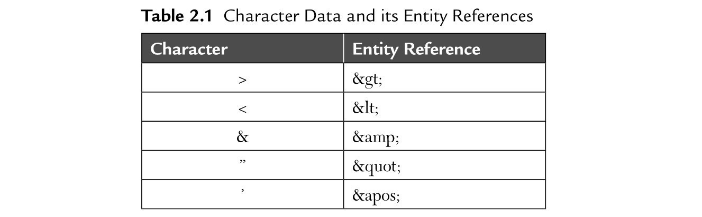

# XML Syntax

[Előző](1.md)


## The Well-formed document

* XML olyan eszköz, amellyel jelölőnyelvek generálhatók általános, nem pedig konkrét jelölőnyelven -> módszer a címke létrehozásához
* Címkék + szöveg = XML dokumentum
* Dokumentum szó félrevezető -> XML egy fájl, de adatfolyamként adatbázis result setként is elküldhető. Alkalmazás is generálhatja dinamikusan és elküldheti egy másiknak. -> XML dokumentum = "data object"
* XML-dokumentumnak "jól-formázottnak" kell lennie, mert az XML processzor nem érti meg -> leáll, "fatal error"

## XML Document Structure

* XML adatok tárolására -> nem feltétlenül megtekintésre
* HTML-hez hasonló elrendezés
  * HTML-ben HEAD és BODY
  * XML-ben prolog és példány vagy törzs (instance or body)
* Logikai és fizikai szerkezet
  * Logikailag:
    * deklarációk
    * elemek
    * megjegyzések
    * karakterhivatkozások
    * feldolgozási utasítások
* XML-dokumentum érthető a benne lévő:
  * **adatok** (bármi a Unicode-on belül, vagy lehet bináris is)
  * és ezeket leíró **jelölések** (címkék, megyjegyzések, feldolgozási utasítások, DTD-k, hivatkozások) alapján
* **XML deklaráció** 
  * feldolgozási utasítás
  * nem kötelező, de célszerű, W3C ajánlja
  * `<?xml version = "1.0"?>`
* **Feldolgozási utasítás:**
  * `<?...?>`
  * kezdeti `<?` után feldolgozási utasítás neve
  * megköveteli **"version"** attribútumot
  * opcionális **"standalone"** és **"encoding"** attribútumok (kell a version!)

## Prolog Section

* Dokumentum bevezetője

```
<?xml version="1.0'?>
<!DOCTYPE book SYSTEM "DTD/book.dtd">
```

1. rész XML-deklaráció
2. rész Dokumentumtípus-meghatározás (Document Type Definition)
   1. beállítja a dokumentum összes szabályát az elemekre, attribútumokra és egyéb összetevőkre
   2. lehet: 
      1. külső: különálló dokumentum, XML-dokumentumból hivatkozva
         1. SYSTEM kulcsszó: mindig, amikor abszolút vagy relatív elérési útra vagy URL-re hivatkozunk
         2. PUBLIC kulcsszó: nyilvános azonosító, W3C vagy más által definiált szabványos DTD, amely adott nyilvános azonosítóhoz van társítva
   
            ```
            <!DOCTYPE html PUBLIC "-//W3C//DTD XHTML 1.0 Transitional//EN"
            "http://www.w3.org/TR/xhtml1/DTD/xhtml1-transitional.dtd">
            ```

      2. belső: teljes egészében az XML fájlban

## The standalone attribute

* Van-e külön dokumentumban meghatározott jelölési deklarációkkal
  * **"yes"**: nem lesznek jelölési deklarációk külső DTD-kben
  * **"no"**: probléma nyitva marad -> dokumentum hozzáférhet külső DTD-khez (vagy nem)

## The encoding attribute

* XML elemzők támogatják 8 és 16 bit Unicode kódolás, vagy nagyobb készletet is
* **Elemek**: XML tartalom alapegységei -> kezdő címke + záró címke + minden, ami köztük van
  * címkék közötti szöveg: karakteradatok (character data)
  * címkéken belüli szöveg: jelölés (markup)

## Instance Section

* XML-dokumentum többi része, dokumentum tényleges tartalma (karakterek, bekezdések, oldalak, grafikák)

## Elements

* Elemek -> XML dokumentum legfontosabb részei
* Nyitó és zárócímkébe zárt tartalom -> többféle típusú tartalom
  * Elem tartalom (element content): csak más elemeket tartalmaz
  * Vegyes tartalom (mixed content): szöveget és egyéb elemeket is tartalmaz
  * Egyszerű tartalom (simple content): csak szöveg
  * Üres tartalom (empty content): Nem tartalmaz információt 
    * `<image src="test.jpg"></image>`
    * rövidíthető: `<image src="test.jpg" />`
* kis- és nagybetű érzékeny
* XML-ben mindig kell kezdeti és záró címke
* beágyazott címkék sorrendje nem felcserélhető -> első megnyitott elemnek mindig utolsó zárt elemnek kell lennie
* A jól formázott dokumentum még nem biztosan érvényes -> követnie kell DTD vagy a séma által meghatározott megszorításokat
* Kell egyetlen gyökér elem -> lehetnek alelemei. XML-dokumentum -> elemekből álló fa



## Character data

* Bármilyen Unicode karakter lehet a "<" kivételével -> címke kezdetére van fenntartva
* Entitáshivatkozások:



## CDATA

* A CDATA blokkokban az összes címkét és entitáshivatkozást figyelmen kívül hagyja az XML-feldolgozó -> karakteradatokként kezeli mindet
* Használata: nagy, speciális karakterblokkok -> nem akarunk állandóan entitáshivatkozásokat használni (pl. ha XML-ről írunk XML-ben)

## Comment

* Megjegyzés szöveg, az XML feldolgozó teljesen figyelmen kívül hagyja
* Pl: `<!-- Begin the Names -->`
* Megjegyzésben soha ne szerepeljen a "-" vagy "--", mert megzavarhatja az XML-feldolgozót (XML processor)
* Nem lehet megjegyzés
  * címkén belül -> hibás: `<NAME <!--The name --> >Peter Williams</NAME>`
  * entitásdeklarációban
  * XML-deklaráció előtt (ennek mindig az 1. sornak kell lennie)

## Processing Instruction

* XML-deklaráció is egy feldolgozási utasítás
* A feldolgozási utasítás az XML-dokumentumot használó alkalmazás számára szánt információ
* XML parser (elemző) továbbítja az alkalmazásnak
* formátum: `<?NAME_OF_APPLICATION_INSTRUCTION_IS_FOR INSTRUCTIONS?>`
* pl: `<?JAVA_OBJECT JAR_FILE = "/java/myjar.jar"?>`

## Entities

* Entitások alapvetően aliasok, melyek nagy szövegrészekre hivatkoznak anélkül, hogy újra ki kellene gépelni ezeket
* Hivatkozás: pl `&letterhead;`, ha fejlécet mentettünk
* Entitás lehet:
  * általános (general)
  * paraméteres
* Entitás felépítése:
  * deklaráció
  * entitáshivatkozás

## General Entities

`<!ENTITY NAME "text that you want to be represented by the entity">`

`<!ENTITY full_name "Shashi Banzal">`

## Parameter Entities

* Lehetnek:
  * Belsők
  * Külsők
* Csak DTD-ben
* Jól formázott paraméter entitás ugyanúgy néz ki mint az általános, kivéve, hogy tartalmazza a "%" specifikációt
* pl: `<!ENTITY % NAME "text that you want to be represented by the entitiy">`
* Entitások deklarálása -> DOCTYPE deklarációban kell, mely mindig a prologot követi (DTD és XML deklaráció)

```
<?xml version="1.0'?>
  <!DOCTYPE myDocument [
    ...here is where you declare your entities...
  ]>
  <myDocument>
  ... here is the body of your document...
  </myDocument>
  ```

  ```
  <?xml version="1.0" encoding="UTF-8"?>
<!DOCTYPE CLIENTS [
    <!ENTITY ninthFloorAdress "2345 Broadway St Floor 9">
    <!ENTITY eightFloorAdress "2345 Broadway St Floor 8">
    <!ENTITY seventhFloorAdress "2345 Broadway St Floor 7">
]>
<CLIENTS>
    <CLIENT>
        <NAME>Fred Jenkins</NAME>
        <ADRESS>&ninthFloorAdress;</ADRESS>
        <PHONE>x345</PHONE>
    </CLIENT>
    <CLIENT>
        <NAME>Ravi Gupta</NAME>
        <ADRESS>&ninthFloorAdress;</ADRESS>
        <PHONE>x111</PHONE>
    </CLIENT>
    <CLIENT>
        <NAME>Natalia Kinski</NAME>
        <ADRESS>&ninthFloorAdress;</ADRESS>
        <PHONE>x346</PHONE>
    </CLIENT>
    <CLIENT>
        <NAME>Mary Smith</NAME>
        <ADRESS>&seventhFloorAdress;</ADRESS>
        <PHONE>x289</PHONE>
    </CLIENT>
    <CLIENT>
        <NAME>Kristin Mancuso</NAME>
        <ADRESS>&eightFloorAdress;</ADRESS>
        <PHONE>x945</PHONE>
    </CLIENT>
</CLIENTS>
```

## Entity References

* Entitáshivatkozások -> kulcsra utalnak, mely feloldja a deklarált entitást
* `&ENTITY_NAME;` -> `&letterhead;`
* Paraméter entitások ugyanúgy, de "&" helyett "%" -> 
  `%PARAMETER_ENTITY_NAME;`
* Entitáshivatkozások használhatók a címkén belül ->
  `<INVOICE CLIENT = "&IBM;" PRODUCT = "&PRODUCT_ID_8762;" QUANTITY = "5">`

## Attributes

* Az elemeknek a tartalom mellett attribútumaik is lehetnek -> jellemzők csatolása egy elemhez (mint HTML-ben)
* Kezdőcímkén belül helyezkednek el, nevük és értékük van -> `<image src="images/test.jpg" />`
* DTD-ben érvényes attribútumok, és adott attribútumok mely értékei érvényesek
* Egy elemnek több attribútuma is lehet -> értékek mindig idézőjelek között ('' vagy "") -> 
  `<topic name="Brian O'Sullivan">`
  `<topic name=' The Use o "s in Popular Literature'>`
* Attribútum ábrázolható elemmel, elem konvertálható attribútummá
* Mikor használjunk:
  * elemeket: többértékű adatokhoz (több érték tartozhat hozzá, vagy nagyon hosszúak)
  * attribútumokat: egyértékű adatokhoz
  * de: ettől eltérő megoldás is helyes, személyes preferenciától függ

## Entities' References and constants

* Entitáshivatkozás: speciális adattípus az XML-ben, amely másik adatra hivatkozik
* 5 speciális érték: -> escape characters
  
|&lt; | < |
|&gt; | > |
|&amp; | & |
|&quot; | " |
|&apos; | ' |

* Meghatározhatók változók vagy állandók az XML-dokumentumon belül

```
<!ENTITY rpsca "Royal Soc. for the Prevention of Cruelty to Animals">
```

* `&rspca;` hivatkozik rá, nem kell mindig beírni -> lehet ilyen e-mail cím is (ha megváltozik csak egy helyen kell átírni)

## Unparsed data

* Adatok, melyeket az értelmező figyelmen kívül hagy:
  * megjegyzések
  * feldolgozási utasítások (PI-k)
  * karakteradatok (CDATA)

## Character Data (CDATA)

* értelmező figyelmen kívül hagy mindent a CDATA szakaszon belül
  * jelentős mennyiségű adat átadható a hívó alkalmazásnak XML-feldolgozás nélkül
  * XML és HTML mintáinak megjelenítésére
  * programkódok megjelenítésére

## Processing Instructions (PIS)

* Feldolgozási utasítások -> XML-dokumentumok utasítások az alkalmazásokhoz
* Formátum: `<?...?>`
* Eddig csak a prologban lévő volt:
  `<?xml version="1.0"?>`

## Questions for discussion [^1]

[Következő](3.md)

---
[^1]: XML Basics, pdf, 75. oldal (50. számozott oldal)