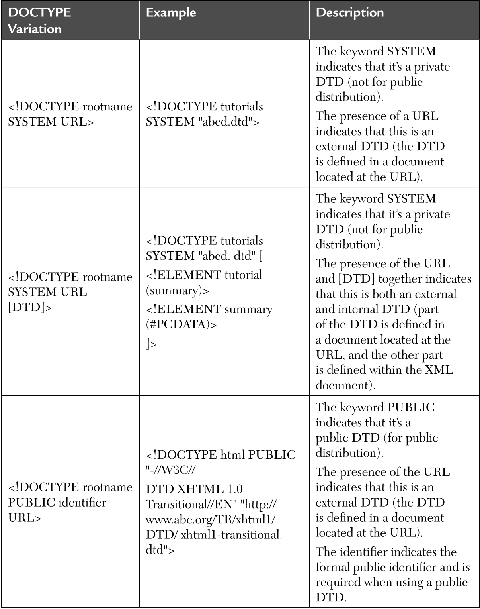

# Document Type Definition (DTD)

[Előző](2.md)


## Physical Structure in XML

* Fizikai szerkezet -> dokumentumban használt összes tartalom
* Tárolóegységek -> entitások ->
  * a dokumentum részei vagy dokumentumon kívüliek
  * egyedi név, saját tartalom
  * Lehetnek:
    * elemzettek vagy elemzés nélküliek
    * előre meghatározottak
    * külső vagy belső

## Parsed and unparsed entities

* Elemzett entitás (parsed):
  * szöveges adatok -> feldolgozás után dokumentum részévé válik
  * XML feldolgozó olvassa -> megjelenik a dokumentum részeként

```
<!ENTITY Publisher1 "McGrawHill Publishing Company.">
```

* Nem elemzett (unparsed):
  * tároló
    * tartalma lehet szöveg -> tartalom nem értelmezhető XML
    * tartalma nem szöveg -> bináris entitás (pl. kép)
  * jelölés -> azonosítja erőforrás formátumát vagy típusát

```
<!NOTATION GIF SYSTEM "/Utils/Gifview.exe">
```

## Predefinied Entities

* Bizonyos karakterek jelölésként értelmezendők `<> és /` -> escape karakterek

## Internal and external entity

* Belső entitás: nincs külön fizikai tárhelyen -> tartalma deklarációjában szerepel

```
<!ENTITY Publisher1 "McGrawHill Publishing Company.">
```

* Külső entitás: tárolóegységre hivatkozik

```
<!ENTITY FirsImg SYSTEM "www.books.com/images/book1.gif" NDATA GIF>
```

## XML General Syntax

* Minden elemhez zárócímke
* Üres elem címke -> speciális formátum `<TAGNAME/>`

## Attributes

* Értékeket rendelhetünk egy elemhez anélkül, hogy az elem tartalmának részévé válnának

```
<PRICE CURRENCY="USD">315.00</PRICE>
```

## Valid Documents

* Prologban megadott DTD -> 
  * dokumentumra vonatkozó összes szabály -> érvényes dokumentumnak meg kell felelni ezeknek és 
  * XML specifikációban meghat. évrényességi megszorításoknak
* XML-feldolgozó
  * érvényességi korlátok megértése
  * dokumentum ellenőrzése (megfelel-e érvényességi korlátoknak)
  * hibajelzés XML alkalmazásnak
* Well-formed document koncepció támogatása

## Well-formed documents

* XML ajánlás követelményeinek megfelelés -> egyetlen gyökérelem, többi megfelelően beágyazva
* Ha jól formázott, számítógépes program olvasni tudja
* Hitelesített dokumentumot (szerver által) nem kell újra ellenőrizni (kliensnek)
* Adatobjektumok, amelyek megfelelnek az XML-syntax specifikációjának -> well-formed XML-dokumentumok -> standalone (önálló) dokumentumok
* Nem függnek külső deklarációtól, attribútumértékeknél nincs speciális feldolgozás, és alapértelmezett értékek
* Hierarchikus fa forma -> szülő-gyermek kapcsolat
* Ha XML-dokumentum nem jól formázott -> XML elemző "fatal error" hibaüzetet ad

## Well-formed XML documents

* Megfelelő szintaxis -> előző fejezetekben

## XML documents

***Pelépítése:***
* Opcionális prolog
* Dokumentum elem beágyazott elemekkel
* Opcionális megjegyzések, feldolgozás utasítások

***Prolog:***
* XML deklaráció
* Feldolgozási utasítások
* Megjegyzések
* Document Type Declaration (DTD)

## The XML declaration

* 1.sor

```
<?xml version="1.0" encoding="UTF-8"standalone="yes"?>
```

* verzió megadása kötelező, többi nem
* standalone -> "no"
  * alapértelmezett értékek használatánál, 
  * markup deklaráció használatakor, 
  * entitások deklarálásánál

## Processing Instructions

* Paraméterek átadására egy alkalmazásnak -> információk XML-dokumentum feldolgozásához

```
<?xml-stylesheet href="beatles.xsl"type="text/xsl"?>
```

## Comments

```
<!--This is a comment-->
```

## Document Type Declaration

* Jelölőkód, ami a nyelvtani szabályokat vagy a Document Type Definitont (DTD) tartalmazza
* Külső fájlra is mutathat
* Jelzés a feldolgozónak, hogy a dokumentum Catalog osztályba tartozik, megfelel a "book.dtd"-nek

```
<?xml version="1.0" encoding="UTF-8"?>
<!DOCTYPE book SYSTEM "Book.dtd">
<Book>
    <Bookname>Paradise Lost</Bookname>
    <Author>John Milton</Author>
</Book>
```

* Attribútumok hozzáadása

```
<element.type.name attribute.name="attribute value">
```

* Ha egy elem több attribútumkészlettel jelenik meg -> attribútumkészlet egyesül
* Adott elemhez tartozó első deklaráció számít, többit figyelmen kívül hagyja XMl-feldolgozó

## XML application classification

* XML alkalmazások DTD nélkül
  * saját elemek tartalommal való használatra
  * megadjuk megfelelő DTD-t
  * Megfelelő dokumentáció nélkül ezek az elemek értelmetlenek
  * Formális DTD nélkül csak adott XML példányban használhatók
* XML alkalmazások DTD-vel
  * Belső, dokumentumba ágyazott DTD-vel
  * Külső, hivatkozott DTD-vel
    * "önálló"
    * "nyilvánosan elérhető" -> FPI-vel (Formal Public Identifier) való hivatkozás

## Parsers

* Kétféle elemző
  * nem érvényesítő (non-validating) ->
  * érvényesítő (validating)
    * az elemző DTD-t használ a jól formált dokumentum formájának és tartalmának érvényesség ellenőrzéséhez
    * konfigurációs kapcsololókkal
    * határolókarakterek OS specifikusak
    * 

## XML Processing-attribute values

* Elemzők karakter- és hivatkozáskezelése


## XML Processing

* AttValue feldolgozása kezdő vagy záró szóközök eltávolításával, többszörös szóközök eggyé alakításával (kivéve CDATA DTD-ben deklarálva érvényesítő elemzővel)
* Parserek (elemzők)
  * eseményvezérelt
  * faalapú elemzők

## Event-driven parsers

* Eseményvezérelt elemző:
  * visszahívás az alkalmazáshoz minden nem üres XML adatosztály esetében
  * adatok visszahívásokon keresztül érhetők el, adatkezelés az alkalmazástól függ
  * elemfa-szerkezet nincs karbantartva

## Tree-based parsers

* Hierarchikus faszerkezet
  * algoritmusok az XML-dokumentumok csomópontjainak bejárására
  * W3C DOM modellnek megfelel -> DOM: platform- és nyelvsemleges interfész faszerkezetű dokumentumok kezelésére
  * MSXML -> Java alapú XML-t a Microsoft fejlesztette ki -> Internet Explorer 5-ben másik értelzővel került be

## XML parser

* Minden modern böngészőben XML parser -> XML-DOM objektummá alakítja, JavaScripttel manipulálható

## Parse an XML document

Kódrészlet XML-dokumentum XML DOM objektummá alakításához

```
if (window.XMLHttpRequest)
{// code for IE7+, Firefox, Chrome, Opera, Safari
xmlhttp=new XMLHttpRequest();
}
else
{// code for IE6, IE5
xmlhttp=new ActiveXObject("Microsoft.XMLHTTP");
}
xmlhttp.open("GET", "books.xml", false);
xmlhttp.send();
xmlDoc=xmlhttp.responseXML;
```

## Parse an XML string

XML szöveg XML DOM objektummá alakítása

```
txt=”<bookstore><book>”;
txt=txt+”<title>Everyday Italian</title>”;
txt=txt+”<author>Giada De Laurentiis</author>”;
txt=txt+”<year>2005</year>”;
txt=txt+”</book></bookstore>”;
if (window.DOMParser) 
{ 
    parser=new DOMParser();
    xmlDoc=parser.parseFromString(txt,”text/xml”);
} 
else // Internet Explorer 
{ 
    xmlDoc=new ActiveXObject(„Microsoft.XMLDOM”);
    xmlDoc.async=”false”;
    xmlDoc.loadXML(txt);
}
```

## Document Type Definitions (DTDS)

* DTD -> szabályok hozhatók létre XML dokumentumokban saját igények szerint
* DTD XML dokumentum tetején deklarálva -> tartalma lehet XML-dokumentumban, vagy másik dokumentumban (vagy mindkettő)
* Formális nyelvtan az XML-dokumentumok szerkezetének és megengedett értékeinek meghatározására
* DTD-vel érvényes XML -> megfelel XML szintaktikai szabályainak és DTD-ben meghatározottaknak
* Elemzők DTD-t is használhatják
* DTD-ben formális szerkezet -> világos pontos szintaktikai szabálykészlet arra, mi megengedett

## Example DTD

```
<!ELEMENT tutorials (tutorials)+>
<!ELEMENT tutorial (name, url)>
<!ELEMENT name (#PCDATA)>
<!ELEMENT url (#PCDATA)>
<!ATTLIST tutorials type CDATA #REQUIRED>
```

## DTD `<!DOCTYPE>`

* Dokumentumtípus meghatározás

## Doctype syntax

* DTD használatához deklarálni kell a prologban a következő alapján:

```
<!DOCTYPE rootname [DTD]>
```

* rootname = gyökérelem
* [DTD] = tényleges definíció
* Eltérések lehetnek DTD külső vagy belső, nyilvános vagy privát





## XML syntax rules

* Viszonylag egyszerű, de nagyon szigorú szintaktikai szabályok (ld. korábbi formázási szabályok)

## DTDS (well-formed vs. valid)

* Jól formázott: követi a szintaktikai szabályokat
* Érvényes: megfelel meghatározott struktúrának összevetve egy sémával (meghatározza XML-dokumentum osztályának szerkezetét)

## General principles in writing DTDS

* Dokumentum összes elemének és a köztük lévő kapcsolat meghatározása
* DTD-k dokumentumokhoz társítva -> az érvényesítő feldolgozó beolvassa a DTD-t -> érvényesíti
* XML deklaráció után DOCTYPE deklaráció (elemek előtt), köztük csak megjegyzések lehetnek
* DOCTYPE kulcsszó + root neve + tartalomdeklarációt behozó szerkezet

## Document validation

* Hibák a kódban előfordulhatnak, értelmező nem tudja kiszűrni
* W3C meghatározza érvényesítő feldolgozó viselkedését -> ha XML-dokumentum DTD-re hivatkozik, érvényesítő feldolgozó kell a DTD lekéréséhez, DTD-ben leírtaknak való megfelelés biztosításához
* Ezután továbbítható application logic felé

## Validating an XML document with a DTD

* DOCTYPE jelzi a dtd fájlt, ugyanabba könyvtárba kell a hivatkozott fájlt

## The purpose of DTDS

* DTD célja: XML-dokumentum szerkezetének meghatározása

```
<?xml version="1.0" encoding="UTF-8"?>
<!DOCTYPE beatles SYSTEM "Beatles.dtd">
<beatles>
    <beatle link="http://www.paulmccartney.com/">
        <name>
            <firstname>Paul</firstname>
            <lastname>McCartney</lastname>
        </name>
    </beatle>
    <beatle link="http://www.johnlennon.com/">
        <name>
            <firstname>John</firstname>
            <lastname>Lennon</lastname>
        </name>
    </beatle>
    <beatle link="http://www.georgeharrison.com/">
        <name>
            <firstname>George</firstname>
            <lastname>Harrison</lastname>
        </name>
    </beatle>
    <beatle link="http://www.ringostarr.com/">
        <name>
            <firstname>Ringo</firstname>
            <lastname>Starr</lastname>
        </name>
    </beatle>
    <beatle link="http://www.webucator.com/" real="no">
        <name>
            <firstname>Nat</firstname>
            <lastname>Dunn</lastname>
        </name>
    </beatle>
</beatles>
```

Hozzá kapcsolódó DTD:

```
<!ELEMENT beatles (beatle+)>
<!ELEMENT beatle (name)>
<!ATTLIST beatle 
link CDATA #IMPLIED
real (yes|no) "yes">
<!ELEMENT name (firstname, lastname)>
<!ELEMENT firstname (#PCDATA)>
<!ELEMENT lastname (#PCDATA)>
```

* DTD egy sématípus -> sturktúra, keret meghatározása -> lehetővé teszi különböző szervezetek számára, hogy megosztható adatfáljokat készítsenek.

## Creating DTDS

* Egyszerű szövegfájlok, bármilyen szövegszerkesztővel létrehozhatók
* Felvázolja milyen elemek lehetnek egy XML-dokumentumban, és milyen attribútumokat és alelemeket vehetnek fel.

## Code Sample: DTDS/DEMOS/Beatles.DTD

```
<!ELEMENT beatles (beatle+)>
<!ELEMENT beatle (name)>
<!ATTLIST beatle 
link CDATA #IMPLIED
real (yes|no) "yes">
<!ELEMENT name (firstname, lastname)>
<!ELEMENT firstname (#PCDATA)>
<!ELEMENT lastname (#PCDATA)>
```

## Internal DTD

* Külső és belső DTD tényleges szintaxisa ugyanaz
* Különbség a DOCTYPE deklarálásban van
* Belső DTD használatával a kód a DOCTYPE  címkék közé kerül

```
<!DOCTYPE tutorials [ and ]>
```

## Example internal DTD

```
<?xml version="1.0" encoding="UTF-8" standalone="yes"?>
<!DOCTYPE tutorials [
    <!ELEMENT tutorials (tutorial)+>
    <!ELEMENT tutorial (name, url)>
    <!ELEMENT name (#PCDATA)>
    <!ELEMENT url (#PCDATA)>
    <!ATTLIST tutorials>
]>
<tutorials>
    <tutorial>
        <name>XML Tutorial</name>
        <url>http://www.abc.com/xml/tutorial</url>
    </tutorial>
    <tutorial>
        <name>HTML Tutorial</name>
        <url>http://www.abc.com/html/tutorial</url>
    </tutorial>
</tutorials>
```

## External DTD

* Külön dokumentumban -> hivatkozni rá DTD fájl URI-jének megadásával (relatív vagy abszolút hivatkozás)

## Example external DTD

```
<?xml version="1.0" encoding="UTF-8" standalone="no"?>
<!DOCTYPE tutorials SYSTEM "tutorial_external.dtd">
<tutorials>
    <tutorial>
        <name>XML Tutorial</name>
        <url>http://www.abc.com/xml/tutorial</url>
    </tutorial>
    <tutorial>
        <name>HTML Tutorial</name>
        <url>http://www.abc.com/html/tutorial</url>
    </tutorial>
</tutorials>
```

Hozzá tartozó DTD fájl

```
<!ELEMENT tutorials (tutorial)+>
<!ELEMENT tutorial (name, url)>
<!ELEMENT name (#PCDATA)>
<!ELEMENT url (#PCDATA)>
<!ATTLIST tutorials> <!--type CDATA #REQUIRED-->
```

## Combined DTD

* Használható egyszerre külső és belső DTD is (központi + saját meghatározás)

## DTD elements

* DTD létrehozása -> elemek, attribútumok és/vagy entitások meghatározása
* Elem meghatározása: `<!ELEMENT>` deklaráció 
* Tartalma: elemre alkalmazandó szintaktikai szabályoktól függ

## Basic Syntax

```
<!ELEMENT element_name content_model>
```

* element_name: definiálandó elem neve
* content_model: jelezhet:
  * egy **konkrét szabályt**
    * ANY
    * EMPTY
  * **adatot vagy más elemet** -> adattípus/elem nevét zárójelek közé kell tenni (tutorial) vagy (#PCDATA)

## Plain text

* Ha egy elemnek egyszerű szöveget kell tartalmaznia, akkor a `#PCDATA` segítségével határozza meg ->
  * Parsed Charachter Data -> a mód, ahogyan nem jelölő szöveget adunk meg a DTD-ben

```
<name>XML Tutorial</name>
```

Példában PCDATA az "XML Tutorial -> másik rész a jelölés

***Syntax***

```
<!ELEMENT element_name (#PCDATA)>
```

***Példa***

```
<!ELEMENT name (#PCDATA)>
```

## Unstricted elements

* Ha nem számít mit tartalmaz az elem -> `ANY` conten_model használható
* Eltávolítja az összes szintaktikai ellenőrzést -> kerülendő

***Syntax***

```
<!ELEMENT element_name ANY>
```

***Példa***

```
<!ELEMENT tutorials ANY>
```

## Empty elements

* Üres elem, amelyben nincs záró címke -> pl XHTML-ben a `<br/>` és `` üres elemek

***Syntax***

```
<!ELEMENT element_name EMPTY>
```

***Példa***

```
<!ELEMENT header EMPTY>
```

## Child elements

* Elemeket tartalmazó elemek

***Syntax***

```
<!ELEMENT element_name (child_element_name)>
```

***Példa***

```
<!ELEMENT tutorials(tutorial)>
```

* Elem neve utáni módosítóval megadható hányszor jelenjenek meg az elemek -> ha nincs módosító: egyszer, és csak egyszer

| Modifier | Description |
|---|---|
| `?` | Egyszer vagy egyszer sem |
| `+` | Egyszer vagy többször |
| `*` | 0 vagy több |

## Other elements

* A többi elemet ugyanúgy deklarálni, mint a dokumentumelemet -> `<!ELEMENT>` deklarációval
* Minden beatle elemnek tartalmaznia kell egy név elemet, amelynek egyszer és csak egyszer kell megjelennie

```
<!ELEMENT beatle (name)>
```

* Minden elem névnek tartalmaznia kell egy firstname és lastname elemet, amit egyszer és csak ebben a sorrendben kell megjeleníteni

```
<!ELEMENT name (firstname, lastname)>
```

* Egyes elemek csak szöveget tartalmaznak -> DTD-ben `#PCDATA`

```
<!ELEMENT firstname (#PCDATA)>
```

## Choice of elements

```
<!ELEMENT img (name|id)>
```

* img elemnek lehet gyerekelem neve vagy gyerekelem azonosítója, de midkettő nem.

## Empty elements

```
<!ELEMENT img EMPTY>
```

## Mixed content

* Néha az elemeknek elemei és szövegei keveredhetnek -> olyan body elem, amely tetszőleges számú link és img elem mellett szöveget is tartalmazhat.

```
<!ELEMENT body (#PCDATA | link | img)*>
```

## Multiple Child elements (sequences)

* Megadhatók elemek vesszővel elválasztott listája -> ha egynél több elemet kell tartalmaznia = sorozat ->
* XML-dokumentumnak ugyanolyan sorrendben kell tartalmaznia a címkéket

***Syntax***

```
<!ELEMENT element_name (child_element_name, child_element_name, ...)>
```

***Példa***

```
<!ELEMENT tutorial (name, url)>
```

* tutorial elem tartalmazza a name elem és az url elem egy példányát az XML dokumentumban

```
<tutorials>
<tutorial>
<name></name>
<url></url>
</tutorial>
</tutorials>
```

## AN XML application without a DTD

```
<?xml version="1.0" encoding="UTF-8" standalone="yes"?>
<?xml-stylesheet href="fragment_style.css" type="text/css"?>
<quote>
    <title>
        The quick brown fox jumps over the lazy dog.
    </title>
    <comment>
        This quote has <property>all the alphabets</property> of the English language.
    </comment>
</quote>
```

CSS hozzá:

```
property {
  display: inline; 
  font-style: italic; 
  color: rgb(000,000,128);
}

quote, title, comment {
    display: block;
    margin: 0,5em;
}

title {
    font-size: 1.5em;
}
```

## DTD element operators


### Zero or More

***Syntax***

```
<!ELEMENT element_name (child_element_name*)>
```

***Példa***

```
<!ELEMENT tutorials(tutorial*)>
```

### One or More

***Syntax***

```
<!ELEMENT element_name (child_element_name+)>
```

***Példa***

```
<!ELEMENT tutorials(tutorial+)>
```

### Zero or One

***Syntax***

```
<!ELEMENT element_name (child_element_name?)>
```

***Példa***

```
<!ELEMENT tutorials(tutorial?)>
```

### Choices

* Választhatunk elemek között, de csak az egyiket

***Syntax***

```
<!ELEMENT element_name (choice_1|choice_2|choice_3)>
```

***Példa***

```
<!ELEMENT tutorials(name|title|subject)>
```

### Mixed Content

* Választhatunk elemek között, de csak az egyiket

***Syntax***

```
<!ELEMENT element_name (#PCDATA | child_element_name)>
```

***Példa***

```
<!ELEMENT tutorials(#PCDATA|name|title|subject)>
```

## DTD operators with sequences

## Subsequences

## The document element

## Location of modifier

## Using parentheses for complex declarations

## XML CDATA

## PCDATA-parsed character data

## CDATA-(unparsed) character data

## Notes on CDATA sections

## Internal & External subsets

## Standalone attribute

## Doctype Declaration

## Internal DTD subset declarations

## External DTDs

## Basic Markup declarations

## Formal DTD structure-entities

## Predefined entities

## General entities

## Parameter entities

## Formal DTD structure-elements

## Content model

## Cardinally operators

## Attributes

## Default values

## Attribute types

## CDATA

## ID

## IDREF

## Entity

## Entity, entities

## NMTOKEN, NMTOKENS

## Notation

## Enumerations

## Declaring attributes

## Conditionali sections

## Limitations of DTDs

## Designing XML documents

## XML for messages

## XML for persistent data

## Mapping the information model to XML

## A document type declaration

## Elements

## Empty elements

## Attributes

## CDATA

## White space

## Special characters

## Questions for discussion

[Következő](4.md)

---
[^1]: 