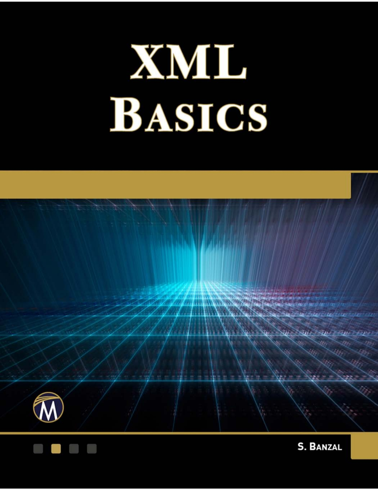

# Shashi Banzal: XML Basics jegyzetek [^1]

## Fejezetek

1. [Understanding XML](1.md)
2. [XML Syntax](2.md)

## Feladatok:

- [x] 1.md mindmapjának elkészítése
- [ ] 2.md fájl létrehozása, előkészítése

---
[^1]: Shashi Banzal: XML Basics, Mercury Learning and Information, 2020.