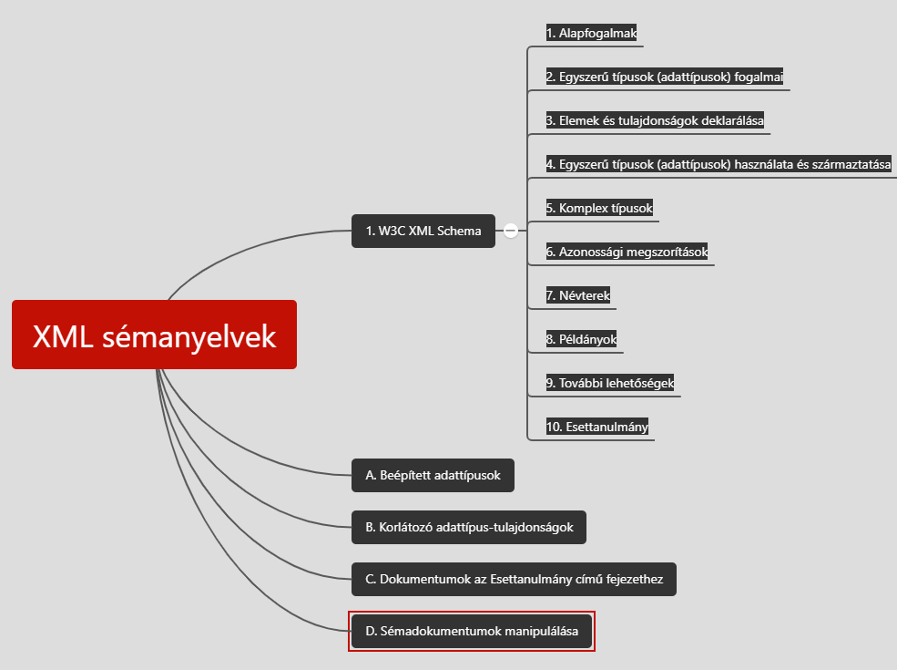

# Jeszenszky Péter - XML sémanyelvek [^1]



## Tartalomjegyzék

1. [Jeszenszky Péter - XML sémanyelvek \[^1\]](#jeszenszky-péter---xml-sémanyelvek-1)
   1. [Tartalomjegyzék](#tartalomjegyzék)
   2. [I. W3C XML Schema](#i-w3c-xml-schema)
         1. [Bevezetés](#bevezetés)
      1. [1. Alapfogalmak](#1-alapfogalmak)
         1. [Sémák és démadokumentumok](#sémák-és-démadokumentumok)
            1. [Sémakomponensek](#sémakomponensek)
            2. [Sémák ábrázolása sémadokumentumokban](#sémák-ábrázolása-sémadokumentumokban)
         2. [Deklarációk és definíciók](#deklarációk-és-definíciók)
         3. [Típusrendszer](#típusrendszer)
            1. [Típusdefiníciók](#típusdefiníciók)
            2. [Egyszerű és komplex típusok](#egyszerű-és-komplex-típusok)
            3. [Típushierarchia](#típushierarchia)
      2. [2. Egyszerű típusok (adattípusok) fogalmai](#2-egyszerű-típusok-adattípusok-fogalmai)
         1. [Bevezetés](#bevezetés-1)
         2. [Adattípusok fajtái](#adattípusok-fajtái)
            1. [Primitív és származtatott adattípusok](#primitív-és-származtatott-adattípusok)
            2. [Beépített és felhasználói származtatott adattípusok](#beépített-és-felhasználói-származtatott-adattípusok)
            3. [Atomi, lista és unió adattípusok](#atomi-lista-és-unió-adattípusok)
         3. [Adattípus fogalma](#adattípus-fogalma)
            1. [Értéktér](#értéktér)
            2. [Lexikális tér](#lexikális-tér)
            3. [Adattípus-tulajdonságok](#adattípus-tulajdonságok)
         4. [Adattípus-alaptulajdonságok](#adattípus-alaptulajdonságok)
            1. [`bounded`](#bounded)
            2. [`cardinality`](#cardinality)
            3. [`numeric`](#numeric)
            4. [`ordered`](#ordered)
         5. [Lista adattípusok](#lista-adattípusok)
         6. [Unió adattípusok](#unió-adattípusok)
         7. [Példa: a decimal adattípus](#példa-a-decimal-adattípus)
      3. [3. Elemek és tulajdonságok deklarálása](#3-elemek-és-tulajdonságok-deklarálása)
         1. [Bevezetés](#bevezetés-2)
         2. [Elemek deklarálása](#elemek-deklarálása)
            1. [Előfordulások száma](#előfordulások-száma)
            2. [Alapértelmezett érték](#alapértelmezett-érték)
            3. [Rögzített érték](#rögzített-érték)
            4. [Helyettesítési csoportok](#helyettesítési-csoportok)
            5. [Absztrakt elemek](#absztrakt-elemek)
         3. [Tulajdonságok deklarálása](#tulajdonságok-deklarálása)
            1. [Előfordulás](#előfordulás)
            2. [Alapértelmezett érték](#alapértelmezett-érték-1)
            3. [Rögzített érték](#rögzített-érték-1)
         4. [Tulajdonságcsoport definíciók](#tulajdonságcsoport-definíciók)
      4. [4. Egyszerű típusok (adattípusok) használata és származtatása](#4-egyszerű-típusok-adattípusok-használata-és-származtatása)
         1. [Bevezetés](#bevezetés-3)
         2. [Beépített adattípusok](#beépített-adattípusok)
         3. [Literálok használata példányokban](#literálok-használata-példányokban)
            1. [Whitespace karakterek kezelése](#whitespace-karakterek-kezelése)
         4. [Adattípusok definiálása](#adattípusok-definiálása)
         5. [Adattípusok származtatása megszorítással](#adattípusok-származtatása-megszorítással)
         6. [Adattípusok származtatása listaképzéssel](#adattípusok-származtatása-listaképzéssel)
         7. [Adattípusok származtatása unióképzéssel](#adattípusok-származtatása-unióképzéssel)
         8. [Az anySimpleType adattípus](#az-anysimpletype-adattípus)
      5. [5. Komplex típusok](#5-komplex-típusok)
         1. [Komplex típusok definiálása](#komplex-típusok-definiálása)
         2. [Csak elmeket tartalmazó elemek](#csak-elmeket-tartalmazó-elemek)
            1. [Tartalommodellek](#tartalommodellek)
            2. [Modellcsoportok](#modellcsoportok)
            3. [Modellcsoportokra vonatkozó korlátozások](#modellcsoportokra-vonatkozó-korlátozások)
            4. [Modellcsoport-definícók](#modellcsoport-definícók)
         3. [Vegyes tartalmú elemek](#vegyes-tartalmú-elemek)
         4. [Tulajdonságok használata](#tulajdonságok-használata)
            1. [Szövegtartalmú elemek tulajdonságokkal](#szövegtartalmú-elemek-tulajdonságokkal)
         5. [Üreselemek](#üreselemek)
         6. [Komplex típusok megszorítása és kiterjesztése](#komplex-típusok-megszorítása-és-kiterjesztése)
            1. [Komplex típus definíciójának kiterjesztése](#komplex-típus-definíciójának-kiterjesztése)
            2. [Komplex típus definíciójának megszorítása](#komplex-típus-definíciójának-megszorítása)
            3. [Származtatás korlátozása](#származtatás-korlátozása)
         7. [Polimorfizmus](#polimorfizmus)
         8. [Absztrakt típusok](#absztrakt-típusok)
         9. [Az anyType típus](#az-anytype-típus)
         10. [Helyettesítők](#helyettesítők)
      6. [6. Azonossági megszorítások](#6-azonossági-megszorítások)
         1. [Bevezetés](#bevezetés-4)
         2. [Azonossági megszorítások definiálása](#azonossági-megszorítások-definiálása)
            1. [XPath elérési útvonalak](#xpath-elérési-útvonalak)
         3. [Szematika](#szematika)
            1. [`key`](#key)
            2. [`keyref`](#keyref)
            3. [`unique`](#unique)
      7. [7. Névterek](#7-névterek)
      8. [8. Példányok](#8-példányok)
      9. [9. További lehetőségek](#9-további-lehetőségek)
      10. [10. Esettanulmány](#10-esettanulmány)
   3. [A. Beépített adattípusok](#a-beépített-adattípusok)
   4. [B. Korlátozó adattípus-tulajdonságok](#b-korlátozó-adattípus-tulajdonságok)
   5. [C. Dokumentumok az Esettanulmány című fejezethez](#c-dokumentumok-az-esettanulmány-című-fejezethez)
   6. [D. Sémadokumentumok manipulálása](#d-sémadokumentumok-manipulálása)
   7. [Könyv elérhetősége](#könyv-elérhetősége)


## I. W3C XML Schema

***W3C***
* [XML Schema: Primer](https://www.w3.org/TR/xmlschema-0/)
  * Bevezető példákon keresztül
* [XML Schema: Structures](https://www.w3.org/TR/xmlschema-1/)
  * Sémanyelv részletes tárgyalása
* [XML Schema: Datatypes](https://www.w3.org/TR/xmlschema-2/)
  * Adattípusok külön tárgyalása - szabvány többi részétől függetlenül is használható
* továbbá még [XML Names](https://www.w3.org/TR/xml-names/) -> névterek

#### Bevezetés

***Sémanyelv legfontosabb jellemzői***
* **XML szintaxis** használata
*** Önleíró** (létezik a sémákhoz séma)
* **Primitív adattípusok** biztosítása
* **Felhasználói típusok** létrehozását támogató típusrendszer
* **XML névterek** támogatása
* **Alkalmazások széles köre által használható**

***Hátrányai***
* Nehezen érthetőség
* Bonyolult, kényelmetlen szintaxis

### 1. Alapfogalmak

Alapfogalmak + jelentésük

#### Sémák és démadokumentumok

* A sémák sémakomponensekből álló absztrakt objektumok
* XML formátum a sémák ábrázolásához -> sémák XML reprezentációi: sémadokumentumok

##### Sémakomponensek

1. **Elsődleges sémakomponensek**
  * elemdeklarációk
  * tulajdonság-deklarációk
  * típusdefiníciók
2. **Másodlagos sémakomponensek**
  * modellcsoport-definíciók
  * tulajdonságcsoport definíciók
  * azonossági megszorítások definíciói
  * jelölésdeklarációk
3. **Segédkomponensek**
  * kommentárok
  * modellcsoportok
  * részecskék
  * helyettesítők

* Minden komponenst egy elem ábrázol a sémadokumentumban.
* Deklarációknak és definícióknak lehet azonosítóként szolgáló neve -> hivatkozható
* Elsődleges sémakomponensek - deklarációk -> kötelező név, típusdefiníciókhoz -> opcionális
* Másodlagos sémakompnensek -> mindenhol kötelező név
* Segédkomponensek -> egyiknek sincs neve -> más komponensek részei
* Sémakomponens név: kettőspont karaktert nem tartalmazó érvényes XML név -> `name` tulajdonság értékeként
* Cél-névtér -> opcionális, megadásakor sémakomponensek nevei ezzel meghatározott névtérbe tartoznak (ha nincs nem tartoznak névtérbe)

##### Sémák ábrázolása sémadokumentumokban

* Sémakomponenseket ábrázoló XML elemek nevei -> alábbi névtérbe

```
http://www.w3.org/2001/SMLSchema
```

* `schema` nevű elem -> gyökér
* `xs` vagy `xsd` előtaggal névtérhez kötés

***Sémadokumentumok alakja általánosan***

```
<?xml version="1.0"?>
<xs:schema xmlns:xs="http://www.w3.org/2001/SMLSchema" targetNamespace="URI">
    sémakomponens(ek)
</xs:schema>
```

* `targetNamespace` opcionális -> gyerekként tartalmazhat:
  * minden elsődleges sémakomponenst
  * másodlagosból: modellcsoport-definíció, tulajdonságcsoport-definíció, jelölésdeklaráció
  * segédkomponensekből: kommentárok

#### Deklarációk és definíciók

* **Deklarációk**
  * Érvényesítés során megfeleltethetők a dokumentumok azon alkotórészeinek, amelyeken érvényesítést kell végezni
  * Megfeleltetés név alapján
  * Elem és tulajdonságdeklaráció -> 
    * *típusdefiníciót* rendel hozzá egy névhez
    * dokumentumok *érvényesítésére, feldolgozására* vonatkozó további infók (pl alapértelmezett értékek)
* **Definíciók**
  * Más sémakomponensek használhatják fel

#### Típusrendszer

* Elemekhez és tulajdonságokhoz kötődnek
* Minden deklarált elemhez és tulajdonsághoz egy típusdefiníció

##### Típusdefiníciók

* Minden típust egy típusdef határoz meg -> típusdefiníciós sémakomponens ábrázol
* Lehet neve (nem kötelező)
* Névtelen típusok egy helyen használhatók

##### Egyszerű és komplex típusok

* Típusdefiníciókkal *elemekre és tulajdonságokra vonatkozó érvényességi megszorítások*

***Egyszerű típusok***
* Egy olyan értékhalmaz, amelynek elemeit szöveges literálok ábrázolják
* Beépített egyszerű típusok -> programozási nyelvek és adatbáziskezelő rendszerek adattípusai
  * boolean
  * date
  * double
  * int
  * stb.
* Elemek és tulajdonságok típusa, de nem lehetnek tulajdonságaik

***Komplex típusok***
* Kizárólag elemekhez
* Tartalomként elemek és tulajdonságok használata
* Nincsenek beépített komplex típusok

##### Típushierarchia


* **Komplex típus-definíciók a hierarchiában**
  * egy egyszerű típus-definíció kiterjesztése
  * egy másik komplex típus-definíció kiterjesztése
  * egy másik komplex típus-definíció megszorítása
* **Egyszerű típus-definíciók a hierarchiában**
  * egy másik egyszerű típus-definíció megszorítása
  * egy másik egyszerű típus-definíció felhasználásával listaképzéssel származtatott -> (a másik típusdefiníció = elem-típusdefiníció)
  * más egyszerű típus-definíciók felhasználásával unióképzéssel származtatott -> (többi típusdefiníció = tag-típusdefiníció)

### 2. Egyszerű típusok (adattípusok) fogalmai

#### Bevezetés

#### Adattípusok fajtái

##### Primitív és származtatott adattípusok

* **Primitív adattípusok** -> definiálásukhoz nem kell más adattípus pl
  * boolean
  * double
  * string
  * decimal
* **Származtatott adattípusok** -> definiálásuk más adattípus felhasználásával (megszorítással, lista vagy unióképzéssel) pl
  * integer
  * normalizedString

##### Beépített és felhasználói származtatott adattípusok

* **Beépített adattípusok** -> az [XML Schema: Datatypes](https://www.w3.org/TR/xmlschema-2/) specifikál pl
  * boolean
  * integer
  * time
* **Felhasználói származtatott adattípusok** -> felhasználók által definiált adattípusok

##### Atomi, lista és unió adattípusok

* **Atomi**
  * Értékei oszthatatlanok pl. double, string
* **Lista**
  * atomi adattípus értékeiből álló véges sorozatok
    * IDREF
    * ENTITIES
    * NMTOKENS
* **Unió**
  * más tagtípus adattípus értékhalmazainak uniója
  * a beépített adattípusok egyike sem unió adattípus

#### Adattípus fogalma

***Adattípust meghatározza***
* **Értéktér** -> értékek halmaza
* **Lexikális tér** -> értékeket ábrázoló literálok halmaza
* Értékteret, egyedi értékeket, vagy literálokat jellemző **adattípus tulajdonságok**

##### Értéktér

* Adattípus értékek halmaza -> meghatározható:
  * axiomatikusan (primitív adattípusok)
  * értéktér elemei felsorolásával
  * másik adattípus értékterének korlátozásával
  * egy vagy több adattípus értékteréből származó értékek kombinálásával

##### Lexikális tér

* Adattípus értékeit reprezentáló karaterláncok (literálok) halmaza
* Kanonikus lexikális reprezentáció:
  * lexikális tér részhalmaza
  * kölcsönösen egyértelműen feleltethető meg az értéktér elemeinek

##### Adattípus-tulajdonságok

* Adattípusokat meghatározó tulajdonságok
* meghatározzák az adattípus értékterét és jellemzőit

***Adattípus-alaptulajdonságok***
* absztrakt tulajdonságok
* szemantikusan jellemzik az értékteret

***Korlátozó adattípus-tulajdonságok***
* típusdefiníciók megszorítással
* értéktér korlátozása -> lexikális tér korlátozása is -> [Korlátozó adattípus-tulajdonságok](#b-korlátozó-adattípus-tulajdonságok)

#### Adattípus-alaptulajdonságok

* Értéktér absztrakt (matematikai) jellemzői
* sémában rögzíti minden beépített adattípusra minden adattípus tulajdonság értékét
* új adattípus származtatása során adattípus-alaptulajdonságok meghatározása

##### `bounded`

* logikai értékű `bounded` adattípus-tulajdonság -> adattípus korlátos-e
  * `true` -> **korlátos**
    * létezik olyan érték, amely értéktér minden értékénél
      * kisebb vagy egyenlő vagy szigorúan kisebb
      * nagyobb vagy egyenlő vagy szigorúan nagyobb
    * atomi származtatott adattípus esetén, ha alaptípus-tulajdonságai között van:
      * [`minInclusive`](https://arato.inf.unideb.hu/jeszenszky.peter/xml/book/#minInclusive-facet)
      * [`minExclusive`](https://arato.inf.unideb.hu/jeszenszky.peter/xml/book/#minExclusive-facet)
      * [`maxInclusive`](https://arato.inf.unideb.hu/jeszenszky.peter/xml/book/#maxInclusive-facet)
      * [`maxExclusive`](https://arato.inf.unideb.hu/jeszenszky.peter/xml/book/#maxExclusive-facet)
    * lista adattípus esetén, ha alaptípus-tulajdonságai között van:
      * [`length`](https://arato.inf.unideb.hu/jeszenszky.peter/xml/book/#length-facet)
      * [`minLength`](https://arato.inf.unideb.hu/jeszenszky.peter/xml/book/#minLength-facet)
      * [`maxLength`](https://arato.inf.unideb.hu/jeszenszky.peter/xml/book/#maxLength-facet)
    * unió adattípusnál:
      * `true` minden tagtípusnál
      * van [`anySimpleType`](https://arato.inf.unideb.hu/jeszenszky.peter/xml/book/#anySimpleType)-tól különböző adattípus, mely őse minden adattípusnak
    * beépített adattípusok közül:
      * double
      * float
      * long
  * false -> nem
    * beépített adattípusok közül:
      * date
      * positiveInteger

##### `cardinality`

* Adattípus értékterének számosságát jelző adattípus-alaptulajdonság -> adattípus számossága
  * finite (véges)
  * countably infinite (megszámlálhatóan végtelen)
* Atomi származtatott típusok
  * Az adattípus-tulajdonságok között van a [`length`](https://arato.inf.unideb.hu/jeszenszky.peter/xml/book/#length-facet), [`maxLength`](https://arato.inf.unideb.hu/jeszenszky.peter/xml/book/#maxLength-facet) és [`totalDigits`](https://arato.inf.unideb.hu/jeszenszky.peter/xml/book/#totalDigits-facet) közül valamelyik.
    * Teljesül az alábbiak mindegyike:
      * Az adattípus-tulajdonságok között van a [`minInclusive`](https://arato.inf.unideb.hu/jeszenszky.peter/xml/book/#minInclusive-facet) vagy a [`minExclusive`](https://arato.inf.unideb.hu/jeszenszky.peter/xml/book/#minExclusive-facet).
      * Az adattípus-tulajdonságok között van a [`maxInclusive`](https://arato.inf.unideb.hu/jeszenszky.peter/xml/book/#maxInclusive-facet) vagy a [`maxExclusive`](https://arato.inf.unideb.hu/jeszenszky.peter/xml/book/#maxExclusive-facet).
      * Teljesül az alábbiak valamelyike:
        * Az adattípus-tulajdonságok között van a [`fractionDigits`](https://arato.inf.unideb.hu/jeszenszky.peter/xml/book/#fractionDigits-facet).
        * Az alaptípus a [`date`](https://arato.inf.unideb.hu/jeszenszky.peter/xml/book/#date-datatype), [`gYearMonth`](https://arato.inf.unideb.hu/jeszenszky.peter/xml/book/#gYearMonth-datatype), [`gYear`](https://arato.inf.unideb.hu/jeszenszky.peter/xml/book/#gYear-datatype), [`gMonthDay`](https://arato.inf.unideb.hu/jeszenszky.peter/xml/book/#gMonthDay-datatype), [`gDay`](https://arato.inf.unideb.hu/jeszenszky.peter/xml/book/#gDay-datatype), [`gMonth`](https://arato.inf.unideb.hu/jeszenszky.peter/xml/book/#gMonth-datatype) adattípusok valamelyike, vagy ezekből származtatott adattípus.

##### `numeric`

* Azok az adattípusok, amelyek értékterének elemei számok
  * `true` -> numerikus
  * `false` -> nem
* A beépített adattípusok közül numerikus például a [`long`](https://arato.inf.unideb.hu/jeszenszky.peter/xml/book/#datatypes-derived-from-decimal), [`double`](https://arato.inf.unideb.hu/jeszenszky.peter/xml/book/#double-datatype) és [`float`](https://arato.inf.unideb.hu/jeszenszky.peter/xml/book/#float-datatype), nem numerikus a [`date`](https://arato.inf.unideb.hu/jeszenszky.peter/xml/book/#date-datatype), [`duration`](https://arato.inf.unideb.hu/jeszenszky.peter/xml/book/#duration-datatype) és a [`string`](https://arato.inf.unideb.hu/jeszenszky.peter/xml/book/#string-datatype) adattípus.

##### `ordered`

* Rendezést értelmez az értéktér elemei között -> rendezett adattípusok
  * **szigorú részbenrendezés**: szigorúan kisebb, szigorúan nagyobb értékek, nem feltétlenül összehasonlítható bármely két elem
  * **szigorú teljes rendezés** -> részbenrendezés, ahol bármely két elem összehasonlítható
* Lehetséges értékek:
  * `false` -> értéktéren nem értelmezett rendezés
  * `partial` -> szigorú részbenrendezés
  * `total` -> szigorú teljes rendezés

#### Lista adattípusok

* Értékterét elemtípus nevű adattípus értékeiből álló véges sorozatok
* Lexikális tere: elemtípus literáljaiból álló listák, amelyekben az elemeket szóköz karakterek választják el

#### Unió adattípusok

* Értéktere tagtípusoknak nevezett adattípusok értéktereinek uniója
* tagtípus lehet:
  * atomi
  * lista
  * unió

#### Példa: a decimal adattípus

* Atomi beépített primitív adattípus
* [Decimal adattípus](https://arato.inf.unideb.hu/jeszenszky.peter/xml/book/#d6e632)

### 3. Elemek és tulajdonságok deklarálása

#### Bevezetés

#### Elemek deklarálása

* Egy névhez rendelnek:
  * **egyszerű vagy komplex típusdefiníciót**
  * **opcionálisan további dokumentum érvényesítését és feldolgozását befolyásoló információkat** (pl. alapértelmezett vagy rögzített érték)
* `element` elem használata:
  * **felső szinten**, *közvetlenül a `schema` elem gyermekeként* -> **globális elemdeklarációk**
    * neveinek egyedinek kell lenni a sémában
    * csak ezek fordulhatnak elő a példányokban gyökérelemként
    * hivatkozni lehet rájuk
    * `name` kötelező
    * `type` -> típusdefiníció adható meg (egyszerű vagy komplex), vagy
    * `element` elem gyermekeként megadható egy névtelen típusdefiníció
  * **modellcsoportokban** -> *komplex típus-definíciók és modellcsoport-definíciók részeként*
    * **lokális elemdeklarációk** ->
      * nem kell egyedi név
      * `name` kötelező
        * `type` -> **típusdefiníció** adható meg (egyszerű vagy komplex), vagy
        * *`element` elem gyermekeként* megadható egy **névtelen típusdefiníció**
    * **globális elemdeklarációkra történő hivatkozások** -> 

```
<xs:element name="név" type="típus"/>

<xs:element name="név"> típusdefiníció </xs:element>
```

* Globális elemdeklarációkra hivatkozni lehet komplex típus-definíciók és modellcsoport-definíciók részeként előforduló modellcsoportokban. A hivatkozást egy olyan `element` elem ábrázolja, amely `ref` tulajdonságának értéke egy globális elemdeklaráció neve:

```
<xs:element ref="név"/>
```

* Az `element` elem fenti előfordulása a `ref` tulajdonság révén hivatkozott elemdeklaráció felhasználását jelenti.

***`element` elem tulajdonságai és előfordulásuk***

| Tulajdonság | Globális elemdeklaráció | Lokális elemdeklaráció | Hivatkozás globális elemdeklarációra |
| --- | --- | --- | --- |
| default | X | X | |
| fixed | X | X | |
| minOccurs/ maxOccurs | | X | X |
| name | X | X | |
| nillable | X | X | |
| ref | | | X |
| substitutionGroup | X | | |
| type | X | X | |

##### Előfordulások száma

* modellcsoportokban előforduló `element` elemekhez adható meg
* `minOccurs` -> előfordulás minimális száma, 
  * nemnegatív egész
  * alapértelmezett érték: 1
* `maxOccurs` -> előfordulás maximális száma
  * nemnegatív egész
  * `unbounded`
  * alapértelmezett: 1
  * `minOccurs` értékénél kisebb nem lehet

##### Alapértelmezett érték

* DTD deklarációkban, XML Schema elemekhez is
* Globális és lokális elemdeklarációként előforuló `element` elemekhez adható meg a `default` tulajdonság
* Egyszerű vagy vegyes tartalmú elemeknél, amelyek megengedik csak szöveg előfordulását

```
<xs:element name="numberOfChildren" type="xs:nonNegativeInteger" default="0"/>
```

##### Rögzített érték

* DTD tulajdonságlista deklarációkban, XML Schema elemekhez is
* Globális és lokális elemdeklarációknál `element` elemhez `fixed` tulajdonság -> kizárólag a rögzített érték megengedett
* Egyszerű típusú, vagy vegyes tartalmú elemekhez használható, amelyek megengedik csak szöveg előfordulását

```
<xs:element name="content-type" type="xs:string" fixed="text/html"/>
```

##### Helyettesítési csoportok

* Helyettesítési csoport mechanizmus -> lehetővé teszi a példányokba adott globális elem más globális elemekkel történő helyettesítését
* Globális deklarációban adatt `element` elemekhez `substitutionGroup` tulajdonság
* Értékeként globális elemdeklaráció nevét kell megadni
* Nem megengedett a körkörös helyettesíthetőség -> elemek nem helyettesíthetők egymással (pl egy "citizenship" nevű "nationalityval" ha egyszerre akarjuk helyettesíteni mindkettőt a másikkal)

##### Absztrakt elemek

* Globális elemdeklarációnál `element` elemhez `abstract` tulajdonság
* Alapértelmezett értéke: `false`
* Absztrakt az elem, ha értéke `true`
* Nem fordulhatnak elő példányokban -> helyettesítési csoportot használunk hozzá, tagjai helyettesíthetik az absztrakt elemet.

#### Tulajdonságok deklarálása

* Egy névhez egy egyszerű típusdefiníciót rendelnek hozzá
* Opcionális további, dokumentum érvényesítést és feldolgozást befolyásoló információkat
* Deklarációk és a tulajdonságok egymásnak való megfeleltetése a nevük alapján történik
* `attribute` elemmel
  * Szerepelhet felső szinten, schema gyermekeként -> globális
    * kötelező `name` tulajdonság
    * `type` tulajdonság értékeként egyszerű típusdef adható meg
    * `attribute` elem gyermekeként megadható egy névtelen egyszerű típusdefiníció
  * Komplex típus-definíciók és tulajdonságcsoport-definíciók részeként -> 
    * lokális tulajdonságdeklarációk
      * kötelező `name` tulajdonság
      * `type` tulajdonság értékeként egyszerű típusdef adható meg
      * `attribute` elem gyermekeként megadható egy névtelen egyszerű típusdefiníció
    * globális tulajdonság-deklarációkra történő hivatkozások

```
<xs:attribute name="név" type="típus"/>

<xs:attribute name="név">egyszerű típus-definíció </xs:element>
```

* Globális tulajdonságdeklarációk nevei egyediek kell legyenek
* Lokálisnál nem kell egyedi név

***`attribute` elem tulajdonságai

| Tulajdonság | Globális tulajdonság-deklaráció | Lokális tulajdonság-deklaráció | Hivatkozás globális tulajdonság-deklarációra |
| --- | --- | --- | --- |
| default | X | X | X |
| fixed | X | X | X |
| name | X | X | |
| ref | | | X |
| type | X | X | |
| use | | X | X |

##### Előfordulás

* Lokális tulajdonság-deklarációként és globális tulajdonság-deklarációra hivatkozásként `attribute` elemhez -> `use`
  * `optional` -> tulajdonság nem kötelező, alapért
  * `required` -> tulajdonság kötelező
  * `prohibited` -> tulajdonság tiltott (komplex típusok megszorítással történő származtatásához)

##### Alapértelmezett érték

* Olyan `attribute` elemekhez a `default` tulajdonság, melyeknél `use` értéke `optional`
* lenti példában a boolean típusú `enabled` tulajdonság alapértelmezett értéke `false`

```
<xs:attribute name="enabled" type="xs:boolean" default="false" />
```

##### Rögzített érték

* `attribute` elem minden előfordulásánál megjelenhet `fixed` tulajdonság -> tulajdonság rögzített értéke, példányokban csak ez megengedett
* példában `units` tulajdonság rögzített érteke a "cm" karakterlánc

```
<xs:attribute name="units" type="xs:token" fixed="cm" />
```

#### Tulajdonságcsoport definíciók

* Másodlagos sémakomponensek, amelyek tulajdonság-deklarációk egy csoportjának elnevezését teszik lehetővé többszöri felhasználás céljából
* `schema` elem gyermekeként:

```
<xs:attributeGroup name="név">
    tulajdonságok használatára vonatkozó elemek
</xs:attributeGroup>
```

* Az elem gyermekeiként az alábbiak fordulhatnak elő:
  * lokális tulajdonság-deklaráció,
  * globális tulajdonság-deklarációra történő hivatkozás,
  * tulajdonságcsoport-definícióra történő hivatkozás
  * tulajdonság-helyettesítő.
* Egy tulajdonságcsoport-definícióra más tulajdonságcsoport-definíciókban és komplex típusok definícióiban lehet hivatkozni az alábbi módon:

```
<xs:attributeGroup ref="név"/>
```

### 4. Egyszerű típusok (adattípusok) használata és származtatása

#### Bevezetés

#### Beépített adattípusok

[Beépített adattípusok](https://arato.inf.unideb.hu/jeszenszky.peter/xml/book/#builtin-datatypes)

#### Literálok használata példányokban

* Az adattípusok értékeit a példányokban literálok ábrázolják. Előbbi linken részletezve
* Minden felhasználói adattípus a beépített adattípusokból származtatott -> literálok formája itt is meghatározott
* Lista adattípus literáljai az elemtípus literáljaiból képzett listák, amelyekben az elemeket szóközök választják el egymástól

##### Whitespace karakterek kezelése

* XML feldolgozók -> tulajdonságértékek normalizálása -> ezeken érvényesség ellenőrzés
* Normalizálások
  * preserve (megőrzés)
    * nincs whitespace normalizálás, változatlan érték
  * replace (helyettesítés)
  * collapse (összevonás)

#### Adattípusok definiálása

* `simpleType` -> két helyen helyezhető el a sémában
  * **Felső szinten** -> `schema` elem gyermekeként
    * kötelező `name`
  * **Elem- és tulajdonság-deklaráció**, vagy **típusdefiníció** részeként -> tilos név megadása
    * **névtelen típusdefiníció** -> *névtelen típus*
    * Származtatás módját meghatározó egyik elem kell:
      * `restriction`(megszorítás)
      * `list` (listaképzés)
      * `union` (unióképzés)


#### Adattípusok származtatása megszorítással

* **Alap típusdefinícióból megszorítással**
  * `restriction` elem `base` tulajdonságának értékeként egyszerű típusdefiníció adható meg
  * `restriction` elem gyermekeként névtelen `simpleType` elem
* `restriction` elemben korlátozó adattípus tulajdonságok -> alaptípus értéktere szűkíthető -> `value` tulajdonságban

[Korlátozó adattípus-tulajdonságok](https://arato.inf.unideb.hu/jeszenszky.peter/xml/book/#d6e1260)

Alaptípusként használható adattípusok
* atomi
* lista -> csak a következők
  * [`enumeration`](https://arato.inf.unideb.hu/jeszenszky.peter/xml/book/#enumeration-facet)
  * [`length`](https://arato.inf.unideb.hu/jeszenszky.peter/xml/book/#length-facet)
  * [`maxLength`](https://arato.inf.unideb.hu/jeszenszky.peter/xml/book/#maxLength-facet)
  * [`minLength`](https://arato.inf.unideb.hu/jeszenszky.peter/xml/book/#minLength-facet)
  * [`pattern`](https://arato.inf.unideb.hu/jeszenszky.peter/xml/book/#pattern-facet)
  * [`whitespace`](https://arato.inf.unideb.hu/jeszenszky.peter/xml/book/#whiteSpace-facet)
* unió
  * [`enumeration`](https://arato.inf.unideb.hu/jeszenszky.peter/xml/book/#enumeration-facet)
  * [`pattern`](https://arato.inf.unideb.hu/jeszenszky.peter/xml/book/#pattern-facet)

* Minden megszorítás révén származtatott típusdefiníció **örökli** alaptípusdefiníciójának korlátozó adattípus tulajdonságait.

***Adattípus tulajdonságok öröklése***

```
<xs:simpleType name="T0">
    <xs:restriction base="xs:decimal">
        <xs:minInclusive value="0"/>
        <xs:fractionDigits value="5"/>
    </xs:restriction>
</xs:simpleType>

<xs:simpleType name="T1">
    <xs:restriction base="T0">
        <xs:minInclusive value="0"/>
        <xs:maxInclusive value="100"/>
    </xs:restriction>
</xs:simpleType>

<xs:simpleType name="T2">
    <xs:restriction base="T1">
        <xs:fractionDigits value="1"/>
        <xs:maxInclusive value="1"/>
    </xs:restriction>
</xs:simpleType>
```

| Típusdefiníció | minInclusive | fractionDigits | maxInclusive |
|---|---|---|---|
| T0 | 0 | 5 | |
| T1 | 0 | 5 | 100 |
| T2 | 0 | 1 | 1 |

***Rossz alkalmazás***

```
<xs:simpleType name="baseString">
    <xs:restriction base="xs:string">
        <xs:minLength value="1"/>
        <xs:maxLength value="256"/>
    </xs:restriction>
</xs:simpleType>

<xs:simpleType name="illegalString">
    <xs:restriction base="baseString">
        <xs:minLength value="0"/>
        <xs:maxLength value="100"/>
    </xs:restriction>
</xs:simpleType>

<xs:simpleType name="fixedLengthString">
    <xs:restriction base="baseString">
        <xs:length value="10"/>
    </xs:restriction>
</xs:simpleType>
```

* A `string` beépített adattípusból megszorítással származtatott `baseString` adattípus értékterét a legalább 1 és legfeljebb 256 karaktert tartalmazó karakterláncok alkotják. 
* Az `illegalString` nevű típusdefiníció nem megengedett, mivel a `minLength` korlátozó adattípus-tulajdonság értéke kisebb, mint az alap-típusdefiníció `minLength` korlátozó adattípus-tulajdonságának értéke, amely nem eredményez az alaptípus értékterénél szűkebb értékteret. 
* Ugyanakkor a `fixedLengthString` nevű típusdefiníció megengedett, mivel a `length` korlátozó adattípus-tulajdonság értéke az alaptípus értékterét szűkíti.

#### Adattípusok származtatása listaképzéssel

* Elem típusdefinícióból listaképzéssel -> `simpleType` elemben `list` elem
  * `list` elem `itemType` tulajdonságának értékeként egyszerű típusdef neve
  * `list` elem gyermekeként megadható egy névtelen típusdefiníciós `simpleType` elem

```
<xs:simpleType name="név">
    <xs:list itemType="elemtípus"/>  (felső szintű típusdefiníció használata)
</xs:simpleType>

<xs:simpleType name="név">
    <xs:list>
        <xs:simpleType>  (névtelen típusdefiníció használata)
            ...
        </xs:simpleType>
    </xs:list>
</xs:simpleType>
```

(névtelen típusdefinícióban a `name` elemet üresen kell hagyni)
* Elemtípusként előfordulhat olyan adattípus, amelynek lexikális tere megengedi a whitespace karaktereket a literálokban, mint például a `string` adattípus. Ilyen adattípusok használata elemtípusként azért problémás, mert a lista adattípusok literáljaiban a whitespace karakterek az elemeket választják el.

#### Adattípusok származtatása unióképzéssel

* Ey vagy több tag-típusdefinícióból unióképzéssel -> `simpleType` elemben `union` elem
  * `union` elem `memberTypes` tulajdonságának értéke -> tígtípusok neveinek listája
  * `union` elem gyermekeként tetszőleges számú `simpleType` elem

#### Az anySimpleType adattípus

* Az anySimpleType adattípus valamennyi beépített primitív adattípus alaptípusa 
* Értéktere a beépített primitív adattípusok értéktereinek, valamint a beépített primitív adattípusok értékeiből alkotható listák halmazának uniója. 
* A lexikális térre nem vonatkoznak korlátozások.
* Mivel egyik korlátozó adattípus-tulajdonság sem alkalmazható az anySimpleType adattípusra, nem használható megszorítással történő származtatásban alaptípusként. (Lehet azonban listaképzésnél elemtípus, unióképzésnél pedig tagtípus.)

### 5. Komplex típusok

* Egyszerű típusok -> elemekhez és tulajdonságokhoz felhasználhatók
* Tulajdonságok és tartalomként elemek használata -> csak elemekhez állnak rendelkezésre
* Komplex típusok szükségesek:
  * csak elemeket tartalmazó elemekhez
  * szöveget és elemeket is tartalmazó (vegyes tartalmú) elemekhez
  * tulajdonságokkal rendelkező elemekhez
  * speciálisan olyan üres elemekhez, amelyeknek nincs tartalma és tulajdonságai

#### Komplex típusok definiálása

* definiálása `complexType` elemmel
  * Felső szinten közvetlenül `schema` elem gyermekeként
    * Kötelező `name` név tulajdonságának megadása
  * Elemdeklaráció részeként -> tilos név megadása
    * névtelen típusdefiníció -> névtelen típus

#### Csak elmeket tartalmazó elemek

```
<xs:complexType name="név">    (felső szintű típusdefiníció)
    tartalommodellt megadó elem
</xs:complexType>

<xs:complexType>               (névtelen típusdefiníció)
    tartalommodellt megadó elem
</xs:complexType>
```

[Komplex típus definíciójának megszorítása](https://arato.inf.unideb.hu/jeszenszky.peter/xml/book/#complex-type-restriction)

Lehet:
* **modellcsoport**
* **modellcsoport-definícióra történő hivatkozás**

##### Tartalommodellek

***DTD-ben:***

```
<!ELEMENT d ((a,b,c)|(a,c,b)|(b,a,c)|(b,c,a)|(c,a,b)|(c,b,a))>
```

***Az XML Schema megoldása:***

```
<xs:element name="d">
    <xs:complexType>
        <xs:all>
            <xs:element ref="a"/>
            <xs:element ref="b"/>
            <xs:element ref="c"/>
        </xs:all>
    </xs:complexType>
</xs:element>
```

##### Modellcsoportok

* XML Schema tartalommodelleket kifejező konstrukciói:
  * `sequence`
  * `choice`
  * `all`
* Megadható mindnél:
  * `minOccurs` -> minimális előfordulások száma -> default = 1
  * `maxOccurs` -> maximális előfordulások száma -> default = 1
* Tartalommodellek leírásához tetszőleges számban és személyben -> részecskék
  * `sequence` és `choice` modellcsoport (`all` nem)
  * `any` helyettesítő
  * lokális elemdeklaráció
  * globális elemdeklarációra történő hivatkozás
  * modellcsoport-definícióra történő hivatkozás

***A `sequence` modellcsoport***
* Kötött sorrend -> részecskéket előfordulásuk sorrendjében kell a tartalom érvényesítéséhez használni

```
<xs:element name="file">
    <xs:complexType>
        <xs:sequence>
            <xs:element name="uri" type="xs:anyURI"/>
            <xs:element name="description" type="xs:string" minOccurs="0"/>
            <xs:element name="size" type="xs:nonNegativeInteger"/>
            <xs:element name="contentType" type="xs:string"/>
            <xs:element name="lastModified" type="xs:dateTime" minOccurs="0"/>
        </xs:sequence>
    </xs:complexType>
</xs:element>
```

```
<xs:element name="data">
    <xs:complexType>
        <xs:sequence minOccurs="0" maxOccurs="unbounded">
            <xs:element ref="block"/>
            <xs:element ref="checksum"/>
        </xs:sequence>
    </xs:complexType>
</xs:element>
```

***A `choice` modellcsoport***
* Alternatívák egy csoportja
* Valamennyi részecske megengedett benne -> nem számít a sorrend -> tartalomérvényesítéshez a részecskék egyikét használja


***Az `all` modellcsoport***
* részecskeként olyan lokális elemdeklarációk és globális elemdeklarációkra történő hivatkozások megengedettek csak, ahol a minOccurs és maxOccurs tulajdonságok értéke 0 vagy 1
* az adott elemek tetszőleges sorrendben fordulhatnak elő
* A sequence és choice modellcsoport sem tartalmazhatja az all modellcsoportot -> csak legfelső szinten

##### Modellcsoportokra vonatkozó korlátozások

* Ha egy modellcsoport azonos nevű elemdeklarációkat tartalmaz részecskeként -> azonos nevű deklarációkhoz ugyanaz a felső szintű típusdefiníció kell, hogy tartozzon

***Nem megengedett modellcsoport***

```
<xs:choice>
    <xs:element name="value" type="xs:int"/>
    <xs:element name="value" type="xs:string"/>
</xs:choice>

<xs:sequence>
    <xs:element name="value" type="xs:int"/> 
    <xs:element name="value" type="xs:string"/>
</xs:sequence>

<xs:sequence>
    <xs:choice>
        <xs:element name="value1" type="xs:int"/>
        <xs:element name="value2" type="xs:string"/>
    </xs:choice> 
    <xs:element name="value1" type="xs:string"/>
</xs:sequence>
```

* modellcsoport egyértelmű legyen -> minden egyes elem egyértelműen megfeleltethető legyen a modellcsoportban tartalmazott valamely részecskének, ehhez nem használhatók fel az elem tartalma és tulajdonságai, sem a dokumentumban ezt követő elemek

***Nem egyértelmű modellcsoport***

```
<xs:sequence>
    <xs:choice>
        <xs:element ref="A"/>
        <xs:element ref="B" minOccurs="0"/>
    </xs:choice>
    <xs:choice>
        <xs:element ref="A"/>
        <xs:element ref="C"/>
    </xs:choice>
</xs:sequence>
```

***Egyértelmű***

```
<xs:sequence>
    <xs:choice>
        <xs:element ref="A"/>
        <xs:element ref="B"/>
    </xs:choice>
    <xs:choice>
        <xs:element ref="A"/>
        <xs:element ref="C"/>
    </xs:choice>
</xs:sequence>
```

##### Modellcsoport-definícók

* Olyan másodlagos sémakomponensek, amelyek egy modellcsoport elnevezését teszik lehetővé többszöri felhasználás céljából. 
* `schema` elem gyerekeként:

```
<xs:group name="név"> modellcsoport </xs:group>
```

* Az elemben pontosan egy `sequence`, `choice` vagy `all` modellcsoport kötelező -> nem adható meg sem `minOccurs` sem `maxOccurs` tulajdonság
* Egy modellcsoport-definícióra a `sequence` és `choice` modellcsoportokban lehet hivatkozni:

```
<xs:group ref="név"/>
```

#### Vegyes tartalmú elemek

***DTD-ben***

```
<!ELEMENT para (#PCDATA|bold|italic)*>
```

***XML Schemában:***

* logikai típusú `mixed` tulajdonság -> típusdefiníciókban `complexType` elemekhez
  * ha értéke `true` -> a tartalommodell által megengedett elemgyermekek között tetszőlegesen helyezhető el szöveg

```
<xs:element name="para">
    <xs:complexType mixed="true">
        <xs:choice minOccurs="0" maxOccurs="unbounded">
            <xs:element ref="bold"/>
            <xs:element ref="italic"/>
        </xs:choice>
    </xs:complexType>
</xs:element>
```

#### Tulajdonságok használata

* **Tartalommodellt meghatározó modellcsoport után** adhatók meg -> lehet:
  * **lokális tulajdonság-deklaráció**
  * **globális tulajdonság-deklarációra történő hivatkozás**
  * **tulajdonságcsoport definícióra történő hivatkozás**
  * **tulajdonság-helyettesítő**
* A tulajdonság-helyettesítő kivételével a fentiek tetszőleges számban és sorrendben fordulhatnak elő, azonban adott nevű tulajdonság csak egyszer deklarálható

##### Szövegtartalmú elemek tulajdonságokkal

* Komplex típusú minden olyan elem, amelyhez megengedett tulajdonságok használata.
* egyszerű típus definíciójának kiterjesztésével alkotható olyan típusdefiníció, amely tartalomként csak az alaptípus literáljait engedi meg

```
<xs:complexType name="név">
    <xs:simpleContent>
        <xs:extension base="alaptípus">
            tulajdonságok használatára vonatkozó elemek
        </xs:extension>
    </xs:simpleContent>
</xs:complexType>
```

#### Üreselemek

* Komplex típusdefiníció szükséges az üreselemekhez, amelyeknek nincs tartalmuk.
* `complexType` elem, amely nem határoz meg tartalommodellt
* Tulajdonságai lehetnek, a szokásos módon adjuk meg

#### Komplex típusok megszorítása és kiterjesztése

##### Komplex típus definíciójának kiterjesztése

* Egy komplex típus definíciója lehet egy másik komplex típus definíciójának kiterjesztése
* származtatott új típus örökli az alaptípus tartalommodelljét és tulajdonságait, amelyeket bővíthet

```
<xs:complexType name="név">
    <xs:complexContent>
        <xs:extension base="alaptípus">
            tartalommodellt megadó elem
            tulajdonságok használatára vonatkozó elemek
        </xs:extension>
    </xs:complexContent>
</xs:complexType>
```

* A származtatott típus tartalommodellje egy olyan `sequence` modellcsoportként tekinthető, amelyben az alaptípus tartalommodelljét az `extension` elemben megadott tartalommodell követi.

##### Komplex típus definíciójának megszorítása

* Egy komplex típus definíciója lehet egy másik komplex típus definíciójának megszorítása
* alaptípus tartalommodellje és tulajdonságainak használata korlátozható

```
<xs:complexType name="név">
    <xs:complexContent>
        <xs:restriction base="alaptípus">
            tartalommodellt megadó elem
            tulajdonságok használatára vonatkozó elemek
        </xs:restriction>
    </xs:complexContent>
</xs:complexType>
```

***kiterjesztéstől eltérően***
* származtatott típus nem örökli az alaptípus tartalommodelljét
* `restriction`elemben az alaptípus tartalommodelljének egy módosított változata adható meg
* Csak olyan módosítások, amelyek szűkítik az alaptípus által megengedett tartalmak halmazát

***Lehetséges módosítások***
* A `minOccurs` és `maxOccurs` tulajdonságok értékének módosítása. (Például az alaptípusnál opcionális elem elhagyása vagy kötelezővé tétele.)
* Ha az alaptípusnál ezek hiányoznak, akkor alapértelmezett vagy rögzített érték megadása egyszerű típusú elemekhez.
* Lokális elemdeklarációban szereplő típus helyettesítése egy szűkebb (az eredeti típusból megszorítással származtatott) típussal.

***kiterjesztéshez hasonlóan***
* származtatott típus örökli az alaptípus tulajdonságait
* `restriction` elemben a tartalommodellt követően elhelyezhetők az alaptípus tulajdonság-deklarációinak módosított változatai
* Csak olyan módosítás végezhető, amely a tulajdonságok használatát szűkíti

***Lehetséges módosítások***
* Alapértelmezett vagy rögzített érték megadása ezek hiányában.
* Az `use` tulajdonság értékének módosítása. (Például opcionális tulajdonság használatának kötelezővé tétele vagy megtiltása.)
* Lokális tulajdonság-deklarációban szereplő egyszerű típus helyettesítése egy szűkebb (az eredeti típusból megszorítással származtatott) egyszerű típussal.

##### Származtatás korlátozása

A típusdefinícióhoz megadható `final` tulajdonság révén korlátozható a származtatás, amelynek lehetséges értékei és ezek jelentése:
* `extension`
  * származtatható a típusdefinícióból kiterjesztéssel új típusdefiníció.
* `restriction`
  * nem származtatható a típusdefinícióból megszorítással új típusdefiníció.
* `#all`
  * nem származtatható a típusdefinícióból kiterjesztéssel és megszorítással sem új típusdefiníció.

 A `schema` elemhez megadható `finalDefault` tulajdonsággal határozható meg a típusok `final` tulajdonságának alapértelmezett értéke.

#### Polimorfizmus

* **objektumorientált programozásban** használt fogalom -> *egy osztály egy objektuma objektuma egyben az öröklődési hierarchiában valamennyi elődosztálynak*
* **XML Schemában** -> a *típusok megfeleltethetők az osztályoknak, a típussal rendelkező elemek pedig az objektumoknak*
* **Polimorfizmus két formája**
  * **helyettesítési csoportok** -> lehetővé teszik adott elemek más elemekkel történő helyettesítését a példányokban.
  * a példányokban **egy elem előfordulásaihoz használható az elem típusából származtatott bármely típus**

***Polimorfizmus korlátozása***
* típusdefinícióhoz megadható `block` tulajdonság révén korlátozható
  * `extension`
    * a típus helyett nem használható belőle kiterjesztéssel származtatott típus
  * `restriction`
    * a típus helyett nem használható belőle megszorítással származtatott típus
  * `#all`
    * a típus helyett nem használható belőle kiterjesztéssel és megszorítással származtatott típus sem.
* a `schema` elemhez megadható `blockDefault` tulajdonsággal határozható meg a típusok `block` tulajdonságának alapértelmezett értéke.

#### Absztrakt típusok

* Típusdefiníciókhoz megadható a logikai értékű `abstract` tulajdonság
* `true` értéke esetén a típusdefiníció csupán alaptípusként szolgálhat más típusok származtatásához, de nem használható fel közvetlenül elemek típusaként

#### Az anyType típus

* A típusdefiníciók hierarchiájának gyökerét reprezentáló `anyType` típus szabadon használható fel elemek típusaként, akár a többi közönséges komplex típus
* **Tartalommodellje kötetlen**, semmiféle megszorítást nem ír elő a tartalomra és a tulajdonságokra
* **Tetszőleges számban és sorrendben** engedi meg 
  * **gyermekként szöveg és tetszőleges elemek előfordulását**, 
  * **tetszőleges tulajdonságok használatát**
* A **tartalomban gyermekként vagy leszármazottként megjelenő elemek** tartalmára sem vonatkozik megkötés,
  * **tetszőlegesen adhatók meg tulajdonságok** 
  * **kivétel**: a deklarált elemek, amelyek használata csak a deklarációknak megfelelően történhet.

```
<xs:element name="anything" type="xs:anyType"/>
```

#### Helyettesítők

* A `sequence` és `choice` modellcsoportokban rendelkezésre álló **elemhelyettesítő** tetszőleges nevű elemek előfordulását engedi meg
  * `any` elem
* A komplex típusok definícióiban és tulajdonságcsoport-definíciókban a **tulajdonság-helyettesítők** tetszőleges nevű tulajdonságok használatát engedik meg
  * `anyAttribute` elem
    * *típusdefiníciókban* és *modellcsoport-definíciókban* egyaránt csak a tulajdonság-deklarációkat követően szerepelhet legfeljebb egyszer

***Mindkét elemhez megadható***
* `namespace` - opcionális tulajdonság -> lehetséges értékei:
  * `##any`
    * Minden elem (tulajdonság) megengedése (ez az alapértelmezés).
  * `##local`
    * Csak névtérbe nem tartozó nevű elemek (tulajdonságok) megengedése.
  * `##other`
    * Csak a cél-névtértől különböző névtérbe tartozó nevű elemek (tulajdonságok) megengedése (nem megengedettek azonban névtérbe nem tartozó nevű elemek és tulajdonságok).
  * `##targetNamespace`
    * Csak a cél-névtérbe tartozó nevű elemek (tulajdonságok) megengedése.
  * `URI`
    * Az adott URI által azonosított névtérbe tartozó nevű elemek (tulajdonságok) megengedése.
* `processContents` - opcionális tulajdonság -> lehetséges értékei:
  * `skip`
    * ezeken az elemeken (tulajdonságokon) nem kell érvényesítést végezni (csak a jólformázottsági megszorításoknak kell megfelelniük).
* `lax`
  * csak akkor kell érvényesítést végezni ezeken az elemeken (tulajdonságokon), ha deklaráltak (azaz nem deklarált elemek és tulajdonságok korlátozás nélkül használhatók).
* `strict`
* mindenképpen érvényesítést kell végezni ezeken az elemeken (tulajdonságokon) (nem deklarált elemek és tulajdonságok használatának kizárása).

***Elemhelyettesítők használata***

```
<xs:element name="note">
    <xs:complexType>
        <xs:sequence>
            <xs:any namespace="http://www.w3.org/1999/xhtml" minOccurs="0"
                maxOccurs="unbounded" processContents="lax"/>
	       </xs:sequence>
    </xs:complexType>
</xs:element>
```

A `comment` elem egy lehetséges előfordulása:

```
<note>
    <p xmlns="http://www.w3.org/1999/xhtml">See
        <a href="http://www.w3.org/XML/Schema">http://www.w3.org/XML/Schema</a>
        for more information.</p>
</note>
```

***Tulajdonság-helyettesítő használata***

```
<xs:element name="myLink">
    <xs:complexType>
        <xs:simpleContent>
            <xs:extension base="xs:string">
                <xs:anyAttribute namespace="http://www.w3.org/1999/xlink"
                    processContents="lax"/>
            </xs:extension>
        </xs:simpleContent>
    </xs:complexType>
</xs:element>
```

A `myLink` elem egy lehetséges előfordulása:


```
<myLink xmlns:xlink="http://www.w3.org/1999/xlink"
    xlink:type="simple" xlink:href="http://www.w3.org/">
    World Wide Web Consortium (W3C)
</myLink>
```

### 6. Azonossági megszorítások

#### Bevezetés

* A **DTD-ben** rendelkezésre álló `ID`, `IDREF` és `IDREFS` tulajdonságtípusok hivatkozható egyedi azonosítók használatát teszik lehetővé XML dokumentumokban -> alkalmazásuk:
  * Kizárólag **tulajdonságokhoz** biztosított *egyedi azonosítók ellenőrzött használata*.
  * Minden **azonosító kötelezően egy XML név**.
  * Minden **azonosító globális** a teljes dokumentumra nézve.
  * **Minden elemhez legfeljebb egy ID típusú tulajdonság deklarálható**.
* **XML sémákban** -> **azonossági megszorítások** -> az azonossági megszorítások előnyei:
  * Az azonosítók **egyediségének követelménye adott hatáskörre korlátozható**.
  * **Tetszőleges adattípusokkal használhatók**.
  * **Azonosítók egyezésének vizsgálatánál** nem egyszerűen karakterláncok hasonlítása történik, hanem az *értéktér megfelelő elemeinek hasonlítása*.
  * **Egyszerű típusú elemekhez és tulajdonságokhoz** is használhatók.
  * Nem csak egyedi elemekhez és tulajdonságokhoz alkalmazhatóak, hanem **ezek tetszőleges kombinációihoz is**.

***Azonossági megszorítások fajtái***
* `key` -> egyediség előírására
* `unique` -> egyediség előírására
* `keyref` -> hivatkozási megszorítás

#### Azonossági megszorítások definiálása

* elemdeklarációkban -> tetszőleges számú azonossági megszorítást definiáló sémakomponens adható meg, amelyek az opcionális kommentárt és típusdefiníciót követik
* **kontextus elem:** az az elemet, amelynek deklarációja a megszorítást definiáló sémakomponenst tartalmazza.
* `name` tulajdonság értékeként -> olyan egyedi azonosító, amely egy kettőspont karaktert nem tartalmazó XML név

***Mindhárom azonossági megszorításban***
* Egy `selector` elemmel ki kell választani a kontextus elemhez képest bizonyos elemeket.
* A `selector` elem által kijelölt elemekhez képest egy-egy `field` elemben kell kiválasztani minden, a megszorításban résztvevő elemet és tulajdonságot.
* Ehhez a selector és field elemekben az `xpath` tulajdonság értékeként **XPath** elérési útvonalakat kell megadni.

##### XPath elérési útvonalak

* csak **relatív elérési útvonalak** használhatók korlátozott módon
* A `selector` és `field` elemekhez tartozó elérési útvonalakban az alábbi lépések szerepelhetnek:
  * `.`
  * `*`
  * `minősített_név`
  * `előtag:*`
* A `field` elemekhez tartozó elérési útvonalak kiválaszthatnak tulajdonságokat is, ezért ezek utolsó lépése lehet az alábbiak valamelyike is:
  * `@*`
  * `@minősített_név`
  * `@előtag:*`
* A lépésekben minősített_név egy tetszőleges, de legfeljebb egy kettőspont karaktert tartalmazó XML név, előtag pedig kettőspont karaktert nem tartalmazó tetszőleges XML név.
* Minden elérési útvonal elején megadható a `.//` rövidítés, a `selector` elemeknél pedig rendelkezésre áll a `|` operátor elérési útvonalak kombinálásához.
* Formailag helyes, de szemantikailag hibás elérési útvonalak az érvényesítés során hibát eredményezhetnek.

#### Szematika

* Mindhárom azonossági megszorítás esetén kötelező az érvényességhez, hogy minden field elérési útvonal minden kiértékelése során (relatív útvonal) legfeljebb egy egyszerű típusú elem vagy tulajdonság kerüljön kiválasztásra.

##### `key`

* a `selector` által kiválasztott elemekhez a `field` elemek olyan **elemeket és tulajdonságokat** választanak ki, amelyek páronként különböző értékkombinációkat határoznak meg, és hogy ezek az értékombinációk minden, a `selector` által kiválasztott elemhez hiánytalanul rendelkezésre állnak.
  * A `selector` által kiválasztott elemekhez a `field` elemek mindegyike pontosan egy egyszerű típusú elemet vagy tulajdonságot választ ki.
  * A `field` elemek által kiválasztott elemek egyikének deklarációjához sem tartozik `true` értékű `nillable` tulajdonság.
  * A `selector` által kiválasztott elemekhez a `field` elemek olyan értékkombinációkat választanak ki, amelyek páronként különböznek.
* A `selector` által kiválasztott elemekhez a `field` elemek által kiválasztott értékkombinációkat kulcssorozatoknak nevezzük

##### `keyref`

* A `keyref` azonossági megszorítás ellenőrzött hivatkozást tesz lehetővé az adott `key` vagy `unique` azonossági megszorításhoz tartozó kulcssorozatokra.
  * A `keyref` azonossági megszorítás definícióját tartalmazó elemdeklaráció gyermekként vagy leszármazottként tartalmazza a `refer` tulajdonságban megnevezett `key` vagy `unique` azonossági megszorítás definícióját.
  * Ha valamely, a `selector` által kiválasztott elemhez minden `field` elem pontosan egy egyszerű típusú elemet vagy tulajdonságot választ ki, akkor az általuk meghatározott kulcssorozat megegyezik a `keyref` tulajdonságban adott `key` vagy `unique` azonossági megszorítás által meghatározott valamely kulcssorozattal.
* Egy `keyref` megszorításhoz a `refer` tulajdonságban megnevezett `key` vagy `unique` azonossági megszorítás viszonya megfelel a DTD-ben rendelkezésre álló `ID` és `IDREF` tulajdonságtípusok kapcsolatának.

##### `unique`

* A `unique` a selector által kiválasztott elemekhez nem teszi kötelezővé a kulcsokként funkcionáló kulcssorozatok létezését a dokumentumokban. 
* A `unique` esetén a `field` elemekhez tartozó elérési útvonalak kiértékelésének eredményeként megengedett az üres halmaz. Az egyediség követelménye csak a hiánytalanul rendelkezésre álló kulcssorozatokra vonatkozik. A unique azonossági megszorítások is használhatók a keyref azonossági megszorításokhoz a kulcsokra történő ellenőrzött hivatkozások megvalósításához
* Páronként különböznek azokhoz a `selector` által kiválasztott elemekhez tartozó kulcssorozatok, amelyekhez minden `field` elem pontosan egy egyszerű típusú elemet vagy tulajdonságot választ ki

[Példák](https://arato.inf.unideb.hu/jeszenszky.peter/xml/book/#d6e2764)

### 7. Névterek

[Névterek](https://arato.inf.unideb.hu/jeszenszky.peter/xml/book/#d6e3028)

### 8. Példányok

[Példányok](https://arato.inf.unideb.hu/jeszenszky.peter/xml/book/#instances)

### 9. További lehetőségek

[További lehetőségek](https://arato.inf.unideb.hu/jeszenszky.peter/xml/book/#further-options)

### 10. Esettanulmány

[Esettanulmány](https://arato.inf.unideb.hu/jeszenszky.peter/xml/book/#case-study)

## A. Beépített adattípusok

[Beépített adattípusok](https://arato.inf.unideb.hu/jeszenszky.peter/xml/book/#builtin-datatypes)

## B. Korlátozó adattípus-tulajdonságok

[Korlátozó adattípus-tulajdonságok](https://arato.inf.unideb.hu/jeszenszky.peter/xml/book/#constraining-facets)

## C. Dokumentumok az Esettanulmány című fejezethez

[Dokumentumok az Esettanulmány című fejezethez](https://arato.inf.unideb.hu/jeszenszky.peter/xml/book/#case-study-appendix)

## D. Sémadokumentumok manipulálása

[Sémadokumentumok manipulálása](https://arato.inf.unideb.hu/jeszenszky.peter/xml/book/#schema-editing)

[Tartalomjegyzék](#tartalomjegyzék)

---
[^1]: Jeszenszky Péter: XML sémanyelvek, 2010.
[Könyv elérhetősége](https://arato.inf.unideb.hu/jeszenszky.peter/xml/book/#d6e30)
---
